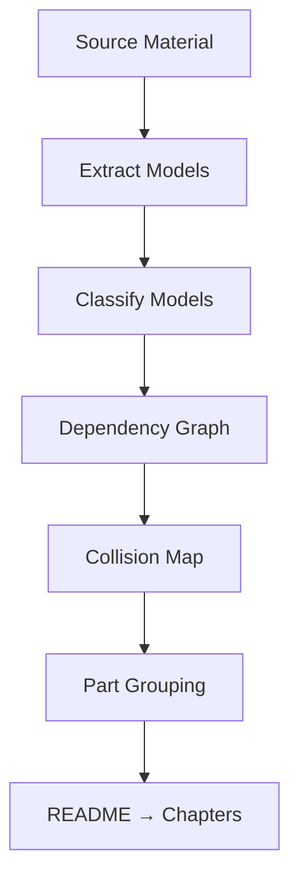
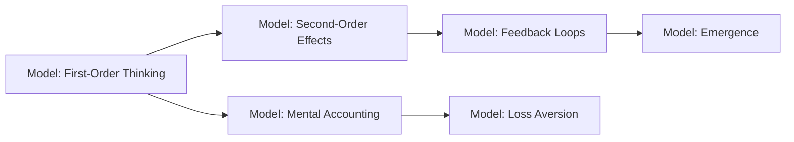
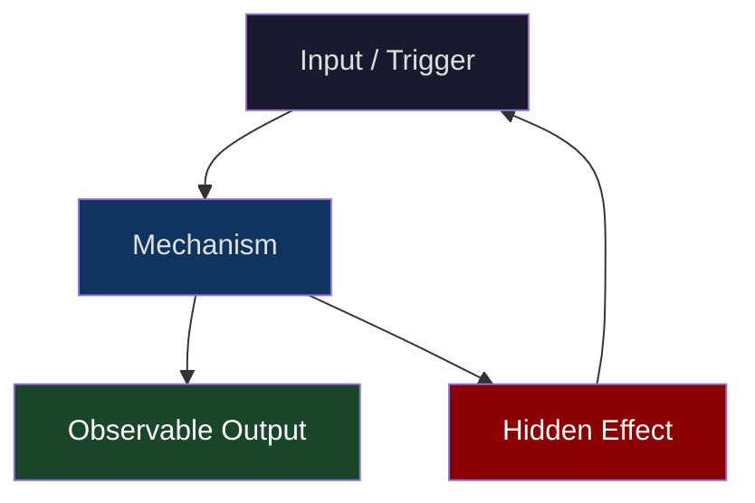
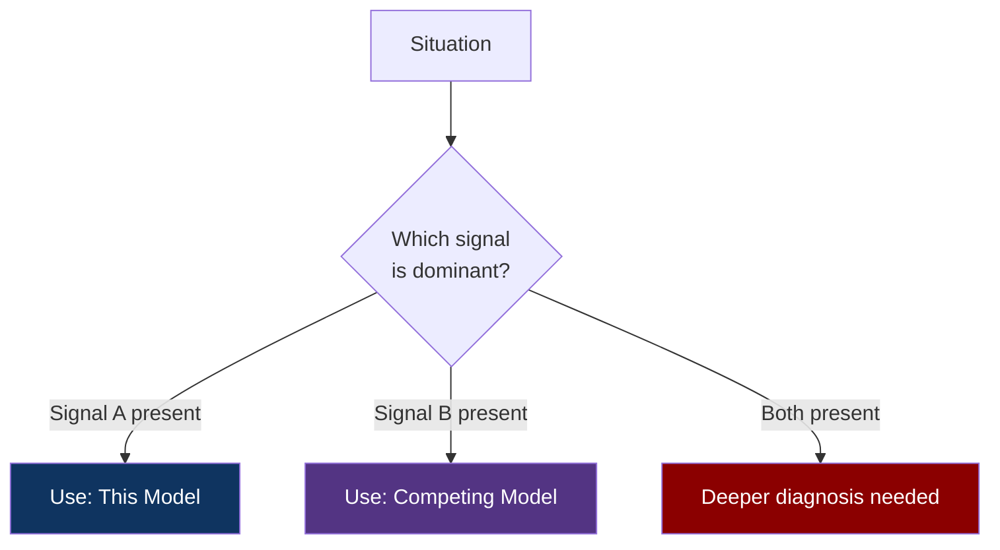
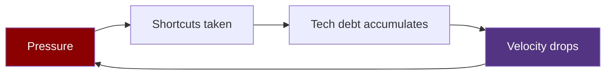

# SKILL: Mental Model / Thinking Book Generator
## Genre: Systems Thinking · Cognitive Science · Philosophy of Mind · Decision Theory

---

## WHAT THIS SKILL DOES

Converts any source material — books on thinking, cognitive science papers, philosophy texts, psychology research, decision theory works — into a **dense, lens-shifting mental model bible** formatted for Jenish's brain.

The output is not a summary. It is a **reconstruction** — a new book that extracts the thinking frameworks from the source and rebuilds them in the `LENS → GRIND → REFRACT` chapter grammar. Each chapter installs a new way of seeing, stress-tests it against reality, and leaves it permanently wired into how the reader perceives the world.

**Trigger this skill when:**
- Source material is: a thinking/decision-making book, cognitive science text, philosophy work, psychology research, mental models collection, or epistemology paper
- You want the output to rewire perception, not just add information
- The domain is: systems thinking, cognitive biases, decision theory, epistemology, game theory as a thinking tool, complexity theory, probability and reasoning

---

## READER PROFILE (hardcoded — do not modify)

```
Name          : Jenish
Age           : 20
Role          : Platform / SRE engineer — thinks in systems and feedback loops natively
Learning style: Wants the model to feel inevitable once installed, not just clever.
                Hates vague wisdom. Needs the model to break somewhere — that's
                what makes him trust it. Curious about edge cases more than
                the core case.
Depth target  : Treats the reader as a peer who thinks carefully, not as someone
                who needs convincing that thinking carefully matters.
```

---

## OUTPUT DIRECTORY STRUCTURE

```
<book-slug>/                          ← kebab-case of the book title
    README.md                         ← Master TOC + Book Overview + Model Index
    Part-01-<Part-Name>/
        CH-01-<Chapter-Name>.md
        CH-02-<Chapter-Name>.md
    Part-02-<Part-Name>/
        CH-03-<Chapter-Name>.md
        CH-04-<Chapter-Name>.md
    ...
```

**Naming rules:**
- Book slug: kebab-case, max 5 words. e.g. `thinking-in-systems-jenish-edition`
- Part dirs: `Part-01-First-Order-Seeing`, `Part-02-Feedback-and-Delay`, etc.
- Chapter files: `CH-01-The-Map-Is-Not-The-Territory.md`, `CH-05-Second-Order-Effects.md`
- Parts should group models thematically. Aim for 3–5 chapters per part.
- A full book should have 4–6 parts, 12–25 chapters depending on source depth.

---

## STEP 0 — SOURCE INGESTION

Before writing anything, do a full analytical pass:

1. **Extract every distinct mental model** — List each model, framework, or lens introduced in the source. Be granular. Do not merge similar models.
2. **Classify each model** — Tag each as: `perception` (changes what you see), `decision` (changes what you choose), `system` (changes how you model causality), `social` (changes how you read other humans), or `meta` (a model about using models).
3. **Find the dependencies** — Which models require other models to be understood first? Build a dependency graph. This determines chapter order.
4. **Find the collisions** — Which models are in genuine tension with each other? These become the Collision sections within chapters.
5. **Find the failure modes** — For each model, what does the source say (or not say) about where it breaks? If the source doesn't say, you must reason it out.
6. **Group into Parts** — Cluster models into 4–6 thematic groups. Each Part is a coherent lens-family.
7. **Build README first** — The README is the model index. See README spec below.



---

## STEP 1 — README.md SPEC

```markdown
# <Book Title>
### *<Tagline that names what the reader will see differently after reading this>*

> "<A short quote — real or from the source — that captures the book's core paradox>"

---

## What This Book Does

<3–4 sentences. This book doesn't add information — it changes the resolution at
which you see. After reading, X will look different. Y will be legible where it
was noise before. Written like you're telling a friend what happened to you after
reading it, not like a publisher's blurb.>

## What It Deliberately Doesn't Do

<2–3 bullets. What this book doesn't claim. Where these models have known limits.
This is the intellectual honesty section.>

## How The Models Relate

<A mermaid diagram showing the dependency/relationship graph between the book's
core models. This is the map before the territory.>



## The Full Model Index

<A table of every mental model in the book:>

| Model | Chapter | Type | One-Line Definition |
|---|---|---|---|
| <Model Name> | CH-01 | perception | <Two sentences max> |

## Reading Path

<Linear vs non-linear guidance. Which chapters are load-bearing for later ones.
Estimated read time per part.>

## Prerequisite Lenses

<What mental models should the reader already have before opening this?
e.g. "Basic probability intuition. Familiarity with feedback as a concept.">
```

---

## STEP 2 — CHAPTER GRAMMAR: `LENS → GRIND → REFRACT`

Every chapter must follow this exact structure. Eight sections. Do not skip. Do not merge.

---

### Section Header Template

```markdown
# CH-<N>: <Model Name>
### *<The question this model answers — stated as a paradox or confusion>*

> **Part <N> of <Total> · <Part Name>**  
> **Model Type:** `<perception | decision | system | social | meta>`

---
```

---

### § 1 — THE MISREAD

**Job:** Open with a situation most people interpret incorrectly. Install disorientation before introducing the model.

**Rules:**
- A specific, concrete scenario — not an abstract setup. A meeting, a market movement, a system behavior, a decision someone made.
- The reader must think they understand it as they read. Then the last paragraph reveals they were reading it wrong.
- No model named yet. No hint of the chapter topic. Just the scene and the disorientation.
- Relevant to Jenish's world: engineering orgs, startups, technical decisions, system behaviors. Can use historical events, company stories, or constructed scenarios.

**Length:** 300–450 words.

**Format:**
```markdown
## The Misread

<Scene. Concrete. Specific. Let the reader feel confident they understand it.
Then pull the floor out.>
```

---

### § 2 — THE BLIND SPOT

**Job:** Name the cognitive or perceptual gap that caused the misread. Make it feel human, not shameful.

**Rules:**
- Explicit statement: "The reason we misread this is because [mechanism]."
- Connect to evolutionary, cognitive, or social origin of the blind spot. Why does this bias exist? What was it useful for originally?
- Written with warmth. Every human has this blind spot including the author. Never condescending.
- Brief. This is setup, not the chapter.

**Length:** 200–300 words.

**Format:**
```markdown
## The Blind Spot

<Name and explain the cognitive gap. Ground it in why this bias exists,
not just that it exists.>
```

---

### § 3 — THE MODEL, PRECISELY

**Job:** Define the mental model with surgical precision. Make it spatial with a diagram.

**Rules:**
- One definition. Max 3 sentences. If it can't be stated in 3 sentences, it's not a model yet.
- A visual metaphor that makes the model spatial. Not an analogy from the same domain — from an adjacent one.
- A mermaid diagram that represents the model's *structure* (not its application yet — that comes later).
- Give the model a **canonical name in bold**. This is how the reader will refer to it forever.
- State explicitly: what does this model let you *see* that you couldn't see before?

**Length:** 250–400 words + 1 mermaid diagram.

**Format:**
```markdown
## The Model, Precisely

**The [Model Name]**

<Definition. Max 3 sentences. Tight. No hedging.>

<What does this model make visible that was previously invisible or misread?>



<The visual metaphor. What does this look like in physical space?>
```

---

### § 4 — THREE DOMAINS, ONE MODEL

**Job:** Prove the model is genuinely universal by applying it to three wildly different domains.

**Rules:**
- Domain 1: Always a **technical/engineering** context (systems, infrastructure, software architecture)
- Domain 2: Always a **human/organizational** context (teams, companies, interpersonal dynamics)
- Domain 3: A **historical, scientific, or unexpected** context (evolution, geopolitics, physics, economics)
- Each domain application is complete: here's the situation, here's the model applied, here's what becomes visible.
- A mermaid diagram for at least one of the three domains.

**Length:** 700–1000 words + 1 mermaid diagram.

**Format:**
```markdown
## Three Domains, One Model

### Domain 1: Engineering
<Apply the model to a specific technical scenario. Show what the model reveals.>

```mermaid
<Diagram showing model applied to the engineering context>
```

### Domain 2: Organization
<Apply the model to a team, company, or interpersonal scenario.>

### Domain 3: <Chosen Domain>
<Apply the model to the most unexpected domain you can find where it still holds.
This is the domain that makes the reader trust the model is real.>
```

---

### § 5 — WHERE THE MODEL BREAKS

**Job:** Find the edge case where this model gives wrong answers. State it honestly.

**Rules:**
- This section is what separates this book from self-help. It is **non-negotiable**.
- Find the assumption the model is built on. Name it explicitly.
- Describe the exact conditions under which that assumption fails.
- Show what the model predicts in that edge case vs. what actually happens.
- Do not hedge. Do not say "the model works most of the time." Say where it breaks precisely.
- A mermaid diagram showing the failure condition is strongly encouraged.

**Length:** 450–650 words.

**Format:**
```markdown
## Where The Model Breaks

**The hidden assumption:** <State the load-bearing assumption explicitly.>

<The scenario where the assumption fails. What happens when you apply the model here?
What does it predict? What actually occurs?>

<Why the model fails here — the mechanism, not just the observation.>

**The signal that you're in the break zone:** <How does the reader know when
to stop using this model?>
```

---

### § 6 — THE COLLISION

**Job:** Put this model in direct conversation with a contradictory model. Do not resolve the tension cheaply.

**Rules:**
- Introduce a second, named mental model that produces directly contradictory advice or predictions in some situations.
- Show the exact scenario where both models apply and give opposite answers.
- Do not declare a winner. The resolution is: "It depends on what you're trying to see."
- Help the reader develop the meta-skill of knowing when to reach for which model.
- A mermaid decision diagram showing "when to use which" is mandatory.

**Length:** 400–600 words + 1 mermaid diagram.

**Format:**
```markdown
## The Collision

**This model says:** <What the chapter's model predicts/prescribes in the conflict scenario>  
**[Competing Model Name] says:** <What the competing model predicts/prescribes>

<The specific scenario where these two models give opposite answers. This is the
core of the section — make the tension feel real and unresolved.>



**The meta-skill:** <How does the reader develop the judgment to know which
model to reach for? What's the deciding signal?>
```

---

### § 7 — THE RETROFIT

**Job:** Re-read a past event entirely through the model's lens. Show what becomes visible that was invisible before.

**Rules:**
- Choose a well-known event: a famous business failure, a historical decision, a classic engineering disaster, a major scientific development. The reader must know (or quickly understand) the event.
- Do a complete reanalysis using only the chapter's model.
- Show explicitly: what was invisible without the model? What becomes obvious with it?
- Written like a detective revealing the solution — the reader should feel the satisfaction of "of course."
- A timeline or annotated sequence showing where the model's lens would have caught the problem is encouraged.

**Length:** 450–700 words + optional mermaid diagram.

**Format:**
```markdown
## The Retrofit

**Event:** <Name of the event. 1-sentence context for anyone unfamiliar.>

<Re-reading the event through the model. Step by step, showing what the
model sees that observers at the time couldn't.>

**What was invisible:** <Precisely what the model reveals that was not visible
without it.>

**The intervention point:** <If someone had this model at the time, where
exactly would they have seen what others missed?>
```

---

### § 8 — THE PRACTICE REP

**Job:** Give the reader one concrete observational exercise for the next 48 hours.

**Rules:**
- Not journaling prompts. Not reflection questions. An actual *observational challenge*.
- Time-boxed. Specific. Verifiable. The reader must be able to confirm they did it.
- Connected to Jenish's actual daily life: engineering work, team dynamics, technical decisions.
- Should feel like a drill, not homework. Short and punchy.

**Length:** 150–250 words.

**Format:**
```markdown
## The Practice Rep

> **Duration:** 48 hours  
> **What you're training:** <The specific perceptual skill this chapter installs>

**The exercise:**
<Concrete instruction. What to observe. When. Under what conditions.>

**What to look for:**
<The specific signal that tells the reader the model is running. What will look
different when they see through this lens?>

**The log:**
At the end of 48 hours, write one sentence: "I saw [model name] at work when [specific thing]."
```

---

## STEP 3 — MERMAID DIAGRAM STANDARDS

Minimum **3 diagrams per chapter**. Mental model diagrams must show *structure*, not just boxes.

**Diagram type selection:**
| What you're showing | Diagram type |
|---|---|
| Model structure (causal loops) | `graph LR` with back-edges |
| Decision tree (when to use model) | `flowchart TD` |
| Two models in tension | `flowchart TD` with branching |
| Timeline of an event (Retrofit) | `gantt` or `sequenceDiagram` |
| Feedback loops | `graph LR` with circular arrows |
| System stocks and flows | `flowchart LR` with labeled edges |

**Critical rule for mental model diagrams:** Feedback loops must show the loop closing. Use back-edges in mermaid (`C --> A` when A already appeared). This is what makes systems thinking diagrams useful — seeing the loop.



**Color palette:**
```
Neutral/input    : fill:#1a1a2e, color:#e0e0e0
Core mechanism   : fill:#0f3460, color:#ffffff
Hidden/emergent  : fill:#533483, color:#ffffff
Failure/break    : fill:#8b0000, color:#ffffff
Positive output  : fill:#1a472a, color:#ffffff
```

---

## STEP 4 — WRITING STYLE RULES

**Voice:**
- The voice of someone who finds ideas genuinely exciting, not someone who wants to sound smart about finding ideas exciting. There's a difference.
- Precise language. If a word can be replaced with a more specific word, replace it.
- Short sentences for impact. Long sentences for nuance. Vary deliberately.
- No motivational tone. No "this will change how you think!" — let the model demonstrate that itself.

**Prohibited patterns:**
- "In this section, we will..."
- Starting any section with the model name as the first word ("Systems thinking is...")
- "It is important to note..."
- Motivational endings ("Now you have this powerful tool...")
- Rhetorical questions that the reader can't actually answer yet

**Paragraph structure:**
- Max 4 sentences per paragraph
- The last sentence of each section should either close cleanly or open the next tension
- No bullet points inside sections (exception: The Failure Taxonomy in § 5 may use a brief list)

**Specificity rules:**
- Named people, companies, events beat "a company once..."
- Mechanisms beat observations. "Because X causes Y" beats "X correlates with Y"
- Edge cases beat central cases. The interesting insight is usually at the boundary.

---

## STEP 5 — QUALITY GATE

**Structure:**
- [ ] The Misread creates genuine disorientation before naming the model
- [ ] The Model is defined in ≤3 sentences with a named label
- [ ] Three Domains covers exactly: engineering, organizational, and one unexpected domain
- [ ] Where It Breaks names the hidden assumption explicitly
- [ ] The Collision introduces a real competing model by name
- [ ] The Retrofit uses a real, named event
- [ ] The Practice Rep is time-boxed, specific, and verifiable

**Depth:**
- [ ] No model is presented as universally correct
- [ ] Where It Breaks does not hedge — states the failure precisely
- [ ] The Collision does not declare a winner

**Diagrams:**
- [ ] Minimum 3 mermaid diagrams
- [ ] At least one feedback loop diagram (graph with back-edges)
- [ ] The Collision has a "when to use which" decision diagram

**Voice:**
- [ ] Zero prohibited phrases
- [ ] The model is stateable in ≤3 sentences
- [ ] No paragraph longer than 4 sentences
