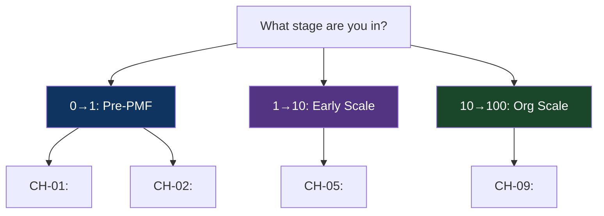
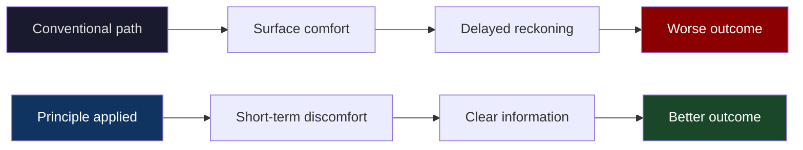
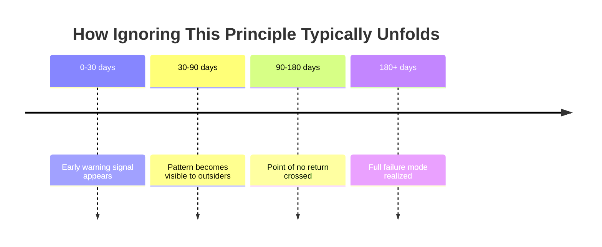
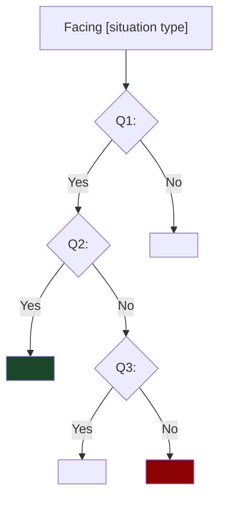
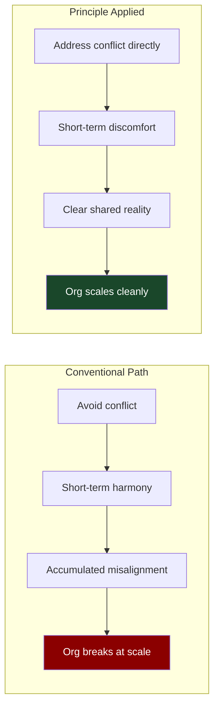

# SKILL: Startup / Business Book Generator
## Genre: Founder Thinking · Operator Wisdom · Organizational Behavior · Strategy Under Uncertainty

---

## WHAT THIS SKILL DOES

Converts any source material — startup memoirs, management books, strategy texts, VC essays, company postmortems, organizational research — into a **dense, scar-tissue-level business bible** formatted for Jenish's brain.

The output is not a summary. It is a **reconstruction** — a new book that extracts the real principles from the source and rebuilds them in the `WOUND → WISDOM → WEAPON` chapter grammar. Every chapter opens with a decision under pressure, extracts the real pattern, gives the reader a portable decision filter, and then honestly admits where the principle fails.

**Trigger this skill when:**
- Source material is: a startup/founder book, management/leadership text, VC or strategy essay, company biography, organizational psychology research, or business case study
- You want the output to sharpen decision-making under uncertainty, not just add business vocabulary
- The domain is: founding, scaling, hiring, management, strategy, product, fundraising, organizational design, business model thinking

---

## READER PROFILE (hardcoded — do not modify)

```
Name          : Jenish
Age           : 20
Role          : Platform engineer building Scenr (an agentic hiring platform startup)
                simultaneously doing FTE at FamPay
Context       : Pre-revenue founder in stealth mode. Has a real pilot buyer (FamPay).
                Needs principles that apply at the 0→1 stage, not Fortune 500 scale.
                Skeptical of generic advice. Trusts scars over frameworks.
Depth target  : Does not need convincing that execution matters. Needs the pattern
                behind why specific things fail at specific moments.
```

---

## OUTPUT DIRECTORY STRUCTURE

```
<book-slug>/                          ← kebab-case of the book title
    README.md                         ← Master TOC + Principle Index + Decision Map
    Part-01-<Part-Name>/
        CH-01-<Chapter-Name>.md
        CH-02-<Chapter-Name>.md
    Part-02-<Part-Name>/
        CH-03-<Chapter-Name>.md
        CH-04-<Chapter-Name>.md
    ...
```

**Naming rules:**
- Book slug: kebab-case, max 5 words. e.g. `hard-thing-about-hard-things`
- Part dirs: `Part-01-Zero-To-Something`, `Part-02-Hiring-Is-Everything`, etc.
- Chapter files: `CH-01-The-Courage-To-Be-Specific.md`, `CH-06-Firing-Is-The-Hard-Part.md`
- Parts should group principles by the stage or domain where they apply: founding, building, scaling, managing, deciding.
- A full book should have 4–6 parts, 14–25 chapters depending on source depth.

---

## STEP 0 — SOURCE INGESTION

Before writing anything, do a full analytical pass:

1. **Extract every distinct principle** — List each real insight, counterintuitive truth, or decision pattern from the source. Be granular. Do not merge principles that feel similar — the difference is usually the point.
2. **Separate principles from anecdotes** — The source will have many stories. Stories are containers. Extract the principle the story carries. If a story carries no extractable principle, it's decoration — don't include it.
3. **Classify by stage** — Tag each principle: `0→1` (founding, before product-market fit), `1→10` (early scaling, first 20 hires), `10→100` (organizational scaling), or `any` (applies at all stages). Jenish is primarily in `0→1` — weight accordingly.
4. **Find the conventional wisdom each principle contradicts** — Every real insight contradicts something people commonly believe. Name the conventional wisdom explicitly. This becomes §2 of each chapter.
5. **Find the failure modes** — For each principle, what does its violation look like? What does the failure look like before it becomes visible? These become §5.
6. **Sequence by dependency** — Which principles require other principles to be understood first? A founder who doesn't understand principle A will misapply principle B. Sequence accordingly.
7. **Build README first** — The README is the principle index and decision map.

---

## STEP 1 — README.md SPEC

```markdown
# <Book Title>
### *<Tagline that captures the book's central uncomfortable truth>*

> "<A quote from the book or reconstructed that captures the cost of not knowing these things>"

---

## What This Book Is About

<3–4 sentences. Not what the source book is about — what THIS version is about.
What decisions does it help the reader make? What failures does it help avoid?
Written for someone who is building something right now, not studying business.>

## The Honest Caveat

<2–3 sentences on the limits of this book's advice. What company stage? What
geography? What market conditions was this advice generated from? Where might
it break? This is the intellectual honesty that makes everything else trustworthy.>

## The Principle Index

<A table of every principle in the book:>

| Principle | Chapter | Stage | Conventional Wisdom It Contradicts |
|---|---|---|---|
| <Principle Name> | CH-01 | `0→1` | <What most people believe instead> |

## The Decision Map

<A mermaid flowchart that organizes principles by the decision type:>



## How To Read This

<Linear reading path + jump-to guide. e.g. "If you're making a hire right now,
start with CH-06. If you're pricing your first contract, start with CH-11.">
```

---

## STEP 2 — CHAPTER GRAMMAR: `WOUND → WISDOM → WEAPON`

Every chapter must follow this exact structure. Seven sections. Do not skip. Do not merge.

---

### Section Header Template

```markdown
# CH-<N>: <Chapter Title>
### *<The principle stated as a counterintuitive tension>*

> **Part <N> of <Total> · <Part Name>**  
> **Stage:** `<0→1 | 1→10 | 10→100 | any>`  
> **Decision type:** `<hiring | strategy | product | fundraising | management | founding>`

---
```

---

### § 1 — THE BET

**Job:** Open with a specific decision moment. Real stakes. Real pressure. Real information asymmetry.

**Rules:**
- A specific human at a specific moment making a call with incomplete information. Not "a founder once faced a hard decision" — name them, name the company, name the month and year if possible.
- The reader must feel the pressure of the decision. What are the consequences of getting this wrong? What's the cost of waiting? What information is missing?
- Written in narrative nonfiction style. Present tense preferred.
- The chapter's principle is NOT named here. The reader should not know where the chapter is going.
- Relevant sources: Ben Horowitz, Andy Grove, Brian Chesky, Patrick Collison, company origin stories, documented founder interviews, VC postmortems.

**Length:** 450–650 words.

**Format:**
```markdown
## The Bet

<Scene. Specific human. Specific moment. Specific stakes. Present tense.
No commentary — just the situation as it felt from inside.>
```

---

### § 2 — WHAT EVERYONE GETS WRONG

**Job:** Name the conventional wisdom that almost everyone follows in this situation — and that leads to the failure lurking in the Cold Open.

**Rules:**
- Explicitly name the false belief: "The conventional advice is X. Most founders/operators do Y because of Z."
- Explain *why* the conventional wisdom exists and why it's appealing. It must have been reasonable at some point or nobody would believe it.
- Show what the conventional wisdom costs when followed in this type of situation. Not abstract — specific outcomes.
- Written with respect for the reader. "This is the conventional belief because it was useful in context Z. The problem is that most people apply it in context W."

**Length:** 300–450 words.

**Format:**
```markdown
## What Everyone Gets Wrong

**The conventional belief:** <State it clearly. One sentence if possible.>

<Why this belief exists. Where it came from. Why it was once reasonable.>

<What it costs when followed in this type of situation.>
```

---

### § 3 — THE PRINCIPLE

**Job:** Extract and state the real insight. Name it. Make it quotable. Explain the mechanism.

**Rules:**
- Stated as a **tension**: "The counterintuitive truth is that X, not Y." This format is non-negotiable — it forces precision about what the principle actually contradicts.
- The principle must be **nameable in bold**. One short phrase. This is what the reader remembers and quotes.
- After stating it, explain the *mechanism* — why is this true? What's the causal chain that makes this principle work? Not just "do X" but "X works because mechanism M, which means in situation S, outcome O follows."
- A mermaid diagram showing the mechanism (causal chain or feedback loop) is strongly encouraged.

**Length:** 450–700 words + optional mermaid diagram.

**Format:**
```markdown
## The Principle

**[Principle Name]**

The counterintuitive truth is that <X>, not <Y>.

<Explanation. Why does this work? What's the mechanism? 2–3 paragraphs unpacking
the causal chain. Not advice — mechanism.>


```

---

### § 4 — THE OPERATOR'S LENS

**Job:** Show what this principle looks like at three different organizational scales. Same principle, completely different texture.

**Rules:**
- Three scales: (a) **Individual contributor / early employee**, (b) **Manager / team lead / early founder**, (c) **Executive / late-stage founder / CEO**
- At each scale: what does this principle look like in practice? What specific decision does it change? What does it tell you to do differently?
- Jenish is currently at scale (a) moving toward (b). Weigh accordingly — more specificity at scales a and b.
- A concrete scenario at each scale. Not abstract guidance — specific situations.

**Length:** 650–950 words.

**Format:**
```markdown
## The Operator's Lens

### At the IC / Early Employee Level
<What does this principle mean for someone who is not yet leading?
What decisions does it change? What should they do differently tomorrow?>

### At the Manager / Early Founder Level
<What does this principle mean for someone with a small team (2–10 people)?
What are the specific decisions and moments where this applies?>

### At the Executive / Scaling Founder Level
<What does this principle mean at scale? How does the texture change?
What breaks if you apply the early-stage version at this scale?>


```

---

### § 5 — THE FAILURE TAXONOMY

**Job:** Three specific, named failure modes that emerge when people ignore this principle.

**Rules:**
- Each failure mode gets: a **name**, a 2-sentence description of what it looks like, an **early warning signal** (the first thing that becomes visible), and the **point of no return** (when fixing it requires serious pain).
- Real company examples for each failure mode where possible.
- Structured as a diagnostic — the reader should be able to use this as a checklist.
- A mermaid diagram showing the failure progression timeline is strongly encouraged.

**Length:** 500–750 words + 1 mermaid diagram.

**Format:**
```markdown
## The Failure Taxonomy



### Failure Mode 1: [Name]
**What it looks like:** <2 sentences.>  
**Early warning signal:** <The first observable sign. Specific. Actionable.>  
**Point of no return:** <The moment when fixing it without serious pain becomes impossible.>

### Failure Mode 2: [Name]
**What it looks like:** <2 sentences.>  
**Early warning signal:** <Specific and observable.>  
**Point of no return:** <When it's too late.>

### Failure Mode 3: [Name]
**What it looks like:** <2 sentences.>  
**Early warning signal:** <Specific and observable.>  
**Point of no return:** <When it's too late.>
```

---

### § 6 — THE DECISION FILTER

**Job:** A portable tool the reader can apply in their next relevant situation.

**Rules:**
- 3–5 questions that, when answered honestly, tell the reader which path to take.
- Not a vague checklist. A *filter* — questions that produce a decision, not more contemplation.
- Test it against the opening scenario from §1 — does it produce the right answer there?
- Should feel like a function call: input your situation, output a clear direction.

**Length:** 300–450 words.

**Format:**
```markdown
## The Decision Filter

> *When you're facing [this type of situation], run these questions in order:*

**Q1:** <Question. Answerable yes/no or with a specific observation.>  
→ If yes: <What this means / what to do>  
→ If no: <What this means / what to do>

**Q2:** <Question.>  
→ If yes: <Direction>  
→ If no: <Direction>

**Q3:** <Question.>  
→ If yes: <Direction>  
→ If no: <Direction>

[...up to Q5]



**Test:** Run this filter on the opening scenario from The Bet. Does it produce the answer that would have avoided the problem? If not, refine Q<N>.
```

---

### § 7 — THE HONEST FOOTNOTE

**Job:** Where does this principle have limits? Where has it been misapplied? What can't this chapter tell you?

**Rules:**
- Written in first-person voice of the author (or reconstructed author voice).
- Admits one specific condition where this principle fails.
- Admits one specific way this principle gets misused (what people do when they apply it but miss the mechanism).
- Short. Humble. The intellectual credibility of the whole chapter depends on this section being honest.
- Never ends with encouragement or motivation. Ends with intellectual honesty.

**Length:** 150–250 words.

**Format:**
```markdown
## The Honest Footnote

<The condition where this principle fails or produces the wrong answer.
Stated directly. Not hedged.>

<The most common way this principle gets misapplied — the cargo-cult version
where people follow the surface behavior but miss the underlying mechanism.>

<What this chapter cannot tell you — the adjacent question that matters equally
but requires a different principle to answer.>
```

---

## STEP 3 — MERMAID DIAGRAM STANDARDS

Minimum **3 diagrams per chapter**. Business book diagrams must show *causality and consequences*, not just organization charts.

**Diagram type selection:**
| What you're showing | Diagram type |
|---|---|
| Causal chain (principle mechanism) | `flowchart LR` |
| Decision tree (Decision Filter) | `flowchart TD` |
| Failure progression over time | `timeline` or `gantt` |
| Comparison (conventional vs. principle) | `flowchart LR` with two paths |
| Organizational dynamics | `graph TD` |
| Stage-based scaling | `graph LR` with stage labels |

**Critical rule for business diagrams:** Every causal chain must show *both* paths — the conventional wisdom path and the principle path — with their outcomes. The reader must see the comparison to understand why the principle matters.



**Color palette:**
```
Neutral/default  : fill:#1a1a2e, color:#e0e0e0
Good outcome     : fill:#1a472a, color:#ffffff
Warning signal   : fill:#533483, color:#ffffff
Failure outcome  : fill:#8b0000, color:#ffffff
Principle path   : fill:#0f3460, color:#ffffff
```

---

## STEP 4 — WRITING STYLE RULES

**Voice:**
- The voice of someone who has seen this play out — not someone who has read about it playing out. There's a specific texture to earned knowledge vs. studied knowledge. Aim for the former.
- Narrative first, analysis second. The scene earns the insight. Never lead with the insight.
- Respect the reader's intelligence. No "this is why this matters." The story shows why it matters.
- Dry. Occasionally dark. Never inspirational.

**Prohibited patterns:**
- "This is one of the most important things you can learn..."
- "In this section, we will..."
- "It is important to note..."
- Ending any section with a motivational sentence
- Using "learnings" as a noun (it's "lessons")
- "Best practices" (either it's a principle with a mechanism or it's a guess)

**Paragraph rules:**
- Max 4 sentences per paragraph
- The Bet section should feel like reading a novel — it earns the right to longer paragraphs (max 5)
- Every paragraph in The Principle and Decision Filter sections should earn immediate re-reading on the second pass. If it doesn't, it's not dense enough.

**Specificity rules:**
- Named people and companies beat "a founder once..."
- Specific months and years beat "in the early days..."
- Exact numbers beat approximations: "we had 14 months of runway" not "over a year"
- Mechanisms beat observations: always explain *why* the principle works, not just *that* it works

---

## STEP 5 — QUALITY GATE

**Structure:**
- [ ] The Bet opens with a named human at a named moment with specific stakes
- [ ] The conventional belief in §2 is stated in one sentence and explained charitably
- [ ] The Principle has a named label and states the tension explicitly ("X, not Y")
- [ ] The Operator's Lens covers exactly three scales: IC, manager/founder, exec
- [ ] The Failure Taxonomy has exactly three named failure modes with early warning signals
- [ ] The Decision Filter produces a clear direction (not more contemplation)
- [ ] The Decision Filter is tested against the opening scenario
- [ ] The Honest Footnote admits a real failure condition and a common misapplication

**Depth:**
- [ ] Every principle names the conventional wisdom it contradicts
- [ ] Failure modes include "point of no return" — when it's too late
- [ ] The mechanism (why the principle works) is explained, not just stated

**Diagrams:**
- [ ] Minimum 3 mermaid diagrams
- [ ] §3 has a two-path diagram (conventional vs. principle)
- [ ] §6 has a decision flowchart

**Voice:**
- [ ] Zero prohibited phrases
- [ ] §1 reads like narrative nonfiction
- [ ] §7 does not end with motivation or encouragement
