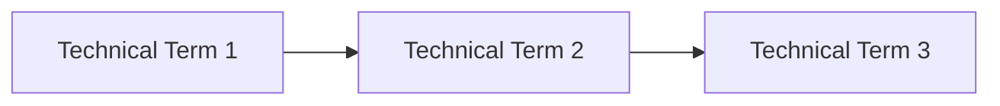
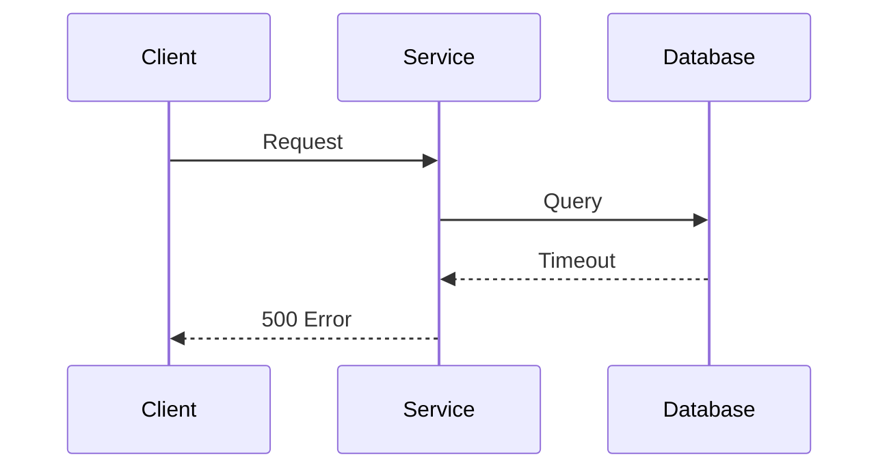

# SKILL: Technical / Engineering Book Generator
## Genre: SRE · Distributed Systems · Platform Engineering · Infrastructure · AI Engineering

---

## WHAT THIS SKILL DOES

Converts any source material — PDF books, research papers, blog posts, codebases, runbooks, conference talks — into a **dense, pragmatic, bible-grade technical book** formatted for Jenish's brain.

The output is not a summary. It is a **reconstruction** — a new book that takes the knowledge from the source and rewrites it in the `SPARK → FORGE → WIRE` chapter grammar, at full depth, with mermaid diagrams, real code, war room incidents, and hands-on labs baked into every chapter.

**Trigger this skill when:**
- Source material is: a technical/engineering book, SRE guide, distributed systems paper, architecture doc, infra blog post, codebase README+code, or conference talk transcript
- You want the output to be executable and hands-on
- The domain is: Kubernetes, CI/CD, observability, databases, networking, cloud infrastructure, platform engineering, reliability engineering, Go/systems programming

---

## READER PROFILE (hardcoded — do not modify)

```
Name          : Jenish
Age           : 20
Role          : Platform / SRE engineer
Stack         : EKS, ArgoCD, GitLab CI, Terraform, Go microservices, LGTM stack
Learning style: Systems thinker. Gets bored fast without a "why does this matter" hook.
                Learns best when things break interestingly. Needs the tradeoffs, not
                just the answer. Hands-on execution is non-negotiable.
Depth target  : Senior engineer level. Never condescend. Never oversimplify.
                Always surface the tradeoffs.
```

---

## OUTPUT DIRECTORY STRUCTURE

```
<book-slug>/                          ← kebab-case of the book title
    README.md                         ← Master TOC + Book Overview
    Part-01-<Part-Name>/
        CH-01-<Chapter-Name>.md
        CH-02-<Chapter-Name>.md
    Part-02-<Part-Name>/
        CH-03-<Chapter-Name>.md
        CH-04-<Chapter-Name>.md
    ...
```

**Naming rules:**
- Book slug: kebab-case, max 5 words. e.g. `designing-distributed-systems`
- Part dirs: `Part-01-Foundation`, `Part-02-Failure-Patterns`, etc.
- Chapter files: `CH-01-The-Two-Generals-Problem.md`, `CH-04-Backpressure.md`
- Parts should group chapters thematically. Aim for 3–6 chapters per part.
- A full book should have 4–7 parts, 15–30 chapters depending on source depth.

---

## STEP 0 — SOURCE INGESTION

Before writing anything, do a full pass of the source material:

1. **Extract the skeleton** — What are the core concepts? List every distinct idea, pattern, or system being explained. Do not collapse related ideas — keep them granular.
2. **Identify natural part groupings** — Which concepts belong together? Group them into 4–7 thematic clusters. These become your Parts.
3. **Sequence the chapters** — Within each part, order chapters so each one builds on the last. A reader hitting chapter N should have exactly what they need from chapters 1..N-1.
4. **Flag incident material** — Mark any postmortems, war stories, case studies, or failure examples in the source. These feed the War Room sections.
5. **Flag hands-on material** — Mark any commands, configs, code, or procedures. These feed the Lab sections.
6. **Build the README first** — See README spec below. This is your contract with the reader before you write a single chapter.

---

## STEP 1 — README.md SPEC

The README is the master table of contents and the reader's orientation document. It must contain:

```markdown
# <Book Title>
### *<One-line tagline that is provocative, not descriptive>*

> "<A short quote — real or reconstructed — that captures the book's core tension>"

---

## What This Book Is

<3–4 sentences. What problem does this book solve? Who is it for? What will the
reader be able to do after reading it that they cannot do now? Written like the
back cover of a book you'd actually buy, not an abstract.>

## What This Book Is Not

<2–3 bullet points. Explicitly state what this book does NOT cover. This builds
trust and sets correct expectations.>

## How To Read It

<Guidance on reading order. Which parts are prerequisite to which. Whether the
reader can jump around or must read linearly. Estimated reading time per part.>

## The Map

### Part 01 — <Part Name>
*<One sentence: what does this part install in the reader's head?>*
- CH-01: [Chapter Name](./Part-01-.../CH-01-....md)
- CH-02: [Chapter Name](./Part-01-.../CH-02-....md)

### Part 02 — <Part Name>
*<One sentence>*
- CH-03: ...

[...continue for all parts]

## Core Mental Models In This Book

<A bulleted list of the 5–10 most important named mental models introduced across
the book. Each gets: name + one sentence definition. This is the cheat sheet.>

## Prerequisite Knowledge

<What should the reader already know before opening this? Be specific.
e.g. "Comfortable reading Go. Has deployed at least one service to Kubernetes.
Knows what a DNS record is.">
```

---

## STEP 2 — CHAPTER GRAMMAR: `SPARK → FORGE → WIRE`

Every chapter must follow this exact structure. Do not skip sections. Do not merge sections. Each section header must appear exactly as written below.

---

### Section Header Template

```markdown
# CH-<N>: <Chapter Title>
### *<Chapter subtitle — a tension or question, not a description>*

> **Part <N> of <Total> · <Part Name>**

---
```

---

### § 1 — THE COLD OPEN

**Job:** Create a burning question in the reader's head before they know the chapter topic.

**Rules:**
- Open mid-scene. No "In this chapter, we will..." ever.
- A production incident, a system behaving wrong, a company making a catastrophic assumption, a counterintuitive observation.
- Real names, timestamps, and technical details make this credible. Reconstruct if necessary but make it feel real.
- End with an implicit or explicit question that the chapter will answer.
- No definitions. No setup. Just the scene.

**Length:** 350–550 words.

**Format:**
```markdown
## The Cold Open

<Scene. Written like the opening of a thriller novel. Present tense preferred.>
```

---

### § 2 — THE UNCOMFORTABLE TRUTH

**Job:** Name the real problem. State the industry assumption that the chapter will destroy.

**Rules:**
- Explicitly name the false belief: *"The assumption is X. The reality is Y."*
- Connect it back to the Cold Open — this is what was lurking behind that scene.
- Written with mild provocation. Should make the reader feel slightly called out.
- No solution yet. Just the problem, fully stated.

**Length:** 250–400 words.

**Format:**
```markdown
## The Uncomfortable Truth

<The thesis. The assumption that breaks things. State it clearly.>
```

---

### § 3 — THE MENTAL MODEL

**Job:** Give the reader one sticky analogy that makes the concept spatial and memorable.

**Rules:**
- One analogy only. Choose it from an unexpected domain: traffic engineering, game theory, evolutionary biology, cooking, film editing, combat sports, thermodynamics. Never choose an analogy from the same domain as the concept.
- Give the analogy a **named label** in bold. This is what readers will quote.
- Follow the analogy with a mermaid diagram that maps the analogy to the real technical concept.
- The model should be stateable in 2 sentences.

**Length:** 450–700 words + 1–2 mermaid diagrams.

**Mermaid guidance for this section:** Use `flowchart LR` or `graph TD` to show the structure of the model. Label nodes with the analogy terms, then add a second diagram that maps them to the technical terms.

**Format:**
```markdown
## The Mental Model

<Introduce the analogy domain. Build it out. Name it.>

**The [Model Name]**

<The precise mapping from analogy to technical concept.>


<Now map the analogy to the real system.>


```

---

### § 4 — THE DISSECTION

**Job:** Full technical depth. This is the meat of the chapter.

**Rules:**
- Always structure as: **Naive Approach → What Breaks → Why It Breaks → Correct Approach → Remaining Tradeoffs**
- The Tradeoffs section is **non-negotiable**. If a section has no tradeoffs, you haven't thought hard enough.
- Real code, configs, manifests. Use the reader's stack where possible: Go, Kubernetes YAML, Terraform HCL, GitLab CI YAML, Bash.
- Use mermaid sequence diagrams for request flows, mermaid state diagrams for state machines, mermaid flowcharts for decision logic.
- Subsections are allowed and encouraged. Use `###` for subsection headers.
- Never write "as we can see" or "it is important to note". Just say the thing.

**Length:** 1000–2000 words + code blocks + 2–4 mermaid diagrams.

**Mandatory sub-structure:**
```markdown
## The Dissection

### The Naive Approach
<What does everyone try first? Code or config showing the naive approach.>

### What Breaks
<The exact failure mode. Be specific: what error, what metric, what symptom.>

### Why It Breaks
<The mechanism. The mental model from §3 applied here. Sequence diagram showing
the failure path.>



### The Correct Approach
<The fix. Code or config. Explain each decision.>

### The Tradeoffs
<What does the correct approach cost? Complexity? Latency? Operational burden?
When is the naive approach actually fine? When does the correct approach fail too?>
```

---

### § 5 — THE WAR ROOM

**Job:** Ground the chapter in a real (or highly realistic) incident. Postmortem style.

**Rules:**
- Named companies, real incidents preferred: AWS us-east-1 (2011, 2017), Cloudflare BGP (2019), Facebook BGP (2021), GitHub (2012 MySQL), Discord (2020 Cassandra), Slack (2021 cascading timeouts), etc.
- If no exact incident exists, reconstruct a *plausible* one with fictional but realistic names (e.g., "Stripe's payment processing team", "FamPay's disbursement service").
- Structure: Timeline → Signals Missed → Escalation → Root Cause → Fix → Lesson
- A mermaid timeline or sequence diagram showing the incident progression is mandatory.
- The "Lesson" subsection connects back to the chapter's mental model explicitly.

**Length:** 700–1000 words + 1 mermaid diagram.

**Format:**
```markdown
## The War Room

> **Incident:** <Name>  
> **Date:** <Date or approximate period>  
> **Impact:** <What broke, for how long, for how many users>

### The Timeline

```mermaid
gantt
    title Incident Timeline
    dateFormat HH:mm
    section Detection
    Alerts fire         : 00:00, 5m
    On-call paged       : 00:05, 2m
    section Investigation  
    Wrong hypothesis    : 00:07, 23m
    Root cause found    : 00:30, 10m
    section Resolution
    Fix deployed        : 00:40, 15m
    Recovery confirmed  : 00:55, 5m
```



### The Signals Nobody Caught
<What was visible in the data before the incident that nobody acted on.>

### The Root Cause
<The technical cause. Connect it to the chapter concept.>

### The Fix
<What they actually did. Code or config where possible.>

### The Lesson
<One sentence. Hard. True. Connect explicitly to the chapter's mental model.>
```

---

### § 6 — THE LAB

**Job:** Hands-on execution. Reader must be able to run this.

**Rules:**
- All commands must be copy-pasteable and runnable.
- Specify exact prerequisites (tools, versions, credentials needed).
- Structure: Setup → Core Exercise → Expected Output → Stretch Goal
- "Expected Output" is critical — reader must know if they succeeded.
- Stretch Goal is optional but should be genuinely harder, not just "add more of the same."
- Use the reader's actual stack: kind clusters, kubectl, Go, Terraform, GitLab CI, AWS CLI.

**Length:** 600–1000 words + code blocks.

**Format:**
```markdown
## The Lab

> **Time required:** ~<N> minutes  
> **Prerequisites:** <exact list>  
> **What you're building:** <one sentence>

### Setup

```bash
# Exact commands to set up the environment
```

### The Exercise

<Step by step. Numbered. Each step has: what to do, what command, what to observe.>

### Expected Output

<Exact output the reader should see if it worked. Diffs, logs, metrics.>

### What Just Happened

<2–3 paragraphs connecting what they observed to the chapter's mental model.
This is the "aha" section.>

### Stretch Goal

> **+30 min:** <A harder variant that forces the reader to apply the concept
> in a new context or break the thing they just built.>
```

---

### § 7 — THE LOOSE THREAD

**Job:** End on curiosity, not closure. Leave one thread deliberately unpulled.

**Rules:**
- One question the chapter doesn't answer.
- One reference or direction for the rabbit hole (paper, tool, incident, concept).
- The last sentence must make the reader want to flip to the next chapter.
- Never a motivational close. Never "In summary..." Never a quote.

**Length:** 120–200 words.

**Format:**
```markdown
## The Loose Thread

<The question. The thing this chapter cannot tell you. The thing that gets
interesting when you push the concept one step further.>

*If you want to fall down this particular hole: [specific reference or direction]*

<Last sentence that creates forward momentum into the next chapter.>
```

---

## STEP 3 — MERMAID DIAGRAM STANDARDS

Use mermaid diagrams aggressively. Every concept that has structure, flow, state, or sequence should have a diagram. Minimums per chapter: **3 diagrams**.

**Diagram type selection:**
| What you're showing | Diagram type |
|---|---|
| Request/response flow | `sequenceDiagram` |
| System architecture | `flowchart LR` |
| State transitions | `stateDiagram-v2` |
| Decision logic | `flowchart TD` |
| Incident timeline | `gantt` |
| Data relationships | `erDiagram` |
| Dependency graph | `graph LR` |

**Color palette (dark, engineering aesthetic):**
```
Background nodes  : fill:#1a1a2e, color:#e0e0e0
Accent nodes      : fill:#0f3460, color:#ffffff  
Warning nodes     : fill:#533483, color:#ffffff
Error/failure     : fill:#8b0000, color:#ffffff
Success/healthy   : fill:#1a472a, color:#ffffff
```

---

## STEP 4 — WRITING STYLE RULES

These are absolute. They apply to every word in every chapter.

**Voice:**
- Peer to peer. Never teacher to student. The reader is an engineer who doesn't know this thing yet, not a beginner.
- Irreverent but precise. Dry humor is fine. Swearing is fine if emphasis genuinely requires it.
- Confident. No "it could be argued that" or "some might say." Say the thing.

**Prohibited phrases — never use these:**
- "In this section, we will..."
- "It is important to note that..."
- "As we can see..."
- "In conclusion..."
- "utilize" (use "use")
- "leverage" as a verb (unless talking about actual leverage)
- "deep dive" as a noun
- "it goes without saying"

**Paragraph rules:**
- Max 4 sentences per paragraph. If it's longer, break it.
- Every paragraph should earn its existence. If removing it loses nothing, remove it.
- Whitespace is not waste. Short paragraphs separated by whitespace are faster to read.

**Code rules:**
- All code blocks must specify language: ` ```go `, ` ```yaml `, ` ```bash `
- Comments in code explain *why*, not *what*. The code shows what.
- Every code block must be complete enough to actually run or apply.

**Depth rules:**
- Never stop at "how." Always include "why it works this way" and "when it breaks."
- Tradeoffs are mandatory in every technical claim. "X is better than Y" must always be followed by "except when..."
- Numbers and specifics beat generalities. "Latency increases" → "p99 latency increases from 12ms to 340ms under 10K concurrent connections."

---

## STEP 5 — QUALITY GATE

Before outputting any chapter, check every item:

**Structure:**
- [ ] Cold Open creates a question without giving definitions
- [ ] Uncomfortable Truth names a specific false belief
- [ ] Mental Model has exactly one analogy with a named label
- [ ] Dissection has all five subsections including Tradeoffs
- [ ] War Room has a real or realistic incident with timeline diagram
- [ ] Lab has exact commands and expected output
- [ ] Loose Thread ends with forward momentum, not summary

**Depth:**
- [ ] Every technical claim surfaces tradeoffs
- [ ] No naive answer is presented as The Answer
- [ ] Numbers used instead of vague qualifiers wherever possible

**Diagrams:**
- [ ] Minimum 3 mermaid diagrams per chapter
- [ ] Every flow / state / sequence has a diagram
- [ ] Color palette applied

**Voice:**
- [ ] Zero prohibited phrases
- [ ] No paragraph longer than 4 sentences
- [ ] Code blocks specify language and are copy-pasteable
