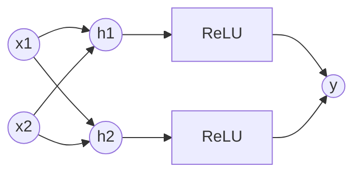

# Chapter 2: Perceptron to MLP

## SPARK

### The Cold Open
It's 1969. The AI community is buzzing about the "Perceptron," an artificial neuron capable of learning. The US Navy expects it to eventually walk, talk, and translate languages. Then, Marvin Minsky and Seymour Papert publish a book proving mathematically that a single layer of these perceptrons cannot solve the XOR (Exclusive OR) problem. Funding freezes. The first "AI Winter" begins. 

All because a multi-million dollar algorithm couldn't figure out that `1 XOR 1 = 0`.

### The Uncomfortable Truth
A single neural layer is nothing more than a linear classifier. No matter how you tune the weights or how big the dataset is, if you try to classify data that cannot be separated by a single straight line (or hyperplane), it will fail silently and permanently. 

### The Mental Model
Imagine you are sorting fruit. You can draw a single straight line on a table to separate Apples from Bananas. This is a **Perceptron**.

Now imagine sorting Apples, Bananas, and Oranges mixed in a circle. One straight line won't work. You need to draw multiple lines, create a bounded region, and say "everything inside this triangle is an Orange." This is a **Multi-Layer Perceptron (MLP)**. The hidden layers fold and twist the space so that a final, single straight line can slice it perfectly.

---

## FORGE

### The Dissection: The XOR Problem

**The Naive Approach (Single Perceptron):**
A perceptron computes a weighted sum of its inputs and applies a step function.
$y = \text{step}(w_1x_1 + w_2x_2 + b)$

Let's try to learn XOR:
| x1 | x2 | XOR(x1, x2) |
|----|----|-------------|
|  0 |  0 |      0      |
|  0 |  1 |      1      |
|  1 |  0 |      1      |
|  1 |  1 |      0      |

If you plot these four points on a 2D graph, you will see that no single straight line can separate the `0`s from the `1`s. The classes are diagonally opposed. A linear model is mathematically incapable of solving this.

**The Correct Approach (The MLP & Activation Functions):**
To solve XOR, we must stack layers. But stacking linear layers is pointless: 
$Linear(Linear(x)) = W_2(W_1x + b_1) + b_2 = (W_2W_1)x + (W_2b_1 + b_2)$ 
This just collapses back into a single linear transformation.

We need a **non-linearity** (an activation function) between the layers to bend the coordinate space.



By adding a hidden layer with a non-linear activation like ReLU (Rectified Linear Unit), the network projects the 2D input into a 3D (or higher) space, warps the space so the points become linearly separable, and then a final linear layer slices them.

### Activation Functions in Systems
Why ReLU? Historically, we used Sigmoid or Tanh.
- **Sigmoid ($1 / (1 + e^{-x})$):** Smashes outputs between 0 and 1. *Systems issue:* If the input is large (positive or negative), the gradient becomes near zero (vanishing gradient). Learning stops.
- **ReLU ($\max(0, x)$):** Gradient is exactly 1 for positive inputs, 0 for negative. *Systems advantage:* It is incredibly cheap to compute (just a max operation, no exponentials) and prevents vanishing gradients for positive values.
- **GeLU / Swish:** Smoothed versions of ReLU used in modern Transformers to allow slight gradients for negative values.

---

## WIRE

### The War Room: Dead Neurons in Production
**Incident Report:** You are training a massive MLP for an ads-CTR (Click-Through Rate) prediction system. You monitor the sparsity of your network activations. You notice that 40% of the neurons in your first hidden layer are outputting exactly zero, 100% of the time, regardless of the input batch.

**Root Cause:** "Dying ReLUs." If a neuron's weights update such that it always produces a negative output for your dataset, the ReLU activation will output 0. The gradient through a 0 is 0. The neuron receives no updates. It is permanently dead. This usually happens if the learning rate is too high, causing a massive weight update that pushes the bias deeply negative.

**The Fix:** 
1. Lower the learning rate.
2. Switch to Leaky ReLU: $\max(0.01x, x)$ which ensures a small gradient always flows.
3. Better initialization (He Initialization - covered in Chapter 6).

### The Lab: Implementing XOR from Scratch in PyTorch

Let's prove that an MLP solves XOR, and look closely at the PyTorch mechanics.

```python
import torch
import torch.nn as nn
import torch.optim as optim

# Dataset
X = torch.tensor([[0., 0.], [0., 1.], [1., 0.], [1., 1.]])
y = torch.tensor([[0.], [1.], [1.], [0.]])

# Model Architecture
class MLP(nn.Module):
    def __init__(self):
        super().__init__()
        # Hidden layer: projects 2D -> 4D
        self.hidden = nn.Linear(2, 4)
        # Output layer: projects 4D -> 1D
        self.output = nn.Linear(4, 1)
        
    def forward(self, x):
        # The crucial non-linearity
        x = torch.relu(self.hidden(x)) 
        # Using Sigmoid at the end to squash output to a probability (0 to 1)
        return torch.sigmoid(self.output(x))

model = MLP()
criterion = nn.BCELoss() # Binary Cross Entropy
optimizer = optim.SGD(model.parameters(), lr=0.1)

# Training Loop
for epoch in range(10000):
    optimizer.zero_grad()    # Flush previous gradients
    predictions = model(X)   # Forward pass
    loss = criterion(predictions, y) # Compute error
    loss.backward()          # Compute gradients
    optimizer.step()         # Update weights

print("Final Predictions after 10,000 epochs:")
print(model(X).round().detach())
# Output will be: [[0.], [1.], [1.], [0.]] -> XOR Solved!
```

### The Loose Thread
We just used `loss.backward()` to magically compute the gradients and update our network. But in production, "magic" is unacceptable. When your model runs out of GPU memory during a backward pass, you need to know exactly what tensors are being cached. How does PyTorch calculate the derivatives of millions of parameters dynamically? Next, we build the engine of deep learning: the Computational Graph and Backpropagation.