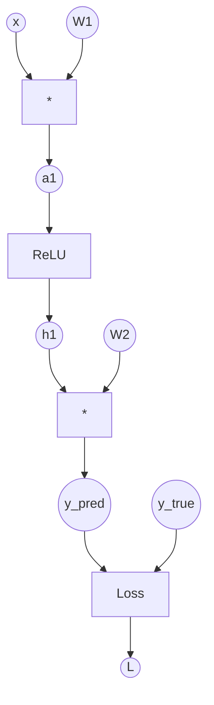

# Chapter 3: Backpropagation & Computational Graphs

## SPARK

### The Cold Open
Your team is fine-tuning a 7-billion parameter language model. You’ve provisioned an 8xA100 GPU cluster. The model parameters take up roughly 14GB of VRAM in fp16. An A100 has 80GB of VRAM. You load the model, set the batch size to 8, and start training. 

*CRASH.* 
`RuntimeError: CUDA out of memory. Tried to allocate 4.00 GiB...`

How did a 14GB model run out of 80GB of memory with a tiny batch size? You assumed training a model just meant storing its weights. You forgot about the hidden cost of the backward pass.

### The Uncomfortable Truth
Backpropagation is not a magical calculus solver; it is a **memory-for-compute tradeoff**. To compute the gradient of a weight early in the network, you must remember the intermediate activations from every layer that came after it during the forward pass. 

### The Mental Model
Imagine a factory line building a car (the **forward pass**). As the car moves down the line, workers attach doors, engines, and wheels. At the end, a quality inspector finds a scratch on the door (the **loss**).

To figure out exactly *who* caused the scratch and *how* to prevent it (the **backward pass**), the factory manager has to walk backward down the line. But they can only do this if every single worker took a photograph of exactly how they held the tool at the exact moment they attached their part. 

Those photographs are your **intermediate activations**. Storing them is why training requires 3x to 4x more memory than inference.

---

## FORGE

### The Dissection: The Chain Rule and The Graph

**The Naive Approach (Analytical Derivatives):**
When you learned calculus, you found derivatives analytically. If $y = \sin(x^2)$, you wrote out $dy/dx = \cos(x^2) \cdot 2x$. 
For a 100-layer neural network with millions of parameters, writing an analytical mathematical formula is impossible.

**The Correct Approach (Automatic Differentiation):**
Deep learning frameworks use **Reverse-Mode Automatic Differentiation** (Autograd). They don't do calculus on equations; they do calculus on *graphs*.

When you perform operations in PyTorch, it dynamically builds a **Computational Graph**. 



During the **Forward Pass**:
1. The framework computes the outputs.
2. Crucially, it saves the intermediate tensors (like `x`, `a1`, `h1`) in memory. It also saves a pointer to the function used to create them (`grad_fn`).

During the **Backward Pass** (The Chain Rule):
The Chain Rule states: $\frac{\partial L}{\partial w_1} = \frac{\partial L}{\partial y} \cdot \frac{\partial y}{\partial h_1} \cdot \frac{\partial h_1}{\partial a_1} \cdot \frac{\partial a_1}{\partial w_1}$

Starting from the Loss $L$, the framework walks backward through the graph. At each node, it calculates the local gradient and multiplies it by the upstream gradient. Once it passes a node, it deletes the saved activation to free memory.

### Why does it OOM?
If your batch size is large, or your sequence length is long (in transformers), the intermediate activations (`a1`, `h1`) become massive tensors. You aren't just storing the weights; you are storing the outputs of every single layer for every single item in the batch.

---

## WIRE

### The War Room: "Why is Inference OOMing?"
**Incident Report:** You deploy your trained model to an inference server with a 16GB GPU. Since training memory includes activations, and inference doesn't need backward passes, you assume it will easily fit. It processes the first 50 requests fine, but on request 51, it OOMs. 

**Root Cause:** You forgot to tell PyTorch you were doing inference. PyTorch defaults to building the computational graph and saving activations on *every* forward pass, just in case you call `.backward()` later. By request 51, the GPU was filled with a massive, useless computational graph.

**The Fix:** 
Always wrap inference code in `torch.no_grad()`. This disables graph construction and activation caching.

```python
# WRONG: Will leak memory over time if you hold onto predictions
outputs = model(inputs) 

# RIGHT: Disables the autograd engine
with torch.no_grad():
    outputs = model(inputs)
```

### The Lab: Peeking at the Autograd Engine

Let's look at the hidden graph PyTorch builds behind your back.

```python
import torch

# Create tensors. requires_grad=True tells PyTorch to track them in the graph.
w = torch.tensor([2.0], requires_grad=True)
x = torch.tensor([3.0]) # Inputs usually don't need gradients
b = torch.tensor([1.0], requires_grad=True)

# Forward pass
y = w * x + b

# y has a grad_fn, proving it was created by an operation tracked by autograd
print(f"y grad_fn: {y.grad_fn}") 
# Output: <AddBackward0 object at 0x...>

loss = (y - 10)**2
print(f"loss grad_fn: {loss.grad_fn}")
# Output: <PowBackward0 object at 0x...>

# Backward pass
loss.backward()

# The gradients are accumulated in the .grad attribute of the leaf tensors
print(f"Gradient of loss w.r.t w: {w.grad}")
print(f"Gradient of loss w.r.t b: {b.grad}")

# If we do another forward/backward pass, gradients will accumulate (add up).
# This is why we must call optimizer.zero_grad() in our training loop!
```

### The Loose Thread
We now have gradients. We know exactly which direction to nudge our weights to make the loss smaller. But what if the loss function itself is pointing us in the wrong direction? And what if "taking a step" in the direction of the gradient causes our network to overcorrect and explode? In the next chapter, we look at Loss Functions and the dark art of Optimization (SGD, Momentum, Adam).