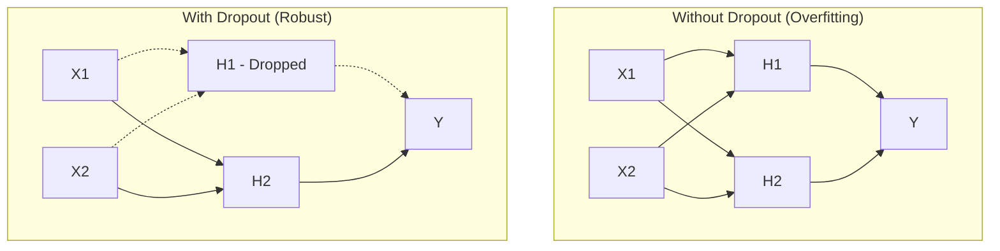

# Chapter 5: Regularization

## SPARK

### The Cold Open
You are training a vision model to detect defects in manufacturing parts. You have a dataset of 5,000 images. You train a massive ResNet-50. After a few hours, the training loss hits exactly `0.0000`. The training accuracy is 100%. You deploy it to the factory floor. 

It immediately rejects perfectly good parts and passes obviously broken ones. The factory floor accuracy is 48%. Worse than a coin flip. What happened? 

### The Uncomfortable Truth
Deep neural networks have millions, sometimes billions, of parameters. They have enough memory capacity to simply **memorize the entire training dataset** rather than learning generalizable rules. If a student memorizes the exact answers to a practice test, they will score 100% on the practice test and fail the real exam. Deep learning models are the ultimate lazy students.

### The Mental Model
Imagine you are hiring a detective to find a specific criminal. 
If you give the detective a photo of the criminal wearing a red hat, a lazy detective might just learn: "Arrest anyone wearing a red hat." That's **overfitting**. 

Regularization is the process of actively hindering the detective during training. You blur the photo. You hide the red hat. You force the detective to look at the jawline, the height, the eyes. By making the training task artificially harder, you force the model to learn robust, generalizable features.

---

## FORGE

### The Dissection: Weight Decay and Dropout

**1. Weight Decay (L2 Regularization)**
*The Naive Approach:* Let the optimizer set the weights to whatever values minimize the loss. If the network decides to multiply a specific pixel by 10,000 to perfectly fit one specific image, it will.
*The Correct Approach:* Add a penalty to the loss function based on the size of the weights. 
$L_{total} = L_{data} + \lambda \sum w^2$
The optimizer now has two conflicting goals: minimize the error, AND keep the weights as close to zero as possible. The network is forced to distribute its reliance across many small weights rather than relying on a few massive, brittle weights.

**2. Dropout**
*The Naive Approach:* All neurons in a layer participate in every forward pass. 
*The Correct Approach:* During training, randomly zero out (drop) a percentage (e.g., 50%) of the neurons in a layer on every forward pass.



Why does this work? **Co-adaptation.** If neuron A always corrects the mistakes of neuron B, they become dependent. If you randomly drop neuron B, neuron A is forced to learn useful features on its own. It’s like an ensemble of smaller sub-networks training together.

---

## WIRE

### The War Room: The Inference Scaling Bug
**Incident Report:** You used 50% Dropout during training. Your loss was great. You deploy to production. Suddenly, the model's predictions are completely wildly off scale, outputting massive values.

**Root Cause:** During training, if you drop 50% of the neurons, the total sum of the signals reaching the next layer is cut in half. PyTorch compensates by scaling the remaining active neurons by a factor of $\frac{1}{1-p}$ (so scaling by 2x). 
But during inference, you *don't* drop neurons. You want the full brain working. If you forget to tell the framework you are in inference mode, it keeps applying the dropout mask or fails to adjust the scaling, completely destroying the pre-activations.

**The Fix:** 
You must explicitly toggle the network state before doing inference.

```python
# Before training loop
model.train() 
# Dropout is active. Batch Norm tracks statistics.

# ... training happens ...

# Before validation or inference
model.eval() 
# Dropout is disabled. Batch Norm uses moving averages.
with torch.no_grad():
    predictions = model(test_data)
```

### The Lab: Data Augmentation as Regularization
The best way to prevent overfitting is to get more data. If you can't get more data, fake it.

```python
import torchvision.transforms as transforms

# Instead of passing the exact same image every epoch,
# we apply random transformations. The network never sees 
# the exact same pixel grid twice.
train_transform = transforms.Compose([
    transforms.RandomHorizontalFlip(p=0.5), # Flip the cat
    transforms.RandomRotation(degrees=15),  # Tilt the cat
    transforms.ColorJitter(brightness=0.2), # Change lighting
    transforms.ToTensor()
])
```

### The Loose Thread
We know how to stop the network from memorizing. But what if the network refuses to learn at all? You hit "Run" and the loss sits exactly where it started, forever. The problem usually isn't your loss function or your data; the problem is that the mathematical plumbing of your network is blocked. In the next chapter, we diagnose Vanishing Gradients, Initialization, and Batch Normalization.