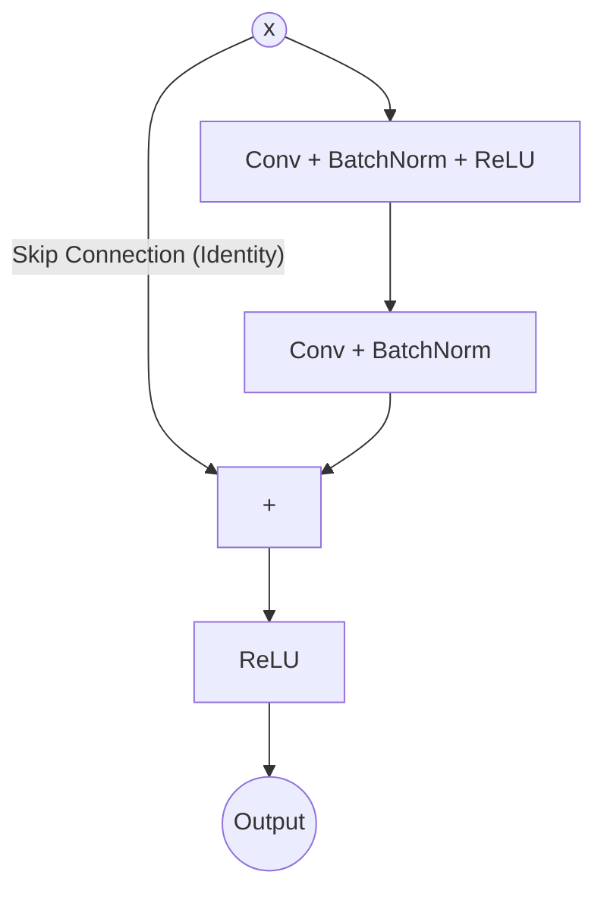

# Chapter 8: CNN Architectures

## SPARK

### The Cold Open
It’s 2015. The deep learning revolution is in full swing. AlexNet (8 layers) crushed the ImageNet competition in 2012. VGG (19 layers) pushed accuracy further in 2014. The logic in the community is simple: **Deeper is better.** 

You decide to build a 56-layer CNN. You initialize it perfectly. You use Batch Normalization. But when you train it, the 56-layer network has *worse* training error than a 20-layer network. Not validation error—*training error*. It's not overfitting; it’s underfitting. The network literally cannot learn.

### The Uncomfortable Truth
Adding layers to a neural network does not guarantee it will learn a more complex function. In reality, every layer you add is an obstacle course for the gradient. By the time the gradient propagates backward through 50 layers of matrix multiplications and non-linearities, it has been multiplied by numbers less than 1 so many times that it vanishes to zero. The early layers learn nothing.

### The Mental Model
Think of a traditional deep network like a game of **Telephone** played by 50 people. The original message (the gradient) is whispered from person to person. By the 50th person, the message is completely garbled or silent.

A **Residual Network (ResNet)** gives every person in the line a megaphone and a direct radio link to the start. If the whisper gets corrupted, the original clean signal can bypass the broken links and jump straight to where it's needed.

---

## FORGE

### The Dissection: The Evolution to ResNet

**1. VGG (The Brute Force Approach):**
VGG relies entirely on stacking tiny $3 \times 3$ convolutions. It proved that deep networks work, but VGG-19 is massive (140+ million parameters) and incredibly slow to train. It hits a depth wall.

**2. Inception (The Wide Approach):**
Instead of just going deep, Inception modules go *wide*. They apply $1 \times 1$, $3 \times 3$, and $5 \times 5$ convolutions in parallel and concatenate the results. *Systems note:* The $1 \times 1$ convolution is a dimensionality reduction trick. It squeezes the number of channels down (like a bottleneck) before the expensive $3 \times 3$ operations, saving massive amounts of compute.

**3. ResNet (The Highway Approach):**
Kaiming He and his team realized a fundamental property: A 56-layer network should be at least as good as a 20-layer network, because the 56-layer network could just copy the 20-layer network exactly, and set the remaining 36 layers to the **Identity Function** (output = input).

But normal layers are terrible at learning the identity function. `Linear(x)` wants to warp `x`. 
So, ResNet forces it mathematically. Instead of asking a layer to learn the underlying mapping $H(x)$, ResNet asks the layer to learn the *residual* $F(x)$, and then adds the original input back: 

$$H(x) = F(x) + x$$



*Why this fixes vanishing gradients:* 
During backpropagation, the derivative of addition is 1. The gradient flows straight back through the skip connection ($x$) without being altered. It acts as an express highway for the gradient, allowing networks to scale to 100, 1000, or even 10,000 layers.

---

## WIRE

### The War Room: GPU Memory vs Checkpointing
**Incident Report:** You are training a ResNet-152 on high-resolution medical images. Even with a batch size of 2, you are OOMing. You cannot reduce the image size, and you cannot reduce the batch size further. 

**Root Cause:** Deep networks = deep computational graphs. ResNet-152 has 152 layers of intermediate activations that must be saved for the backward pass.

**The Fix (Gradient Checkpointing):** 
PyTorch offers a tool called `torch.utils.checkpoint`. Instead of saving all 152 activations, you only save the activations at specific "checkpoints" (e.g., every 10 layers). During the backward pass, when PyTorch needs a missing activation, it simply recomputes it by running the forward pass *just for that chunk*. 
**Tradeoff:** You save up to 70% of your VRAM, but training takes ~20% longer because you are doing redundant forward passes.

### The Lab: Implementing a Residual Block

```python
import torch
import torch.nn as nn

class ResidualBlock(nn.Module):
    def __init__(self, channels):
        super().__init__()
        # First convolution
        self.conv1 = nn.Conv2d(channels, channels, kernel_size=3, padding=1)
        self.bn1 = nn.BatchNorm2d(channels)
        
        # Second convolution
        self.conv2 = nn.Conv2d(channels, channels, kernel_size=3, padding=1)
        self.bn2 = nn.BatchNorm2d(channels)
        
    def forward(self, x):
        # Save the original input for the skip connection
        identity = x
        
        # The main path (learning the residual)
        out = torch.relu(self.bn1(self.conv1(x)))
        out = self.bn2(self.conv2(out))
        
        # The magic addition: Output = Residual + Identity
        out += identity 
        out = torch.relu(out)
        
        return out

# A tensor representing 1 image, 64 channels, 32x32 pixels
x = torch.randn(1, 64, 32, 32)
block = ResidualBlock(64)
print("Output shape:", block(x).shape) # Remains [1, 64, 32, 32]
```

### The Loose Thread
We now have incredibly powerful image feature extractors. But training a ResNet-50 from scratch takes days and requires millions of images. What if you only have 500 images of a specific rare disease? You can't train a ResNet from scratch on that. In the next chapter, we learn how to steal knowledge from Google and Facebook: Transfer Learning.