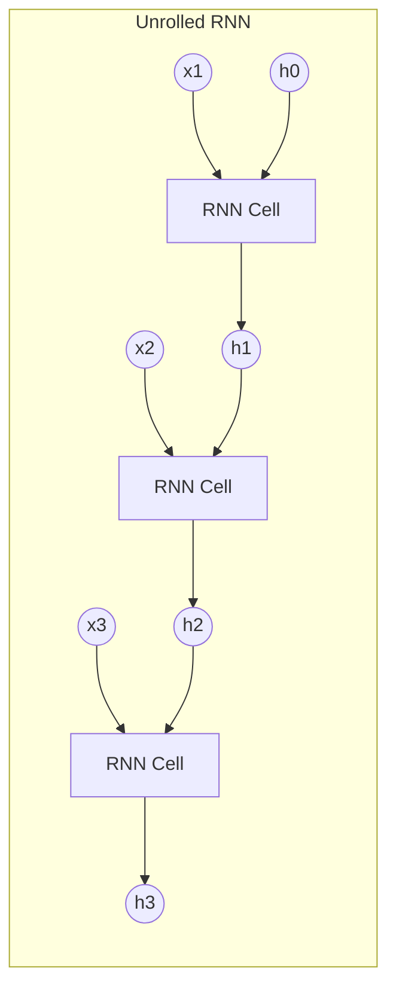

# Chapter 10: RNNs

## SPARK

### The Cold Open
You are building an AI to predict the next word in a sentence. 
Input: "The cat sat on the..." $\rightarrow$ Target: "mat".
You try to use an MLP. You decide to limit your input to 5 words. You train it. It works okay.
Then someone inputs: "I grew up in France, where I spent my childhood eating baguettes, so I speak fluent..." 
The word "France" occurred 15 words ago. Your 5-word MLP only sees "so I speak fluent..." and guesses "English". It fails completely. 

### The Uncomfortable Truth
Standard Neural Networks (MLPs, CNNs) are **amnesiacs**. They process an input, spit out an output, and immediately wipe their memory. They have no concept of time or sequence. To process a sequence of arbitrary length, a network must possess an internal memory state that persists across steps.

### The Mental Model
Think of reading a book. You do not look at the entire page simultaneously (like an MLP). You read one word at a time. As you read, you maintain a running summary of the plot in your head. 
When you read the word "he", you know it refers to "John" from the previous sentence because your internal memory state connects them. 

A Recurrent Neural Network (RNN) is simply an MLP wrapped in a `for` loop, passing its own output back to itself as a running summary.

---

## FORGE

### The Dissection: State Through Time

**The Architecture:**
At time step $t$, the RNN receives two inputs:
1. The current data $x_t$ (e.g., the current word).
2. The previous hidden state $h_{t-1}$ (the running summary).

It applies a weight matrix to both, adds them, and passes them through a `tanh` activation to create the new hidden state $h_t$.
$h_t = \tanh(W_{hx} x_t + W_{hh} h_{t-1} + b)$



**Backpropagation Through Time (BPTT):**
To train this, we "unroll" the loop. A 10-word sentence becomes a 10-layer deep network, where *every layer shares the exact same weights* ($W_{hh}$ and $W_{hx}$). The loss at step 10 backpropagates through step 9, 8, 7... all the way to 1. 

---

## WIRE

### The War Room: The Exploding Loop
**Incident Report:** You are training an RNN on 100-character sequences. After 5 epochs, your loss becomes `NaN`. 

**Root Cause:** Look at the unrolled graph. You are multiplying by the *exact same weight matrix* $W_{hh}$ 100 times.
If the largest eigenvalue of $W_{hh}$ is 1.1, then $1.1^{100} = 13,780$. The gradient explodes to infinity.
If the largest eigenvalue is 0.9, then $0.9^{100} = 0.00002$. The gradient vanishes to zero.

Because the weight is shared across time, RNNs are exponentially susceptible to exploding and vanishing gradients. The network literally cannot remember information from 20 steps ago because the gradient signal dies before it can travel that far backward in time.

**The Fix:** 
For exploding gradients: **Gradient Clipping** is mandatory when training RNNs.
For vanishing gradients: Standard RNNs cannot be fixed. We must change the architecture.

### The Lab: The Vanilla RNN Loop

```python
import torch
import torch.nn as nn

class VanillaRNN(nn.Module):
    def __init__(self, input_size, hidden_size):
        super().__init__()
        self.hidden_size = hidden_size
        
        # W_hx: Weights for input
        self.i2h = nn.Linear(input_size, hidden_size)
        # W_hh: Weights for previous hidden state
        self.h2h = nn.Linear(hidden_size, hidden_size)
        
    def forward(self, x_sequence):
        # x_sequence shape: [Sequence_Length, Batch, Input_Size]
        seq_len, batch_size, _ = x_sequence.size()
        
        # Initialize hidden state h_0 to zeros
        h_t = torch.zeros(batch_size, self.hidden_size)
        
        # The Recurrent Loop!
        for t in range(seq_len):
            x_t = x_sequence[t]
            # h_t = tanh(W_hx * x_t + W_hh * h_{t-1})
            h_t = torch.tanh(self.i2h(x_t) + self.h2h(h_t))
            
        # Return the final running summary
        return h_t

# 5 time steps, batch size of 1, 10 features per step
sequence = torch.randn(5, 1, 10) 
rnn = VanillaRNN(input_size=10, hidden_size=20)
final_state = rnn(sequence)
print("Final summary shape:", final_state.shape) # [1, 20]
```

### The Loose Thread
The vanilla RNN is beautifully simple, but practically useless for long sequences. Every time a new word arrives, it forces the hidden state through a `tanh` function, slowly overwriting the old memories. We need a way for the network to explicitly say: "This new word is useless, ignore it and keep the old memory perfectly intact." Enter the LSTM.