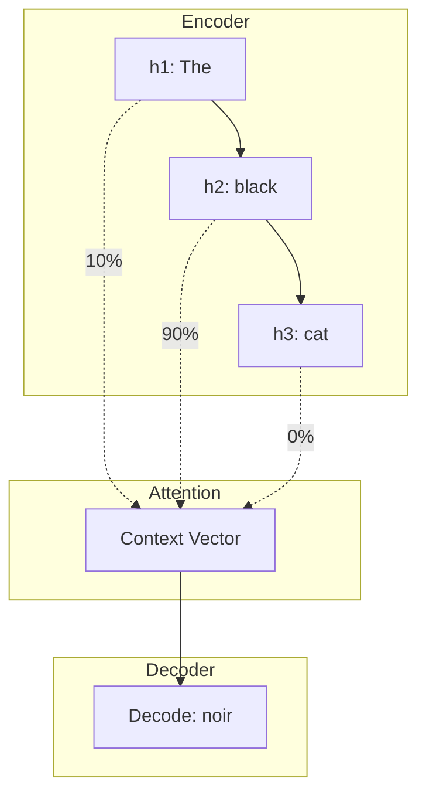

# Chapter 12: Seq2Seq & Attention

## SPARK

### The Cold Open
You are building an AI translator to convert English to French. 
You use an LSTM. You feed it a 5-word sentence. It outputs a perfect 5-word translation. 
Then, you feed it a 50-word legal document. The LSTM processes all 50 words, compresses the entire document into a single 512-dimensional hidden vector, and starts generating the French translation. It gets the first few words right, then hallucinates complete garbage for the rest. 

### The Uncomfortable Truth
Compressing a 50-word sentence into a single, fixed-size vector is like trying to summarize "War and Peace" on a sticky note. The **Information Bottleneck** is fatal. You cannot force an infinite amount of semantic meaning into a finite-dimensional space without catastrophic data loss.

### The Mental Model
Imagine you are translating a speech live.
The **Seq2Seq (No Attention)** approach: You listen to the speaker for 5 minutes, take *zero notes*, wait for them to finish, and then try to recite the translation from memory.
The **Seq2Seq (With Attention)** approach: You write down every single sentence the speaker says. When you start translating, for every French word you write, you actively *look back* at your notes, focusing your eyes on the specific English words that are most relevant right now.

---

## FORGE

### The Dissection: The Encoder-Decoder Architecture

To translate, we need two networks:
1. **The Encoder:** An LSTM that reads the English sentence and produces hidden states.
2. **The Decoder:** An LSTM that takes the Encoder's final state and generates French words one by one.

**The Naive Approach (The Bottleneck):**
The Decoder is initialized with *only* the Encoder's final hidden state $h_{final}$. It never looks at the previous states ($h_1, h_2...$). It relies entirely on the sticky note.

**The Correct Approach (Attention):**
Instead of discarding the intermediate states of the Encoder, we keep all of them. 
When the Decoder wants to generate the first French word, it asks a question: *"Based on my current state, which English words from the Encoder should I look at?"*

1. **Alignment Scores:** The network computes a mathematical dot product between the Decoder's current state and *every single* Encoder state. 
2. **Softmax:** These scores are passed through a Softmax function, turning them into probabilities (e.g., 90% focus on $h_2$, 10% on $h_3$).
3. **Context Vector:** We multiply the Encoder states by these percentages and sum them up. We give this custom-built, highly-focused Context Vector to the Decoder.



The network learns *how to align* languages. It learns that when generating the French adjective, it should place 90% of its mathematical focus on the English adjective.

---

## WIRE

### The War Room: "Why does training take so long?"
**Incident Report:** You implement Attention. Your translation accuracy skyrockets. Your BLEU score is amazing. But training is agonizingly slow. You scale up your GPU cluster, but it barely helps.

**Root Cause:** The Attention mechanism still relies on the underlying LSTMs. The Encoder must process word 1 before word 2. The Decoder must generate word 1 before word 2. You have a magnificent, intelligent algorithm trapped inside a strictly sequential `for` loop. It cannot parallelize.

**The Fix:** 
There is no fix for LSTMs. To break the sequential bottleneck, we must destroy the recurrent architecture entirely. 

### The Lab: Attention is just a Dictionary
At a systems level, Attention is a differentiable key-value store.
- **Query:** What the Decoder is looking for.
- **Key:** What the Encoder words represent.
- **Value:** The actual content of the Encoder words.

```python
import torch
import torch.nn.functional as F

# 1 Query (Decoder state), 5 Keys/Values (Encoder states)
# Dimension = 64
query = torch.randn(1, 64) 
keys = torch.randn(5, 64)
values = torch.randn(5, 64)

# 1. Compute Alignment Scores (Dot Product)
# Shape: [1, 64] @ [64, 5] -> [1, 5]
scores = torch.matmul(query, keys.T) 

# 2. Convert to probabilities (Attention Weights)
attention_weights = F.softmax(scores, dim=1)
print("Attention Weights:", attention_weights.round(decimals=2))
# Output: tensor([[0.10, 0.80, 0.05, 0.03, 0.02]])

# 3. Create Context Vector (Weighted Sum of Values)
# Shape: [1, 5] @ [5, 64] -> [1, 64]
context_vector = torch.matmul(attention_weights, values)
```

### The Loose Thread
Attention is brilliant. It allows dynamic routing of information. But if Attention is so powerful, why do we even need the LSTM? Why are we forcing the words through a sequential loop just to generate the `Keys` and `Values`? What if we threw away the LSTM entirely and built a network *only* out of Attention? In 2017, a team at Google asked exactly this question. The answer changed the world.