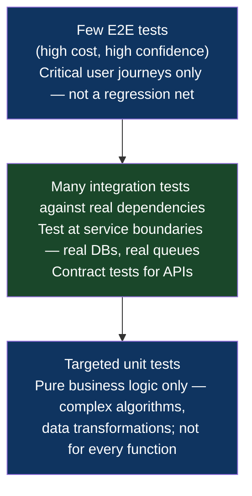

# Chapter 2: Core Principles
*Part I: Principles of Modern Release Engineering*

> *"Our branching strategy was called 'GitFlow.' Our actual branching strategy
> was called 'fear of trunk.'"*
> — anonymous postmortem, 2021

---

## The War Story

Aditya Sharma is the release manager at Strata Finance, a Series C fintech company processing about $4 billion in payments per month. It's 9:14 AM on a Tuesday in October when the security team sends a Slack message that ruins his week: a critical vulnerability in the JWT validation library they're using — CVE-2023-44487 variant, a timing attack that under specific conditions allows token forgery. The CVE is public. Strata has 72 hours before they have to disclose to regulators, and the fix is a one-line dependency bump: `jsonwebtoken` from `9.0.1` to `9.0.2`.

One line. A dependency version number.

Here is what Strata's branching strategy looks like at this moment:

- `main` — production-deployed, last touched 11 days ago, contains the v2.4.0 release
- `develop` — integration branch, 34 commits ahead of `main`, contains partially complete features for v2.5.0
- `release/v2.4.1` — a "hotfix release" branch that was cut from `main` three weeks ago for a different patch, subsequently had four more "quick fixes" committed directly to it, and was never merged back because "we didn't want to destabilize develop"
- `feature/payment-refactor` — a feature branch that two engineers have been working on for six weeks, which has been "almost ready to merge to develop" for the last three of those weeks

The vulnerability exists in all of them. The fix is the same: bump `jsonwebtoken`. But applying the fix to each branch is not straightforward. `develop` has dependency resolution conflicts introduced by the payment refactor work. `release/v2.4.1` has a `package-lock.json` that was generated against a different version of Node.js than the one CI is currently using. `feature/payment-refactor` has restructured the authentication module in ways that break the `main` version of the integration tests.

Three days later, after three separate patch efforts, three separate CI runs, two hotfix cherry-picks that produced different diffs than expected, and one 2 AM incident where the `release/v2.4.1` deploy to production temporarily broke session management for European customers (the branch had a silent merge conflict in a config file that the tests didn't cover), the vulnerability is patched.

Total time to patch a one-line dependency bump: 72 hours.

In the postmortem, Aditya writes five pages about the branching strategy. The last paragraph reads: *"The branching strategy is not the tool that failed us. The branching strategy was the failure. We will move to trunk-based development before the next release cycle."*

He's right. And this chapter explains why.

---

## What You'll Learn

- Why trunk-based development is a precondition for CI/CD, not a stylistic choice — and what "trunk-based" actually requires (it's not what most teams think)
- The deployment safety contract: the four explicit guarantees a pipeline must provide and the organizational commitments required to maintain them
- The hermetic reproducibility axiom and the "build once, deploy many" principle — why building the same code twice is a defect, not an efficiency
- What "immutable artifacts" actually means in practice, and why `docker push myapp:latest` is an act of violence against your future self
- Why the test pyramid optimizes for the wrong cost function — and what mental model to use instead

---

## Trunk-Based Development: The Precondition, Not the Preference

Trunk-based development (TBD) is the practice of having developers integrate their work into a single shared mainline branch — the trunk — continuously, with individual changes living on short-lived branches measured in hours, not days. There are no long-lived feature branches. There are no "develop" branches. There is no "release branch" that accumulates fixes and diverges from mainline. There is one branch that represents the current state of the codebase, and every engineer's job is to keep it deployable.

This sounds simple. Organizations resist it violently.

The resistance comes from a place of genuine concern: "If we all push to main, we'll break each other's work constantly." This concern is legitimate. It is also based on a misunderstanding of what trunk-based development actually requires. TBD without feature flags is not TBD — it is recklessness with good marketing. TBD without feature flags means pushing incomplete, half-built features to the mainline branch where they are visible to users in production. That is bad. But it is not what TBD advocates recommend.

**The enabling mechanism is the feature flag.** You push incomplete code to trunk. The incomplete code runs in production. It is invisible to users because it is gated behind a feature flag that is `false` for everyone except the internal dogfood group. The code is deployed; the feature is not released. This distinction — between *deployment* and *release* — is one of the most important conceptual separations in modern release engineering, and it will come up repeatedly in this book.

The DORA (DevOps Research and Assessment) research program — the most rigorous empirical study of software delivery practices — found consistently, across multiple years of data and thousands of organizations, that trunk-based development is one of the strongest predictors of elite software delivery performance. Elite performers deploy multiple times per day, have lead times measured in minutes, and recover from failures in under an hour. Elite performers, almost universally, practice trunk-based development.

This is not causation argued from correlation. The mechanism is clear: long-lived branches create integration debt. Integration debt creates merge complexity. Merge complexity creates risk. Risk creates ceremony around deployments. Ceremony creates batch pressure (making each release contain many changes to justify the ceremony cost). Batch pressure creates large, high-risk deploys. TBD eliminates the branch and the debt, which unwinds the entire failure cascade.

### What TBD Actually Requires

TBD has four structural requirements that are non-negotiable:

**1. Short-lived branches only.** Feature branches should live for less than a day, ideally less than four hours. If a branch lives longer, it is accumulating divergence. The definition of "short-lived" is not about lines of code — it's about time. A 500-line refactor committed over four hours is TBD-compatible. A 10-line change that sits on a branch for three weeks while the author "polishes it" is not.

**2. Feature flags for incomplete work.** Any code that is not ready for all users to see must be behind a feature flag. This is not optional. Without feature flags, TBD forces you to either deploy incomplete features or sit on branches until features are complete — and the second option is not TBD.

**3. Comprehensive automated tests that run on every commit to trunk.** Every push to the mainline triggers the full test suite. The results are available quickly (under 10 minutes for unit/lint, under 30 minutes for integration). Broken builds are fixed immediately — they are not "we'll get to it" issues. The mainline must be kept green. A red mainline is a production incident for the team.

**4. Small, focused commits.** TBD works because each change is small enough that its blast radius is manageable. "I rewrote the authentication module" is not a single commit to trunk. It is either a sequence of commits behind an abstraction layer (the Branch by Abstraction pattern, Chapter 15) or it is a deployment risk. Large commits negate the safety properties that TBD provides.

### GitFlow Is Not Wrong — It's Wrong for You

A note on GitFlow, because this is where people get defensive: GitFlow was designed by Vincent Driessen in 2010 for a specific context — teams releasing versioned software packages (libraries, desktop apps, installed software) where supporting multiple versions in production simultaneously is a requirement. If you are maintaining a library that has users on v1.4, v2.1, and v3.0 simultaneously, GitFlow's release branches make sense. You need to be able to patch v1.4 without the patch containing the v2.x breaking changes.

If you are a web application or a service with a single production deployment, you do not have multiple versions in production simultaneously. You have one version. There is no semantic case for long-lived release branches. GitFlow in this context is not a branching strategy — it is anxiety management. Teams use it because merging to trunk feels scary, and GitFlow provides the illusion of a controlled process while actually increasing integration risk and complexity.

---

## The Deployment Safety Contract

Every pipeline makes an implicit promise to the organization that owns it. Most teams never write this promise down, which is why they're surprised when the promise gets broken.

The **deployment safety contract** is the explicit statement of what a pipeline guarantees about the software it delivers. It has four clauses:

### Clause 1: Correctness Guarantee

The pipeline guarantees that software reaching production has been verified against a defined quality bar. "Verified" means automated tests have run and passed. "Defined quality bar" means the test coverage, test types, and pass criteria are explicit and documented — not "we run our tests."

This clause requires you to be honest about what your tests actually cover. A correctness guarantee backed by a test suite with 20% coverage of the critical payment flow is not a correctness guarantee — it is theater. The safety contract must specify *what* is guaranteed, not just that "tests pass."

### Clause 2: Reproducibility Guarantee

The pipeline guarantees that a given artifact, deployed to any environment, behaves identically. This means the artifact itself carries its dependencies — it does not rely on the target environment having the right versions of anything. A container image is a stronger reproducibility guarantee than a "deploy script that installs dependencies from requirements.txt" because the container image is immutable and complete; the deploy script's output depends on what PyPI serves the day it runs.

This clause is violated constantly, in ways that are hard to detect until they cause an incident.

### Clause 3: Auditability Guarantee

The pipeline guarantees that it can answer, at any point: *What is currently running in production? When was it deployed? By whom? What source code commit does it correspond to?* This requires artifact versioning, deployment event logging, and traceability from a running artifact back to a specific git SHA.

Without this guarantee, incident response is guesswork. "I think it's running the version from last Tuesday but I'm not sure" is not an auditability guarantee.

### Clause 4: Recoverability Guarantee

The pipeline guarantees that if a deployment causes a regression, the organization can return to a previous known-good state within a defined time bound. The time bound must be explicit: "We can roll back to the previous version within 5 minutes" is a guarantee. "We can probably roll back, we've done it before" is not.

Recoverability requires artifact retention (can't roll back to a version whose image was garbage-collected), tested rollback procedures (can't trust a rollback path that has never been executed under realistic conditions), and database migration compatibility (can't roll back the application binary if the schema migration it depends on has already run and isn't reversible). Chapter 45 covers rollback in depth.

### Who Owns Each Clause

The safety contract is not the pipeline's contract alone. It requires commitments from multiple parties:

- **The development team** owns the correctness guarantee. If the tests don't cover the critical paths, the pipeline cannot make a meaningful correctness guarantee. No amount of CI tooling compensates for missing tests.
- **The platform team** owns the reproducibility and auditability guarantees. These are infrastructure properties — artifact management, environment parity, logging — that the platform team is responsible for providing as a service to development teams.
- **The release engineering function** (which may be a person, a team, or a shared responsibility) owns the recoverability guarantee. Designing rollback capability, testing it regularly, and ensuring the organizational muscle memory exists to execute it quickly under pressure — this is release engineering's core product.

When an incident happens and the safety contract is violated, the postmortem should identify *which clause was violated* and *who was responsible for that clause*. "The pipeline failed" is not a useful finding. "The correctness guarantee was violated because the payment integration test suite didn't cover the edge case that was in production" is a useful finding.

---

## The Hermetic Reproducibility Axiom: Build Once, Deploy Many

The hermetic reproducibility axiom states: **a build is hermetic if and only if it produces identical output for identical input, regardless of the environment in which the build runs, and depends on nothing outside the explicitly specified build inputs**.

"Hermetic" comes from Hermes Trismegistus (alchemists were weird), but the engineering meaning is simple: sealed. A hermetic build is sealed against its environment. It brings everything it needs. It does not reach out to the network, the host filesystem, or ambient state during the build process.

Why does this matter? Because non-hermetic builds produce non-reproducible artifacts, which means the artifact you test in CI is not the artifact you deploy to production. The builds *look* the same. The artifacts have different digests. The differences are small — maybe a transitive dependency was at a slightly different version when the production deploy ran than when CI ran. Maybe a system library was at a different patch level. Usually nothing goes wrong. Occasionally, something goes wrong in a way that is completely invisible in CI and completely reproducible in production, at which point you have the worst possible kind of bug: one that cannot be replicated in the environment where you have debugging tools.

The "build once, deploy many" corollary follows directly: if a build is hermetic and reproducible, there is no reason to build the same commit twice. You build once in CI, producing an artifact with a deterministic digest. That artifact is stored. That *same artifact* — same bytes, same digest — is promoted through dev → staging → production. You do not re-build when promoting to staging. You do not re-build when promoting to production. The artifact that passed tests in CI is the artifact that runs in production. This gives you an actual correctness guarantee: if the artifact behaves well in staging, the production artifact is identical, so the testing result transfers.

Non-hermetic builds in practice look like this:

```dockerfile
# ❌ BAD: Non-hermetic build. This is what most Dockerfiles look like.
FROM node:18

WORKDIR /app
COPY package*.json ./

# This reaches out to the internet at build time.
# The packages installed depend on what npm serves TODAY.
# A transitive dependency could have been updated since CI ran.
# This build is not reproducible.
RUN npm install

COPY . .
RUN npm run build
```

```dockerfile
# ✅ GOOD: Hermetic build. Dependencies are locked and verified.
FROM node:18.19.0-alpine3.19@sha256:8d471bfed0c2aef938e5   # pin exact digest, not just tag

WORKDIR /app
COPY package.json package-lock.json ./

# --frozen-lockfile: fail if package-lock.json is out of sync with package.json.
# This ensures the lockfile — which was committed and reviewed — is the authoritative
# source of dependency versions. No silent updates.
RUN npm ci --frozen-lockfile

# After npm ci, the node_modules directory is bit-for-bit identical to what it was
# when the lockfile was last updated. Every build from this Dockerfile, anywhere,
# produces the same output.
COPY . .
RUN npm run build
```

The difference seems minor. It is not minor. The `npm install` version will silently install a different version of a transitive dependency if that dependency releases a new patch between your CI run and your production deploy. With `npm ci --frozen-lockfile`, the production artifact is bit-for-bit identical to the CI artifact. The hermetic build guarantee holds.

Hermetic builds have a second benefit that's less obvious but equally important: **supply chain security**. If your build reaches out to external package registries at build time, a compromised package version can silently end up in your production binary. If your build uses a locked, verified lockfile and pinned base images, supply chain attacks must compromise your *lockfile* — which is in version control, code-reviewed, and auditable — rather than exploiting a window between your CI run and your production deploy. Chapter 46 covers supply chain security in depth.

The tools that make hermetic builds practical at scale: **Docker BuildKit** with `--cache-from` for container builds, **Bazel** and **Nix** for language-level reproducibility, and **SLSA (Supply-chain Levels for Software Artifacts)** for provenance attestation. Chapter 3 covers the Hermetic Build Pattern implementation exhaustively.

---

## Immutable Artifacts: What "Immutable" Actually Means

An artifact is immutable if, once created, it cannot be changed. The tag that identifies the artifact points to the same content forever. If you need different content, you create a new artifact with a new tag.

This sounds obvious. In practice, the `latest` tag exists, which means it is not obvious enough.

```bash
# ❌ The most common artifact management mistake in the industry.
# "latest" is not a version. It's a floating pointer that means
# "whatever the last person pushed." 
docker push myapp:latest

# ❌ Even worse: overwriting a specific tag.
# v1.2.3 now refers to different bytes than it did yesterday.
# Any system that deployed "v1.2.3" and kept a record of that
# deployment can no longer use the record to reproduce the deployment.
docker push myapp:v1.2.3  # if this runs twice, the first v1.2.3 is gone
```

```bash
# ✅ GOOD: Tag with git SHA for immutability. The SHA is a content-addressed
# identifier — it uniquely identifies the exact commit that produced this artifact.
# This tag will never refer to different content.
GIT_SHA=$(git rev-parse --short HEAD)
docker build -t myapp:${GIT_SHA} .
docker push myapp:${GIT_SHA}

# ✅ ALSO GOOD: Tag with a build number that is monotonically increasing
# and stored in CI's build metadata. Less common but acceptable.
docker push myapp:build-${CI_BUILD_NUMBER}

# For human convenience, you CAN also push a semver tag.
# But semver tags must NEVER be overwritten once pushed.
# Use immutable tag enforcement in your registry (ECR has this feature).
docker push myapp:1.4.2
```

Immutability has three properties that the rest of the book depends on:

**Traceability.** An immutable artifact tagged with its git SHA gives you a direct, unforgeable link from a running system back to the exact source code that produced it. Debugging a production issue becomes: `kubectl describe pod | grep image`, get the SHA, `git show <sha>`, see exactly what was deployed. Without immutable tags, this chain breaks.

**Rollback correctness.** Rolling back to "the previous version" requires that "the previous version" still exists and is unchanged. If artifacts are mutable — if `v1.2.2` was overwritten after `v1.2.3` was released — the rollback target may not be what you think it is. Immutable artifacts guarantee that the artifact you want to roll back to is exactly what it was when it was originally deployed.

**Promotion confidence.** The "build once, deploy many" axiom requires that the artifact promoted from staging to production is the same artifact that was tested in staging. If artifacts are mutable, someone could have modified the `staging` tag between the staging test run and the production promotion. Immutability makes this impossible.

The practical implementation: enforce immutability at the registry level, not at the process level. Processes can be circumvented. Registry policies cannot be circumvented accidentally. AWS ECR, Google Artifact Registry, and JFrog Artifactory all support immutable tag policies. Enable them.

---

## The Testing Philosophy: Why the Pyramid Is Wrong

The testing pyramid — Mike Cohn's 2009 model that recommends many unit tests, some integration tests, and few end-to-end tests — has been the dominant mental model for test suite design for fifteen years. It was right for its context and wrong for many modern systems.

The pyramid's logic: unit tests are cheap to write, fast to run, and precise in their failure signals. E2E tests are expensive to write, slow to run, and imprecise in their failure signals (an E2E failure tells you something broke, but not what). Therefore, optimize for unit tests.

This logic breaks in two scenarios that are increasingly common:

**Scenario 1: Systems where the units don't carry the business logic.** If your service is primarily a composition of external calls — database queries, downstream API calls, message queue interactions — then unit tests that mock all of those calls are testing the composition logic, not the system behavior. The actual behavior of the system only exists when the real dependencies are involved. A unit test that mocks the database is not testing whether your SQL is correct. It's testing whether your mock accurately models the database, which is not the same thing and significantly harder to get right.

**Scenario 2: Microservices systems with contract boundaries.** In a system with 50 services, the unit tests for each service can all pass while the system is comprehensively broken, because all the unit tests mock the other services' APIs. The integration points — the contract boundaries between services — are exactly where defects live in microservices systems, and the pyramid dedicates the fewest tests to those boundaries.

The mental model that better fits modern distributed systems is the **testing diamond** or, in Spotify's framing, the **testing honeycomb**:



The shift in emphasis: more tests at integration boundaries, fewer tests at the unit level for code that is primarily I/O coordination. The practical implication: your CI pipeline needs to be able to run real databases and real message queues in ephemeral containers for the integration test suite. The Dynamic Provisioning pattern (Chapter 9) and the Sidecar Verification pattern (Chapter 6) cover how to do this.

### Contract Testing: The Missing Middle

Between integration tests and unit tests, there is a category that the pyramid ignores almost entirely: **contract tests**.

In a microservices system, Service A calls Service B. Service A's tests mock Service B's API. Service B's tests mock whatever calls it makes. Neither test verifies that Service A's mock accurately represents Service B's actual API. When Service B ships a breaking API change, neither Service A's tests nor Service B's tests catch it. Production catches it, at 2 PM on a deployment day.

Contract tests solve this by encoding the *interface contract* between services as a versioned test artifact. Service B publishes a contract that says "I will accept these requests and return these responses." Service A's tests verify that it would produce requests that conform to Service B's contract. When Service B ships a change, it must either maintain the existing contract or negotiate a new contract with all consumers before the change ships.

The canonical tool is **Pact** (pact.io). The pattern: contracts are stored in a Pact Broker; each service's CI pipeline verifies the contracts for all its consumers and providers as part of the test suite. A contract violation blocks the pipeline before any code reaches production.

### The Flakiness Tax

Every flaky test in your suite is a tax on your entire development team. A flaky test — one that passes and fails non-deterministically without any change to the code — costs:

- Developer time investigating false failures (~15 minutes per occurrence, minimum)
- Reduced trust in the test suite (leading to ignored failures)
- Broken CI/CD velocity (pipelines retried, delays in feedback)

At scale, the math is punishing. If you have 1,000 tests and 1% are flaky (10 tests), and each flaky test fires once per 20 runs, and you run 100 pipeline executions per day across your team, you have 5 false failures per day. Each costs 15 minutes. That's 75 developer-minutes per day, or over 300 developer-hours per year, from 10 flaky tests.

Treat flaky tests as P1 bugs. Quarantine them (a separate test suite that runs but doesn't block the pipeline), fix or delete them within one sprint, and track flakiness rate as a pipeline health metric. A flakiness rate above 2% is a pipeline reliability incident.

---

## The Anti-Patterns

### ❌ Anti-Pattern: GitFlow in a Web Application Context

**What it looks like:** A web application team uses GitFlow: `develop` branch, `release/*` branches, `hotfix/*` branches, `main`. Changes flow through develop → release → main. Hotfixes are cherry-picked from main back to develop. The team prides itself on "following best practices."

**Why it happens:** GitFlow was well-documented and widely promoted. Teams adopted it as a default without evaluating whether the problem it solves is the problem they have.

**What breaks:** Every hotfix requires cherry-picking to multiple branches, which means the same change must be applied, tested, and reviewed multiple times. Branches drift. The longer branches live, the more drift accumulates. Emergency fixes take three times as long as they should because you have to apply them to three branches.

**The fix:** Identify whether you have multiple versions in production simultaneously. If not — and for most web applications, you don't — you don't need GitFlow. Use TBD with feature flags. The Branch by Abstraction pattern (Chapter 15) handles large-scale changes without long-lived branches.

---

### ❌ Anti-Pattern: Building at Deploy Time

**What it looks like:** The deployment pipeline's "production deploy" step runs `docker build` and `npm install` on the production server (or in a production CI context). The deployment is fast because it just rebuilds on the server. The team considers this "streamlined."

**Why it happens:** It's easy to set up. It eliminates the need for an artifact registry. It feels like fewer moving parts.

**What breaks:** The "build once, deploy many" axiom, the reproducibility guarantee, and supply chain security — simultaneously. The artifact deployed to production is not the one that was tested in CI. It was built from the same source code, in a different environment, at a different time, potentially resolving to different dependency versions. If a supply chain attack is active, the production build is exposed; the CI build is not.

**The fix:** Build once in CI, push to an artifact registry, deploy the immutable artifact from the registry. Never build on deploy targets.

---

### ❌ Anti-Pattern: Mocking External Dependencies in Integration Tests

**What it looks like:** The integration test suite for a service that reads from PostgreSQL and publishes to Kafka uses mocked versions of both. The tests run in 2 seconds. Coverage metrics are high. The service fails in staging because the SQL queries that work in the mock don't account for PostgreSQL's actual transaction isolation semantics.

**Why it happens:** Setting up real dependencies in CI is operationally complex. Mocks are faster and easier to control. The team optimizes for test speed and setup simplicity.

**What breaks:** The correctness guarantee. The integration tests are testing the composition logic against a mock, not the actual system behavior. Defects at the real integration boundary are not caught until staging or production.

**The fix:** Run integration tests against real dependencies in Docker containers. Use `docker compose` or a Kubernetes-based test environment to spin up real PostgreSQL and Kafka instances for the test run. This adds setup time (30–60 seconds for container startup) but eliminates an entire category of defects that mocks cannot catch. The Dynamic Provisioning pattern (Chapter 9) covers how to make this operationally sustainable.

---

### ❌ Anti-Pattern: The Undefined Safety Contract

**What it looks like:** The team's pipeline runs tests and deploys. No one has written down what the pipeline guarantees. When a production incident occurs that "the pipeline should have caught," the postmortem devolves into debate about what the pipeline was supposed to do.

**Why it happens:** Writing down commitments is harder than building pipelines. Writing down commitments creates accountability, which some teams prefer to avoid.

**What breaks:** Organizational trust in the pipeline, post-incident clarity, and pipeline improvement over time. Without a documented safety contract, there's no basis for evaluating whether the pipeline needs improvement or whether the incident was within acceptable risk bounds.

**The fix:** Write the safety contract. One page. Four clauses (correctness, reproducibility, auditability, recoverability). State what each clause guarantees and what its preconditions are. Review it in every postmortem. When a clause is violated, update either the contract or the pipeline to make the contract true again.

---

### ❌ Anti-Pattern: Ignoring Flaky Tests

**What it looks like:** The CI pipeline has a retry mechanism: if a test fails, run it again. If it passes on retry, treat the build as passing. This keeps the pipeline green most of the time. The flakiness rate slowly increases. After six months, 15% of builds require at least one retry. Developers stop investigating failures because "it's probably just flaky."

**Why it happens:** Flaky tests are unpleasant to debug. Retrying is easy. The retry mechanism is a reasonable short-term mitigation that becomes a long-term coping strategy.

**What breaks:** Trust in the test suite. A flaky test masks real failures — developers learn to ignore failures, and a real regression can be invisible until it reaches production. The pipeline's correctness guarantee erodes from within.

**The fix:** Track flakiness rate as a first-class metric. Quarantine flaky tests into a separate suite that doesn't block the pipeline (but does alert the team). Set an SLO on the flakiness rate (e.g., ≤2% of tests may be flaky at any time). Treat flakiness-SLO violations as pipeline reliability incidents with assigned owners.

---

## Field Notes

💀 **Trunk-based development without feature flags** → Incomplete features deployed to production, user-visible bugs, panicked rollbacks → Adopt feature flags *before* migrating to TBD. The flag infrastructure is the prerequisite. Chapter 21 covers feature flag patterns.

💀 **`docker push myapp:latest` in any production pipeline** → Next deploy silently overwrites the artifact that's currently running in production, destroying rollback capability → Replace `latest` with `${GIT_SHA}`. Enable immutable tag policies in your registry. This takes 10 minutes and eliminates an entire class of incident.

💀 **Safety contract violations attributed to "the pipeline failed"** → Root cause analysis never completes, same class of incident recurs → After every pipeline-related incident, identify which clause of the safety contract was violated (correctness, reproducibility, auditability, recoverability) and who owns that clause. This creates clear ownership and measurable improvement targets.

💀 **Unit test coverage as a proxy for safety** → High coverage scores on code that doesn't cover the actual failure modes → Coverage measures *which code was executed*, not *which failure modes were tested*. A mock that always returns success gives you 100% coverage on code paths that fail in production. Measure integration coverage at system boundaries, not just line coverage at the unit level.

---

## Chapter Summary

The principles in this chapter are not independent: they compose. Trunk-based development requires short-lived branches, which requires feature flags, which requires a deployment infrastructure that can deploy dark code safely. Hermetic builds require immutable artifacts, which require an artifact registry, which enables the promotion model that makes the safety contract's reproducibility guarantee possible. The testing philosophy requires real integration dependencies, which requires dynamic provisioning capability in CI.

The deployment safety contract is the most important concept in this chapter, because it is what gives the rest of the book's patterns their purpose. Every pattern exists to strengthen one of the four contract clauses — correctness, reproducibility, auditability, or recoverability. When you're evaluating whether a new pattern or tool is worth adopting, ask which clause it strengthens and by how much. If the answer is "none of them," the pattern is not release engineering. It's decoration.

The testing pyramid is the wrong mental model because it optimizes for cost at the unit level rather than confidence at the system boundary level. Redesign your test suite around service boundaries, not code structure. Contract testing fills the gap between unit and integration that the pyramid ignores.

---

## What's Next

Part I has established the vocabulary and the principles. From here, the book moves into the actual patterns — starting with the foundation of everything else: the hermetic build.

Chapter 3 covers the Hermetic Build Pattern in complete implementation depth: Bazel, Nix, containerized build environments, reproducibility guarantees, and the specific configuration choices that separate a truly hermetic build from one that merely looks hermetic. If you've ever heard a developer say "it works in CI but not in production" — Chapter 3 is why that happens and how to make it stop.

[→ Next: Chapter 3 — The Hermetic Build Pattern](../part-02-ci-patterns/chapter-03-hermetic-build.md)

---
*[← Previous: Chapter 1 — The Evolution of CI, CD, and CT](./chapter-01-evolution-ci-cd-ct.md) |
[→ Next: Chapter 3 — The Hermetic Build Pattern](../part-02-ci-patterns/chapter-03-hermetic-build.md)*
