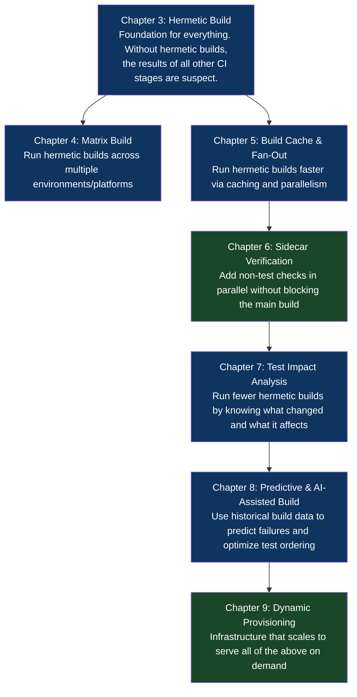

# Part II: Foundational Build & Integration Patterns (CI)

## What This Part Is About

The CI stage of your pipeline has one job: take a code change and tell you, with high confidence and low latency, whether that change is safe to proceed toward production. That sounds simple. The seven patterns in this part are a catalog of all the ways that job is harder than it looks.

Before these patterns were understood and named, the CI stage was a hopeful ritual: you ran some tests, they passed, you declared victory. The problems were invisible until they weren't. Builds that passed in CI failed in production because the build environment wasn't the same. Tests that passed on their own failed together because of shared state. A single slow test gate blocked everything behind it while parallelizable work sat idle. Security vulnerabilities made it to production because the policy scanner ran *after* the deploy, not before. Builds for a monorepo with 300 services ran completely, even when only three services changed. The CI stage was a bottleneck, a lie, and a false ceiling — all at the same time.

The patterns in this part address those problems directly, at the level where they actually live.

The foundational insight is that CI is not just "running tests." A mature CI stage provides four guarantees that are distinct from the test pass/fail result: **reproducibility** (the build produces the same artifact regardless of where or when it runs), **completeness** (all required checks run, including ones that aren't tests), **efficiency** (feedback arrives in minutes, not hours), and **proportionality** (the work done is proportional to the scope of the change — a one-line change to a comment doesn't rebuild everything). These four guarantees are what the patterns in this part are designed to provide.

## Why These Chapters Belong Together

All seven chapters in this part are about the CI stage — the phase of the pipeline between a code change and a decision about whether to proceed toward deployment. They address different failure modes and different performance characteristics, but they compose. A mature CI system uses all of them simultaneously: hermetic builds (Chapter 3) for reproducibility, matrix builds (Chapter 4) for cross-platform coverage, build caching and fan-out (Chapter 5) for speed, sidecar verification (Chapter 6) for completeness, test impact analysis (Chapter 7) for proportionality, AI assistance (Chapter 8) for intelligence, and dynamic provisioning (Chapter 9) for the infrastructure that makes all of it possible.

The chapters are roughly ordered from "foundational and almost universally applicable" (Chapters 3–6) to "advanced and applicable at scale" (Chapters 7–9). If you're building a CI system from scratch, read them in order. If you're improving an existing system, identify which guarantee your current system is weakest on and jump to the corresponding chapter.

## Chapter Map

## Prerequisites

Before reading this part, you should be comfortable with:
- Chapter 1 and Chapter 2 of this book (the vocabulary and principles)
- Basic Docker: you know what a `Dockerfile` is and have run `docker build` at least once
- Basic familiarity with at least one CI system (GitHub Actions, GitLab CI, Jenkins, CircleCI)
- Basic understanding of package managers: npm, pip, go modules, Maven, or equivalent for your language ecosystem

You do not need prior knowledge of Bazel, Nix, or any specific build system. Chapter 3 introduces what you need.

## Chapters in This Part

| Chapter | Title | Core Question Answered |
|---|---|---|
| [3](./chapter-03-hermetic-build.md) | The Hermetic Build Pattern | How do you guarantee the same code produces the same artifact, everywhere, always? |
| [4](./chapter-04-matrix-build.md) | The Matrix Build Pattern | How do you verify code across multiple platforms/versions without combinatorial explosion? |
| [5](./chapter-05-build-cache-fan-out.md) | The Build Cache & Fan-Out Pattern | How do you make CI fast at scale without sacrificing correctness? |
| [6](./chapter-06-sidecar-verification.md) | The Sidecar Verification Pattern | How do you run compliance, security, and policy checks without blocking shipping? |
| [7](./chapter-07-test-impact-analysis.md) | The Test Impact Analysis Pattern | How do you run only the tests that matter for a given change? |
| [8](./chapter-08-predictive-ai-build.md) | The Predictive & AI-Assisted Build Pattern | How do you use historical data to predict failures and prioritize test execution? |
| [9](./chapter-09-dynamic-provisioning.md) | The Dynamic Provisioning Pattern | How do you provide CI infrastructure that costs nothing when idle and scales instantly on demand? |
