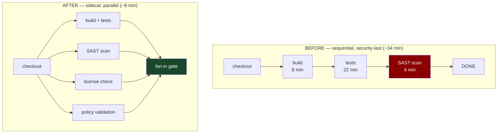

# Chapter 6: The Sidecar Verification Pattern
*Part II: Foundational Build & Integration Patterns (CI)*

> *"The security scan ran. It finished three days after the deploy.
> We reviewed the results. They were interesting."*
> — actual incident retrospective note, lightly paraphrased

---

## The War Story

Nadia Chen is a security engineer at Fieldstone Health, a healthcare data platform handling PHI (Protected Health Information) under HIPAA. In January, her team rolled out a mandatory SAST (Static Application Security Testing) scan for all pull requests. The tool they chose: Semgrep, with a custom ruleset tuned for their Django backend. Good tool, good rules, correct decision.

The problem: nobody thought about where to put it.

The platform engineer who implemented it appended the Semgrep scan to the end of the existing sequential CI pipeline. Build → unit tests → integration tests → Semgrep. Total pipeline time with Semgrep: 52 minutes. Before Semgrep: 38 minutes.

Fourteen extra minutes per pull request. On a team of 40 engineers averaging 8 PRs per day, that's 112 extra developer-wait-minutes per day. In the first week, three engineers opened tickets requesting that Semgrep be moved to "advisory only" because it was "blocking development velocity." One filed a JIRA ticket titled "Semgrep adding 25% to CI time."

Here is the thing: Semgrep itself takes 4 minutes to run. The other 10 minutes of overhead comes from it running sequentially after a 38-minute pipeline instead of in parallel from the start.

Nadia's second problem is the gate design. The platform team configured Semgrep with `--error` flag: any finding blocks the PR. Medium-severity findings. Low-severity findings. A finding that fired on a SQL query that Semgrep incorrectly classified as an injection risk but is actually parameterized and safe. The team started putting `# nosemgrep` suppression comments everywhere to keep the pipeline green, including in places where the findings were valid.

Within 30 days, Semgrep had 847 suppression comments across the codebase and was being ignored by 80% of the engineering team.

The original goal — catch security issues before they reach production — was not achieved. What was achieved was a 14-minute CI overhead and an organizational learned reflex to ignore security findings.

This chapter is about building security and compliance verification that works with your development team, not against it.

---

## What You'll Learn

- The sidecar verification model: running verification checks parallel to the main build, not after it
- Blocking gates vs. advisory checks: how to distinguish critical blockers from informational findings and configure each appropriately
- Implementation with GitHub Actions parallel jobs, GitLab CI parallel stages, and Tekton pipelines
- The verification catalog: which checks should block, which should advise, and which should run on schedules rather than per-commit
- How to avoid the "security theater" failure mode where suppressions accumulate and checks become noise

---

## The Sidecar Verification Model

The sidecar verification pattern runs verification tasks — security scans, compliance checks, license audits, policy validation — in parallel with the main build and test pipeline, not after it.



The sidecar model has two benefits:

**Benefit 1: Time.** Verification checks that were adding sequential minutes to the pipeline now run concurrently with the build. Total pipeline time is bounded by the slowest parallel track, not by the sum of all tracks. If the build takes 8 minutes and the SAST scan takes 4 minutes, the SAST runs during the build and adds 0 minutes to total CI time.

**Benefit 2: Decoupled governance.** The main build path (code compiles, tests pass) is separated from the verification path (code is safe, compliant, policy-adherent). This separation allows different teams to own different tracks: the platform team owns the build track, the security team owns the SAST track, the legal/compliance team owns the license track. Each track has its own failure criteria, its own suppression mechanisms, and its own on-call.

---

## Blocking Gates vs. Advisory Checks

Not all verification findings deserve the same response. The most important design decision in the sidecar verification pattern is the **gate classification**: should this finding block the PR from merging, or should it be reported as advisory information?

The rule: **a check should block only when the failure has an unacceptable risk profile that justifies delaying the merge**. Everything else is advisory.

### Classification Framework

| Severity | Example | Gate behavior |
|---|---|---|
| Critical | Hardcoded secret (API key, database password) | Block merge, alert security team immediately |
| High | Unvalidated SQL query, known CVE in a direct dependency | Block merge, require explicit exception approval |
| Medium | Unvalidated user input in non-security-critical path, deprecated dependency | Advisory — annotate PR, do not block |
| Low | Code style deviation, informational finding | Advisory — aggregate in weekly report, do not annotate PR |
| Informational | License compatibility, dependency age | Schedule-only — do not run on per-PR pipelines |

The boundary between "advisory" and "blocking" is a policy decision, not a technical one. It should be made by security and engineering leadership together, written down, and enforced consistently. When a finding's severity is disputed, the policy document is the arbiter.

### Implementation: Semgrep with Tiered Gates

```yaml
# .github/workflows/security.yml
name: Security Verification Sidecar

on: [pull_request]

jobs:
  # This job runs in parallel with your main build job.
  # It does not appear in the main build job's `needs:` list.
  sast-blocking:
    name: SAST — Critical/High (Blocking)
    runs-on: ubuntu-22.04
    steps:
      - uses: actions/checkout@v4

      - name: Run Semgrep — blocking rules only
        uses: returntocorp/semgrep-action@v1
        with:
          config: |
            # Only rules tagged as 'critical' or 'security-high' block this job.
            # Medium and below run in the advisory job below.
            p/secrets          # Hardcoded secrets (API keys, passwords, tokens)
            p/sql-injection     # SQL injection patterns
            p/command-injection # Shell command injection
          # --error: exit with non-zero if any findings. Blocks the PR.
          # These rules represent unacceptable risk; they must be fixed.
          generateSarif: "1"

      - name: Upload SARIF (visible in GitHub Security tab)
        if: always()
        uses: github/codeql-action/upload-sarif@v3
        with:
          sarif_file: semgrep.sarif

  sast-advisory:
    name: SAST — Medium/Low (Advisory)
    runs-on: ubuntu-22.04
    steps:
      - uses: actions/checkout@v4

      - name: Run Semgrep — advisory rules
        # continue-on-error: true means findings here do NOT block the PR.
        # They appear in the PR annotations for developer awareness,
        # but they don't prevent merge.
        continue-on-error: true
        uses: returntocorp/semgrep-action@v1
        with:
          config: p/owasp-top-ten
          generateSarif: "1"

      - name: Upload advisory SARIF
        if: always()
        uses: github/codeql-action/upload-sarif@v3
        with:
          sarif_file: semgrep.sarif
          # Advisory findings appear in the Security tab with a different
          # severity marker. Developers see them; they don't block work.

  dependency-audit:
    name: Dependency Audit (Critical CVEs Blocking)
    runs-on: ubuntu-22.04
    steps:
      - uses: actions/checkout@v4

      - name: Audit dependencies for critical CVEs
        run: |
          # npm audit fails with exit code 1 for vulnerabilities at the
          # specified severity level or above.
          # --audit-level=critical: only block for CVSS >= 9.0
          # Medium and high advisories are logged but don't block.
          npm audit --audit-level=critical
          # For Python: pip-audit --severity critical
          # For Go: govulncheck ./... (checks against Go vulnerability database)
          # For Java: OWASP Dependency Check with --failBuildOnCVSS 9

  license-check:
    name: License Compliance (Advisory)
    runs-on: ubuntu-22.04
    # Advisory: license violations are worth knowing about, but they
    # typically require legal review before blocking. A CI block for
    # "GPL-adjacent transitive dependency" without human review creates
    # false positives that erode trust.
    continue-on-error: true
    steps:
      - uses: actions/checkout@v4

      - name: Check dependency licenses
        run: |
          # license-checker outputs a report of all dependency licenses.
          # --onlyAllow limits to approved license types.
          # Adjust the list to your organization's legal policy.
          npx license-checker \
            --onlyAllow 'MIT;Apache-2.0;BSD-2-Clause;BSD-3-Clause;ISC;CC0-1.0' \
            --excludePrivatePackages \
            --json > license-report.json

      - name: Upload license report
        uses: actions/upload-artifact@v4
        with:
          name: license-report
          path: license-report.json

  policy-validation:
    name: OPA Policy Validation
    runs-on: ubuntu-22.04
    steps:
      - uses: actions/checkout@v4

      - name: Install OPA
        run: |
          curl -L -o /usr/local/bin/opa \
            https://openpolicyagent.org/downloads/v0.60.0/opa_linux_amd64_static
          chmod +x /usr/local/bin/opa

      - name: Validate Kubernetes manifests against policy
        run: |
          # OPA/Conftest validates Kubernetes YAML manifests against
          # policy rules written in Rego.
          # These policies enforce: no root containers, resource limits set,
          # readiness probes defined, no privileged containers.
          conftest test k8s/ \
            --policy policies/ \
            --namespace kubernetes \
            --output tap
```

### The Fan-In Gate for Sidecar Jobs

The main build job and the sidecar verification jobs must be aggregated at a fan-in gate before deployment:

```yaml
  # Fan-in gate: only blocking sidecars are included in `needs:`.
  # Advisory sidecars (continue-on-error: true) don't need to be here
  # because their failures don't affect the pipeline outcome.
  all-checks-passed:
    needs: [build-and-test, sast-blocking, dependency-audit, policy-validation]
    runs-on: ubuntu-22.04
    if: always()
    steps:
      - name: Verify all blocking checks passed
        run: |
          RESULTS=(
            "${{ needs.build-and-test.result }}"
            "${{ needs.sast-blocking.result }}"
            "${{ needs.dependency-audit.result }}"
            "${{ needs.policy-validation.result }}"
          )
          for result in "${RESULTS[@]}"; do
            if [[ "$result" == "failure" ]]; then
              echo "A blocking check failed. PR cannot be merged."
              exit 1
            fi
          done
          echo "All blocking checks passed."
```

---

## The Verification Catalog: What to Run, When, and How

Different verification checks have different cost profiles and different value profiles. Running everything on every PR commit wastes compute and degrades the signal-to-noise ratio. The right model is a tiered schedule:

### Tier 1: Per-Commit (Every PR push, blocking)

These checks are fast (<5 minutes) and have high signal for code changes:
- SAST for critical/high severity findings (Semgrep, CodeQL)
- Dependency vulnerability audit for critical CVEs
- Secret detection (truffleHog, gitleaks, GitHub Secret Scanning)
- OPA/Conftest policy validation for Kubernetes/Terraform manifests
- Container image scanning for known critical CVEs in the base image

### Tier 2: Per-PR (First push and significant changes, advisory)

These checks are medium-cost (5–15 minutes) and provide useful context:
- Full SAST sweep including medium/low findings
- License compatibility audit
- Container image full scan (all severity levels)
- Dependency tree analysis (outdated dependencies, deprecated packages)
- SBOM (Software Bill of Materials) generation

### Tier 3: Scheduled (Nightly or weekly, not per-commit)

These checks are expensive or produce findings that don't change with individual commits:
- DAST (Dynamic Application Security Testing) — requires a running environment
- Full dependency audit across all transitive dependencies
- Infrastructure drift detection (Terraform plan against live infrastructure)
- Secrets rotation audit (are any secrets older than 90 days?)
- Container runtime security policy review

```yaml
# Scheduled security scan — runs nightly, not on every PR
name: Nightly Security Scan
on:
  schedule:
    - cron: '0 2 * * *'  # 2 AM UTC nightly

jobs:
  dast-scan:
    runs-on: ubuntu-22.04
    steps:
      - name: Run OWASP ZAP against staging
        uses: zaproxy/action-full-scan@v0.9.0
        with:
          target: 'https://staging.myapp.com'
          # Fail the nightly build if ZAP finds critical issues.
          # This creates a nightly health check on the security posture
          # of the staging environment without blocking developer PRs.
          fail_action: true
          cmd_options: '-a'  # Include active scan (sends attack probes)

  secret-rotation-audit:
    runs-on: ubuntu-22.04
    steps:
      - name: Audit secret ages
        env:
          GITHUB_TOKEN: ${{ secrets.AUDIT_TOKEN }}
        run: |
          # Custom script: check if any secrets in GitHub Secrets
          # were last rotated more than 90 days ago.
          # Nightly check produces a Slack alert, not a PR block.
          python scripts/audit_secret_age.py --threshold-days 90
```

---

## Implementing with OPA/Conftest for Policy-as-Code

OPA (Open Policy Agent) is the standard tool for expressing organizational policy as code. With Conftest, OPA policies can be evaluated against structured data (YAML, JSON, Dockerfile, HCL) as a CI step.

```rego
# policies/kubernetes.rego
# OPA policy: enforce security best practices for Kubernetes workloads.

package kubernetes

# Deny containers that run as root.
# Running as root in a container is the most common privilege escalation path.
# This rule fires if securityContext.runAsNonRoot is not set to true.
deny[msg] {
  input.kind == "Deployment"
  container := input.spec.template.spec.containers[_]
  not container.securityContext.runAsNonRoot == true
  msg := sprintf(
    "Container '%s' in Deployment '%s' must set securityContext.runAsNonRoot: true",
    [container.name, input.metadata.name]
  )
}

# Deny containers without resource limits.
# A container without limits can consume all node resources and starve neighbors.
# This rule is particularly important for multi-tenant clusters.
deny[msg] {
  input.kind == "Deployment"
  container := input.spec.template.spec.containers[_]
  not container.resources.limits.memory
  msg := sprintf(
    "Container '%s' must set resources.limits.memory",
    [container.name]
  )
}

# Deny images tagged with 'latest'.
# 'latest' is not a version. Its resolution can change between deploys.
# Policies should enforce digest-pinned or SHA-tagged images.
deny[msg] {
  input.kind == "Deployment"
  container := input.spec.template.spec.containers[_]
  endswith(container.image, ":latest")
  msg := sprintf(
    "Container '%s' must not use 'latest' tag. Pin to a specific version or digest.",
    [container.name]
  )
}

# Warn (not deny) about missing readiness probes.
# Missing readiness probes means traffic is sent to pods that aren't ready.
# This is advisory — missing probes degrade reliability but aren't a security issue.
warn[msg] {
  input.kind == "Deployment"
  container := input.spec.template.spec.containers[_]
  not container.readinessProbe
  msg := sprintf(
    "Container '%s' should define a readinessProbe to prevent traffic to unready pods.",
    [container.name]
  )
}
```

```bash
# Run Conftest in CI against all Kubernetes manifests in k8s/ directory.
# --policy: directory containing .rego policy files
# --namespace: Rego package name (matches "package kubernetes" above)
# --output tap: TAP format — parseable by most CI result aggregators
conftest test k8s/**/*.yaml \
  --policy policies/ \
  --namespace kubernetes \
  --output tap

# Output example:
# ok 1 - k8s/payment-api/deployment.yaml - data.kubernetes.deny
# not ok 2 - k8s/legacy-service/deployment.yaml - Container 'app' must set securityContext.runAsNonRoot: true
# not ok 3 - k8s/old-worker/deployment.yaml - Container 'worker' must not use 'latest' tag
# ok 4 - k8s/payment-api/deployment.yaml - data.kubernetes.warn
```

---

## Avoiding Security Theater

Security theater is the outcome when verification tools are implemented in ways that make them easy to ignore. The symptoms:
- Suppression comments (`# nosemgrep`, `# noqa`, `# nosec`) accumulate without review
- Findings are classified as "advisory" reflexively because "we'll fix it later"
- Engineers route around the verification by splitting changes to avoid triggering certain checks
- The finding count in dashboards grows monotonically with no remediation

The root causes are always the same: too many findings, too little ownership, and no feedback loop between findings and fixes.

**Suppression hygiene.** Every suppression comment should require an explanation and an expiration date:

```python
# nosemgrep: sql-injection — justification: query is parameterized via SQLAlchemy
# ORM; the pattern detector incorrectly flags parameterized queries. 
# expiry: review if we migrate off SQLAlchemy before 2025-06.
result = db.execute(text("SELECT * FROM users WHERE id = :id"), {"id": user_id})
```

Enforce this with a CI check: any `# nosemgrep` without a justification comment fails the build. Review all suppressions quarterly. Expire any suppression whose justification no longer applies.

**Finding ownership.** Every finding category should have an owner who is responsible for the remediation backlog. "The security team" is not an owner for SQL injection findings in the payments service — the payments service team is the owner, with the security team as advisor. Without clear ownership, findings accumulate.

**Trend metrics, not point-in-time counts.** The right metric is not "we have 47 open Semgrep findings." It is "our open finding count decreased by 12% this sprint" or "we introduced 3 new findings this week, all of which are in the advisory category." Trend visibility creates accountability.

---

## Scale Considerations

**At 1–5 engineers:** Run all verifications in a single CI job sequentially. The overhead is acceptable and the fan-out complexity is not worth it. Focus on getting the right tools configured with the right gate classifications.

**At 5–30 engineers:** The sidecar model pays off. Separate the blocking verification track from the advisory track. Run them in parallel with the main build. Add OPA/Conftest for infrastructure policy.

**At 30+ engineers:** Verification findings need a dedicated management workflow. Integrate with your vulnerability management system (Snyk, Wiz, DefectDojo). Implement finding deduplication so the same CVE in a transitive dependency doesn't create 30 separate tickets. Schedule DAST against staging environments automatically after each deployment.

**Regulated industries (HIPAA, PCI-DSS, SOC 2):** Verification isn't optional, and the audit trail matters. Store verification results as signed artifacts alongside the build artifacts they correspond to. The audit question is not just "did you scan?" — it's "what were the findings for this specific build, and what was the disposition of each finding?" Chapter 55 covers regulated pipeline architecture in detail.

---

## The Anti-Patterns

### ❌ Anti-Pattern: Security Scan on the Critical Path

**What it looks like:** SAST, DAST, and dependency scanning run sequentially after all tests. They add 20 minutes to CI. Engineers request exceptions because "security is blocking velocity."

**Why it happens:** The tools were added to an existing sequential pipeline without restructuring it.

**What breaks:** Developer trust in the security process and actual security posture (because engineers learn to work around the checks).

**The fix:** Move verification to parallel sidecar jobs. If the SAST scan takes 8 minutes and your build takes 10 minutes, it adds 0 minutes to total CI time when run in parallel. The "security vs. velocity" tension often disappears entirely when the scan is not on the critical path.

---

### ❌ Anti-Pattern: All-or-Nothing Gate Classification

**What it looks like:** Every finding of every severity blocks the PR. No finding is advisory. Engineers spend 30 minutes resolving a low-severity informational finding before they can merge a two-line typo fix.

**Why it happens:** "Security" was told to add scanning without being given authority to classify findings. They defaulted to blocking everything to avoid being blamed for a finding that shipped.

**What breaks:** Developer experience and security posture simultaneously. Engineers learn to suppress findings reflexively. The actual high-severity issues get lost in the noise.

**The fix:** Publish a severity classification policy. Critical and high are blocking. Medium and below are advisory. The policy should be signed off by security and engineering leadership. Give security engineers the authority to adjust classifications without requiring an all-hands meeting.

---

### ❌ Anti-Pattern: Running DAST on Every PR

**What it looks like:** A DAST (Dynamic Application Security Testing) scan runs on every pull request against a per-PR ephemeral environment. Each scan takes 45 minutes. The PR can't merge until the DAST scan completes.

**Why it happens:** Someone read that DAST is important and added it to CI without thinking about cost/cadence tradeoffs.

**What breaks:** CI latency (45 minutes blocks every PR) and DAST signal quality (DAST results on incomplete PR features are noisy and misleading — the feature isn't done yet).

**The fix:** DAST runs nightly against the staging environment, not per-PR against ephemeral environments. The staging deployment is the gate; DAST informs whether to roll forward or roll back after staging validation.

---

### ❌ Anti-Pattern: Suppression Without Justification

**What it looks like:** 847 `# nosemgrep` comments scattered across the codebase, added over 8 months, with no justification text. Nobody remembers why most of them were added. Several are suppressing findings that are actually valid vulnerabilities.

**Why it happens:** The path of least resistance when a scan blocks a PR is to suppress the finding. Without governance, suppressions accumulate.

**What breaks:** The security scan becomes meaningless. Real vulnerabilities hide behind suppression comments added for convenience.

**The fix:** Require justification for every suppression (enforced by CI). Conduct a quarterly suppression audit. Any suppression without a current, valid justification is a finding in its own right.

---

## Field Notes

💀 **Security scan added to end of sequential pipeline** → +20 minutes CI time, engineers request removal → Run scans as parallel sidecars. The time overhead of a parallel 8-minute scan on a 10-minute build pipeline is literally zero.

💀 **All findings classified as blocking** → Suppression accumulation, security theater → Classify by actual risk. Critical/high block. Medium/low are advisory. Publish the policy.

💀 **No suppression governance** → Hundreds of `# nosemgrep` with no justification → Lint for unsupported suppressions in CI. Require justification + expiry date. Quarterly review cadence.

💀 **Security team owns all findings in all services** → Backlog drowns, nothing gets fixed → Findings are owned by the team that owns the code. Security team provides policy, triage assistance, and escalation path. Not the remediation queue.

---

## Chapter Summary

The sidecar verification pattern separates two concerns that are often incorrectly conflated: "did the code change produce a correct build?" and "does the code meet our organization's security and compliance policy?" These are different questions with different owners, different failure modes, and different urgency profiles. Running them in parallel respects both concerns without forcing a trade-off.

The gate classification decision — blocking vs. advisory — is the most important design choice in the pattern. Get it wrong in the "everything blocks" direction and you get suppression theater. Get it wrong in the "everything is advisory" direction and verification becomes a reporting tool rather than a gate. The right answer is a documented policy that distinguishes risk levels, enforced consistently across all services.

The controversial take: most organizations are running security scans in the wrong place (after tests, not in parallel), with the wrong gate classification (everything blocks), and with no suppression governance (suppressions accumulate until the scan is meaningless). Fixing the placement first gives immediate time savings. Fixing the classification policy gives back developer trust. Fixing suppression governance makes the signal real.

---

## What's Next

Chapter 7 addresses a different efficiency problem: even with fan-out parallelism, running the full test suite on every commit is wasteful when a change only affects a small fraction of the codebase. The Test Impact Analysis pattern maps code changes to the subset of tests that actually cover that code — eliminating redundant test execution without reducing coverage confidence.
