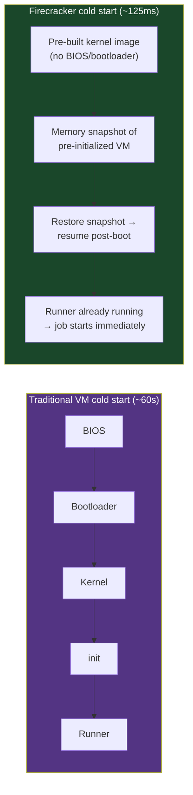

# Chapter 9: The Dynamic Provisioning Pattern
*Part II: Foundational Build & Integration Patterns (CI)*

> *"We paid for 40 runners 24/7. They were idle 73% of the time.
> We also had a 90-minute queue on Monday mornings.
> Paying for idle capacity AND having a queue is a special kind of wrong."*
> — engineering director describing their pre-ARC infrastructure, 2023

---

## The War Story

It's Monday morning at Axis Commerce, an e-commerce platform with 95 engineers. The weekend was quiet — maybe 20 CI runs total, all from a couple of on-call engineers pushing hotfixes. The fixed CI runner pool of 20 Ubuntu runners sat idle from Friday 6 PM to Monday 8:59 AM.

At 9:00 AM, 95 engineers open their laptops. By 9:15 AM, 34 PRs have been pushed or updated. Each PR triggers a CI run. Each CI run needs two runners (one for the build, one for the test suite). 34 PRs × 2 runners = 68 runner-slots required. Available: 20.

The queue forms.

By 9:30 AM, the queue depth is 48 runs waiting for a runner. The estimated wait for a new job: 47 minutes. Engineers who pushed code before standup won't see CI results until after standup. Some won't see results until late morning.

At 9:45 AM, an engineer pushes a fix. His PR is at position 23 in the queue. He opens a new tab, edits a different file, pushes another commit to his PR. His PR now has two queued runs. He does this twice more. By 10:00 AM, he has six queued runs, but only the latest commit matters. The five previous runs are now irrelevant, but they're consuming runner time that could go to someone else's PR.

This is the fundamental failure mode of fixed runner pools: peak demand vastly exceeds capacity, idle time between peaks wastes money, and there is no mechanism to cancel obsolete work or prioritize high-value work.

The math for Axis Commerce's annual CI costs:
- 20 dedicated runners × $0.096/hour (m5.large EC2) × 8,760 hours = **$16,819/year**
- Average runner utilization: 27%
- Compute value delivered: ~$4,500/year worth of actual CI work
- Waste: ~$12,300/year on idle runners
- Cost of the Monday morning queue in lost engineer productivity: unquantified but real

The fix (Actions Runner Controller on Kubernetes, scale-to-zero):
- New cost: ~$4,800/year (pay only for what you run)
- Queue on Monday mornings: eliminated (scales to 68 runners in ~90 seconds)
- Weekend idle cost: $0

This chapter covers how that fix works and the specific configuration choices that make it reliable.

---

## What You'll Learn

- The three CI infrastructure models (hosted, self-hosted fixed pool, dynamic/ephemeral) and when each is correct
- Actions Runner Controller (ARC): Kubernetes-based GitHub Actions runners with autoscaling from zero
- Firecracker microVMs: the 125ms cold-start solution for isolation-sensitive CI workloads
- Warm pool strategies: the trade-off between cold-start latency and idle cost
- Job cancellation and queue management: eliminating obsolete runs before they consume resources
- The economics: how to calculate the break-even point for dynamic provisioning investment

---

## The Three Infrastructure Models

### Model 1: Hosted Runners (GitHub-Hosted, GitLab SaaS)

GitHub-hosted runners are fully managed, ephemeral, and pre-provisioned with common tooling. You specify `runs-on: ubuntu-22.04` and GitHub handles the rest: finding an available runner, setting it up, executing your jobs, and tearing it down.

**When hosted runners are right:**
- Teams of 1–50 engineers with moderate CI volume
- No specialized hardware requirements (no GPU, no high-memory builds, no specific kernel configurations)
- No regulatory requirements around CI infrastructure isolation
- No need for persistent local caches (though GitHub Actions cache fills this gap for most cases)

**When hosted runners break:**
- Large builds that exceed the 14GB RAM or 16-core limits of GitHub-hosted runners
- GPU workloads (Chapter 40 covers this)
- High CI volume that makes per-minute GitHub pricing expensive compared to reserved capacity
- Air-gapped or network-isolated environments (Chapter 55)
- Regulatory requirements around data residency or network access (PHI, PCI-DSS)

**GitHub Actions pricing (as of 2024):**
- Linux (2-core): $0.008/minute
- Linux (4-core): $0.016/minute
- macOS (3-core): $0.08/minute (10× Linux — this is the number that surprises people)
- Windows (2-core): $0.016/minute
- Larger runners (8/16/32/64 core): available at proportional pricing

Break-even calculation: GitHub-hosted becomes more expensive than self-hosted at approximately 30,000 Linux runner-minutes per month (~500 runner-hours). Below that, hosted is almost certainly cheaper after accounting for the operational cost of self-hosted infrastructure.

### Model 2: Self-Hosted Fixed Pool

A fleet of long-lived machines (EC2 instances, bare-metal servers, VMs) that run the CI agent software continuously. Jobs are dispatched from the CI orchestrator (GitHub Actions, GitLab CI, Jenkins) to available agents in the pool.

**When fixed pools are right:**
- High CI volume where the utilization rate can be kept above 60–70% to justify the fixed cost
- Hardware that must be pre-provisioned (physical GPUs, FPGA cards, specific network interfaces)
- Very low cold-start tolerance (the runner must be available instantly, not after 90-second provisioning)
- Monorepo builds that benefit from local disk caches that persist across jobs

**When fixed pools break:**
- Bursty demand patterns (like Axis Commerce's Monday mornings) — fixed pools can't handle peaks
- Teams where CI volume has high variance — a fixed pool sized for average load will queue on peaks; a fixed pool sized for peak load will idle on troughs

### Model 3: Dynamic Provisioning (Ephemeral Runners)

Runners are created on demand when a CI job is queued and destroyed after the job completes. The pool size fluctuates between zero (no active jobs) and the current concurrency requirement (all currently running jobs).

**When dynamic provisioning is right:**
- Almost always, for teams beyond the break-even point for hosted runners
- Especially for teams with bursty demand (most engineering teams, due to Monday morning effect, end-of-sprint rushes, release crunch)
- Environments where isolation is required: each job runs on a fresh, clean runner with no state from previous jobs

**The cold-start problem:** Dynamic runners have a cold-start penalty: the time between "a job is queued" and "a runner is ready to execute the job." This ranges from 90 seconds (Kubernetes pod startup) to 125 milliseconds (Firecracker microVM with a pre-warmed base snapshot). Cold-start cost is the main reason some teams stick with fixed pools.

---

## Implementation: Actions Runner Controller (ARC) on Kubernetes

Actions Runner Controller (ARC) is the Kubernetes operator for GitHub Actions self-hosted runners. It provisions runner pods on demand, scales from zero, and tears down after job completion.

### Installing ARC

```bash
# Install ARC via Helm
helm install arc \
  --namespace "arc-systems" \
  --create-namespace \
  oci://ghcr.io/actions/actions-runner-controller-charts/gha-runner-scale-set-controller \
  --version 0.9.3

# Verify the controller is running
kubectl -n arc-systems get pods
```

### Configuring Runner Scale Sets

A runner scale set defines a pool of runners with specific compute profiles, autoscaling bounds, and GitHub registration:

```yaml
# arc-runner-scaleset-linux.yaml
# A scale set for standard Linux CI jobs: scales from 0 to 50 runners.
apiVersion: helm.toolkit.fluxcd.io/v2beta1
kind: HelmRelease
metadata:
  name: arc-runner-scaleset-linux
  namespace: arc-runners
spec:
  chart:
    spec:
      chart: gha-runner-scale-set
      version: 0.9.3
      sourceRef:
        kind: HelmRepository
        name: arc
  values:
    # GitHub configuration
    githubConfigUrl: "https://github.com/myorg/my-repo"
    githubConfigSecret: arc-github-secret  # Contains GITHUB_TOKEN or App credentials

    # Runner identity — this is the label used in `runs-on:` in your workflows
    runnerScaleSetName: "arc-linux"

    # Autoscaling bounds
    minRunners: 0       # Scale to zero when idle. Eliminates idle cost.
    maxRunners: 50      # Maximum concurrent runners. Set based on your Kubernetes cluster capacity.

    # Runner pod template — defines compute resources for each runner
    template:
      spec:
        containers:
          - name: runner
            image: ghcr.io/actions/actions-runner:latest
            # Resources: size based on your typical CI job requirements.
            # Monitor runner OOM kills and p95 CPU usage to right-size.
            resources:
              requests:
                cpu: "2"
                memory: "4Gi"
              limits:
                cpu: "4"
                memory: "8Gi"
            # Mount the Docker socket for jobs that build container images.
            # Alternative: use Docker-in-Docker (dind) sidecar for stronger isolation.
            volumeMounts:
              - name: docker-sock
                mountPath: /var/run/docker.sock
        volumes:
          - name: docker-sock
            hostPath:
              path: /var/run/docker.sock
        # Node affinity: schedule CI runners on dedicated nodes.
        # This prevents CI workloads from competing with production workloads
        # on shared nodes.
        affinity:
          nodeAffinity:
            requiredDuringSchedulingIgnoredDuringExecution:
              nodeSelectorTerms:
                - matchExpressions:
                    - key: node-role.kubernetes.io/ci
                      operator: In
                      values: ["true"]
---
# A separate scale set for memory-intensive builds (Gradle, Maven, large Docker builds)
apiVersion: helm.toolkit.fluxcd.io/v2beta1
kind: HelmRelease
metadata:
  name: arc-runner-scaleset-large
  namespace: arc-runners
spec:
  chart:
    spec:
      chart: gha-runner-scale-set
  values:
    githubConfigUrl: "https://github.com/myorg/my-repo"
    githubConfigSecret: arc-github-secret
    runnerScaleSetName: "arc-linux-large"  # Used in `runs-on: arc-linux-large`
    minRunners: 0
    maxRunners: 10
    template:
      spec:
        containers:
          - name: runner
            image: ghcr.io/actions/actions-runner:latest
            resources:
              requests:
                cpu: "8"
                memory: "32Gi"
              limits:
                cpu: "16"
                memory: "64Gi"
```

```yaml
# In your workflow — use the scale set label in `runs-on:`
jobs:
  build:
    # Standard job: uses the arc-linux scale set
    runs-on: arc-linux
    steps:
      - uses: actions/checkout@v4
      - run: make build

  heavy-build:
    # Memory-intensive job: uses the large scale set
    runs-on: arc-linux-large
    steps:
      - uses: actions/checkout@v4
      - run: ./gradlew build  # Gradle needs memory
```

### Cold-Start Latency with ARC

ARC runner cold-start: the time from "job queued" to "job starts executing" is the Kubernetes pod scheduling and startup time. Typical values:
- With pre-pulled container images on all nodes: 30–60 seconds
- With container image pull on cold node: 90–180 seconds (depends on image size)
- With spot/preemptible nodes that are warming up: 2–4 minutes

For most CI workloads, 90-second cold-start is acceptable — a 10-minute test suite loses 15% to cold start overhead. If cold-start latency is unacceptable, use warm pools.

### Warm Pools: The Trade-Off

A warm pool pre-provisions a small number of runners so that some fraction of jobs start immediately:

```yaml
    # Warm pool configuration: keep 3 runners always running, scale up to 30
    minRunners: 3    # 3 runners always warm and ready (eliminates cold start for first 3 jobs)
    maxRunners: 30   # Remaining 27 scale on demand with cold-start latency
```

The economics: if a runner costs $0.05/hour on a Spot instance, 3 warm runners cost $0.15/hour = $131/year to eliminate cold-start for the first 3 jobs. This is almost always worth it for teams running CI continuously during business hours.

A dynamic warm pool (scale to N runners at 8 AM, scale to 0 at 8 PM on weekdays) saves money overnight while maintaining warm runners during peak hours:

```yaml
# Kubernetes CronJob to scale the warm pool up/down by schedule
apiVersion: batch/v1
kind: CronJob
metadata:
  name: arc-warmpool-schedule
spec:
  # Scale up at 7:50 AM Monday-Friday (UTC, adjust for your timezone)
  schedule: "50 7 * * 1-5"
  jobTemplate:
    spec:
      template:
        spec:
          containers:
            - name: scaler
              image: bitnami/kubectl:latest
              command:
                - kubectl
                - patch
                - helmrelease
                - arc-runner-scaleset-linux
                - --type=merge
                - -p
                - '{"spec":{"values":{"minRunners":5}}}'
---
apiVersion: batch/v1
kind: CronJob
metadata:
  name: arc-warmpool-schedule-down
spec:
  # Scale down at 7 PM Monday-Friday
  schedule: "0 19 * * 1-5"
  jobTemplate:
    spec:
      template:
        spec:
          containers:
            - name: scaler
              image: bitnami/kubectl:latest
              command:
                - kubectl
                - patch
                - helmrelease
                - arc-runner-scaleset-linux
                - --type=merge
                - -p
                - '{"spec":{"values":{"minRunners":0}}}'
```

---

## Implementation: Firecracker MicroVMs for Sub-Second Cold Start

Firecracker is an open-source VMM (Virtual Machine Monitor) from AWS that creates lightweight "microVMs" — KVM-based virtual machines that boot in ~125 milliseconds and use ~5MB of memory overhead per VM. It is the technology behind AWS Lambda and AWS Fargate.

For CI use cases, Firecracker solves the isolation/cold-start trade-off: unlike containers (fast but shared kernel, weaker isolation), Firecracker VMs have hardware-level isolation AND fast cold-start.

### The Architecture



Firecracker-based CI runners:
- **Actuated** (commercial): https://actuated.dev — fully managed Firecracker runners for GitHub Actions and GitLab CI. Priced per minute. The fastest path to Firecracker without building infrastructure.
- **Warpbuild** (commercial): similar offering with GitHub Actions focus
- **DIY**: Run Firecracker directly on bare-metal hosts. Requires significant infrastructure engineering. Recommended only if you have existing KVM infrastructure and the team to operate it.

### Firecracker for Security-Sensitive CI

The primary use case for Firecracker beyond speed is **security isolation**. Container-based CI runners share the host kernel. A sufficiently sophisticated CI workload could escape the container and access the host. For most teams this is theoretical; for security-sensitive CI (running external PRs, processing untrusted code, red team tooling) it is a real concern.

Firecracker VMs provide hardware-level isolation: the guest kernel and host kernel are separate. An exploit that escapes the container doesn't escape the VM. For public repositories where any contributor can run arbitrary code in CI, Firecracker provides the isolation that containers cannot.

---

## Job Cancellation and Queue Management

The waste in Axis Commerce's scenario included obsolete queued jobs: engineers pushing multiple commits in rapid succession, with only the latest commit being relevant. Cancelling stale runs before they consume runner time is part of the dynamic provisioning story.

```yaml
# Automatically cancel in-progress runs when a new run is pushed to the same PR.
# This prevents the "push 5 commits quickly, waste 4 runner-slots" problem.
concurrency:
  # Group key: unique per PR/branch combination.
  # All runs in the same group that are queued or running when a new run starts
  # will be cancelled (if cancel-in-progress is true).
  group: ${{ github.workflow }}-${{ github.ref }}
  
  # cancel-in-progress: true: cancel the previous run when a new one starts.
  # Correct for PR workflows where only the latest commit matters.
  # Set to false for main branch builds where you want every commit verified.
  cancel-in-progress: ${{ github.ref != 'refs/heads/main' }}
```

This single configuration change — `concurrency` with `cancel-in-progress: true` — can reduce CI resource consumption by 20–40% for teams where engineers frequently push rapid iterations.

### Priority-Based Scheduling

Not all CI jobs have equal urgency. A release-blocking hotfix on the `release/v3.1` branch is more urgent than a feature PR from three weeks ago that's been waiting in queue. Kubernetes-based CI infrastructure can use pod priorities to schedule high-urgency jobs before low-urgency ones:

```yaml
# High-priority runner scale set for release branches
apiVersion: helm.toolkit.fluxcd.io/v2beta1
kind: HelmRelease
metadata:
  name: arc-runner-scaleset-priority
spec:
  values:
    runnerScaleSetName: "arc-linux-priority"
    minRunners: 2  # Keep 2 warm for fast response to urgent jobs
    maxRunners: 20
    template:
      spec:
        # Kubernetes PriorityClass: high-priority pods are scheduled first
        # and preempt lower-priority pods if resources are constrained.
        priorityClassName: high-priority-ci
        containers:
          - name: runner
            image: ghcr.io/actions/actions-runner:latest
```

```yaml
# In a release workflow — use the priority runner set
jobs:
  release-build:
    runs-on: arc-linux-priority  # Jumps ahead of regular queue
    if: startsWith(github.ref, 'refs/heads/release/')
    steps:
      - uses: actions/checkout@v4
      - run: make release-build
```

---

## The Economics of Dynamic Provisioning

The decision between hosted runners, fixed pools, and dynamic provisioning is primarily an economics calculation:

```python
# ci_economics.py — calculate CI infrastructure costs for each model

def calculate_hosted_cost(
    daily_ci_minutes: int,
    working_days_per_year: int = 250
) -> float:
    """Cost of GitHub-hosted Linux runners at $0.008/minute."""
    annual_minutes = daily_ci_minutes * working_days_per_year
    return annual_minutes * 0.008

def calculate_fixed_pool_cost(
    runner_count: int,
    instance_type_hourly_cost: float = 0.096,  # m5.large
    hours_per_year: int = 8760
) -> float:
    """Cost of a fixed EC2 runner pool running 24/7."""
    return runner_count * instance_type_hourly_cost * hours_per_year

def calculate_dynamic_cost(
    daily_ci_minutes: int,
    instance_type_hourly_cost: float = 0.096,
    working_days_per_year: int = 250,
    warm_pool_size: int = 3,
    warm_pool_hours_per_day: float = 12
) -> float:
    """Cost of dynamic provisioning: pay-per-use + warm pool."""
    # Variable cost: compute used for actual CI runs
    annual_ci_hours = (daily_ci_minutes / 60) * working_days_per_year
    variable_cost = annual_ci_hours * instance_type_hourly_cost
    
    # Fixed cost: warm pool running during business hours
    warm_pool_cost = (warm_pool_size * instance_type_hourly_cost * 
                      warm_pool_hours_per_day * working_days_per_year)
    
    return variable_cost + warm_pool_cost

# Example: Team with 400 CI runs/day, avg 8 minutes each = 3,200 CI minutes/day
daily_minutes = 3200

hosted = calculate_hosted_cost(daily_minutes)
fixed_20 = calculate_fixed_pool_cost(20)
dynamic = calculate_dynamic_cost(daily_minutes, warm_pool_size=3)

print(f"GitHub-hosted (Linux): ${hosted:,.0f}/year")
print(f"Fixed pool (20 runners): ${fixed_20:,.0f}/year")
print(f"Dynamic provisioning (3 warm + on-demand): ${dynamic:,.0f}/year")

# Typical output for this example:
# GitHub-hosted (Linux): $16,000/year
# Fixed pool (20 runners): $16,819/year
# Dynamic provisioning (3 warm + on-demand): $7,344/year
```

For 3,200 CI minutes/day (a mid-size engineering team), dynamic provisioning costs roughly 45% of both alternatives. The break-even between hosted runners and dynamic provisioning is around 1,500 daily CI minutes — above that, self-hosted dynamic provisioning wins on cost.

The break-even calculation must also account for:
- **Operational cost** of self-hosted infrastructure: estimated 2–4 engineering-hours per month for ARC on a managed Kubernetes cluster (EKS, GKE, AKS)
- **Cluster cost**: if you're running the CI infrastructure on a dedicated Kubernetes cluster (not shared with production), add the cluster control plane and minimum node costs
- **Custom tooling**: if your CI needs software that isn't in the standard runner image, you maintain a custom image with additional build time and maintenance overhead

---

## Scale Considerations

**At 1–15 engineers:** GitHub-hosted runners. The operational overhead of self-hosted infrastructure is not worth the cost savings at this scale. The $200–$500/month difference does not justify engineering time.

**At 15–100 engineers:** Evaluate the break-even. If CI volume exceeds 2,000 minutes/day and your team has Kubernetes experience, ARC is worth the investment. If not, GitHub-hosted with concurrency-based cancellation is adequate.

**At 100–500 engineers:** Self-hosted dynamic provisioning is almost certainly the right choice on cost. Use ARC with scale-to-zero. Size the warm pool based on measured p50 queue depth during business hours.

**At 500+ engineers:** Dynamic provisioning with multiple runner scale sets (by resource profile, by priority, by isolation requirement), Firecracker for security-sensitive workloads, and dedicated platform engineering ownership of the CI infrastructure as a product.

---

## The Anti-Patterns

### ❌ Anti-Pattern: Shared State Between Ephemeral Runners

**What it looks like:** The CI jobs assume that build artifacts, cached dependencies, or intermediate files persist between job runs. When runners are ephemeral, the assumption breaks: each job starts clean.

**Why it happens:** The team migrated from fixed-pool runners (where state persisted between jobs on the same runner) to ephemeral runners without auditing state assumptions.

**What breaks:** Jobs that depend on artifacts from previous runs fail silently (the dependency is missing, but no error is raised — the job just uses a fallback behavior).

**The fix:** Every CI job must explicitly restore any state it needs (via the cache action) and explicitly produce any state that downstream jobs need (via artifacts or the cache). No implicit state. The ephemeral nature of runners should be a feature, not a constraint to work around.

---

### ❌ Anti-Pattern: Runners With Docker-in-Docker Without Understanding the Trade-Off

**What it looks like:** CI jobs that build Docker images run inside Docker containers, requiring Docker-in-Docker (DinD). The DinD configuration is the default from a tutorial: `--privileged` mode, the Docker daemon running as root inside the container.

**Why it happens:** The tutorial said to do it. Nobody questioned the security implications.

**What breaks:** Container isolation. `--privileged` mode gives the container near-root access to the host kernel. A malicious CI job (or a supply-chain-compromised build step) can escape the container and access the host. On a shared runner pool, this affects all jobs running on the same host.

**The Fix Options:**
1. **Rootless DinD** (`docker:27-dind-rootless`): Docker daemon runs without root. Slower than privileged DinD but significantly safer.
2. **Kaniko** (Google): builds Docker images without requiring the Docker daemon, from inside an unprivileged container.
3. **Buildah**: Red Hat's container image builder, rootless by design.
4. **Firecracker runners**: VM-level isolation means DinD privilege escalation is contained to the VM.

---

### ❌ Anti-Pattern: No Concurrency Limits on Shared Cluster Resources

**What it looks like:** ARC scales from 0 to `maxRunners: 200`. When a large PR burst hits, 80 runner pods spin up simultaneously. Each pod requests 4 CPU and 8GB RAM. The Kubernetes cluster doesn't have 320 CPU and 640GB RAM available. Pods enter Pending state. The cluster triggers node autoscaler. New nodes take 3 minutes to provision. The "instant scale-up" is not actually instant.

**Why it happens:** `maxRunners` was set optimistically without considering cluster capacity constraints.

**What breaks:** CI queue time on large bursts. The expected linear scaling doesn't materialize because the cluster can't absorb the request surge.

**The Fix:** Size `maxRunners` to the cluster's available burst capacity, not the theoretical maximum. Use node autoscaler pre-provisioning (scale the node pool to N before Monday morning). Set resource requests accurately — over-requesting CPU/memory prevents bin-packing and wastes capacity.

---

### ❌ Anti-Pattern: Not Cancelling Obsolete Runs

**What it looks like:** A developer rapidly iterates on a PR, pushing 6 commits in 20 minutes. All 6 CI runs queue and execute. Only the last one matters. The first five consume ~40 runner-minutes producing results the developer will never look at.

**Why it happens:** `concurrency:` was not configured because nobody thought about it.

**What breaks:** CI economics and queue depth. Every obsolete run is a runner occupied that could serve a different PR.

**The Fix:** Add `concurrency: group: ${{ github.workflow }}-${{ github.ref }}, cancel-in-progress: true` to all workflow files. This is a one-line change per workflow file that typically reduces CI load by 20–40% for active development teams.

---

## Field Notes

💀 **Runners idle 70% of the time but queuing on Monday mornings** → Fixed pool sized for trough, not peak → Switch to dynamic provisioning. A warm pool of 5 runners handles baseline; autoscaling handles Monday morning.

💀 **Running macOS runners 24/7 for a team that needs them 8 hours a day** → macOS runners cost 10× Linux; 24/7 = 3× the necessary cost → Schedule macOS runners: up at 7 AM, down at 9 PM (or on demand only if cold-start latency is acceptable).

💀 **No concurrency limits in workflows** → Engineers pushing rapid iterations waste 4× CI resources → Add `concurrency:` with `cancel-in-progress: true` to every PR-triggered workflow. Takes 5 minutes; saves significant compute.

💀 **DinD in privileged mode on shared runners** → A compromise of one CI job compromises the host → Switch to rootless DinD or Kaniko. Firecracker for the highest-security requirements.

---

## Chapter Summary

Dynamic provisioning closes the loop on Part II: hermetic builds define what to build, matrix builds define which environments to verify, fan-out and caching define how to build efficiently, sidecar verification defines what to check, TIA defines what to run, and predictive analytics define in what order. Dynamic provisioning defines *where* all of that runs — and at what cost.

The economic argument for dynamic provisioning is strong above 1,500 daily CI minutes: scale-to-zero eliminates idle cost, autoscaling eliminates peak queuing, and job cancellation eliminates the cost of obsolete work. The operational argument is simpler: ephemeral runners are cleaner than persistent runners because each job starts from a known state. State management bugs don't accumulate. Security blast radius is bounded per job.

The one non-negotiable: ephemeral runners require explicit state management. Any implicit assumptions about persistent state from previous runs will break. Make this explicit in your onboarding documentation for the platform.

---

## What's Next

Part III moves from CI (making code integrable and verifiable) to CD (making integrated code deployable). Chapter 10 opens with the foundational architectural question of deployment: should your pipeline *push* changes to the target environment, or should an agent in the target environment *pull* the desired state from a repository? The answer is not obvious, and the wrong choice at architectural decision time costs months of rework.

[→ Next: Chapter 10 — The Push vs. Pull Deployment Pattern](../part-03-cd-patterns/chapter-10-push-vs-pull.md)

---
*[← Previous: Chapter 8 — The Predictive & AI-Assisted Build Pattern](./chapter-08-predictive-ai-build.md) |
[→ Next: Chapter 10 — The Push vs. Pull Deployment Pattern](../part-03-cd-patterns/chapter-10-push-vs-pull.md)*
