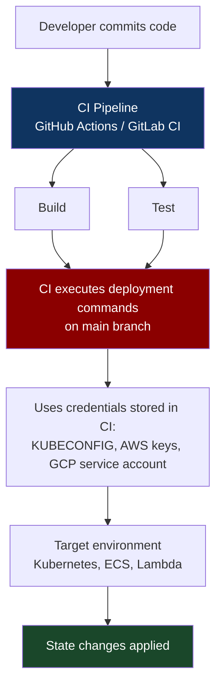
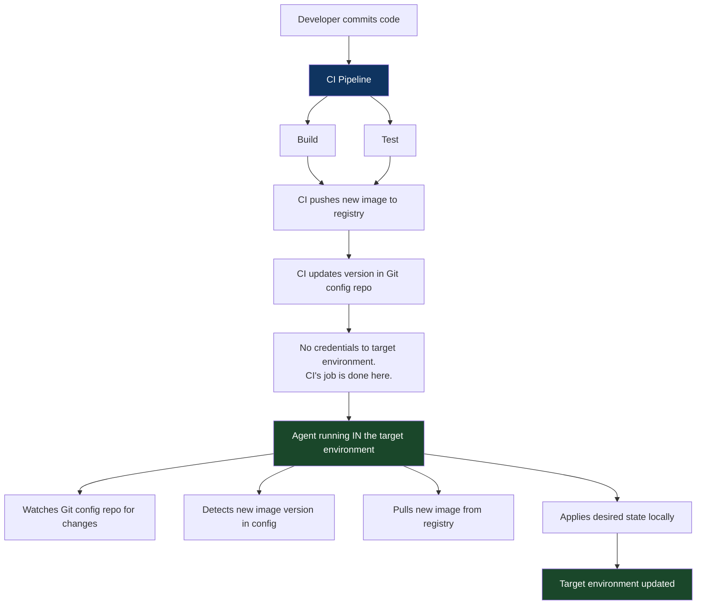
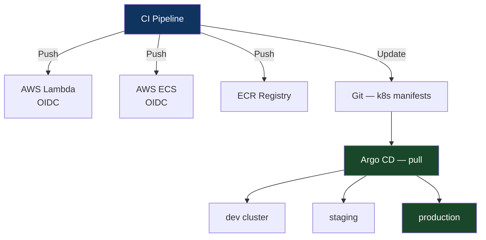

# Chapter 10: The Push vs. Pull Deployment Pattern
*Part III: Delivery & Deployment Patterns (CD)*

> *"Our CI system had SSH keys and kubectl credentials for 200 Kubernetes clusters.
> Rotating those credentials took three weeks and caused 48 hours of deployment
> outages. I wrote the ticket to switch to pull-based. I was ignored.
> Six months later, I wrote the postmortem instead."*
> — platform engineer, 2022

---

## The War Story

Rhea Gupta is the platform lead at Tessera Cloud, a SaaS platform deployed across 12 AWS regions in three tiers: development (4 clusters), staging (4 clusters), and production (4 clusters). CI runs on GitHub Actions. Deployment is push-based: when a build completes successfully, the GitHub Actions pipeline runs `kubectl apply` against each of the 12 Kubernetes clusters using long-lived `KUBECONFIG` secrets stored in GitHub Secrets.

On a Tuesday in April, Tessera's security team performs a quarterly credential rotation. All `KUBECONFIG` secrets are rotated across all 12 clusters. The new credentials are generated and distributed — to some systems. GitHub Secrets, which stores them in a separate vault, needs a separate update. The security engineer on rotation updates 9 of the 12. Three production clusters in the ap-southeast-1, eu-west-2, and us-east-1 regions are missed.

For three days, nobody notices. Deployments to the missed clusters fail silently — the GitHub Actions job exits with code 1, which is logged but not alerted on because the alert threshold is "3 consecutive failures" and not every push goes to all clusters.

On day four, an urgent security patch needs to go to all 12 clusters. The deployment runs, completes in 11 of 12, fails in ap-southeast-1 because the KUBECONFIG is stale. The engineer re-runs the job. It fails again. She looks at the credentials. They're wrong. She manually generates new credentials for ap-southeast-1, stores them, re-runs. The cluster is on the patched version 2.5 hours after all other clusters.

This is a moderate incident. But the postmortem reveals the deeper problem: the push-based deployment model requires that the CI system has outbound network access and valid credentials for *every* environment. Twelve clusters means twelve credential sets, twelve network paths, twelve potential failure points. As Tessera scales to 20 regions, the model scales to 20 × 3 tiers = 60 clusters, 60 credential sets, and a credential rotation process that grows proportionally in complexity and risk.

Rhea writes the proposal to migrate to pull-based deployment that week. It takes four months to implement. It takes two hours to explain to the CTO.

---

## What You'll Learn

- The precise definitions of push-based and pull-based deployment, and the security and operational implications of each
- The specific failure modes of push deployment at scale: credential sprawl, network path complexity, and the "CI system has prod access" security anti-pattern
- Argo CD and Flux as pull-based deployment engines: how they work, when to use each, and the specific configuration choices that matter
- The hybrid model: when push is the right choice and how to use it safely
- The decision framework for choosing push vs. pull given your specific architecture

---

## Push-Based Deployment: The Mental Model

In push-based deployment, the CI system is the actor. After a successful build, the CI pipeline executes deployment commands that write state into the target environment: running `kubectl apply`, `helm upgrade`, `aws ecs update-service`, `fly deploy`, or equivalent. The CI system has credentials for the target environment and uses them to push the desired state.



Push deployment is the intuitive model and the historical default. The first CI/CD systems were all push-based: they had mechanisms to run arbitrary commands after a successful build, and "deploy" was just another command. It works correctly at small scale — one or two environments, a single CI system, credentials that can be managed manually.

Push deployment has two architecturally significant properties:

**Property 1: The CI system needs outbound access to all target environments.** This means network connectivity (the CI runner can reach the Kubernetes API server, ECS endpoint, or deployment target) and credentials (the CI system has service account tokens, IAM roles, or kubeconfig files that authorize deployments). Both requirements scale linearly with the number of target environments.

**Property 2: The CI system is the initiator.** If CI is down, deployments don't happen. If credentials expire, deployments fail. If the network path between CI and the target environment is interrupted (VPN down, security group misconfigured, firewall change), deployments fail. The operational dependencies of the deployment process include the health of the CI infrastructure.

---

## Pull-Based Deployment: The Inversion

In pull-based deployment, an agent running *inside* the target environment is the actor. The agent watches a source of truth (typically a Git repository) for the desired state. When the desired state changes, the agent pulls the new configuration and applies it locally. The CI system's role ends at "push a new artifact version to a registry and update the desired state in Git." It does not reach into the target environment.



The security inversion is significant: the CI system never holds credentials that can mutate production state. The agent in the target environment holds only the credentials needed to reach the Git config repo and the artifact registry — both read operations from the environment's perspective. An attacker who compromises the CI system gains no direct access to production. They could potentially modify the Git config repo (if CI has write access), but that modification is visible in version control and must be validated by the pull agent before application.

---

## Comparing the Models

| Dimension | Push | Pull |
|---|---|---|
| CI access to production | Required | Not required |
| Credential scope | CI has write access to all environments | Agent has read access to config repo only |
| Network path | CI → all target environments | Agent → config repo (internal or controlled) |
| Deployment latency | Near-instant (CI executes immediately) | 30s–5min polling interval |
| Drift detection | Blind (CI doesn't know if env drifted after deploy) | Continuous (agent detects and can reconcile drift) |
| Works without CI | No | Yes (agent continues reconciling even if CI is down) |
| Air-gapped environments | Difficult (CI needs to reach the air-gap) | Natural fit (agent reaches out; nothing reaches in) |
| Scale complexity | O(n) with environment count | O(1) — each environment manages itself |
| Audit trail | CI logs | Git history (config commits) + agent sync logs |
| Emergency deployment | Fast (run the CI job or kubectl manually) | Requires a Git commit or agent CLI |

---

## Implementation: Push Deployment (When It's Right)

Push deployment is the right choice for:
- Simple targets: serverless functions, static site deployments, simple VMs
- Environments where pull agents are impractical (batch jobs, one-off tasks)
- Small teams with 1–3 environments and manageable credential overhead
- Platforms that are inherently push-based (Heroku, Railway, Render, Fly.io)

```yaml
# .github/workflows/deploy-push.yml
# Push-based deployment to Kubernetes using OIDC (not long-lived credentials)
name: Deploy

on:
  push:
    branches: [main]

jobs:
  deploy:
    runs-on: ubuntu-22.04
    permissions:
      id-token: write  # Required for OIDC token exchange
      contents: read

    steps:
      - uses: actions/checkout@v4

      - name: Configure AWS credentials via OIDC
        uses: aws-actions/configure-aws-credentials@v4
        with:
          # OIDC: no long-lived access keys. GitHub generates a short-lived token
          # that AWS exchanges for temporary credentials.
          # These credentials expire after 1 hour and are never stored anywhere.
          # This is the correct credential model for push-based deployment.
          role-to-assume: arn:aws:iam::123456789:role/github-actions-deploy
          aws-region: us-east-1

      - name: Update ECS service
        run: |
          # Update the task definition to use the new image tag.
          # ECS is inherently push-based (there's no pull agent equivalent).
          NEW_IMAGE="${{ env.ECR_REGISTRY }}/myapp:${{ github.sha }}"

          TASK_DEF=$(aws ecs describe-task-definition \
            --task-definition myapp-production \
            --query 'taskDefinition' \
            --output json)

          NEW_TASK_DEF=$(echo $TASK_DEF | jq \
            --arg IMAGE "$NEW_IMAGE" \
            '.containerDefinitions[0].image = $IMAGE')

          NEW_TASK_ARN=$(aws ecs register-task-definition \
            --cli-input-json "$NEW_TASK_DEF" \
            --query 'taskDefinition.taskDefinitionArn' \
            --output text)

          aws ecs update-service \
            --cluster production \
            --service myapp \
            --task-definition $NEW_TASK_ARN \
            --force-new-deployment
```

**The key security improvement over Rhea's original setup:** OIDC (OpenID Connect) token exchange. Instead of storing long-lived `AWS_ACCESS_KEY_ID` credentials in GitHub Secrets, the workflow uses GitHub's OIDC provider to exchange a short-lived token for temporary AWS credentials scoped to a specific IAM role. The credentials expire. They cannot be rotated incorrectly because they're never stored. Rhea's credential rotation incident cannot happen with OIDC.

---

## Implementation: Pull Deployment with Argo CD

Argo CD is the most widely deployed GitOps engine for Kubernetes. It runs inside the cluster, watches a Git repository for Kubernetes manifests, and continuously reconciles the cluster state toward the desired state in Git.

```yaml
# argocd-application.yaml
# This manifest, stored in the GitOps config repo, declares that
# the payment-api service in the production cluster should be deployed
# from a specific path in the config repo.
apiVersion: argoproj.io/v1alpha1
kind: Application
metadata:
  name: payment-api
  namespace: argocd
spec:
  project: production

  # Source: where the desired state lives.
  # Argo CD watches this repo/path/revision and applies changes.
  source:
    repoURL: https://github.com/myorg/k8s-config
    targetRevision: HEAD  # Always track the latest commit on main
    path: apps/payment-api/production

  # Destination: where to deploy.
  # The cluster URL is the Kubernetes API server that THIS Argo CD
  # instance is authorized to manage. The agent runs inside this cluster
  # and reaches the API server at localhost — no external access needed.
  destination:
    server: https://kubernetes.default.svc  # Local cluster
    namespace: payment-api

  syncPolicy:
    automated:
      # prune: true — delete resources that exist in the cluster but not in Git.
      # This is what prevents manual kubectl changes from persisting.
      # Everything not in Git gets removed. This is the "Git is the truth" commitment.
      prune: true
      # selfHeal: true — if someone manually changes the cluster state,
      # Argo CD corrects it back to the Git state within the sync interval.
      # This is what prevents configuration drift.
      selfHeal: true
    syncOptions:
      - CreateNamespace=true
      # ServerSideApply=true: use server-side apply for better conflict handling
      # and support for large resources.
      - ServerSideApply=true
    retry:
      limit: 5
      backoff:
        duration: 5s
        factor: 2
        maxDuration: 3m
```

The CI pipeline's role in this model:

```yaml
# .github/workflows/deploy-gitops.yml
# CI builds, pushes to registry, then updates the GitOps config repo.
# CI has NO access to the production cluster.
name: Build and Update GitOps Config

on:
  push:
    branches: [main]

jobs:
  build-and-update:
    runs-on: ubuntu-22.04
    steps:
      - uses: actions/checkout@v4

      - name: Build and push image
        run: |
          docker build -t $ECR_REGISTRY/payment-api:$GITHUB_SHA .
          docker push $ECR_REGISTRY/payment-api:$GITHUB_SHA

      - name: Update GitOps config repo
        run: |
          # Clone the config repo (CI has write access only to this repo,
          # not to any production cluster)
          git clone https://x-access-token:${{ secrets.CONFIG_REPO_TOKEN }}@github.com/myorg/k8s-config.git

          cd k8s-config

          # Update the image tag in the Kubernetes manifest.
          # yq is a YAML processor — use it rather than sed to avoid
          # corrupting YAML structure.
          yq e -i \
            ".spec.template.spec.containers[0].image = \"$ECR_REGISTRY/payment-api:$GITHUB_SHA\"" \
            apps/payment-api/production/deployment.yaml

          git config user.email "ci@myorg.com"
          git config user.name "CI Bot"
          git add apps/payment-api/production/deployment.yaml
          git commit -m "chore: deploy payment-api $GITHUB_SHA to production

          Source commit: $GITHUB_SHA
          Build: $GITHUB_RUN_ID
          Triggered by: $GITHUB_ACTOR"
          git push

      # Argo CD detects the config change within its polling interval (default: 3 min)
      # and applies the new image version to the production cluster.
      # CI's job is done. CI never touches the production cluster.
```

---

## Implementation: Pull Deployment with Flux

Flux is the CNCF-graduated alternative to Argo CD. Its model is similar but it uses Kubernetes CRDs to represent the GitOps configuration, and it has native support for Helm, Kustomize, and plain YAML without an additional UI.

```yaml
# flux-gitrepository.yaml — Flux watches this Git repo
apiVersion: source.toolkit.fluxcd.io/v1
kind: GitRepository
metadata:
  name: k8s-config
  namespace: flux-system
spec:
  interval: 1m  # Check for new commits every minute
  url: https://github.com/myorg/k8s-config
  ref:
    branch: main
  secretRef:
    name: flux-git-credentials  # Stored as a Kubernetes Secret in the cluster
---
# flux-kustomization.yaml — Flux applies this Kustomization from the repo
apiVersion: kustomize.toolkit.fluxcd.io/v1
kind: Kustomization
metadata:
  name: payment-api
  namespace: flux-system
spec:
  interval: 10m
  sourceRef:
    kind: GitRepository
    name: k8s-config
  path: ./apps/payment-api/production
  prune: true  # Delete resources not in Git
  # healthChecks: Flux waits for these resources to become healthy
  # before marking the sync as successful.
  healthChecks:
    - apiVersion: apps/v1
      kind: Deployment
      name: payment-api
      namespace: payment-api
  # Force: apply even if there are conflicts
  force: false
  # postBuild: variable substitution in manifests
  postBuild:
    substituteFrom:
      - kind: ConfigMap
        name: cluster-config  # Cluster-specific values injected here
```

**Argo CD vs. Flux — the honest comparison:**

Argo CD has a UI that operations teams find valuable for visibility and manual sync operations. Flux is more "kubernetes-native" (everything is a CRD) and better suited for GitOps-only workflows where the UI is not a priority. For teams that want visibility and manual override capability: Argo CD. For teams that want minimal operational surface area and everything-in-git: Flux.

---

## The Hybrid Model

Most production systems use a hybrid: pull for Kubernetes, push for everything else.

Kubernetes has pull-based agents (Argo CD, Flux) that are purpose-built for the GitOps model. The Kubernetes API server is designed for declarative state management. Pull deployment is a natural fit.

Lambda, ECS, Cloud Run, Heroku, Fly.io, and most non-Kubernetes platforms don't have pull agents. They are inherently push-based. You call their API with a new artifact version; they deploy it. OIDC-based short-lived credentials make push deployment safe for these platforms.



---

## When Push Breaks at Scale

The symptom of push deployment hitting its scale limit: **credential operations become a project in themselves**. When rotating credentials requires identifying all CI pipelines that use them, generating new credentials, distributing them to all CI secrets stores, and verifying connectivity to all targets — that's not a security operation, it's a systems management crisis. Every incident response that involves credential rotation becomes a multi-team, multi-day project.

The inflection point is roughly 10–15 target environments. Below that, push deployment with OIDC is manageable. Above that, the operational overhead of managing outbound access from CI to all targets starts exceeding the cost of implementing GitOps pull-based deployment.

---

## When Pull Breaks

Pull deployment introduces its own failure modes:

**Polling latency.** The pull agent checks Git on an interval (default 3 minutes for Argo CD). A deployment that needs to apply immediately (emergency patch) must either wait for the next poll or trigger a manual sync. Configure the sync interval based on your acceptable deployment latency.

**Config repo as a bottleneck.** In a high-velocity monorepo, many services updating their config repo simultaneously can produce merge conflicts. Mitigation: separate config repos per team, or image-update automation (Argo CD Image Updater, Flux Image Automation) that handles the config repo update outside the CI pipeline.

**Sync failures are silent.** If the pull agent fails to apply a config change (image pull rate limit, resource constraint, schema validation error), the cluster stays on the old version. The CI job succeeded (it updated Git). The deployment didn't happen. Without monitoring on sync status, this goes undetected. Monitor Argo CD application health and Flux kustomization status with alerts on `OutOfSync` or `Failed` states.

---

## The Anti-Patterns

### ❌ Anti-Pattern: Long-Lived Credentials in CI Secrets

**What it looks like:** `AWS_ACCESS_KEY_ID` and `AWS_SECRET_ACCESS_KEY` stored as GitHub Secrets, rotated annually (or never), with read/write access to production resources.

**Why it happens:** It's the easiest path. Every tutorial shows this.

**What breaks:** Credential rotation becomes high-risk, any CI system compromise exposes production access, and the credentials are valid indefinitely if they're not rotated.

**The fix:** OIDC for AWS, GCP, and Azure. GitHub Actions, GitLab CI, and most modern CI systems support OIDC token exchange. No stored credentials. Expiry built in.

---

### ❌ Anti-Pattern: CI with Direct Production Cluster Access

**What it looks like:** The CI system runs `kubectl apply` against the production Kubernetes API server using a service account token with cluster-admin rights.

**Why it happens:** It's the simplest implementation of push deployment.

**What breaks:** The CI system becomes the highest-value target in your infrastructure. Compromising CI gives an attacker cluster-admin on production. A supply chain attack that injects malicious steps into your CI pipeline can now deploy arbitrary workloads to production.

**The fix:** GitOps pull deployment eliminates this attack surface entirely. If push is required, scope the CI service account to exactly the namespaces and operations required and nothing more.

---

### ❌ Anti-Pattern: GitOps Config Repo with No Review Process

**What it looks like:** The CI pipeline pushes directly to `main` on the GitOps config repo. Any CI run can update production configuration without review.

**Why it happens:** Requiring review for config repo PRs adds latency to deployments.

**What breaks:** The audit trail and the change control model. A malicious or buggy CI step can update the config repo with an arbitrary image tag or manifest change that goes directly to production.

**The fix:** For application image tag updates (routine deploys): allow direct push via a bot with narrow permissions. For infrastructure configuration changes (resource limits, environment variables, volume mounts): require a PR with review. Separate the signal from the noise.

---

## Field Notes

💀 **Rotating credentials in a push-based system** → Hours to days of deployment failures while finding and updating every location where the credential is stored → Migrate to OIDC before your first mandatory rotation cycle. After migration, there's nothing to rotate.

💀 **Argo CD with `selfHeal: false`** → Manual kubectl changes persist until the next CI-triggered sync, masking configuration drift → Enable `selfHeal: true` in production. If you need to make a temporary manual change, use Argo CD's "override" feature which is visible in the UI and auto-expires.

💀 **No alerting on Argo CD OutOfSync status** → Deployment failures are invisible until a developer asks "did my deploy go through?" → Alert on any Application in `OutOfSync` state for >10 minutes. This covers the case where the CI job succeeded but the cluster sync failed.

---

## Chapter Summary

The push vs. pull choice is an architectural decision that determines the security model, credential management complexity, and drift detection capabilities of your deployment infrastructure. Push is simpler and correct for environments where pull agents don't exist. Pull is architecturally superior for Kubernetes at scale — the CI system has no production access, drift is continuously detected and corrected, and the Git history of the config repo is the complete audit trail of all deployment state changes.

The hybrid model is the production reality: pull for Kubernetes environments, OIDC-based push for serverless and managed services. The key principle regardless of model: credentials stored in CI should never have write access to production systems. OIDC for push; Git-mediated config updates for pull.

---

## What's Next

Chapter 11 formalizes pull-based deployment into the GitOps pattern — the complete operational model where Git is the single source of truth for all production state. It covers Argo CD and Flux in implementation depth, the specific sync strategies and health check configurations that make GitOps reliable, and the GitOps anti-patterns that undermine the model's guarantees.

[→ Next: Chapter 11 — The GitOps Pattern](./chapter-11-gitops.md)

---
*[← Previous: Chapter 9 — The Dynamic Provisioning Pattern](../part-02-ci-patterns/chapter-09-dynamic-provisioning.md) |
[→ Next: Chapter 11 — The GitOps Pattern](./chapter-11-gitops.md)*
