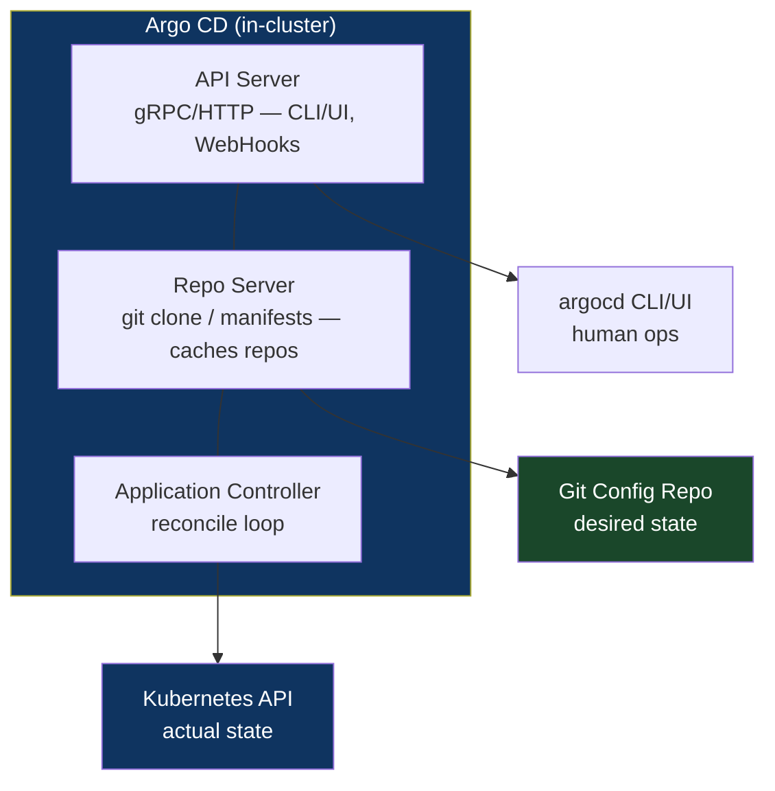
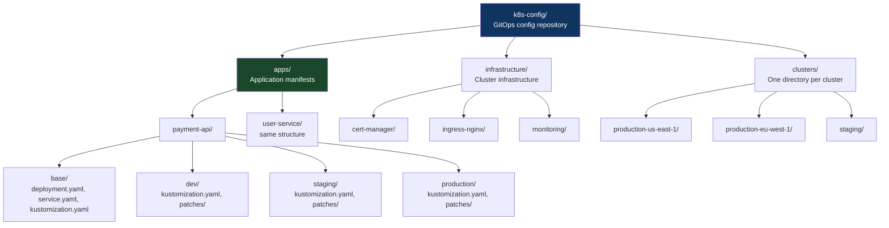

# Chapter 11: The GitOps Pattern
*Part III: Delivery & Deployment Patterns (CD)*

> *"A developer spent 45 minutes debugging why the API was returning the wrong
> response format. The code in Git was correct. The running pod had a manually
> applied ConfigMap from six weeks ago that nobody remembered.
> This is what 'production state is in your head' looks like."*
> — postmortem note, a team the day before they adopted GitOps

---

## The War Story

It's 11 AM on a Thursday when Jasmine Torres, lead SRE at Hartwell Financial, gets paged. The `order-service` in production is returning HTTP 503 on 12% of requests. The service is running. The health checks are green. The logs show connection timeouts to the downstream `pricing-service`.

Jasmine checks the `pricing-service` deployment. The pod count is right: 3 replicas. She checks the Kubernetes Service. The selector looks correct. She checks the ConfigMap that `order-service` uses to reach `pricing-service`. The URL is `http://pricing-svc:8080`.

She checks what the `pricing-service` Kubernetes Service is actually named. It's `pricing-service`. Not `pricing-svc`.

Three weeks earlier, someone had renamed the service as part of a standardization effort. They edited the live Kubernetes resources with `kubectl edit`. They didn't update the ConfigMap that `order-service` uses. They didn't update the GitOps config repo. The change went into the cluster state and stayed there, invisible and undocumented, until a load spike caused the 12% timeout rate to cross the alerting threshold.

The fix: update the ConfigMap to use `pricing-service`. Two minutes. But the root cause — live cluster state diverging from the documented state in Git — takes a sprint to address properly. Hartwell has 34 microservices deployed across 3 clusters. A review of all three clusters against the config repo finds 17 undocumented manual changes. Six of them are configuration values that differ from what the config repo says they should be.

Hartwell has been doing GitOps for 18 months. They have Argo CD installed. They have a config repo. But they have `selfHeal: false` and no policy preventing direct `kubectl` access to production. GitOps as a checkbox, not a discipline.

This chapter is about GitOps as a discipline.

---

## What You'll Learn

- What GitOps actually requires, beyond "we have Argo CD installed"
- Argo CD architecture in depth: how the reconciler works, what sync strategies mean, how health checks are evaluated
- Flux as an alternative with different operational characteristics
- The "Git is the source of truth" commitment and what it costs organizationally
- Drift detection and the specific Argo CD/Flux configurations that enforce it
- Secret management in GitOps: the problem Git-stored secrets create and the solutions that don't compromise the model

---

## What GitOps Actually Requires

GitOps is a set of four principles, formalized by Weaveworks (the company that coined the term) and adopted by the OpenGitOps project:

**Principle 1: Declarative.** The entire desired state of the system is expressed declaratively. Not "run this script" (imperative), but "the desired state is this YAML" (declarative). Kubernetes YAML, Helm charts, Kustomize overlays, and Terraform are all declarative. `kubectl run` is not.

**Principle 2: Versioned and Immutable.** The desired state is stored in a version control system in a way that enforces immutability and retains the complete history. Git provides both. Every state change is a commit with an author, a timestamp, and a message.

**Principle 3: Pulled Automatically.** Software agents automatically pull the desired state from the source and apply it to the managed systems. No push from outside. The agent initiates all outbound connections.

**Principle 4: Continuously Reconciled.** Software agents continuously compare the actual state of the managed systems to the desired state. When they diverge, the agent corrects the actual state toward the desired state. Divergence is detected continuously, not just at deploy time.

Hartwell was satisfying principles 1 and 2 — they had declarative configs in Git. They were partially satisfying principle 3 — Argo CD was pulling. They were not satisfying principle 4 — they had disabled continuous reconciliation (`selfHeal: false`). The 17 manual changes lived in production because there was nothing to detect and correct them.

---

## Argo CD Architecture and Internals

Understanding how Argo CD works internally makes its behavior predictable and its failure modes debuggable.



**The Application Controller** is the heart of Argo CD. It runs a reconcile loop that:
1. Fetches the current desired state from the Repo Server (which caches the Git repo)
2. Fetches the current actual state from the Kubernetes API
3. Computes a diff between desired and actual
4. If `selfHeal: true` and a diff exists: applies the desired state to correct the drift
5. Updates the Application's sync status (`Synced`, `OutOfSync`)

The reconcile loop runs on a configurable interval (default: 3 minutes) and also runs immediately when the Repo Server detects a new commit (via webhook or polling). This means a normal deploy scenario — CI commits to the config repo — triggers a sync within seconds (webhook) to minutes (polling).

### Application Health Assessment

Argo CD evaluates application health by checking the status of the underlying Kubernetes resources. Different resource types have different health criteria:

```yaml
# Health check behaviors for common resource types:
# 
# Deployment: Healthy when spec.replicas == status.availableReplicas
#             and the current rollout is complete
#             Degraded when availableReplicas < desired
#             Progressing during rollout
#
# StatefulSet: Similar to Deployment
#
# Service: Always Healthy (Services don't have a meaningful "unhealthy" state)
#
# PersistentVolumeClaim: Healthy when Bound, Degraded when Pending >5 min
#
# Job: Healthy when succeeded, Failed when failed

# You can define custom health checks for CRDs using Lua scripts:
# (in argocd-cm ConfigMap)
data:
  resource.customizations.health.certmanager.k8s.io_Certificate: |
    hs = {}
    if obj.status ~= nil then
      if obj.status.conditions ~= nil then
        for i, condition in ipairs(obj.status.conditions) do
          if condition.type == "Ready" and condition.status == "False" then
            hs.status = "Degraded"
            hs.message = condition.message
            return hs
          end
          if condition.type == "Ready" and condition.status == "True" then
            hs.status = "Healthy"
            return hs
          end
        end
      end
    end
    hs.status = "Progressing"
    hs.message = "Waiting for certificate"
    return hs
```

### Sync Strategies

```yaml
apiVersion: argoproj.io/v1alpha1
kind: Application
spec:
  syncPolicy:
    automated:
      # prune: Remove resources from the cluster that no longer exist in Git.
      # Without prune: true, deleting a manifest from Git doesn't delete the
      # resource from the cluster. It just becomes "unmanaged." This is the
      # "ghost resource" problem — things running in the cluster that nobody
      # knows about because they were deleted from Git but not from the cluster.
      prune: true

      # selfHeal: Correct cluster state when it drifts from Git state.
      # Without selfHeal: true, Argo CD detects drift (shows OutOfSync) but
      # doesn't fix it. The Hartwell problem exactly.
      selfHeal: true

      # allowEmpty: Allow syncing to an empty directory (deletes all resources).
      # Default false. This prevents accidentally wiping an environment by
      # deleting all manifests from the config repo.
      allowEmpty: false

    syncOptions:
      # CreateNamespace: Argo CD creates the target namespace if it doesn't exist.
      - CreateNamespace=true

      # PruneLast: Apply all non-prune changes first, prune last.
      # Prevents race conditions where resources are deleted before
      # their replacements are ready.
      - PruneLast=true

      # ApplyOutOfSyncOnly: Only apply resources that have changed.
      # Reduces noise and resource server load for large applications.
      - ApplyOutOfSyncOnly=true

      # ServerSideApply: Use server-side apply (SSA) instead of client-side.
      # SSA handles field ownership correctly for resources managed by multiple
      # controllers (e.g., Argo CD manages the Deployment but the HPA modifies
      # the replica count). Client-side apply would overwrite the HPA's changes
      # on every sync.
      - ServerSideApply=true

    retry:
      limit: 5
      backoff:
        duration: 5s
        factor: 2        # Each retry doubles the wait
        maxDuration: 3m  # Cap at 3 minutes between retries
```

---

## GitOps Repository Structure

The structure of the GitOps config repo determines how maintainable the repository is as the number of services and environments grows.



```yaml
# apps/payment-api/base/deployment.yaml
# Base deployment manifest — no environment-specific values
apiVersion: apps/v1
kind: Deployment
metadata:
  name: payment-api
spec:
  replicas: 1  # Overridden by environment overlays
  selector:
    matchLabels:
      app: payment-api
  template:
    metadata:
      labels:
        app: payment-api
    spec:
      containers:
        - name: payment-api
          # Image tag is a Kustomize variable, set per environment.
          # The CI pipeline updates this value in the environment-specific
          # kustomization.yaml when a new image is built.
          image: myregistry.io/payment-api:PLACEHOLDER
          ports:
            - containerPort: 8080
          resources:
            requests:
              cpu: "100m"
              memory: "128Mi"
            limits:
              cpu: "500m"
              memory: "512Mi"
```

```yaml
# apps/payment-api/production/kustomization.yaml
# Production overlay — sets the specific image tag and production-scale resources
apiVersion: kustomize.config.k8s.io/v1beta1
kind: Kustomization

resources:
  - ../base

# Image tag is set here by the CI pipeline on each successful build.
# This is the only line that changes for a typical deployment.
images:
  - name: myregistry.io/payment-api
    newTag: "a3f8c2d"  # Updated by CI: yq e -i '.images[0].newTag = "..."' kustomization.yaml

# Production-specific patches
patches:
  - path: patches/replicas.yaml
  - path: patches/resources.yaml
  - path: patches/hpa.yaml
```

---

## Secret Management in GitOps: The Hard Problem

GitOps demands that everything is in Git. Secrets cannot be in Git in plaintext. This creates a tension that every GitOps implementation must resolve.

The wrong solutions:
- Base64 encoding in Kubernetes Secrets committed to Git. Base64 is not encryption. Anyone with read access to the Git repo has the secrets.
- Encrypting with a team key and committing the encrypted value. Works but creates key management complexity and doesn't integrate well with secret rotation.

The right solutions:

**Option 1: Sealed Secrets (Bitnami)**
Sealed Secrets allows you to commit encrypted secrets to Git. The encryption uses a cluster-specific key pair; only the SealedSecrets controller in the cluster can decrypt them.

```bash
# Generate a SealedSecret from a plain Kubernetes Secret
kubectl create secret generic db-password \
  --from-literal=password='s3cr3t' \
  --dry-run=client \
  -o yaml | \
kubeseal \
  --controller-namespace kube-system \
  --format yaml > apps/payment-api/production/sealed-db-password.yaml

# The output is safe to commit to Git.
# The controller in the cluster decrypts it; nobody else can.
```

**Option 2: External Secrets Operator (ESO)**
ESO keeps secrets in an external system (AWS Secrets Manager, HashiCorp Vault, GCP Secret Manager) and creates Kubernetes Secrets by pulling from the external system at runtime. Nothing sensitive is in Git — only the reference to where the secret lives.

```yaml
# apps/payment-api/production/external-secret.yaml
# This YAML is safe to commit — it contains no secret values,
# only references to where secrets live in AWS Secrets Manager.
apiVersion: external-secrets.io/v1beta1
kind: ExternalSecret
metadata:
  name: payment-api-secrets
spec:
  refreshInterval: 1h  # Re-sync from AWS Secrets Manager every hour
  secretStoreRef:
    name: aws-secrets-manager
    kind: ClusterSecretStore
  target:
    name: payment-api-secrets  # Creates a Kubernetes Secret with this name
  data:
    - secretKey: db-password    # Key in the Kubernetes Secret
      remoteRef:
        key: payment-api/production/db-password  # Path in AWS Secrets Manager
    - secretKey: stripe-api-key
      remoteRef:
        key: payment-api/production/stripe-key
```

ESO is the recommendation for most teams. The secret values live in a purpose-built secret management system with rotation support, access auditing, and fine-grained access control. The GitOps config repo contains only the mapping from Kubernetes Secret to external secret — safe to commit.

---

## Flux vs. Argo CD: The Definitive Comparison

```mermaid
flowchart LR
    subgraph compare["Argo CD vs Flux v2"]
        direction TB
        A1["UI: Yes (web) vs No (CLI + Grafana)"]
        A2["CRD config: Partial vs Fully CRD-driven"]
        A3["Multi-tenancy: Projects + RBAC vs Tenancy toolkit"]
        A4["Notifications: Yes vs Yes (notification-controller)"]
        A5["Multi-cluster: App of Apps vs Cluster API + Flux"]
        A6["Helm: Native vs HelmRelease CRD"]
        A7["Kustomize: Native vs Kustomization CRD"]
        A8["Config repo: Application CRD vs GitRepository + Kustomization CRDs"]
        A9["Learning curve: Moderate vs Higher"]
        A10["CNCF: Graduated vs Graduated"]
        A11["Best for: UI visibility vs everything-in-CRDs, minimal footprint"]
    end

    style compare fill:#0f3460,color:#ffffff
```



The controversial take: **the UI is both Argo CD's killer feature and its operational liability**. Teams that are running GitOps correctly should rarely need to click "sync" manually — the automation handles it. When the UI is available, teams click it instead of fixing the root cause of sync failures. The UI creates an escape valve that weakens the GitOps discipline. Flux's lack of a UI forces operators to fix problems in Git rather than clicking through them.

---

## When GitOps Breaks

### Break Mode 1: Config Repo Lag Under High Velocity

When CI is deploying 50 times per day across 20 services, the config repo receives 50 commits per day. Each commit triggers an Argo CD sync. Sync operations are not instantaneous — a large application sync takes 10–30 seconds. Under high commit volume, syncs queue behind each other, creating latency between "CI pushed the image" and "new version is running in the cluster."

Mitigation: Argo CD's sync parallelism (`--sync-concurrency`), separate config repos per team (reduces contention), and image update automation that batches small image tag updates.

### Break Mode 2: Sync Failures That Go Unnoticed

Argo CD marks an Application as `OutOfSync` when it can't apply a manifest. Reasons: malformed YAML, schema validation failure, resource quota exceeded, RBAC permission denied. If nobody is watching the Argo CD dashboard and alerts aren't configured, the Application sits `OutOfSync` indefinitely while the cluster runs the previous version.

This is Hartwell's failure mode from a different angle: not "manual changes override Git" but "Git changes fail to apply and nobody notices."

Alert rule (Prometheus):
```yaml
# Alert when any Argo CD Application is OutOfSync for more than 10 minutes.
# A deployment that hasn't converged within 10 minutes needs human attention.
- alert: ArgoCDApplicationOutOfSync
  expr: |
    argocd_app_info{sync_status="OutOfSync"} == 1
  for: 10m
  labels:
    severity: warning
  annotations:
    summary: "Argo CD Application {{ $labels.name }} is OutOfSync"
    description: "Application {{ $labels.name }} has been OutOfSync for >10 minutes. Check Argo CD for sync errors."
```

### Break Mode 3: The Bootstrapping Problem

When you use GitOps to manage everything, including Argo CD itself, you face a chicken-and-egg problem: Argo CD manages its own configuration, but Argo CD needs to be installed before it can manage anything. The "App of Apps" pattern solves this: a root Argo CD Application manages all other Argo CD Applications. But that root Application must be bootstrapped manually the first time.

```bash
# One-time bootstrap: install Argo CD and create the root App of Apps
kubectl apply -n argocd -f https://raw.githubusercontent.com/argoproj/argo-cd/stable/manifests/install.yaml

# After Argo CD is running, create the root application
# that will manage all other applications (including Argo CD itself from now on)
kubectl apply -f - <<EOF
apiVersion: argoproj.io/v1alpha1
kind: Application
metadata:
  name: root
  namespace: argocd
spec:
  project: default
  source:
    repoURL: https://github.com/myorg/k8s-config
    targetRevision: HEAD
    path: clusters/production
  destination:
    server: https://kubernetes.default.svc
    namespace: argocd
  syncPolicy:
    automated:
      prune: true
      selfHeal: true
EOF
# From this point, all changes to Argo CD configuration happen through Git.
```

---

## The Anti-Patterns

### ❌ Anti-Pattern: GitOps Without selfHeal

**What it looks like:** Argo CD is installed, config repo exists, but `selfHeal: false`. Drift is detected but not corrected. Manual kubectl changes persist indefinitely.

**Why it happens:** Teams are afraid that selfHeal will overwrite intentional manual changes. This fear is valid — but the correct response is to eliminate the pattern of intentional manual changes, not to disable reconciliation.

**What breaks:** The GitOps guarantee. If selfHeal is off, Git is not the source of truth — it's the intended source of truth that isn't enforced.

**The fix:** Enable `selfHeal: true`. Use Argo CD's "override" mechanism for the rare cases where a temporary manual change is genuinely necessary. The override is time-limited and visible to the whole team.

---

### ❌ Anti-Pattern: Secrets in Git (Even Encrypted)

**What it looks like:** Secret values encrypted with a team PGP key, committed to the config repo. Rotation requires re-encrypting and re-committing.

**Why it happens:** It keeps everything in one place.

**What breaks:** Rotation hygiene, access auditing, and the security posture the moment the team key is compromised. Encrypted secrets in Git are only as secure as the key management.

**The fix:** External Secrets Operator + AWS Secrets Manager / Vault. The mapping lives in Git; the value lives in the secret store. Rotation happens in the secret store; ESO syncs within the refresh interval.

---

### ❌ Anti-Pattern: One Giant Config Repository

**What it looks like:** All 50 services, all 3 clusters, all environments in a single Git repository. Every deployment to any service causes a commit to this repo, creating a high-velocity "noise" commit history that makes it hard to audit what actually changed for a specific service.

**Why it happens:** The "everything in Git" principle taken too literally.

**What breaks:** Auditability and change review. When 50 services are committing image tag updates to the same repo at high velocity, the Git log is unusable for auditing. Merge conflicts on the same `kustomization.yaml` files become frequent.

**The fix:** Separate config repos by team or domain. Each team owns their config repo, CI has write access to their repo only, and Argo CD watches all repos. The per-team structure reflects the organizational ownership model and limits the blast radius of a misconfigured CI pipeline.

---

## Field Notes

💀 **Manual kubectl apply in production without updating Git** → Config drift accumulates silently until an incident exposes it → Enforce Git-first as a cultural policy. Every kubectl command that changes cluster state must have a corresponding Git commit. Enable `selfHeal: true` so the cluster enforces it automatically.

💀 **Argo CD application in `Unknown` health status with no alert** → Running degraded for days with no response → Alert on `Unknown` health status with a 5-minute tolerance. Unknown means Argo CD can't determine health — which means you don't know if the application is working.

💀 **Not managing Argo CD itself via GitOps** → Argo CD configuration changes are made via UI or kubectl, creating a system that manages everything except itself → Include Argo CD's own configuration in the config repo. Use App of Apps to bootstrap.

---

## Chapter Summary

GitOps is not a tool. It's a discipline enforced by four properties: declarative state, version-controlled history, pull-based reconciliation, and continuous drift correction. Installing Argo CD satisfies the tool requirement. Enabling `selfHeal: true`, storing only references to secrets (not secret values) in Git, alerting on sync failures, and eliminating manual cluster modifications satisfies the discipline requirement.

The value of GitOps is that it converts deployment from an event (something that happens when CI runs) to a state (something that Git continuously enforces). The cluster is always trying to match Git. The audit trail for any cluster change is the Git history of the config repo. Debugging "what changed?" is `git log`. This is the operational simplicity that GitOps promises — and it only materializes when all four principles are operational, not just two of them.

---

## What's Next

Chapter 12 extends GitOps to per-PR preview environments: ephemeral environments that are created when a PR is opened, updated as commits are pushed, and destroyed when the PR merges or closes. This requires GitOps infrastructure that can create and tear down complete application stacks on demand — Argo CD ApplicationSets, Kubernetes namespace-per-branch, and cost containment strategies.
