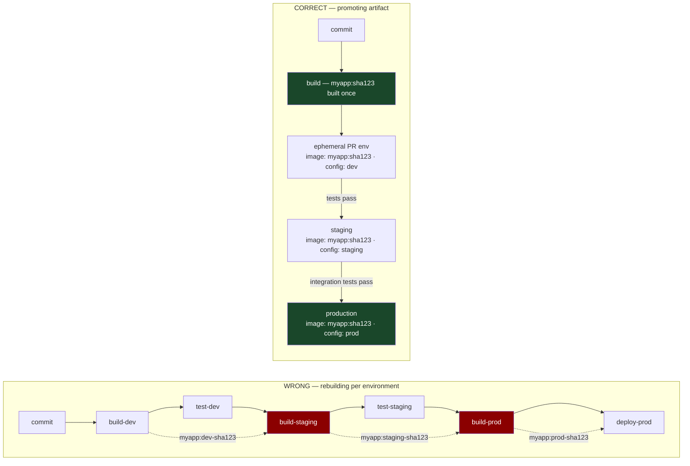

# Chapter 13: The Environment Promotion Pattern
*Part III: Delivery & Deployment Patterns (CD)*

> *"We promoted to production because the tests passed in staging.
> Staging was running PostgreSQL 13. Production was running PostgreSQL 14.2.
> That difference doesn't matter for 99% of queries.
> We had the 1% query."*
> — postmortem, January 2023

---

## The War Story

At Clearpath Logistics, "promotion" to production means someone goes into the Confluence page titled "Release Checklist v4 (Updated Feb 2022)" and follows 23 steps. Step 14 is "verify DB migration is compatible with current prod schema." Step 19 is "confirm no open SEV-2+ incidents." Step 22 is "update the deployment log Google Sheet."

Nobody does all 23 steps every time. The checklist is aspirational. The actual process is: engineer pushes the deployment, watches it for a few minutes, declares it done. The checklist exists because something broke once for each of the 23 items. The checklist is 23 lessons written down and then not followed.

In March, a release engineer named Jordan promotes the inventory service from staging to production. The service has been stable in staging for four days. The staging database is PostgreSQL 13.8. Production is 14.2. Steps 14 and 19 of the checklist are skipped — "they're usually fine," Jordan notes in Slack. The migration adds a `CHECK` constraint that uses a function whose behavior differs between PG 13 and PG 14. Staging passes. Production throws:

```
ERROR:  function jsonb_path_query_array(jsonb, jsonpath) does not exist
LINE 1: CHECK (jsonb_path_query_array(metadata, '$.tags[*]') IS NOT ...
```

The migration fails mid-run. The database is in a partial state. The inventory service is in a degraded mode for 4 hours while the database team diagnoses and reverses the migration manually. 1,800 customer-facing orders fail to update inventory counts, requiring a 3-day manual reconciliation effort.

Jordan had done everything right by the informal process. The informal process was wrong. The formal checklist existed but was too cumbersome to follow for routine releases. The gap between "what we say we do" and "what we actually do" is where this incident lived.

This chapter is about closing that gap by encoding the promotion process in the pipeline, not on a Confluence page.

---

## What You'll Learn

- The promotion model: what an immutable artifact promotion workflow looks like, and why it's different from "re-deploying to the next environment"
- Gate types: automated gates (health checks, integration tests, contract tests), manual gates (approval workflows), and hybrid gates
- Environment parity: the specific configuration differences between environments that cause "works in staging, breaks in prod" and how to track them
- Configuration injection: how to apply environment-specific configuration to an environment-agnostic artifact at promotion time
- The promotion audit trail: what the pipeline must record for compliance and debugging

---

## The Core Concept: Promoting Artifacts, Not Deploying Code

The most important conceptual distinction in environment promotion: **you promote artifacts, not code**. The artifact — the container image, the Helm chart, the Lambda ZIP — is built once in CI and promoted through environments unchanged. You do not re-build for staging. You do not re-build for production. The binary that passed tests in the ephemeral PR environment is the binary that runs in production.

This principle has a corollary that many teams violate: **environment-specific configuration is separate from the artifact**. The database URL, the log level, the feature flag defaults, the API endpoint configurations — these are injected at deployment time via environment variables, ConfigMaps, or a configuration service. They are not baked into the image. If they were baked into the image, you'd need to rebuild for each environment, destroying the "build once" guarantee.



---

## Implementing the Promotion Workflow

### GitOps-Based Promotion

In a GitOps setup, promotion means updating the image tag in the config repo for the target environment. The promotion pipeline:

1. CI builds `myapp:sha123` and pushes to the registry
2. CI updates the image tag in the dev overlay of the config repo → Argo CD deploys to dev
3. After dev passes, a promotion workflow updates the image tag in the staging overlay → Argo CD deploys to staging
4. After staging passes, a promotion workflow updates the image tag in the production overlay → Argo CD deploys to production

```yaml
# .github/workflows/promote.yml
# Triggered manually or by a passing integration test job
name: Promote to Environment

on:
  workflow_dispatch:
    inputs:
      image_tag:
        description: 'Image tag to promote (git SHA)'
        required: true
      target_env:
        description: 'Target environment'
        required: true
        type: choice
        options: [staging, production]

jobs:
  pre-promotion-gates:
    runs-on: ubuntu-22.04
    steps:
      - name: Verify image exists in registry
        run: |
          # Verify the artifact we're promoting actually exists.
          # A promotion of a non-existent tag is a configuration error.
          docker manifest inspect ${{ env.REGISTRY }}/myapp:${{ inputs.image_tag }} || \
            (echo "Image tag ${{ inputs.image_tag }} not found in registry" && exit 1)

      - name: Verify staging health (if promoting to production)
        if: inputs.target_env == 'production'
        run: |
          # Before promoting to production, verify staging is healthy.
          # Promoting to prod while staging is degraded means you're skipping
          # the validation that staging provides.
          STAGING_STATUS=$(kubectl get deployment myapp -n staging \
            -o jsonpath='{.status.availableReplicas}')
          DESIRED=$(kubectl get deployment myapp -n staging \
            -o jsonpath='{.spec.replicas}')
          
          if [[ "$STAGING_STATUS" != "$DESIRED" ]]; then
            echo "Staging is not fully healthy ($STAGING_STATUS/$DESIRED available)."
            echo "Resolve staging issues before promoting to production."
            exit 1
          fi

      - name: Check error budget (if promoting to production)
        if: inputs.target_env == 'production'
        run: |
          # Query the SLO system to verify we have remaining error budget.
          # Promoting during an error budget exhaustion event compounds the incident.
          # This gate implements the SLO-based release gating pattern (Chapter 23).
          python scripts/check_error_budget.py \
            --service myapp \
            --env staging \
            --min-remaining 20  # Require at least 20% of monthly error budget remaining

  promote:
    needs: pre-promotion-gates
    runs-on: ubuntu-22.04
    # Require a manual approval for production promotions.
    # This uses GitHub Environments with required reviewers configured.
    environment: ${{ inputs.target_env }}
    steps:
      - name: Checkout config repo
        uses: actions/checkout@v4
        with:
          repository: myorg/k8s-config
          token: ${{ secrets.CONFIG_REPO_TOKEN }}

      - name: Update image tag for target environment
        run: |
          ENV="${{ inputs.target_env }}"
          TAG="${{ inputs.image_tag }}"
          
          # Update the image tag in the environment's kustomization.yaml
          yq e -i \
            ".images[0].newTag = \"${TAG}\"" \
            apps/myapp/${ENV}/kustomization.yaml

          git config user.email "deploy-bot@myorg.com"
          git config user.name "Deploy Bot"
          git add apps/myapp/${ENV}/kustomization.yaml
          git commit -m "chore(${ENV}): promote myapp to ${TAG}

          Promoted by: ${{ github.actor }}
          Workflow run: ${{ github.run_id }}
          Source tag: ${TAG}
          Target environment: ${ENV}"
          git push

      - name: Wait for Argo CD sync
        run: |
          # Wait for Argo CD to pick up the config change and sync successfully.
          # argocd app wait blocks until the application is Synced and Healthy.
          argocd app wait myapp-${{ inputs.target_env }} \
            --sync \
            --health \
            --timeout 300

  post-promotion-verification:
    needs: promote
    runs-on: ubuntu-22.04
    steps:
      - name: Run smoke tests
        run: |
          ENV="${{ inputs.target_env }}"
          BASE_URL="https://${ENV}.myapp.com"

          # Smoke test: verify the most critical user journeys work.
          # These are fast (< 2 minutes) and verify the deployment didn't break basics.
          pytest tests/smoke/ \
            --base-url="${BASE_URL}" \
            --timeout=30 \
            -v

      - name: Emit promotion event to observability
        run: |
          # Emit a deployment event to your observability platform.
          # This creates a "deploy marker" in Datadog/Honeycomb/Grafana,
          # enabling correlation of metric changes with deployment events.
          # Chapter 25 covers this in depth.
          curl -X POST https://api.datadoghq.com/api/v1/events \
            -H "Content-Type: application/json" \
            -H "DD-API-KEY: ${{ secrets.DATADOG_API_KEY }}" \
            -d '{
              "title": "Deployment: myapp to ${{ inputs.target_env }}",
              "text": "Image: ${{ inputs.image_tag }}\nBy: ${{ github.actor }}",
              "tags": ["env:${{ inputs.target_env }}", "service:myapp", "version:${{ inputs.image_tag }}"],
              "alert_type": "info"
            }'
```

---

## Gate Types: When to Block, When to Require Approval

### Automated Gates

Automated gates run checks and pass or fail without human involvement. They are fast and should be the primary quality signal for most promotions.

```yaml
# Example automated gate: contract tests pass before staging → production promotion
- name: Run contract tests
  run: |
    # Contract tests verify that the API contracts between services are satisfied.
    # If this service's API changed in a way that breaks a consumer, this gate catches it
    # before the breaking change reaches production.
    pact-broker can-i-deploy \
      --pacticipant myapp \
      --version ${{ inputs.image_tag }} \
      --to-environment ${{ inputs.target_env }} \
      --broker-base-url https://pact-broker.myorg.com
```

### Manual Gates (Approval Workflows)

Manual gates pause the pipeline and wait for a human to explicitly approve the promotion. Use manual gates when:
- The deployment has business risk that can't be automatically assessed (major feature release, high-risk schema migration)
- Regulatory requirements mandate human sign-off (SOX, HIPAA change control)
- The team's SLO is in a degraded state and a human should decide whether to proceed

```yaml
# GitHub Environments provide manual approval gates natively.
# Configure in repo Settings → Environments → production → Required reviewers.
# The pipeline pauses at the `environment: production` job and waits.
jobs:
  deploy-to-production:
    environment: production  # Pauses here for required reviewer approval
    runs-on: ubuntu-22.04
    steps:
      - name: Deploy
        run: echo "Deploying after approval..."
```

### Hybrid Gates

A hybrid gate combines automated checks with a lightweight manual acknowledgment. The automated checks run first; if they pass, a human is notified and can approve with a single click rather than reviewing the full checklist.

This is the model Clearpath Logistics should have had: the checklist automations run first (DB compatibility check, open incident check, error budget check), and Jordan's approval means "I've reviewed the automated checks and authorize this promotion," not "I'm manually verifying 23 checklist items."

---

## Environment Parity: The Root Cause of "Works in Staging"

Environment parity is the degree to which staging mirrors production. Perfect parity is impossible — production has more data, more traffic, and potentially different versions of external dependencies. But the specific parity gaps that cause production incidents are usually in infrastructure versions, not data or traffic.

Track parity explicitly:

```yaml
# parity-manifest.yaml — version specification for each environment
# Stored in the config repo. Updated when any environment's dependency version changes.
# A CI check compares staging to production and flags significant divergence.

environments:
  staging:
    postgresql: "14.2"      # Must match production within minor version
    redis: "7.2.3"
    node_version: "18.19.0"
    kubernetes: "1.28.4"
    
  production:
    postgresql: "14.2"
    redis: "7.2.3"
    node_version: "18.19.0"
    kubernetes: "1.28.4"
```

```python
# ci/check_parity.py — run as a CI gate before staging → production promotion
import yaml, sys

with open('parity-manifest.yaml') as f:
    manifest = yaml.safe_load(f)

staging = manifest['environments']['staging']
production = manifest['environments']['production']

critical_fields = ['postgresql', 'redis', 'node_version']
divergences = []

for field in critical_fields:
    s_ver = staging.get(field, 'MISSING')
    p_ver = production.get(field, 'MISSING')
    if s_ver != p_ver:
        divergences.append(f"{field}: staging={s_ver} vs production={p_ver}")

if divergences:
    print("PARITY GAPS DETECTED:")
    for d in divergences:
        print(f"  - {d}")
    print("\nResolve these before promotion or document the known gap.")
    sys.exit(1)

print("Parity check passed.")
```

The parity manifest is a living document. When production is upgraded to PG 14.3, the manifest is updated, a CI check verifies staging is also at 14.3 (or flags the gap), and no promotion can complete until the gap is resolved or explicitly acknowledged.

---

## The Promotion Audit Trail

Every promotion must leave a complete, immutable audit trail that answers: who promoted what to where and when, what automated gates ran and what was their result, and who approved the promotion if a manual gate was required.

In a GitOps system, the config repo's commit history is the audit trail for what was deployed when. But the commit history alone is insufficient for compliance — it doesn't record who approved the promotion or what the automated gate results were.

```python
# promotion_record.py — write to your audit database after every promotion
from dataclasses import dataclass
from datetime import datetime
import json

@dataclass
class PromotionRecord:
    # What was promoted
    service: str
    artifact_tag: str          # The git SHA of the promoted artifact
    artifact_digest: str       # The container image digest (content-addressed)
    
    # Where
    source_env: str            # staging
    target_env: str            # production
    
    # When
    started_at: datetime
    completed_at: datetime
    
    # Who
    initiated_by: str          # GitHub username
    approved_by: list[str]     # List of approvers (for manual gates)
    workflow_run_id: str       # GitHub Actions run ID for full log access
    
    # Gate results
    automated_gates: dict      # {"contract_tests": "passed", "error_budget": "passed"}
    manual_gate_reason: str    # Reason provided by the approver (if manual gate)
    
    # Outcome
    success: bool
    failure_reason: str | None  # If not success: what failed

def write_promotion_record(record: PromotionRecord):
    """Write to your audit database. For compliance, this must be immutable."""
    # Append-only write to a compliance-grade audit store
    # Options: AWS CloudTrail, a write-once S3 bucket, an append-only database
    print(json.dumps({
        "event_type": "promotion",
        **{k: str(v) for k, v in record.__dict__.items()}
    }))
```

---

## Scale Considerations

**At 1–5 services:** Manual promotion with a simple approval gate in GitHub Actions environments is sufficient. Two environments (staging, production) with automated smoke tests at each boundary.

**At 5–30 services:** Automated promotion pipelines per service, with standardized gates. The gates are defined once in a shared workflow template (Chapter 43 covers pipeline-as-code). Each service inherits the template.

**At 30+ services:** Promotion orchestration across services requires a coordination layer. Tools like Spinnaker (Netflix) or custom promotion pipelines manage multi-service coordinated promotions, where service A can only promote to production after service B (which it depends on) has successfully promoted.

**Numbers that matter:** Netflix runs ~4,000 production deployments per day across hundreds of microservices. Their Spinnaker instance processes these with automated gates for 95% of promotions and human approval only for services with active incidents or on a major version boundary. The 5% manual approval rate is the right target for mature teams: automation handles routine promotions, humans handle the exceptions.

---

## The Anti-Patterns

### ❌ Anti-Pattern: Re-Building Artifacts Per Environment

**What it looks like:** CI builds `myapp-dev`, runs tests, then rebuilds `myapp-staging`, runs different tests, then rebuilds `myapp-prod`. Each environment gets a fresh build.

**Why it happens:** Build scripts that embed environment configuration. The image that deploys to dev "knows it's dev" because it was built with `NODE_ENV=development` baked in.

**What breaks:** The reproducibility guarantee. The artifact that passed staging tests is not the artifact that runs in production. You've introduced a gap between what was tested and what was deployed.

**The fix:** Build once, inject configuration via environment variables at deploy time. The image is environment-agnostic; the environment is configuration-specific.

---

### ❌ Anti-Pattern: The Unenforced Checklist

**What it looks like:** Clearpath's 23-step Confluence checklist. Comprehensive in theory, ignored in practice because it's too slow for routine promotions.

**Why it happens:** Good intentions accumulate as manual steps after each incident.

**What breaks:** The checklist items that aren't being executed — the ones that existed because something broke before.

**The fix:** For each checklist item, ask: can this be automated as a pipeline gate? The answer is almost always yes. DB migration compatibility: run `pg_dump --schema-only` and diff it. Open incident check: query PagerDuty API. Environment parity: compare the parity manifest. When it can be automated, automate it and remove it from the checklist.

---

### ❌ Anti-Pattern: Staging as a Long-Lived Shared Environment With No Gate

**What it looks like:** Staging is perpetually running whatever the development team has been working on. "Staging" means "the current state of development" — not "a stable environment where we validate release candidates."

**Why it happens:** Staging was set up as a development integration environment rather than a release validation environment.

**What breaks:** The value of the staging gate. If staging is always running unstable development code, staging's "green" status means nothing for production quality.

**The fix:** Treat staging as a release candidate environment. Promotions to staging are pipeline-managed, not developer ad-hoc. Staging runs the release candidate image, not the development image.

---

## Field Notes

💀 **Environment version parity not tracked** → "Works in staging, breaks in prod" for infrastructure reasons that could have been caught → Maintain a parity manifest. Automate the comparison check as a pre-promotion gate.

💀 **Promotion initiated by pushing to `main` and hoping the pipeline handles it** → No explicit promotion trigger means no explicit approval and no audit trail → Require explicit promotion triggers: `workflow_dispatch` with required inputs, or a promotion commit in the config repo that requires a PR and review.

💀 **Not emitting deployment events to observability** → Can't correlate metric changes with deployments; post-incident analysis is guesswork → Emit a deployment event on every successful promotion. One API call. The value during incident response is enormous.

---

## Chapter Summary

Environment promotion is the operational formalization of the deployment safety contract. The contract says: this artifact is safe to deploy to production. Promotion is the process of verifying that claim at each environment boundary. The verification must be automated (for speed) and audited (for accountability).

The two most important principles: promote artifacts, not code (the image that passed staging tests is the image that runs in production), and encode gates in the pipeline (not on a Confluence page that nobody reads under time pressure).

Clearpath's 23-step checklist contained the right checks. The wrong part was expecting humans to execute them consistently. Every check on that list became a pipeline gate. Jordan's job changed from "execute 23 steps" to "click Approve after reviewing the automated check results." The incident rate dropped to zero for the class of problems the checklist was designed to catch.

---

## What's Next

Chapter 14 addresses the multi-service coordination problem: what happens when multiple interdependent services need to be promoted together, and changing service A's API breaks service B. Contract testing, deployment order orchestration, and the version compatibility matrix are the tools for coordinating deployments across a microservices system.

[→ Next: Chapter 14 — The Multi-Microservice Coordination Pattern](./chapter-14-multi-microservice-coordination.md)

---
*[← Previous: Chapter 12 — The Ephemeral Environment Pattern](./chapter-12-ephemeral-environment.md) |
[→ Next: Chapter 14 — The Multi-Microservice Coordination Pattern](./chapter-14-multi-microservice-coordination.md)*
