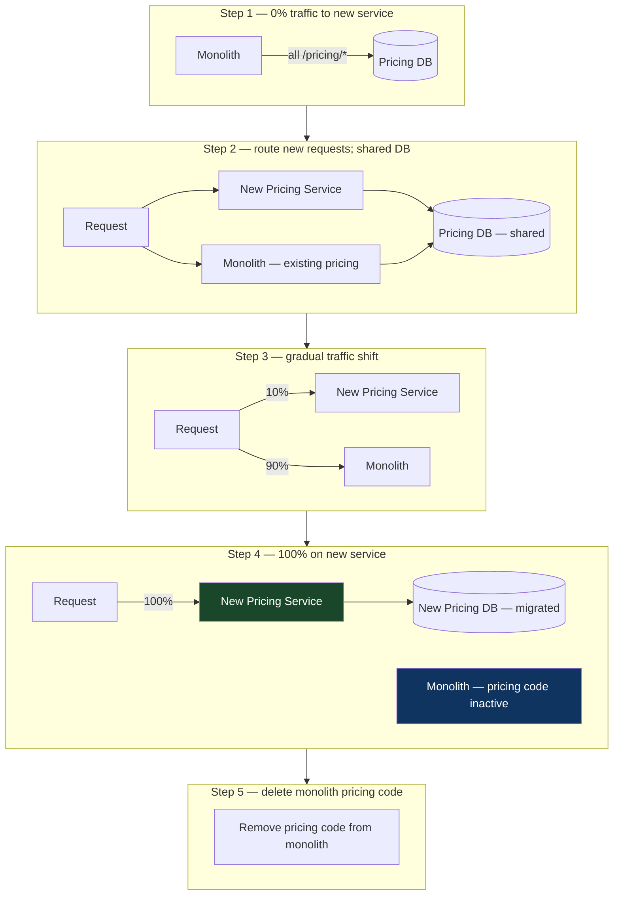

# Chapter 15: The Branch by Abstraction Pattern
*Part III: Delivery & Deployment Patterns (CD)*

> *"The 'ORM migration' branch lived for 11 weeks.
> When it merged, the diff was 47,000 lines.
> The merge itself took three days.
> We called it 'the merge that ate the sprint.'
> We never did another long-lived branch after that."*
> — engineering manager, 2019, describing the incident that changed their workflow

---

## The War Story

The engineering team at Corelink Payments decides in Q1 that their Django ORM is slowing them down. Twelve services share a monolithic ORM layer — 340 model definitions accumulated over six years. Query performance is poor. Schema migrations are slow. The team wants to move to SQLAlchemy with a clean async model layer.

The plan: create a long-lived branch, migrate all 340 models to SQLAlchemy, run the migration for 10 weeks, then merge. The branch is created in January.

For 10 weeks, six engineers work on `feature/sqlalchemy-migration`. Every week, `main` advances: bug fixes, performance patches, new features. Every week, someone rebases the migration branch. By week 8, the rebase takes an afternoon. By week 10, it takes two days.

The merge happens in mid-March. The diff is 47,000 lines. Code review takes three days because nobody can hold 47,000 lines in working memory. Three bugs survive code review (the reviewers are exhausted). Two are caught in staging. One ships to production, causing a subtle foreign key integrity violation in a low-traffic code path. It takes six weeks to find.

The retrospective produces one action item: "don't do long-lived branches for large refactors." The retrospective does not produce a plan for how to do the next large refactor without a long-lived branch. That plan is Branch by Abstraction.

---

## What You'll Learn

- Branch by Abstraction: the four-step technique for making large-scale changes incrementally on trunk
- Abstraction layer patterns: interfaces, adapters, and facades that enable parallel implementations
- Feature flags as the deployment mechanism for Branch by Abstraction: keeping incomplete work in production without it being visible or active
- The Strangler Fig pattern for service extraction: how to migrate from a monolith to microservices without a big-bang cutover
- When Branch by Abstraction is harder than a long-lived branch: the honest failure modes

---

## What Branch by Abstraction Is

Branch by Abstraction is a technique for making large-scale changes to a codebase incrementally, without long-lived feature branches, by introducing an abstraction layer that allows both the old and new implementations to coexist in production simultaneously.

The four steps:

**Step 1: Create an abstraction.** Add an interface (or abstract class, or protocol, or adapter) that the callers use instead of calling the implementation directly. The implementation is unchanged; only the calling convention changes.

**Step 2: Implement both versions behind the abstraction.** The old implementation and the new implementation both satisfy the abstraction. At runtime, a feature flag determines which implementation is active.

**Step 3: Migrate callers incrementally.** Each caller is updated to use the new implementation via the abstraction. Changes ship to main in small batches, tested independently.

**Step 4: Remove the old implementation.** Once all callers are migrated and the new implementation is verified, delete the old code.

The critical insight: at no point is there a long-lived branch. Every step happens on main. The in-progress migration is in production from step 1 onwards — but users are insulated from it by the feature flag and the abstraction.

---

## The Abstraction Layer in Practice

For the Corelink ORM migration:

```python
# Step 1: Create the abstraction (commit to main, ships to production immediately)
# This interface defines what the ORM layer must provide.
# Callers import from this module — not directly from Django models.

from abc import ABC, abstractmethod
from typing import Optional

class UserRepository(ABC):
    """Abstract repository for user data access.
    
    All user-related database operations go through this interface.
    The implementation (Django ORM or SQLAlchemy) is swapped behind this.
    """
    
    @abstractmethod
    async def get_by_id(self, user_id: int) -> Optional[dict]:
        raise NotImplementedError
    
    @abstractmethod
    async def create(self, data: dict) -> dict:
        raise NotImplementedError
    
    @abstractmethod
    async def update(self, user_id: int, data: dict) -> dict:
        raise NotImplementedError

# The factory function: returns the correct implementation based on the feature flag.
# The flag value is read from LaunchDarkly (or equivalent) at runtime.
def get_user_repository() -> UserRepository:
    from config import feature_flags
    
    if feature_flags.get('sqlalchemy-user-repo', default=False):
        from repos.sqlalchemy_impl import SQLAlchemyUserRepository
        return SQLAlchemyUserRepository()
    else:
        from repos.django_impl import DjangoUserRepository
        return DjangoUserRepository()
```

```python
# Step 2a: The existing Django implementation, now behind the abstraction
# (minimal change — just wrap existing code in the interface)
class DjangoUserRepository(UserRepository):
    async def get_by_id(self, user_id: int) -> Optional[dict]:
        from models import User
        try:
            user = await User.objects.aget(id=user_id)
            return {'id': user.id, 'email': user.email, 'name': user.name}
        except User.DoesNotExist:
            return None
    
    async def create(self, data: dict) -> dict:
        from models import User
        user = await User.objects.acreate(**data)
        return {'id': user.id, 'email': user.email, 'name': user.name}
    
    async def update(self, user_id: int, data: dict) -> dict:
        from models import User
        await User.objects.filter(id=user_id).aupdate(**data)
        return await self.get_by_id(user_id)
```

```python
# Step 2b: The new SQLAlchemy implementation (developed incrementally on main)
# Each increment ships when it passes tests — not when the whole migration is done.
class SQLAlchemyUserRepository(UserRepository):
    def __init__(self):
        from database import async_session_factory
        self.session_factory = async_session_factory
    
    async def get_by_id(self, user_id: int) -> Optional[dict]:
        async with self.session_factory() as session:
            result = await session.execute(
                select(UserModel).where(UserModel.id == user_id)
            )
            user = result.scalar_one_or_none()
            if user is None:
                return None
            return {'id': user.id, 'email': user.email, 'name': user.name}
    
    async def create(self, data: dict) -> dict:
        async with self.session_factory() as session:
            user = UserModel(**data)
            session.add(user)
            await session.commit()
            await session.refresh(user)
            return {'id': user.id, 'email': user.email, 'name': user.name}
    
    async def update(self, user_id: int, data: dict) -> dict:
        async with self.session_factory() as session:
            await session.execute(
                update(UserModel).where(UserModel.id == user_id).values(**data)
            )
            await session.commit()
            return await self.get_by_id(user_id)
```

```python
# Step 3: Callers use the abstraction (small incremental commits to main)
# BEFORE:
from models import User
user = User.objects.get(id=user_id)

# AFTER:
from repositories import get_user_repository
repo = get_user_repository()
user = await repo.get_by_id(user_id)

# This change is one commit. It ships immediately.
# The feature flag defaults to False in production — Django implementation runs.
# In internal testing: flag is True — SQLAlchemy implementation runs.
# Gradual rollout: flag rolls from 0% → 1% → 10% → 50% → 100%
```

The migration for all 340 models takes the same 10 weeks. But instead of 47,000 lines in a single merge, there are 340 incremental commits — each testable, each reviewable, each reversible. The 10-week migration produces 340 small diffs instead of one enormous one.

---

## The Strangler Fig for Service Extraction

Branch by Abstraction scales up to service-level changes via the Strangler Fig pattern. The "strangler fig" — a tree that grows around a host tree and eventually replaces it — is the metaphor for extracting a service from a monolith without a big-bang cutover.



Implementation with an Nginx/Envoy proxy:

```yaml
# nginx.conf — gradually shift traffic during Strangler Fig migration
upstream pricing_monolith {
    server monolith:8080;
}

upstream pricing_new_service {
    server pricing-service:8080;
}

# Traffic splitting based on request hash (consistent per user)
# Split 10% to new service, 90% to monolith
map $request_id $pricing_backend {
    ~^[0-9a-f]{1}  pricing_new_service;  # 1/16 ≈ 6.25%
    default         pricing_monolith;
}

server {
    location /api/pricing/ {
        proxy_pass http://$pricing_backend;
        
        # Shadow mode: send requests to BOTH services,
        # compare responses before committing to the new service.
        # (Uncomment to enable shadow mode as a verification step)
        # mirror /shadow-pricing;
    }
}
```

---

## Feature Flags as the Deployment Mechanism

Branch by Abstraction depends on feature flags to control which implementation is active. The flags provide:

1. **Rollout control:** Start at 0% (off for all users), test internally, then roll out to 1%, 10%, 50%, 100%
2. **Instant rollback:** If the new implementation has issues, flip the flag back to 0% — no deployment required
3. **User segmentation:** Roll out to internal users first, then external beta users, then general availability

```python
# Feature flag integration with LaunchDarkly
import ldclient
from ldclient.config import Config

ldclient.set_config(Config(os.environ['LAUNCHDARKLY_SDK_KEY']))
client = ldclient.get()

def get_user_repository(user_context: dict) -> UserRepository:
    """Return the repository implementation based on the feature flag.
    
    The flag allows per-user rollout:
    - internal employees get SQLAlchemy first (for testing)
    - paying customers get it after internal validation
    - everyone gets it after full validation
    """
    
    # LaunchDarkly context: determines which variation the user gets
    context = ldclient.Context.builder(str(user_context.get('id', 'anonymous'))) \
        .set('email', user_context.get('email', '')) \
        .set('plan', user_context.get('plan', 'free')) \
        .build()
    
    use_sqlalchemy = client.variation('sqlalchemy-user-repo', context, default=False)
    
    if use_sqlalchemy:
        return SQLAlchemyUserRepository()
    else:
        return DjangoUserRepository()
```

### Verifying Both Implementations Produce Consistent Results

During the migration period, you can run both implementations on every request and compare their outputs — catching any discrepancy before it affects users:

```python
def get_user_repository_with_verification(user_context: dict) -> UserRepository:
    """During migration: run both implementations and compare results."""
    
    verification_mode = client.variation('sqlalchemy-verify-mode', user_context_ctx, False)
    
    if not verification_mode:
        return get_user_repository(user_context)
    
    # Return a verification wrapper that calls both implementations
    # and logs any discrepancies.
    return VerifyingRepository(
        primary=DjangoUserRepository(),
        shadow=SQLAlchemyUserRepository(),
        # Use primary's result for the actual response.
        # Log if shadow differs from primary.
        on_mismatch=lambda op, primary, shadow: log_mismatch(op, primary, shadow)
    )

class VerifyingRepository(UserRepository):
    """Calls both implementations; serves primary result; logs discrepancies."""
    
    async def get_by_id(self, user_id: int) -> Optional[dict]:
        primary_result = await self.primary.get_by_id(user_id)
        
        try:
            shadow_result = await self.shadow.get_by_id(user_id)
            if primary_result != shadow_result:
                self.on_mismatch('get_by_id', primary_result, shadow_result)
        except Exception as e:
            logging.warning(f"Shadow implementation failed: {e}")
        
        return primary_result  # Always return primary result to caller
```

This verification approach (similar to the Shadow Deployment pattern in Chapter 22) builds confidence in the new implementation on real traffic before it handles real responses.

---

## When Branch by Abstraction Is Harder Than a Long-Lived Branch

The honest answer: Branch by Abstraction requires more upfront design work than a long-lived branch. For some changes, the abstraction is natural; for others, it requires significant refactoring of the call sites before the migration can begin.

**Cases where Branch by Abstraction is straightforward:**
- Database access layer replacement (as in the ORM example): clear interface boundaries, well-understood input/output contracts
- External service client replacement (e.g., migrating from one payment processor to another): the abstraction is the service client interface
- Configuration system replacement: inject the new config system behind a common config interface
- Queue/event system migration: abstract the publish/consume operations behind an interface

**Cases where Branch by Abstraction is genuinely hard:**
- Changes to shared mutable state (global variables, shared caches): the abstraction layer can't hide the mutation semantics
- Schema changes that affect multiple services and require coordinated data migration: Branch by Abstraction handles the code; the data migration requires the Expand-and-Contract pattern (Chapter 27)
- Framework-level changes that affect how the entire codebase is structured: migrating from Flask to FastAPI, for example, affects every route definition, not just the data access layer
- Changes to a shared library that is consumed by services maintained by different teams: coordinating the consumer migrations requires cross-team coordination that Branch by Abstraction doesn't simplify

For the hard cases: Branch by Abstraction is still usually better than a long-lived branch, but the timeline is longer and the coordination overhead is higher. The key decision is whether the merge risk of a long-lived branch exceeds the design overhead of the abstraction layer.

---

## Scale Considerations

**At 1–5 engineers, small codebase:** Long-lived branches are painful but manageable. Branch by Abstraction is still better — it forces you to think about interface design — but the risk delta is smaller.

**At 5–30 engineers, growing codebase:** The value of Branch by Abstraction starts being felt as merge conflicts become a recurring source of delays.

**At 30+ engineers, mature codebase:** Branch by Abstraction is not optional for large-scale changes. A 47,000-line merge in a 30+ person organization creates review bottlenecks that block multiple teams. The design overhead of the abstraction layer is small compared to the coordination cost of the merge.

---

## The Anti-Patterns

### ❌ Anti-Pattern: Adding the Abstraction Layer Without Feature Flag Control

**What it looks like:** The abstraction layer is created, both implementations exist, but there's no flag — the new implementation is always active from the moment it's committed.

**Why it happens:** Feature flags add operational complexity. The engineer skipped the flag to "keep it simple."

**What breaks:** The ability to roll back without a deployment. If the new implementation has a bug, you can't turn it off without reverting a commit and redeploying.

**The fix:** The feature flag is not optional. It's what makes Branch by Abstraction safe. The flag is the rollback mechanism and the gradual rollout mechanism simultaneously.

---

### ❌ Anti-Pattern: Never Removing the Old Implementation

**What it looks like:** The migration completes, 100% of traffic is on the new implementation, but the old implementation stays in the codebase "just in case." Six months later, the old implementation is maintained alongside the new one because it's in the code review scope for changes.

**Why it happens:** Teams are conservative about deleting code they might "need again."

**What breaks:** Code maintainability. Two implementations mean two code paths to test, two sets of bugs to fix, and constant cognitive overhead for engineers reading the code.

**The fix:** Define a completion date for the migration. When the flag reaches 100% and the new implementation has been running stably for N weeks, delete the old implementation and the abstraction layer. The abstraction is a migration scaffold, not a permanent fixture.

---

### ❌ Anti-Pattern: Branch by Abstraction for a Two-Day Change

**What it looks like:** An engineer creates an abstraction layer, a feature flag, and a dual implementation for a change that would have taken two days on a short-lived branch.

**Why it happens:** "We always do Branch by Abstraction now" applied without judgment.

**What breaks:** Engineering velocity. The overhead of the abstraction layer (design work, flag management, verification mode) is non-trivial. For small changes, it's unjustified.

**The fix:** Branch by Abstraction is for changes that would otherwise require long-lived branches (>1 week). For two-day changes, a short-lived branch with a clean merge is the right approach.

---

## Field Notes

💀 **Long-lived migration branch with weekly rebases** → Compounding merge conflicts, increasing cognitive load, eventual big-bang merge risk → Establish a hard rule: no branch lives longer than 3 days. For longer changes, Branch by Abstraction is required.

💀 **No completion criteria for the migration** → Both implementations persist indefinitely → Before starting the migration, define: "Migration is complete when flag is at 100% for 2 weeks with no rollbacks." Put it on the PR description. Put it on the Jira ticket. Set a calendar reminder.

💀 **Abstraction layer retained after migration completes** → Dead code accumulates → The abstraction layer is a temporary scaffold. Delete it after the migration is complete: the flag, the old implementation, the factory function, and the abstraction interface if the new implementation is concrete enough to not need it.

---

## Chapter Summary

Branch by Abstraction is how mature engineering teams do large-scale refactoring without accumulating the merge risk that destroys sprints and introduces subtle bugs. The technique is conceptually simple: introduce an abstraction, implement both old and new behind it, migrate callers incrementally, remove the old implementation. The operational machinery — the feature flag, the gradual rollout, the verification mode — makes the process safe and reversible.

The pattern works because it converts a single high-risk event (the big-bang merge) into a series of small low-risk events (individual caller migrations). Each small event is independently testable, independently deployable, and independently reversible. The 10-week migration at Corelink still takes 10 weeks with Branch by Abstraction. But instead of one 47,000-line merge, there are 340 small commits, each of which could be reverted in isolation if something goes wrong.

---

## What's Next

Chapter 16 closes Part III with a pattern that is often overlooked until the finance team sends an email: the FinOps Target Pattern, which makes cloud cost a first-class pipeline constraint. When ephemeral environments, multi-region deployments, and GPU workloads are all running through your pipeline, the pipeline itself is a cost generation machine. Chapter 16 covers how to add cost visibility and cost gates before the AWS bill becomes a board-level conversation.

[→ Next: Chapter 16 — The FinOps Target Pattern](./chapter-16-finops-target.md)

---
*[← Previous: Chapter 14 — The Multi-Microservice Coordination Pattern](./chapter-14-multi-microservice-coordination.md) |
[→ Next: Chapter 16 — The FinOps Target Pattern](./chapter-16-finops-target.md)*
