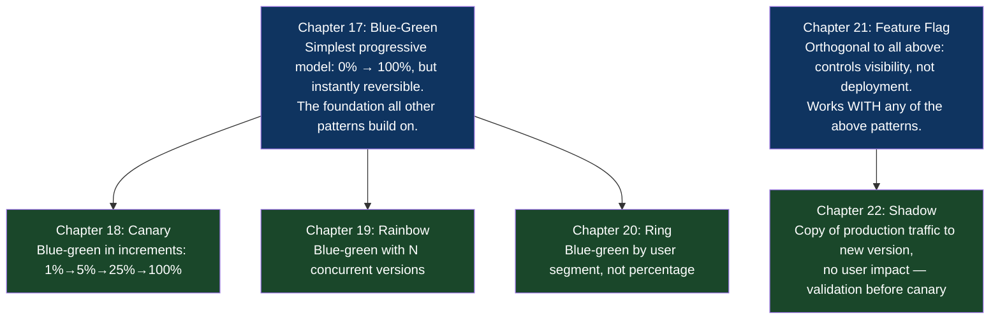

# Part IV: Progressive Delivery Patterns (Safe Rollouts)

## What This Part Is About

Binary deployments — the artifact is either fully deployed or it isn't — are not how mature engineering organizations ship. Binary deployments mean the first user who experiences a new version is a real paying customer, with no opportunity to validate the change under real traffic before it reaches everyone. When something goes wrong, it's wrong for 100% of users simultaneously.

Progressive delivery is the discipline of making deployments incremental: exposing the new version to a controlled subset of traffic, validating that it behaves correctly under real conditions, then expanding the exposure until 100% of traffic reaches the new version. If something goes wrong, the blast radius is bounded by how far the rollout has progressed.

The patterns in this part span a spectrum from coarse to fine control. Blue-green (Chapter 17) is atomic — traffic switches from 0% to 100% in a single operation, but the operation is reversible in seconds. Canary (Chapter 18) is gradual — traffic shifts in percentage increments with automatic health evaluation at each step. Ring deployment (Chapter 20) is sociological — different user populations get the new version at different times based on their tolerance for early-access risk. Feature flags (Chapter 21) decouple deployment completely from release — code ships to production dark and is enabled for specific users at runtime.

These patterns are not mutually exclusive. Production-grade systems use them in combination: a canary release might be protected by an active feature flag that allows instant kill-switch disablement; a ring deployment might use blue-green for the actual traffic switch at each ring boundary.

## Why These Chapters Belong Together

All six chapters address the same fundamental problem: how do you give real production traffic to a change without exposing all of your users to the risk of that change simultaneously? The patterns differ in their granularity of control, their complexity of implementation, and their operational requirements.

## Chapter Map

## Prerequisites

- Basic understanding of load balancers (what they do, roughly how they route traffic)
- Docker and Kubernetes basics (Pods, Deployments, Services)
- Part III familiarity: GitOps and environment promotion concepts inform how these patterns are deployed

## Chapters in This Part

| Chapter | Title | Core Question Answered |
|---|---|---|
| [17](./chapter-17-blue-green-deployment.md) | The Blue-Green Deployment Pattern | How do you deploy with instant rollback capability? |
| [18](./chapter-18-canary-release.md) | The Canary Release Pattern | How do you expose a change to a controlled percentage of traffic? |
| [19](./chapter-19-rainbow-deployment.md) | The Rainbow Deployment Pattern | How do you run multiple versions simultaneously for different use cases? |
| [20](./chapter-20-ring-deployment.md) | The Ring Deployment Pattern | How do you roll out changes to progressively wider user populations? |
| [21](./chapter-21-feature-flag-dark-launch.md) | The Feature Flag (Dark Launch) Pattern | How do you decouple code deployment from feature release? |
| [22](./chapter-22-shadow-deployment.md) | The Shadow Deployment Pattern | How do you validate a new version against real traffic without serving responses to users? |
