# Chapter 17: The Blue-Green Deployment Pattern
*Part IV: Progressive Delivery Patterns (Safe Rollouts)*

> *"Blue-green deployments are the easiest deployment strategy to explain
> and the second-hardest to implement correctly.
> The hardest is the database migration you didn't plan for."*
> — release engineer with opinions

---

## The War Story

Kavita Sharma is the lead engineer at Helios Commerce, a B2B e-commerce platform. It's a Thursday afternoon when her team deploys version 2.4.1 — a new product catalog API that adds richer filtering capabilities. The deployment uses their blue-green setup: deploy to the idle green environment, verify health checks pass, flip the AWS ALB target group from blue to green.

The flip happens at 2:14 PM. By 2:16 PM, PagerDuty fires. Product search is returning HTTP 500 for 100% of requests on the new green environment.

The error: `column "filter_metadata" of relation "products" does not exist`.

Kavita's team had written the migration to add the `filter_metadata` column. The migration ran successfully in staging. But in production, the migration runs as part of the application startup — `python manage.py migrate` in the Kubernetes init container. On the green deployment, the migration ran and succeeded. The application started.

Here's the problem they didn't anticipate: they're running a blue-green deployment with a shared database. Both blue and green point at the same PostgreSQL instance. The migration added the `filter_metadata` column. The new green application reads from it and writes to it. But the old blue application — which is still running (they haven't torn it down yet) — is an older version of the ORM that doesn't know about `filter_metadata`. When Kavita's team flipped the load balancer back to blue (their rollback), blue's ORM started throwing:

```
django.db.utils.ProgrammingError: column "filter_metadata" is of type jsonb
but expression is of type character varying
LINE 1: ...filter_metadata, ...
```

The blue application was compiled against a schema that expected a different column type. Someone had changed the column type in the migration from `VARCHAR` to `JSONB` without updating the model field type in the previous version.

The rollback failed. Blue couldn't run on the migrated schema. Green couldn't run due to the initial bug. Both environments were broken simultaneously. This is the nightmare scenario for blue-green deployment.

Recovery took 4.5 hours: manually writing a compensating migration, restoring the old schema state, then coordinating a fresh deployment. Seven customer accounts had no access to product search during the outage.

This chapter covers how to implement blue-green correctly — including the database compatibility rules that prevent this exact scenario.

---

## What You'll Learn

- The blue-green deployment model: what "two identical environments" means in practice and what it doesn't mean
- Traffic switching mechanisms: AWS ALB target groups, Kubernetes service selectors, DNS-based switching — when to use each
- The database compatibility contract: the specific rules that govern what schema changes are safe during a blue-green deployment
- Rollback mechanics: what makes a rollback instant and what makes it fail
- The pre-switch validation checklist: what to verify before flipping traffic

---

## The Blue-Green Model

Blue-green deployment maintains two production environments — blue and green — that are identical in configuration but differ in the version of the application they run. At any given time, one environment (say, blue) is live, receiving all production traffic. The other (green) is idle, running the new version.

```mermaid
flowchart TB
    subgraph before["BEFORE DEPLOYMENT"]
        I1[Internet] --> LB1[Load Balancer]
        LB1 --> B1["Blue v2.4.0 — LIVE"]
        G1["Green — IDLE"] -.-> DB1[(Production DB)]
        B1 --> DB1
    end

    subgraph during["DURING DEPLOYMENT"]
        D1["1. Deploy v2.4.1 to Green"] --> D2["2. Run health checks on Green"]
        D2 --> D3["3. Run smoke tests on Green"]
        D3 --> D4["4. Flip load balancer: Blue → Green"]
    end

    subgraph after["AFTER DEPLOYMENT — new version live"]
        I2[Internet] --> LB2[Load Balancer]
        LB2 -.-> B2["Blue v2.4.0 — IDLE"]
        LB2 --> G2["Green v2.4.1 — LIVE"]
        B2 --> DB2[(Production DB)]
        G2 --> DB2
    end

    subgraph rollback["ROLLBACK — if needed"]
        R1["Flip load balancer: Green → Blue"]
        R2["Takes: seconds"]
        R1 --> R2
    end

    style B1 fill:#1a472a,color:#ffffff
    style G2 fill:#1a472a,color:#ffffff
    style G1 fill:#27272a,color:#e4e4e7
    style B2 fill:#27272a,color:#e4e4e7
```



The value proposition: the rollback operation is a load balancer reconfiguration, not a deployment. It takes seconds, not minutes. When something goes wrong, you're not racing to redeploy the previous version — you're clicking a button (or running one command) that routes traffic back to the environment that was working 10 minutes ago.

**What "identical environments" actually means:** Same number of replicas, same resource allocations, same configuration (except the application version), same network topology. It does NOT mean separate databases. Blue and green share the same production database — because maintaining two production databases in sync in real time is infrastructure complexity that no team actually wants. The shared database is what creates the compatibility constraint.

---

## The Database Compatibility Contract

The Helios incident happened because the database compatibility contract was violated. The contract is simple to state and easy to forget to follow:

**During the window when both blue and green exist against the same database, the database schema must be readable and writable by BOTH versions simultaneously.**

This means:

**Safe schema changes (backward-compatible):**
- Adding a new nullable column: `ALTER TABLE products ADD COLUMN tags JSONB` — old code ignores the column; new code reads/writes it
- Adding a new table: old code ignores it; new code uses it
- Adding an index: no application code change required
- Adding a nullable foreign key column

**Unsafe schema changes (NOT backward-compatible):**
- Adding a NOT NULL column without a default: old code tries to insert without this column, gets a NOT NULL violation
- Renaming a column: old code references the old name, breaks immediately
- Changing a column type: old code has type assumptions baked into the ORM model
- Deleting a column: old code references the deleted column
- Adding a NOT NULL constraint to an existing column that has NULLs

The fix for unsafe changes: the Expand-and-Contract pattern (Chapter 27). Add the new column as nullable, backfill it, update the application to write to both columns, then in a later deployment drop the old column. At no point during the blue-green transition are both versions reading from an incompatible schema.

```sql
-- UNSAFE: adding NOT NULL column in one migration (breaks blue rollback)
ALTER TABLE products ADD COLUMN filter_metadata JSONB NOT NULL;

-- SAFE: Expand-and-Contract approach
-- Migration 1 (deployed with v2.4.1):
ALTER TABLE products ADD COLUMN filter_metadata JSONB;  -- nullable, no constraints

-- v2.4.1 code: writes to filter_metadata if present
-- v2.4.0 code: ignores filter_metadata (it doesn't know about it)
-- Both versions run against this schema: ✅

-- Migration 2 (deployed with v2.5.0, after v2.4.1 is fully rolled out):
ALTER TABLE products ALTER COLUMN filter_metadata SET NOT NULL;
-- By this point, v2.4.0 is no longer running anywhere, so the NOT NULL
-- constraint doesn't break any active application version.
```

---

## Implementation: AWS ALB Target Groups

The canonical blue-green implementation on AWS uses Application Load Balancer (ALB) with two target groups:

```hcl
# terraform/blue-green-alb.tf

resource "aws_lb" "main" {
  name               = "helios-production"
  load_balancer_type = "application"
  subnets            = var.public_subnet_ids
}

# Blue target group — points to blue ECS service or EC2 instances
resource "aws_lb_target_group" "blue" {
  name     = "helios-blue"
  port     = 8080
  protocol = "HTTP"
  vpc_id   = var.vpc_id
  target_type = "ip"

  health_check {
    path                = "/health"
    interval            = 15
    timeout             = 5
    healthy_threshold   = 2
    unhealthy_threshold = 3
    matcher             = "200"
  }
}

resource "aws_lb_target_group" "green" {
  name     = "helios-green"
  port     = 8080
  protocol = "HTTP"
  vpc_id   = var.vpc_id
  target_type = "ip"

  health_check {
    path                = "/health"
    interval            = 15
    timeout             = 5
    healthy_threshold   = 2
    unhealthy_threshold = 3
    matcher             = "200"
  }
}

# The listener: routes ALL traffic to whichever target group is "live"
# The "active_target_group" variable is controlled by the deployment pipeline
resource "aws_lb_listener" "https" {
  load_balancer_arn = aws_lb.main.arn
  port              = "443"
  protocol          = "HTTPS"
  ssl_policy        = "ELBSecurityPolicy-TLS13-1-2-2021-06"
  certificate_arn   = var.ssl_certificate_arn

  default_action {
    type             = "forward"
    target_group_arn = var.active_target_group == "blue" ? aws_lb_target_group.blue.arn : aws_lb_target_group.green.arn
  }
}
```

```bash
# deploy.sh — the deployment script that orchestrates the blue-green switch
#!/bin/bash
set -euo pipefail

CURRENT_COLOR=$(aws elbv2 describe-listeners \
  --listener-arns $LISTENER_ARN \
  --query 'Listeners[0].DefaultActions[0].TargetGroupArn' \
  --output text | grep -oP '(blue|green)')

# Determine the idle (target) environment
if [[ "$CURRENT_COLOR" == "blue" ]]; then
  TARGET_COLOR="green"
else
  TARGET_COLOR="blue"
fi

echo "Current active: $CURRENT_COLOR"
echo "Deploying to idle: $TARGET_COLOR"

# Step 1: Deploy new version to the idle environment
aws ecs update-service \
  --cluster production \
  --service "helios-${TARGET_COLOR}" \
  --task-definition "helios:${NEW_IMAGE_TAG}" \
  --force-new-deployment

echo "Waiting for ${TARGET_COLOR} deployment to stabilize..."
aws ecs wait services-stable \
  --cluster production \
  --services "helios-${TARGET_COLOR}"

# Step 2: Run health checks against the idle environment BEFORE switching
# The pre-production load balancer routes to the idle environment for testing
IDLE_LB_URL="https://${TARGET_COLOR}-internal.helios.internal"

echo "Running health checks on ${TARGET_COLOR}..."
for i in {1..10}; do
  STATUS=$(curl -s -o /dev/null -w "%{http_code}" "${IDLE_LB_URL}/health")
  if [[ "$STATUS" != "200" ]]; then
    echo "Health check failed with status $STATUS. Aborting deployment."
    exit 1
  fi
  sleep 3
done

# Step 3: Run smoke tests against the idle environment
echo "Running smoke tests on ${TARGET_COLOR}..."
pytest tests/smoke/ --base-url="${IDLE_LB_URL}" --timeout=30
if [[ $? -ne 0 ]]; then
  echo "Smoke tests failed. Aborting. ${TARGET_COLOR} environment not switched."
  exit 1
fi

# Step 4: Switch traffic to the new environment
TARGET_TG_ARN=$(aws elbv2 describe-target-groups \
  --names "helios-${TARGET_COLOR}" \
  --query 'TargetGroups[0].TargetGroupArn' \
  --output text)

echo "Switching traffic to ${TARGET_COLOR}..."
aws elbv2 modify-listener \
  --listener-arn $LISTENER_ARN \
  --default-actions Type=forward,TargetGroupArn=$TARGET_TG_ARN

echo "Deployment complete. ${TARGET_COLOR} is now live."
echo "Previous live environment (${CURRENT_COLOR}) retained for 15 minutes for rollback capability."
echo "To rollback: ./deploy.sh rollback"
```

---

## Implementation: Kubernetes Service Selector Switch

In Kubernetes, blue-green deployment is implemented by having two Deployments (blue and green) and a single Service that routes to whichever Deployment is "active" via label selectors.

```yaml
# blue-deployment.yaml
apiVersion: apps/v1
kind: Deployment
metadata:
  name: helios-blue
spec:
  replicas: 5
  selector:
    matchLabels:
      app: helios
      slot: blue
  template:
    metadata:
      labels:
        app: helios
        slot: blue
        version: "v2.4.0"  # Updated per deployment
    spec:
      containers:
        - name: helios
          image: myregistry.io/helios:v2.4.0
---
# green-deployment.yaml
apiVersion: apps/v1
kind: Deployment
metadata:
  name: helios-green
spec:
  replicas: 5
  selector:
    matchLabels:
      app: helios
      slot: green
  template:
    metadata:
      labels:
        app: helios
        slot: green
        version: "v2.4.1"
    spec:
      containers:
        - name: helios
          image: myregistry.io/helios:v2.4.1
---
# service.yaml — the Service selector determines which Deployment receives traffic
apiVersion: v1
kind: Service
metadata:
  name: helios
spec:
  selector:
    app: helios
    slot: blue  # Change to "green" to switch traffic — takes effect immediately
  ports:
    - port: 80
      targetPort: 8080
```

```bash
# Switch traffic from blue to green
kubectl patch service helios \
  --patch '{"spec":{"selector":{"slot":"green"}}}'

# The patch takes effect immediately — in-flight requests to blue complete,
# new requests go to green. Zero dropped connections.

# Rollback: switch back to blue
kubectl patch service helios \
  --patch '{"spec":{"selector":{"slot":"blue"}}}'
```

---

## Pre-Switch Validation Checklist

Before every blue-green traffic switch, validate:

```bash
# pre-switch-validation.sh

TARGET=$1  # "blue" or "green"

echo "=== Pre-switch validation for ${TARGET} ==="

# 1. All pods are Running (not Pending, CrashLoopBackOff, etc.)
READY=$(kubectl get deployment "helios-${TARGET}" \
  -o jsonpath='{.status.readyReplicas}')
DESIRED=$(kubectl get deployment "helios-${TARGET}" \
  -o jsonpath='{.spec.replicas}')
if [[ "$READY" != "$DESIRED" ]]; then
  echo "FAIL: Only $READY/$DESIRED pods ready"
  exit 1
fi
echo "PASS: $READY/$DESIRED pods ready"

# 2. Health endpoint returns 200
HEALTH=$(curl -s -o /dev/null -w "%{http_code}" \
  "http://helios-${TARGET}-internal/health")
if [[ "$HEALTH" != "200" ]]; then
  echo "FAIL: Health endpoint returned $HEALTH"
  exit 1
fi
echo "PASS: Health endpoint returns 200"

# 3. Database migrations completed successfully
DB_MIGRATION_STATUS=$(kubectl exec \
  deployment/helios-${TARGET} -- \
  python manage.py showmigrations --list 2>&1 | grep "\[ \]" | wc -l)
if [[ "$DB_MIGRATION_STATUS" -gt 0 ]]; then
  echo "FAIL: $DB_MIGRATION_STATUS pending migrations"
  exit 1
fi
echo "PASS: All migrations applied"

# 4. Critical smoke tests pass
pytest tests/smoke/ \
  --base-url="http://helios-${TARGET}-internal" \
  --timeout=30 \
  -q
echo "PASS: Smoke tests passed"

# 5. Schema compatibility check (new)
# Verify the current schema is readable by the VERSION BEING REPLACED
python ci/schema-compat-check.py \
  --old-version "v2.4.0" \
  --new-schema "$(kubectl exec deployment/helios-${TARGET} -- \
    python manage.py sqlmigrate --backwards 2>&1)"

echo "=== All pre-switch validations passed. Safe to switch. ==="
```

---

## When Blue-Green Breaks

### Break Mode 1: Warm-Up Latency After Switch

The green environment has been idle. Its JVM (Java apps), Python interpreter caches, or connection pool haven't been exercised under production load. The first seconds after the traffic switch have elevated latency as the application warms up. Users see slow responses.

**Fix:** Run synthetic load against the idle environment before switching. Send 10–20% of production traffic to the idle environment for 60 seconds (via weighted routing), allow it to warm up, then cut over fully.

### Break Mode 2: Long-Running Requests Dropped on Switch

In-flight requests to the old environment continue after the load balancer switches. If the old environment is taken down too quickly, those requests fail.

**Fix:** After the traffic switch, let the old environment drain for at least the maximum expected request duration. Set a `connection_draining` timeout on the ALB target group (180 seconds is common). During draining, the old environment continues to process its in-flight requests but receives no new ones.

### Break Mode 3: Database State Divergence

Writes made while green is live cannot be "undone" by switching back to blue. Blue reads the same database. If green wrote new rows or updated existing ones, blue will see that state. If blue's code interprets that state differently than green, blue may behave incorrectly after rollback.

**Fix:** This is the fundamental limitation of blue-green with shared databases. The solution is not to avoid blue-green — it's to follow the Expand-and-Contract database migration pattern and ensure schema changes are backward-compatible across both versions.

---

## The Anti-Patterns

### ❌ Anti-Pattern: Running Migrations in the Application Init Container

**What it looks like:** `python manage.py migrate` in a Kubernetes init container. The migration runs every time a pod starts, including during a blue-green deployment.

**Why it happens:** It's the simplest way to ensure migrations run before the application starts.

**What breaks:** The migration runs in the new environment, changes the schema, and potentially breaks the old environment's ability to continue processing requests — exactly the Helios incident.

**The fix:** Run migrations as a separate Job before deploying the new version. The Job completes, migrations are applied, then the new deployment starts. The old version continues running (with the new schema, which must be backward-compatible).

---

### ❌ Anti-Pattern: Backward-Incompatible Schema Changes

**What it looks like:** `ALTER TABLE products ADD COLUMN filter_metadata JSONB NOT NULL`. A single migration that adds a NOT NULL column.

**Why it happens:** It seems like the simplest migration. It works in development where only one version runs at a time.

**What breaks:** Blue-green rollback capability. After the migration runs, the old version cannot write to the table (NOT NULL violation). Rollback fails.

**The fix:** Expand-and-Contract. Add nullable. Backfill. Set NOT NULL in a subsequent deployment. Chapter 27 covers this in complete detail.

---

### ❌ Anti-Pattern: No Post-Switch Monitoring Window

**What it looks like:** Traffic is switched to green. The team moves on. Ten minutes later, green has a memory leak that causes gradual degradation that only manifests under production load.

**Why it happens:** "The smoke tests passed, we're done."

**What breaks:** The user experience 10–30 minutes after the switch.

**The fix:** Monitor error rates and latency for 15–30 minutes after every traffic switch before declaring the deployment complete. Set auto-rollback: if error rate exceeds baseline by more than X% within 10 minutes of a switch, automatically revert.

---

## Field Notes

💀 **Migrations in init containers** → New deployment changes schema, breaks rollback to old version → Run migrations as a separate Job, not in the application init container. The Job is a deployment prerequisite, not a startup action.

💀 **NOT NULL column in a blue-green migration** → Rollback impossible because old version can't satisfy the constraint → Follow Expand-and-Contract for every schema change during a blue-green lifecycle. Chapter 27 is the reference.

💀 **Tearing down the idle environment immediately after switch** → Rollback requires full redeployment instead of a 5-second load balancer flip → Keep the previous environment running for at least 30 minutes after a switch. The cost of a few minutes of idle compute is less than the cost of a slow rollback under incident pressure.

---

## Chapter Summary

Blue-green deployment delivers its value — instant, zero-downtime deployment with near-instant rollback — when the database compatibility contract is honored. The load balancer flip is 10% of the implementation. The 90% is ensuring that both versions of your application can safely operate against the same database simultaneously. Every backward-incompatible schema change is a bomb planted under your rollback capability.

The deployment model is simple. The operational discipline around it is not. Teams that implement blue-green without understanding the database constraint discover the constraint the same way Kavita's team did: in production, at the worst possible moment.

---

## What's Next

Chapter 18 takes the "atomic flip" model of blue-green and makes it gradual. The Canary Release pattern shifts traffic in increments — 1%, 5%, 25%, 100% — with automated health monitoring at each step. A canary deployment catches problems before they affect your entire user base, rather than after the full blue-green switch.
