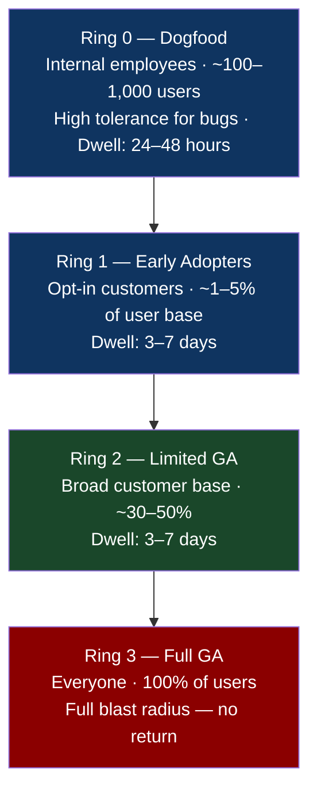
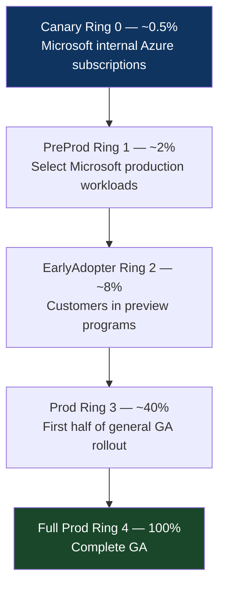

# Chapter 20: The Ring Deployment Pattern
*Part IV: Progressive Delivery Patterns (Safe Rollouts)*

> *"Ring 0 is your engineers. They find bugs.
> Ring 1 is your most forgiving customers. They report bugs.
> Ring 2 is your average customers. They expect it to work.
> Ring 3 is everyone. It works.
> The rings exist because the cost of a bug in Ring 3
> is 100× the cost of a bug in Ring 0."*
> — engineering principle at a large software company

---

## The War Story

In 2022, a major SaaS enterprise platform shipped a critical bug in their mobile iOS app. The bug caused the app to crash on launch when the device locale was set to any Arabic or Hebrew locale (right-to-left text). The bug affected approximately 3% of their global user base.

The bug existed in their QA environment. It existed in their staging environment. It was reported by exactly one internal tester. The report was closed as "cannot reproduce" because the engineer who closed it had an English-locale device and couldn't trigger the condition.

The update shipped to all 4.2 million mobile users simultaneously. Crashing on launch for RTL locales. 3% × 4.2 million = 126,000 users who opened the app and found it non-functional.

The fix took 48 hours (App Store review cycle for the patch). 126,000 users had an unusable app for 48 hours.

The investigation revealed: there were no internal testers with RTL locale devices. There were no dogfood users in the Middle East or Israel. Ring 0 (internal) had zero coverage for RTL locales. Ring 1 (early adopters) had no Middle Eastern users because the early access program was US-only.

The lesson: rings are only as good as their representative coverage. A ring system that doesn't include representative users from every affected demographic provides no protection for those demographics.

This chapter covers ring deployment — what it is, how to implement it, and how to design rings that actually provide the blast radius reduction they promise.

---

## What You'll Learn

- Ring deployment architecture: how rings are defined, promoted, and monitored
- Microsoft's ring model for Windows/Azure as the reference implementation
- Kubernetes + feature flag implementation for segment-based ring routing
- Ring composition: what makes a ring representative vs. a ring that gives you false confidence
- Ring promotion criteria: automated vs. manual gates between rings
- The mobile-specific ring model: phased App Store rollouts + OTA update rings

---

## The Ring Deployment Model

A ring deployment is a concentric deployment model where each ring represents a progressively wider user population. Changes deploy to Ring 0 first. After validation, they promote to Ring 1. Then Ring 2. Finally Ring N (all users).



The key difference from canary deployment: **canary uses random percentage routing** (1% of all requests); **rings use user segment routing** (all requests from a specific user population).

This distinction matters for two reasons:

1. **Representative coverage.** A 1% canary gives you a statistically representative sample of all users. A Ring 0 of 200 internal employees gives you a very non-representative sample of users. The ring is designed for organizational trust, not for statistical validity.

2. **Feedback quality.** Engineers in Ring 0 write bug reports. Random 1% canary users mostly don't. Rings are designed to put informed observers in contact with new code before general users.

---

## Microsoft's Ring Model (Reference Architecture)

Microsoft runs ring deployments for Windows, Office 365, and Azure at a scale that defines the pattern's upper limits. Their ring structure for Azure service updates:



For each ring, Microsoft defines:
- **Dwell time**: minimum time in ring before promotion
- **Health criteria**: specific metrics that must remain stable during dwell
- **Rollback criteria**: automatic or manual rollback triggers
- **Representative criteria**: what user/workload types are in this ring

The Azure Safe Deployment Practices (SDP) specification, which Microsoft has published publicly, requires that every Azure service update pass through all rings with defined dwell times before reaching full production. The SDP is enforced by the Azure release pipeline infrastructure — a deployment that skips a ring fails validation automatically.

---

## Implementation: Kubernetes + LaunchDarkly Rings

For most engineering teams, rings are implemented by combining a deployment mechanism (Kubernetes, feature flags) with a user segmentation strategy:

```yaml
# ring-feature-flag.yaml — LaunchDarkly flag configuration
# Stored as code in the feature flag management repo

name: "new-dashboard-ui"
description: "Redesigned dashboard with improved navigation"

# Ring definitions as targeting rules
targeting_rules:
  # Ring 0: Internal employees
  - clause:
      attribute: email
      operator: endsWith
      values:
        - "@mycompany.com"
    serve: "enabled"

  # Ring 1: Early adopters (users who opted in via account settings)
  - clause:
      attribute: earlyAdopter
      operator: in
      values:
        - true
    serve: "enabled"

  # Ring 2: 30% of remaining users (not internal, not early adopters)
  # Gradually expand this percentage as Ring 1 completes successfully
  - clause:
      attribute: userId
      operator: in
      values: []  # populated by the ring promotion job
    rollout:
      - variation: "enabled"
        weight: 30000  # 30% (weights sum to 100000)
      - variation: "disabled"
        weight: 70000

# Default: disabled for all users not matching above rules
default_variation: "disabled"
```

The ring promotion job updates the 30% percentage as rings progress:

```python
# ring_promoter.py — runs after Ring 1 dwell period passes health checks

import ldclient
import time

def promote_to_ring_2(flag_key: str, target_percentage: int):
    """Expand the Ring 2 rollout percentage."""
    
    ld_client = ldclient.get()
    
    # Gradually increase the percentage over 24 hours to avoid thundering herd
    current = get_current_ring2_percentage(flag_key)
    step = (target_percentage - current) // 8  # 8 steps over 24 hours
    
    for i in range(8):
        new_pct = current + step * (i + 1)
        update_flag_rollout(flag_key, new_pct)
        
        # Evaluate health after each step
        time.sleep(3 * 3600)  # Wait 3 hours between steps
        
        if not evaluate_ring_health(flag_key, new_pct):
            print(f"Health check failed at {new_pct}%. Rolling back Ring 2.")
            update_flag_rollout(flag_key, current)  # Return to pre-Ring-2 state
            alert_team(f"Ring 2 promotion failed at {new_pct}% for {flag_key}")
            return False
    
    print(f"Ring 2 promotion complete at {target_percentage}%")
    return True
```

---

## Ring Composition: Making Rings Representative

The RTL locale bug in the war story existed because Ring 0 and Ring 1 had zero Middle Eastern or Israeli users. The rings were not representative.

A ring is representative when its user composition mirrors the production user composition for the dimensions that matter to the change being deployed.

**Dimensions to consider for ring composition:**

| Dimension | Why it matters |
|---|---|
| Geography | Different regions have different latency, different legal requirements, different usage patterns |
| Device/OS version | Mobile apps with OS-specific code paths must have ring members across all supported OS versions |
| Account tier | Free vs. paid users often have different code paths, different rate limits, different data volumes |
| Language/locale | RTL vs. LTR, date format assumptions, character encoding |
| Usage pattern | Heavy users vs. light users surface different performance characteristics |
| Network conditions | Users on mobile networks vs. high-speed connections reveal different latency behaviors |

For a consumer-facing mobile app, Ring 0 should include at minimum:
- Employees with devices covering all supported OS versions
- Employees with RTL locale settings (if RTL is supported)
- Employees in multiple geographies (or VPN users in different regions)

For a B2B SaaS platform, Ring 0 should include:
- Internal users of each account tier that customers use
- Accounts with the largest data volumes (surface performance issues early)
- Accounts in each supported region

---

## Ring Promotion Criteria

Ring promotions should be gated on both automated health checks and manual review:

```yaml
# ring-promotion-gates.yaml — defines promotion criteria for each ring boundary

ring_promotions:
  ring_0_to_ring_1:
    dwell_hours: 24
    automated_gates:
      - type: error_rate
        threshold: "canary_error_rate <= baseline_error_rate * 1.05"
        window: 4h
      - type: crash_rate  # Mobile-specific
        threshold: "crash_rate < 0.01"
        window: 24h
    manual_gates:
      - reviewer: on-call SRE
        required: false  # Recommended but not blocking
    auto_promote: true  # Promote automatically if all gates pass

  ring_1_to_ring_2:
    dwell_hours: 72
    automated_gates:
      - type: error_rate
        threshold: "canary_error_rate <= baseline_error_rate * 1.02"
        window: 24h
      - type: user_feedback
        threshold: "negative_feedback_rate < 0.5%"
        window: 72h
      - type: support_tickets
        threshold: "new_tickets_about_feature < 5"
        window: 72h
    manual_gates:
      - reviewer: product_manager
        required: true  # PM reviews ring 1 feedback before Ring 2
      - reviewer: engineering_lead
        required: true
    auto_promote: false  # Human approval required for Ring 2

  ring_2_to_ring_3:
    dwell_hours: 168  # 7 days
    automated_gates:
      - type: error_rate
        threshold: "error_rate <= historical_p95"
        window: 7d
      - type: slo_budget_burn
        threshold: "error_budget_burn_rate < 1.5x"  # Not burning budget faster than normal
        window: 7d
    manual_gates:
      - reviewer: vp_engineering
        required: true  # Executive sign-off for full GA
    auto_promote: false
```

---

## Mobile Ring Deployment

Mobile rings are implemented differently because of App Store constraints — you can't route 30% of iOS users to a different binary without going through App Store review. The mobile ring model uses:

**Phased App Store rollouts** for the outer rings:


Apple's phased release can be paused at any percentage if crash rates spike. This is Ring 2 → Ring 3 automation managed by App Store infrastructure rather than your own pipeline.

**OTA (Over-The-Air) updates** for inner rings (React Native, Flutter, Expo):
```javascript
// Expo Updates: control which ring receives which OTA bundle
import * as Updates from 'expo-updates';

// Ring 0: internal employees always get the latest OTA
// Ring 1: early adopters get OTA after 24-hour delay
// Ring 2: general users get OTA after App Store review completes
async function checkForUpdate(user) {
  const channel = getUserUpdateChannel(user);
  // channel = 'internal' | 'early-access' | 'stable'
  
  const update = await Updates.checkForUpdateAsync();
  if (update.isAvailable && shouldApplyForChannel(update, channel)) {
    await Updates.fetchUpdateAsync();
    Updates.reloadAsync();
  }
}
```

---

## The Anti-Patterns

### ❌ Anti-Pattern: Ring 0 = No Users

**What it looks like:** Ring 0 is defined as "our internal team," but nobody on the internal team actually uses the product in their daily work. The dogfood ring exists on paper; in practice it tests nothing.

**Why it happens:** B2B SaaS teams often don't use their own product as customers. They use the internal tooling directly.

**What breaks:** The entire value of Ring 0. If Ring 0 users don't behave like customers, Ring 0 doesn't catch customer-facing bugs.

**The fix:** Require specific product managers, customer success managers, and executives to use the actual product via their own customer accounts. These are the Ring 0 users. Their accounts are the dogfood ring.

---

### ❌ Anti-Pattern: All Rings Are the Same Demographic

**What it looks like:** Ring 0 = US East Coast engineers. Ring 1 = US West Coast early adopters. Ring 2 = more US users. Ring 3 = international users who get the bug that US users never triggered.

**Why it happens:** Rings are built from the users who are easiest to recruit (internal employees, US-based customers with good relationships).

**What breaks:** Geographic and demographic coverage. The RTL locale bug.

**The fix:** Define rings with explicit demographic requirements. Ring 1 must include users from every supported geography, locale, and device configuration.

---

### ❌ Anti-Pattern: Ring Promotion Based on Time Alone

**What it looks like:** "Ring 0 gets it for 24 hours, then we promote regardless of what we see."

**Why it happens:** Time-based promotion is simple to automate.

**What breaks:** The health gate. A memory leak that manifests in 30 hours in Ring 0 promotes to Ring 1 after 24 hours before it's been detected.

**The fix:** Combine time gates with metric gates. Dwell time is the minimum; metric health is the condition.

---

## Field Notes

💀 **Ring 0 with zero representative coverage** → Ring 0 "passed" but Ring 3 has a crash → Audit Ring 0 composition. Does it include users with the device types, locales, and usage patterns of your customer base? If not, Ring 0 provides false confidence.

💀 **No automated ring promotion** → Rings stall indefinitely as engineers forget to promote → Automated promotion (with appropriate health checks) for Ring 0 → Ring 1. Manual approval for Ring 1 → Ring 2 and Ring 2 → Ring 3. Remove the human bottleneck from routine ring progressions.

💀 **Rings without rollback strategy** → A Ring 2 issue requires re-deploying the previous version → Each ring promotion is a feature flag percentage change. Rollback = flag percentage to 0. No redeployment required.

---

## Chapter Summary

Ring deployment adds user segment awareness to progressive delivery. Instead of routing by traffic percentage (canary), rings route by user identity — internal employees, early adopters, limited GA, full GA. The rings serve two functions: blast radius limitation and representative feedback at each stage before wider exposure.

The pattern's value is directly proportional to ring composition quality. A ring system where Ring 0 has zero representative coverage of affected user demographics provides no protection for those users. Building rings that are representative of your user base requires deliberate effort — and is the work that transforms ring deployment from a process checkbox into an actual safety mechanism.

---

## What's Next

Chapter 21 covers the pattern that makes progressive delivery separable from deployment: Feature Flags. A feature flag allows you to ship code to production without activating its behavior — deployed dark, activated at the moment of your choice, for the users of your choice, with instant kill-switch capability that doesn't require a deployment to execute.
