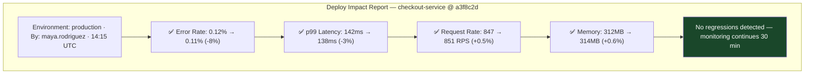
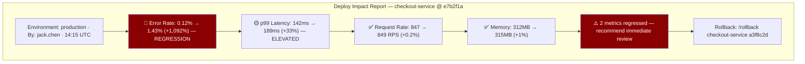

# Chapter 25: The Deployment Observability & Correlation Pattern
*Part V: Deployment Observability & Feedback Loops*

> *"The incident started at 14:32. The deploy happened at 14:15.
> We spent four hours debating whether it was the deploy.
> The deploy was it. We knew by 18:47.
> If we'd had deploy markers in Datadog, we'd have known by 14:35."*
> — postmortem note, e-commerce company, August 2022

---

## The War Story

It's a Tuesday afternoon at Orbital Retail when the on-call fires. HTTP 500 rate on the checkout service is climbing: 0.3% at 14:32, 0.8% at 14:38, 1.4% at 14:45. The SLO alert threshold is 1%.

The SRE on call, Priya Mehta, opens the APM dashboard. Error rate is up. She checks recent changes. There was a deploy at 14:15 — a backend team pushed a change to the cart serialization logic. But the Datadog dashboard shows no annotation, no marker, no indication that anything changed in the environment at 14:15.

Priya pings the on-call for the backend team: "Did you deploy something today?"

The backend on-call checks their Slack deployment channel. Yes, there was a deploy at 14:15. He's not sure what was in it — he joined the on-call rotation last week. He pings the engineer who made the deploy.

That engineer is in a meeting.

At 15:10, the engineer comes out of the meeting. She looks at the deploy. It changed the cart serialization — specifically, it changed how the `total_price` field is formatted when currency has more than two decimal places. Jordanian dinar, Kuwaiti dinar. Two of Orbital's smaller markets.

By 15:25, the hypothesis is confirmed: 1.4% of checkouts are in JOD or KWD. The serialization change broke the price display for those currencies.

Rollback at 15:30. Incident resolved at 15:47. Duration: 1 hour 15 minutes.

The postmortem action item: emit deployment markers to Datadog. Deploy events must be visible as annotations on every metric chart. Priya should have seen the deploy annotation at 14:15 the moment she opened the dashboard and connected it to the error spike in 30 seconds, not 75 minutes.

---

## What You'll Learn

- Deploy events as first-class observability signals: what to emit, where to emit it, and how to make it automatic
- Deployment annotations in Datadog, Honeycomb, Grafana, and New Relic
- Automated anomaly detection: detecting metric regressions within minutes of a deploy completing
- The deployment impact report: a structured post-deploy summary generated automatically
- Correlation without causation: how to surface deploy/metric correlations without false positives

---

## The Deploy Event as an Observability Signal

A deployment event contains the information needed to answer the first question in any production incident: *did something change?*

```python
# deploy_event.py — emit this immediately after every production deployment

from dataclasses import dataclass, asdict
from datetime import datetime
import json, requests, os

@dataclass
class DeployEvent:
    service: str
    version: str          # The image tag or git SHA deployed
    environment: str      # "production", "staging", etc.
    deployed_by: str      # The engineer or CI system
    pipeline_run_id: str  # Link back to the CI run for full context
    deployment_id: str    # Unique ID for this deployment
    deployed_at: datetime
    
    # What changed: links to the diff and changelog
    commit_sha: str
    commit_message: str
    pr_url: str           # Pull request that introduced this change
    diff_url: str         # GitHub compare link: base...head
    
    # Risk classification (useful for alert tuning)
    change_type: str      # "feature", "bugfix", "dependency_update", "config", "rollback"
    risk_level: str       # "low", "medium", "high" — set by the pipeline based on change scope


def emit_to_datadog(event: DeployEvent):
    """Emit deployment event to Datadog as a deployment annotation."""
    
    requests.post(
        "https://api.datadoghq.com/api/v1/events",
        headers={
            "Content-Type": "application/json",
            "DD-API-KEY": os.environ["DD_API_KEY"]
        },
        json={
            "title": f"Deploy: {event.service} → {event.version[:8]}",
            "text": (
                f"%%% \n"
                f"Service: **{event.service}**\n"
                f"Version: `{event.version[:12]}`\n"
                f"Environment: {event.environment}\n"
                f"Deployed by: {event.deployed_by}\n"
                f"Change: [{event.commit_message[:80]}]({event.diff_url})\n"
                f"Pipeline: [Run {event.pipeline_run_id}]({os.environ.get('CI_BASE_URL', '')}/runs/{event.pipeline_run_id})\n"
                f"%%%"
            ),
            # Tags enable filtering: "show only deploys for the payments service"
            # "show only high-risk deploys" — extremely useful during incident response
            "tags": [
                f"service:{event.service}",
                f"env:{event.environment}",
                f"version:{event.version}",
                f"deployed_by:{event.deployed_by}",
                f"change_type:{event.change_type}",
                f"risk_level:{event.risk_level}",
            ],
            "alert_type": "info",
            "source_type_name": "deployment"
        }
    )


def emit_to_honeycomb(event: DeployEvent):
    """Emit deployment event to Honeycomb as a marker."""
    
    requests.post(
        f"https://api.honeycomb.io/1/markers/{os.environ['HONEYCOMB_DATASET']}",
        headers={
            "X-Honeycomb-Team": os.environ["HONEYCOMB_API_KEY"],
            "Content-Type": "application/json"
        },
        json={
            "message": f"Deploy {event.service} {event.version[:8]}",
            "type": "deploy",
            "start_time": int(event.deployed_at.timestamp()),
            # url: clicking the marker in Honeycomb opens this URL
            # Link to the PR or the pipeline run for instant context
            "url": event.pr_url
        }
    )


def emit_to_grafana(event: DeployEvent, grafana_url: str):
    """Emit deployment event to Grafana as an annotation."""
    
    requests.post(
        f"{grafana_url}/api/annotations",
        headers={
            "Authorization": f"Bearer {os.environ['GRAFANA_API_KEY']}",
            "Content-Type": "application/json"
        },
        json={
            "time": int(event.deployed_at.timestamp() * 1000),  # milliseconds
            "text": (
                f"<b>Deploy: {event.service}</b><br>"
                f"Version: {event.version[:12]}<br>"
                f"By: {event.deployed_by}<br>"
                f"<a href='{event.diff_url}'>View diff</a>"
            ),
            "tags": ["deployment", event.service, event.environment]
        }
    )
```

### Automatic Emission from the Deployment Pipeline

```yaml
# .github/workflows/deploy.yml
# The deploy event emission is the last step of every deployment job.
# It runs regardless of deployment outcome (success or failure).
jobs:
  deploy:
    runs-on: ubuntu-22.04
    steps:
      - name: Deploy
        id: deploy
        run: ./scripts/deploy.sh ${{ inputs.environment }} ${{ github.sha }}

      - name: Emit deployment event
        # always() ensures this runs even if the deploy step fails
        # A failed deployment is also worth recording in observability
        if: always()
        run: |
          python ci/emit_deploy_event.py \
            --service "${{ env.SERVICE_NAME }}" \
            --version "${{ github.sha }}" \
            --environment "${{ inputs.environment }}" \
            --deployed-by "${{ github.actor }}" \
            --pipeline-run-id "${{ github.run_id }}" \
            --commit-sha "${{ github.sha }}" \
            --commit-message "${{ github.event.head_commit.message }}" \
            --pr-url "${{ github.event.pull_request.html_url }}" \
            --diff-url "https://github.com/${{ github.repository }}/compare/${{ github.event.before }}...${{ github.sha }}" \
            --change-type "${{ inputs.change_type || 'feature' }}" \
            --status "${{ steps.deploy.outcome }}"  # "success" or "failure"
```

---

## Automated Anomaly Detection Post-Deploy

Emitting deploy events tells you *when* something changed. Automated anomaly detection tells you *whether* the change caused a metric regression. The combination answers the most common incident response question automatically.

```python
# post_deploy_monitor.py
# Runs automatically 5 minutes after every production deployment.
# Compares current metrics to the pre-deploy baseline and alerts on regressions.

import time, requests, json
from dataclasses import dataclass
from typing import Optional

@dataclass
class MetricComparison:
    metric_name: str
    pre_deploy_value: float   # Average over 30 minutes before deploy
    post_deploy_value: float  # Average over 5 minutes after deploy
    change_pct: float
    is_regression: bool
    severity: str              # "ok", "warning", "critical"


def compare_metric_pre_post_deploy(
    prometheus_url: str,
    metric_query: str,
    deploy_timestamp: float,
    pre_window_minutes: int = 30,
    post_window_minutes: int = 5,
    regression_threshold_pct: float = 20.0
) -> MetricComparison:
    """Compare a metric before and after a deployment."""
    
    # Pre-deploy window: 30 minutes before the deploy
    pre_start = deploy_timestamp - pre_window_minutes * 60
    pre_end = deploy_timestamp
    
    # Post-deploy window: 5 minutes after the deploy
    post_start = deploy_timestamp
    post_end = deploy_timestamp + post_window_minutes * 60
    
    def query_avg(start, end):
        resp = requests.get(
            f"{prometheus_url}/api/v1/query_range",
            params={
                "query": f"avg_over_time(({metric_query})[{int(end-start)}s:])",
                "start": start,
                "end": end,
                "step": "60s"
            }
        )
        results = resp.json()["data"]["result"]
        if not results:
            return None
        values = [float(v[1]) for v in results[0]["values"] if v[1] != "NaN"]
        return sum(values) / len(values) if values else None
    
    pre_value = query_avg(pre_start, pre_end)
    post_value = query_avg(post_start, post_end)
    
    if pre_value is None or post_value is None:
        return None
    
    change_pct = ((post_value - pre_value) / pre_value) * 100 if pre_value != 0 else 0
    
    # Regression: post-deploy metric is significantly worse than pre-deploy
    is_regression = abs(change_pct) > regression_threshold_pct
    
    if change_pct > 50:
        severity = "critical"
    elif change_pct > 20:
        severity = "warning"
    else:
        severity = "ok"
    
    return MetricComparison(
        metric_name=metric_query[:50],
        pre_deploy_value=pre_value,
        post_deploy_value=post_value,
        change_pct=change_pct,
        is_regression=is_regression,
        severity=severity
    )


def run_post_deploy_analysis(
    service: str,
    deployment_id: str,
    deploy_timestamp: float,
    prometheus_url: str,
    slack_webhook: str
) -> dict:
    """Run full post-deploy metric analysis and generate the impact report."""
    
    # Standard metrics to check after every deployment
    metrics_to_check = [
        (f'sum(rate(http_requests_total{{service="{service}",status_code=~"5.."}}[5m])) / sum(rate(http_requests_total{{service="{service}"}}[5m])) * 100',
         "Error Rate %", True),  # Higher = worse
        
        (f'histogram_quantile(0.99, rate(http_request_duration_seconds_bucket{{service="{service}"}}[5m])) * 1000',
         "p99 Latency (ms)", True),  # Higher = worse
        
        (f'sum(rate(http_requests_total{{service="{service}"}}[5m]))',
         "Request Rate (RPS)", False),  # Lower could indicate upstream problem
        
        (f'container_memory_working_set_bytes{{container="{service}"}} / 1048576',
         "Memory Usage (MB)", True),   # Higher = potential memory leak
    ]
    
    # Wait for post-deploy window to accumulate data
    # (This function is called 5 minutes after deploy completes)
    
    regressions = []
    all_comparisons = []
    
    for query, name, higher_is_worse in metrics_to_check:
        comparison = compare_metric_pre_post_deploy(
            prometheus_url=prometheus_url,
            metric_query=query,
            deploy_timestamp=deploy_timestamp
        )
        if comparison:
            all_comparisons.append((name, comparison))
            if comparison.is_regression and (higher_is_worse and comparison.change_pct > 0):
                regressions.append((name, comparison))
    
    # Generate and send the impact report
    report = generate_impact_report(service, deployment_id, all_comparisons, regressions)
    send_to_slack(slack_webhook, report)
    
    return {"regressions": len(regressions), "comparisons": len(all_comparisons)}
```

---

## The Deployment Impact Report

An automatically generated impact report, sent to the team's channel within 10 minutes of every production deployment, closes the observability loop. Instead of waiting for alerts to fire (which means waiting for thresholds to be crossed), the team sees the metric delta immediately:



Or, when a regression is detected:



This is the report that Priya Mehta needed at 14:15. She would have seen the error rate regression at 14:20 — five minutes after the deploy completed, not 75 minutes later.

---

## Correlation Without False Positives

Automatic deploy-metric correlation must distinguish between:
- Metric changes caused by the deployment
- Metric changes caused by upstream dependencies (database slowdown, external API degradation)
- Metric changes caused by traffic patterns (normal peak load)

The key: always compare the deployed service's metrics against a reference group (other services that weren't deployed). If error rate went up for the deployed service AND for three unrelated services simultaneously, it's external degradation, not the deployment.

```python
def is_deployment_correlated_regression(
    service: str,
    deploy_timestamp: float,
    prometheus_url: str,
    reference_services: list[str]
) -> tuple[bool, str]:
    """
    Determine if a metric regression is correlated with the deployment
    or is more likely an external event.
    
    Returns: (is_deploy_correlated, explanation)
    """
    
    # Check if reference services also show regression at the same time
    reference_regressions = 0
    for ref_service in reference_services:
        ref_comparison = compare_metric_pre_post_deploy(
            prometheus_url=prometheus_url,
            metric_query=f'sum(rate(http_requests_total{{service="{ref_service}",status_code=~"5.."}}[5m])) / sum(rate(http_requests_total{{service="{ref_service}"}}[5m])) * 100',
            deploy_timestamp=deploy_timestamp
        )
        if ref_comparison and ref_comparison.change_pct > 20:
            reference_regressions += 1
    
    ref_regression_rate = reference_regressions / len(reference_services)
    
    if ref_regression_rate > 0.5:
        # More than half of reference services also show regression
        # → likely external degradation, not deployment-caused
        return False, (
            f"Metric regression detected but {reference_regressions}/{len(reference_services)} "
            f"reference services also show regression. Likely external degradation, not deployment-caused."
        )
    
    # Regression in deployed service, not in reference services
    return True, (
        f"Metric regression isolated to {service}. "
        f"Reference services show no regression ({reference_regressions}/{len(reference_services)})."
        f"High probability of deployment correlation."
    )
```

---

## The Anti-Patterns

### ❌ Anti-Pattern: Deploy Events Only in Slack

**What it looks like:** Deployment notifications go to a Slack channel. Datadog, Honeycomb, and Grafana dashboards have no deploy markers. During an incident, someone has to search Slack for "deployed" to find what changed.

**Why it happens:** Slack integration is easier than APM integration.

**What breaks:** Incident response time. The correlation between the deploy and the metric change requires a human to manually connect two systems.

**The fix:** Emit deploy events directly to your observability platform as annotations/markers. The correlation should be visible in the same dashboard where you see the metric spike.

---

### ❌ Anti-Pattern: No Post-Deploy Monitoring Window

**What it looks like:** The deployment pipeline declares success when the pods are Running. No post-deploy metric evaluation. Engineers move on. Problems surface in user reports 30 minutes later.

**Why it happens:** The deployment pipeline ends when the deployment ends. Monitoring is a separate system.

**What breaks:** MTTR. The time from deployment completion to problem detection is the gap between "deploy complete" and "user reports broken." With automated post-deploy monitoring, that gap is 5 minutes.

**The fix:** A post-deploy monitoring step (either automated in the pipeline or triggered by the deploy event) that evaluates key metrics for 10–30 minutes after every production deployment.

---

### ❌ Anti-Pattern: Impact Reports That Cry Wolf

**What it looks like:** The impact report flags every change >5% as a "regression." Normal traffic variation of ±8% triggers regression alerts on 40% of deployments. Engineers learn to ignore the reports.

**Why it happens:** Threshold set too tight without understanding baseline variance.

**What breaks:** Trust in the automated analysis. The impact report becomes noise.

**The fix:** Calibrate thresholds to statistical significance against historical baseline variance. A 10% change on a metric with 15% natural variance is not a signal. A 50% change on the same metric is. Use p-values or Bayesian change point detection rather than simple percentage thresholds.

---

## Field Notes

💀 **No deployment markers in APM** → "Is it the deploy?" takes 90 minutes to answer → Emit deploy events to every observability platform you use. One API call per platform. Takes 30 minutes to implement. Saves hours per incident.

💀 **Impact report sent to a channel nobody monitors** → Reports generate, nobody reads them, impact is invisible → Route impact reports to the same channel where deployment notifications go. Make the report the immediate follow-up to "deploy complete."

💀 **Comparing deployed service to itself without reference group** → External degradation misattributed to the deployment → Always check reference services in the same time window. If other services also degraded, the cause is upstream.

---

## Chapter Summary

Deployment observability transforms incident response from archaeology to correlation. When every deployment emits a structured event to the observability platform, "did the deploy cause this?" has a 30-second answer (see the deploy annotation on the metric chart) instead of a 90-minute answer (search Slack, find the right engineer, trace the change).

The deploy event is the minimum. The automated post-deploy impact report — generated 5 minutes after every deployment, comparing pre/post metrics across error rate, latency, and resource usage — is what closes the feedback loop automatically. The team doesn't need to remember to check; the system checks and reports. When a regression is detected, the report surfaces it within minutes and includes the rollback command.

The correlation engine that distinguishes deployment-caused regressions from external degradation is what prevents false positives from eroding trust in the system. Calibrate it correctly, and the impact report becomes the first thing an SRE checks during an incident — not Slack, not the deployment log, not a gut feeling.

---

## What's Next

Chapter 26 closes Part V with the hardest feedback loop to build: converting production incidents into pipeline changes. The incident → postmortem → pipeline improvement cycle is where the most valuable signal lives — and where it most often gets lost. Every SEV-1 caused by a deployment contains information about what the pipeline should have caught. Encoding that information as a concrete pipeline change is the discipline this chapter covers.

[→ Next: Chapter 26 — The On-Call & Incident-Driven Release Feedback Pattern](./chapter-26-oncall-incident-feedback.md)

---
*[← Previous: Chapter 24 — The DORA Metrics Pipeline Feedback Pattern](./chapter-24-dora-metrics-feedback.md) |
[→ Next: Chapter 26 — The On-Call & Incident-Driven Release Feedback Pattern](./chapter-26-oncall-incident-feedback.md)*
