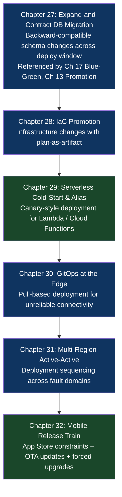

# Part VI: Cloud, Data & Edge Specialized Delivery

## What This Part Is About

The patterns in Parts II through V describe general-purpose CI/CD — the core mechanics that apply to most software delivery contexts. This part addresses the domains where general-purpose patterns break down: databases that cannot tolerate downtime during schema changes, infrastructure that must be reconciled as code rather than applied ad-hoc, serverless functions with cold-start constraints, edge devices in bandwidth-constrained environments, applications that must be active in multiple regions simultaneously, and mobile applications locked behind app store review cycles.

Each of these domains has deployment constraints that don't appear in a standard web service deployment:

A **database migration** cannot simply be rolled back by redeploying the previous binary — the schema is already changed, and the previous binary may not be compatible with the new schema. The deployment pipeline must account for this irreversibility.

**Infrastructure-as-Code** deployments can destroy resources as easily as they create them. A Terraform plan that accidentally deletes a production database looks identical to a Terraform plan that adds a new environment until someone reads the diff carefully. The pipeline must enforce plan review before apply.

**Serverless functions** have a cold-start problem: the first invocation after a period of inactivity incurs initialization latency that can be 10-100× the normal execution time. Progressive delivery for serverless requires alias-based traffic shifting and provisioned concurrency strategies that don't exist in container deployments.

**Edge devices** may be offline for hours, have kilobytes of bandwidth, and cannot be rolled back remotely in the same way a Kubernetes pod can. The deployment pipeline must assume unreliable connectivity and build in delta updates, rollback capability, and offline-safe state management.

**Multi-region active-active** systems require coordinated deployment sequencing across regions with cross-region data consistency constraints. Deploying to region A while region A's database is replicating to region B creates windows of inconsistency that can cause data corruption.

**Mobile applications** live in app stores with days-long review cycles that make the "deploy and roll back in 5 minutes" model impossible. The pipeline must account for phased rollouts, OTA update channels, feature flags as the primary rollback mechanism, and forced upgrade flows for critical security patches.

## Chapter Map

## Chapters in This Part

| Chapter | Title | Core Question Answered |
|---|---|---|
| [27](./chapter-27-expand-contract-db-migration.md) | The Expand-and-Contract Database Migration Pattern | How do you change a database schema without taking down the application? |
| [28](./chapter-28-iac-promotion.md) | The Infrastructure-as-Code (IaC) Promotion Pattern | How do you deploy infrastructure changes with the same safety as application changes? |
| [29](./chapter-29-serverless-cold-start-alias.md) | The Serverless Cold-Start & Alias Pattern | How do you do canary-style deployment for serverless functions? |
| [30](./chapter-30-gitops-at-the-edge.md) | The GitOps-at-the-Edge Pattern | How do you deploy to thousands of edge devices that may be offline? |
| [31](./chapter-31-multi-region-active-active.md) | The Cloud-Native Multi-Region Active-Active Pattern | How do you deploy across multiple regions without split-brain or data corruption? |
| [32](./chapter-32-mobile-release-train.md) | The Mobile Release Train Pattern | How do you ship and roll back mobile apps when the App Store review takes days? |
