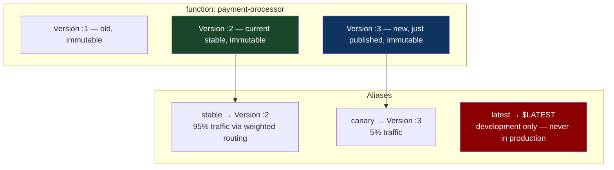

# Chapter 29: The Serverless Cold-Start & Alias Pattern
*Part VI: Cloud, Data & Edge Specialized Delivery*

> *"We had 45ms p99 latency on our Lambda. We deployed a new version.
> The p99 went to 3045ms. We assumed the deployment was broken.
> It wasn't broken. It was just cold. Three seconds of cold.
> Every new deployment resets the warm state. We had never tested this."*
> — backend engineer describing their first Lambda canary incident

---

## The War Story

The API team at Solaris Commerce migrates their product recommendations Lambda from Python 3.9 to Python 3.12. The new runtime is faster — benchmarks show 23% throughput improvement. The deployment is simple: update the Lambda function code, point the alias to the new version.

They deploy at 2 PM on a Tuesday. Within 90 seconds, the p99 latency alert fires: Lambda p99 exceeds 2,000ms. The SLO threshold is 200ms.

The engineer checks CloudWatch. Thousands of `Init Duration` log entries: each new Lambda execution container is spending 2.8 seconds initializing before the first invocation. The new Python 3.12 version imported a machine learning model from S3 during initialization — a pattern inherited from the old version. The ML model file is 340MB. Python 3.12 changed how the S3 client initializes, resulting in an extra connection setup step that adds 2.3 seconds to the first invocation per container.

At the old traffic levels, the warm Lambda containers were serving most requests. The deployment reset all container warming — every container was now cold, and the 2.8-second initialization was affecting 100% of invocations for the first 5–10 minutes.

They roll back in 3 minutes. But the rollback itself takes another 5 minutes of elevated cold-start latency as the rolled-back version's containers warm up. Total high-latency window: 8 minutes.

The fix: alias-based canary deployment that shifts 5% of traffic to the new version first, waits for it to warm up and for the cold-start behavior to be observable before advancing.

---

## What You'll Learn

- Lambda versioning and alias architecture: how versions and aliases work together for safe deployments
- Alias-based canary deployments: shifting traffic between Lambda versions using weighted aliases
- Provisioned concurrency: pre-warming Lambda instances to eliminate cold start
- Lambda SnapStart (Java) and equivalent pre-initialization strategies
- SAM, Serverless Framework, and CDK pipelines for managing Lambda deployments
- Lambda layers for shared dependency management across functions

---

## Lambda Versions and Aliases

Every Lambda deployment publishes a new immutable version. Versions are numbered (`:1`, `:2`, `:3`) and cannot be modified after publication. This is Lambda's equivalent of immutable container image tags.

An **alias** is a pointer to a specific version. Aliases can be updated to point at a new version — this is how a Lambda "deployment" works. Aliases support weighted routing: 90% to version 5, 10% to version 6.



---

## Implementing Alias-Based Canary Deployments

```bash
# deploy_lambda_canary.sh — canary-style Lambda deployment

FUNCTION_NAME="payment-processor"
S3_BUCKET="mycompany-lambda-artifacts"
NEW_CODE_S3_KEY="payment-processor/payment-processor-${GIT_SHA}.zip"

# Step 1: Publish a new version
# Publishing creates an immutable snapshot of the current function code
NEW_VERSION=$(aws lambda update-function-code \
  --function-name ${FUNCTION_NAME} \
  --s3-bucket ${S3_BUCKET} \
  --s3-key ${NEW_CODE_S3_KEY} \
  --publish \
  --query 'Version' \
  --output text)

echo "Published Lambda version: ${NEW_VERSION}"

# Wait for the new version to be active
aws lambda wait function-updated \
  --function-name "${FUNCTION_NAME}:${NEW_VERSION}"

# Step 2: Start canary — route 5% of traffic to the new version
CURRENT_VERSION=$(aws lambda get-alias \
  --function-name ${FUNCTION_NAME} \
  --name stable \
  --query 'FunctionVersion' \
  --output text)

aws lambda update-alias \
  --function-name ${FUNCTION_NAME} \
  --name stable \
  --function-version ${CURRENT_VERSION} \
  --routing-config AdditionalVersionWeights={${NEW_VERSION}=0.05}
  # Result: 95% to current version, 5% to new version

echo "Canary started: 5% traffic to version ${NEW_VERSION}"

# Step 3: Monitor for 10 minutes
echo "Monitoring canary for 10 minutes..."
sleep 300  # First check at 5 minutes

# Check error rate and p99 latency for the canary version
CANARY_ERROR_RATE=$(aws cloudwatch get-metric-statistics \
  --namespace AWS/Lambda \
  --metric-name Errors \
  --dimensions Name=FunctionName,Value=${FUNCTION_NAME} \
               Name=Resource,Value="${FUNCTION_NAME}:${NEW_VERSION}" \
  --start-time $(date -u -d '5 minutes ago' +%Y-%m-%dT%H:%M:%SZ) \
  --end-time $(date -u +%Y-%m-%dT%H:%M:%SZ) \
  --period 300 \
  --statistics Sum \
  --query 'Datapoints[0].Sum' \
  --output text)

CANARY_P99=$(aws cloudwatch get-metric-statistics \
  --namespace AWS/Lambda \
  --metric-name Duration \
  --dimensions Name=FunctionName,Value=${FUNCTION_NAME} \
               Name=Resource,Value="${FUNCTION_NAME}:${NEW_VERSION}" \
  --start-time $(date -u -d '5 minutes ago' +%Y-%m-%dT%H:%M:%SZ) \
  --end-time $(date -u +%Y-%m-%dT%H:%M:%SZ) \
  --period 300 \
  --extended-statistics p99 \
  --query 'Datapoints[0].ExtendedStatistics.p99' \
  --output text)

echo "Canary metrics — Errors: ${CANARY_ERROR_RATE}, p99: ${CANARY_P99}ms"

# Step 4: Rollback if metrics are bad
if [[ $(echo "${CANARY_P99} > 500" | bc) -eq 1 ]]; then
  echo "p99 latency exceeds 500ms on canary — rolling back"
  aws lambda update-alias \
    --function-name ${FUNCTION_NAME} \
    --name stable \
    --function-version ${CURRENT_VERSION} \
    --routing-config AdditionalVersionWeights={}  # Remove canary routing
  echo "Rollback complete. All traffic back to version ${CURRENT_VERSION}"
  exit 1
fi

# Step 5: Promote canary to 100%
aws lambda update-alias \
  --function-name ${FUNCTION_NAME} \
  --name stable \
  --function-version ${NEW_VERSION} \
  --routing-config AdditionalVersionWeights={}  # Remove weighted routing
  # All traffic now goes to new version

echo "Canary promoted to 100%. Version ${NEW_VERSION} is now stable."
```

---

## Provisioned Concurrency: Eliminating Cold Start

Provisioned concurrency pre-initializes Lambda execution environments and keeps them warm. Provisioned instances respond immediately without the initialization penalty.

```hcl
# terraform: Lambda with provisioned concurrency
resource "aws_lambda_function" "payment_processor" {
  function_name = "payment-processor"
  role          = aws_iam_role.lambda_execution.arn
  handler       = "handler.process"
  runtime       = "python3.12"
  
  s3_bucket = "mycompany-lambda-artifacts"
  s3_key    = "payment-processor/${var.version}.zip"
  
  # publish = true is required for provisioned concurrency
  publish = true
  
  # Memory size affects cold-start time: more memory = faster initialization
  # The ML model loading: 512MB was slower than 1024MB
  # Lambda allocates CPU proportional to memory — 1024MB = faster import
  memory_size = 1024
  
  timeout = 30
}

resource "aws_lambda_provisioned_concurrency_config" "payment_processor" {
  function_name                  = aws_lambda_function.payment_processor.function_name
  qualifier                      = aws_lambda_alias.stable.name
  
  # Keep 10 Lambda instances pre-initialized and ready to serve
  # These 10 instances will NEVER have a cold start
  # Traffic above 10 concurrent requests may hit new (cold) instances
  provisioned_concurrent_executions = 10
}

# Cost of provisioned concurrency:
# 10 instances × $0.000004646/GB-second × 1024MB × 3600 seconds/hour
# = $0.171/hour = ~$124/month for 10 pre-warmed instances
# Compare to: cold-start latency penalty × number of cold starts × business impact
```

### Scheduled Provisioned Concurrency

For functions with predictable traffic patterns (business hours), scale provisioned concurrency on a schedule:

```bash
# Scale up provisioned concurrency at 8 AM UTC (start of business)
aws application-autoscaling register-scalable-target \
  --service-namespace lambda \
  --resource-id "function:payment-processor:stable" \
  --scalable-dimension lambda:function:ProvisionedConcurrency \
  --min-capacity 2 \
  --max-capacity 20

# Scheduled action: increase to 15 at 8 AM UTC on weekdays
aws application-autoscaling put-scheduled-action \
  --service-namespace lambda \
  --resource-id "function:payment-processor:stable" \
  --scalable-dimension lambda:function:ProvisionedConcurrency \
  --scheduled-action-name scale-up-business-hours \
  --schedule "cron(0 8 ? * MON-FRI *)" \
  --scalable-target-action MinCapacity=15,MaxCapacity=15

# Scheduled action: reduce to 2 at 8 PM UTC
aws application-autoscaling put-scheduled-action \
  --service-namespace lambda \
  --resource-id "function:payment-processor:stable" \
  --scalable-dimension lambda:function:ProvisionedConcurrency \
  --scheduled-action-name scale-down-after-hours \
  --schedule "cron(0 20 ? * MON-FRI *)" \
  --scalable-target-action MinCapacity=2,MaxCapacity=2
```

---

## Lambda SnapStart (Java)

SnapStart is AWS's solution for eliminating Java Lambda cold starts. It takes a snapshot of the execution environment after initialization, then restores the snapshot on subsequent invocations instead of re-initializing from scratch.

```java
// Lambda function with SnapStart annotations
import com.amazonaws.services.lambda.runtime.Context;
import com.amazonaws.services.lambda.runtime.RequestHandler;

// The @SnapStart annotation is declared in the function configuration,
// not in the code — but the code must be written to support snapshotting

public class PaymentProcessor implements RequestHandler<PaymentRequest, PaymentResponse> {
    
    private static final PaymentModel MODEL;
    
    static {
        // This static initialization block runs ONCE during snapshot creation.
        // The initialized state (MODEL loaded) is saved to the snapshot.
        // All subsequent invocations restore from the snapshot — no re-initialization.
        MODEL = PaymentModel.loadFromS3("payment-model-v3.bin");
        // Loading 340MB model: takes 2.8s on cold start
        // With SnapStart: this runs once during publish, never again per invocation
    }
    
    @Override
    public PaymentResponse handleRequest(PaymentRequest request, Context context) {
        // This runs on every invocation — model is already loaded
        return MODEL.score(request);
    }
    
    // SnapStart restore hook: code that must run on EVERY restore (not just init)
    @RegisterHook(hookType = RuntimeHookType.BEFORE_RESTORE)
    public void beforeRestore(BeforeSnapshotContext context) {
        // Example: re-establish database connection (connections don't survive snapshots)
        DatabaseConnection.refresh();
        // Re-seed random number generators (snapshot state is shared — don't share random seeds)
        SecureRandom.reseed();
    }
}
```

SnapStart reduces Java Lambda cold starts from 4–10 seconds (for large initialized workloads) to under 1 second. Available for Java 11+ runtimes.

---

## SAM Pipeline for Serverless Deployments

AWS SAM (Serverless Application Model) provides a pipeline template for blue-green Lambda deployments with automatic rollback on CloudWatch alarms:

```yaml
# template.yaml — SAM template with canary deployment configuration
AWSTemplateFormatVersion: '2010-09-09'
Transform: AWS::Serverless-2016-10-31

Resources:
  PaymentProcessorFunction:
    Type: AWS::Serverless::Function
    Properties:
      Handler: handler.process
      Runtime: python3.12
      MemorySize: 1024
      Timeout: 30
      
      # AutoPublishAlias: SAM automatically publishes a new version
      # and creates/updates the alias on every deployment
      AutoPublishAlias: stable
      
      # DeploymentPreference: controls the traffic shifting behavior
      DeploymentPreference:
        Type: Canary10Percent5Minutes
        # Built-in strategies:
        # Canary10Percent5Minutes: 10% for 5 min, then 100%
        # Canary10Percent10Minutes: 10% for 10 min, then 100%
        # Canary10Percent15Minutes: ...
        # Linear10PercentEvery1Minute: 10% more traffic every 1 minute
        # AllAtOnce: immediate 100% (use only for non-production)
        
        # Alarms: if any of these alarms fire during the canary period,
        # CodeDeploy automatically rolls back to the previous version
        Alarms:
          - !Ref PaymentProcessorErrorRateAlarm
          - !Ref PaymentProcessorHighLatencyAlarm
        
        # Hooks: Lambda functions to run before/after traffic shifting
        Hooks:
          PreTraffic: !Ref PreTrafficHookFunction
          PostTraffic: !Ref PostTrafficHookFunction

  PaymentProcessorErrorRateAlarm:
    Type: AWS::CloudWatch::Alarm
    Properties:
      AlarmDescription: Lambda error rate too high during canary
      MetricName: Errors
      Namespace: AWS/Lambda
      Dimensions:
        - Name: FunctionName
          Value: !Ref PaymentProcessorFunction
        - Name: Resource
          Value: !Sub "${PaymentProcessorFunction}:stable"
      Statistic: Sum
      Period: 60
      EvaluationPeriods: 2
      Threshold: 5  # More than 5 errors in 2 minutes → rollback
      ComparisonOperator: GreaterThanThreshold
      TreatMissingData: notBreaching
```

---

## When Lambda Cold Start Is Not the Problem

**The controversial take:** Provisioned concurrency solves cold start, but cold start is often not the real bottleneck. In many cases:

- High p99 latency is caused by downstream dependencies (database, external APIs) being slow, not by Lambda initialization
- Cold start only affects the first invocation per container — for high-traffic functions, most invocations hit warm containers
- Provisioned concurrency costs money (roughly $124/month per 10 instances at 1024MB) and eliminates a problem that may only affect 0.1% of invocations

Measure before you optimize. Query CloudWatch for `Init Duration` vs. `Duration` across your Lambda invocations. If `Init Duration` appears in less than 1% of invocations, your cold start problem is statistical noise, not a systematic issue.

---

## The Anti-Patterns

### ❌ Anti-Pattern: Deploying to `$LATEST` in Production

**What it looks like:** Lambda code updated, `$LATEST` is used as the production invocation target. No versioning, no aliasing.

**What breaks:** Rollback requires re-uploading the previous code. No traffic splitting. No canary. Every deployment is all-or-nothing.

**The fix:** Always `publish = true` and use aliases. `$LATEST` is for development environments only.

---

### ❌ Anti-Pattern: Provisioned Concurrency on Every Lambda

**What it looks like:** Provisioned concurrency applied to all Lambda functions because "we don't want cold starts." Even infrequently invoked batch functions have provisioned concurrency.

**What breaks:** Budget. Provisioned concurrency charges for pre-warmed instances whether they're used or not. A batch function invoked once per hour doesn't need pre-warmed instances.

**The fix:** Apply provisioned concurrency only to latency-sensitive, user-facing functions where cold start directly impacts user experience. Batch processing functions can tolerate cold starts.

---

### ❌ Anti-Pattern: Ignoring Cold Start During Deployment

**What it looks like:** New Lambda version deployed at 100% without accounting for the cold-start wave. Every container is new. The first 5 minutes of production traffic hits 100% cold containers. p99 spikes.

**The fix:** Alias-based canary. 5% traffic to the new version first. The new version's containers warm up serving 5% of requests. After 10 minutes, advance to 100% — the containers are warmed and the cold-start wave is contained to 5% of requests.

---

## Field Notes

💀 **`$LATEST` as the production alias** → Rollback requires code re-upload, no canary capability → Always publish versions, always use aliases. `$LATEST` is not a deployment target.

💀 **340MB ML model loaded in Lambda init** → 2.8-second cold start on every new container → Move heavy initialization to SnapStart (Java), lazy-load from EFS (mount the model as a file), or use Lambda layers for pre-cached dependencies. Measure init duration before accepting 2-second p99.

💀 **Provisioned concurrency not released after deployment** → Old version still has provisioned concurrency allocated, costs double → After alias update, remove provisioned concurrency from the old version. Automate this in the deployment script.

---

## Chapter Summary

Lambda deployments without alias management are binary: the new code either works or it doesn't, and you find out when 100% of traffic hits it. Alias-based canary deployment gives Lambda the same progressive delivery capabilities that container-based services have. Provisioned concurrency addresses the cold-start problem for latency-sensitive functions — but at a cost that must be justified by measuring actual cold-start frequency rather than assumed.

---

## What's Next

Chapter 30 moves to the opposite end of the compute spectrum: edge devices with constrained bandwidth, intermittent connectivity, and no ability to accept a 3-second cold start because they're running point-of-sale systems in retail stores. GitOps at the edge adapts the pull-based deployment model for devices that may be offline for hours.

[→ Next: Chapter 30 — The GitOps-at-the-Edge Pattern](./chapter-30-gitops-at-the-edge.md)

---
*[← Previous: Chapter 28 — The IaC Promotion Pattern](./chapter-28-iac-promotion.md) |
[→ Next: Chapter 30 — The GitOps-at-the-Edge Pattern](./chapter-30-gitops-at-the-edge.md)*
