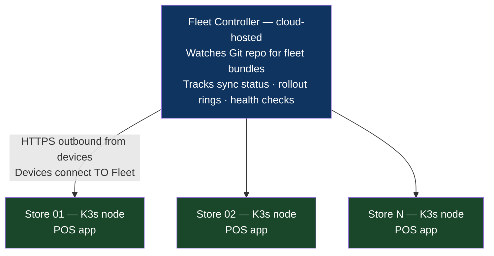

# Chapter 30: The GitOps-at-the-Edge Pattern
*Part VI: Cloud, Data & Edge Specialized Delivery*

> *"We pushed a bad update to 50 stores manually.
> They were down for 4 hours each.
> We couldn't roll back remotely because we didn't have a rollback mechanism.
> We sent field technicians. Fifty stores. Fifty technicians.
> Some of them drove two hours each way.
> After that we built a proper edge deployment pipeline."*
> — VP of Engineering at a retail technology company, 2021

---

## The War Story

Nexus Retail deploys point-of-sale (POS) software to 500 store locations. Each store runs a Linux-based compute node that handles checkout, inventory, and customer loyalty. The nodes connect to the internet over store WiFi — reliable most of the time, but with occasional outages during inventory restocking or high-traffic periods.

The standard deployment procedure: SSH into each node, `apt upgrade nexus-pos`, restart the service, verify. Automated via a Bash script with a `for` loop over the list of store IPs. No staging ring. No health check before moving to the next store. No rollback.

In November, a deployment pushes a misconfigured dependency that causes the loyalty module to crash on startup. The Bash loop runs through 50 stores before someone notices the loyalty module is down (it's not on the critical path for checkout, so it doesn't immediately trigger an alert). Those 50 stores have a broken loyalty module. The remaining 450 stores are blocked while the problem is investigated.

Rolling back the 50 affected stores requires SSHing into each one individually and running `apt install nexus-pos=2.3.1`. It takes two hours with three engineers. Fourteen stores go unreachable during the rollback because their internet is intermittently unavailable. Those 14 require field technician visits.

The total cost: $140,000 in field technician fees, 200+ hours of engineering time, customer-facing loyalty outage during the pre-holiday period.

The fix: GitOps-based edge deployment. Stores pull their desired state from a Git repository. Ring deployment: 10% of stores first, 24-hour health observation, then remaining. Automatic rollback if the health check fails. Remote rollback via config repo commit, not SSH.

---

## What You'll Learn

- The edge deployment challenge: constrained bandwidth, intermittent connectivity, heterogeneous hardware
- Rancher Fleet for multi-cluster GitOps across edge nodes
- KubeEdge and K3s: Kubernetes at the edge
- Delta updates and image layering for bandwidth-constrained environments
- Offline-first sync: handling devices that are unreachable during a deployment
- Ring deployment for edge: canary rings at the store/device level

---

## The Edge Deployment Challenge

Edge deployments face constraints that don't exist in cloud Kubernetes deployments:

| Constraint | Cloud Kubernetes | Edge Device |
|---|---|---|
| Bandwidth | Gigabit+ | 10–100 Mbps, often shared with store operations |
| Connectivity | Always-on | Intermittent (store WiFi, cellular fallback) |
| Hardware | Uniform (EC2 instance type) | Heterogeneous (different CPU, RAM, storage) |
| Physical access | Data center, remote API | May require field technician |
| Update window | Any time | Often restricted to off-hours |
| Rollback speed | Seconds (Kubernetes) | Minutes to hours (depends on connectivity) |
| Scale | Hundreds of pods | Hundreds to thousands of devices |

These constraints require a deployment model that:
1. **Doesn't require persistent connectivity** — devices apply updates when online, queue them when offline
2. **Is bandwidth-efficient** — delta updates, layer caching, compressed manifests
3. **Self-heals** — if an update fails, the device attempts to roll back to a known-good state without requiring external intervention
4. **Provides central visibility** — operators can see sync status for all devices from a central dashboard

---

## Architecture: K3s + Rancher Fleet

**K3s** is a lightweight Kubernetes distribution designed for resource-constrained environments (edge nodes, IoT gateways, Raspberry Pi). K3s runs a full Kubernetes API server and kubelet in a single binary using ~512MB RAM.

**Rancher Fleet** is a GitOps continuous delivery system for managing hundreds to thousands of Kubernetes clusters (or K3s nodes) from a central control plane. Each cluster registers with the Fleet controller and periodically pulls its desired state from a Git repository.



```yaml
# fleet-gitrepo.yaml — registers the Git repository with Fleet
apiVersion: fleet.cattle.io/v1alpha1
kind: GitRepo
metadata:
  name: nexus-pos
  namespace: fleet-default
spec:
  # Fleet watches this Git repository for changes to the POS application
  repo: https://github.com/nexus-retail/edge-config
  branch: main
  
  # The path within the repo containing the fleet bundle
  paths:
    - apps/nexus-pos
  
  # Ring deployment: roll out to stores in stages
  targets:
    # Ring 0: 10 internal test stores (the "dev" stores in headquarters)
    - name: ring-0-internal
      clusterSelector:
        matchLabels:
          store-ring: "0"
          store-type: "internal"
    
    # Ring 1: 50 pilot stores (early adopters, notified in advance)
    - name: ring-1-pilot
      clusterSelector:
        matchLabels:
          store-ring: "1"
      # Pause after Ring 0 syncs successfully — require manual approval for Ring 1
      # (via a Git commit updating the ring-1.paused annotation)
      
    # Ring 2: Remaining 440 production stores
    - name: ring-2-all-stores
      clusterSelector:
        matchLabels:
          store-ring: "2"
---
# Each K3s node registers with Fleet using these labels:
# kubectl label node nexus-store-001 store-ring=1 store-type=pilot region=northeast
```

---

## Bandwidth-Efficient Updates: OCI Artifacts and Delta Sync

A full container image pull for a 800MB POS application over 30 Mbps store WiFi takes 3.5 minutes — unacceptable during store hours. Edge deployments require delta updates.

**Strategy 1: OCI Layer Caching**

Container images are built to maximize layer cache reuse:

```dockerfile
# Layering strategy for edge containers — maximize cache hit ratio

# Layer 1: Base OS (changes very rarely — quarterly)
FROM debian:bookworm-slim@sha256:...
# Size: ~60MB. Cached after first pull. Never re-downloaded unless OS updates.

# Layer 2: System dependencies (changes rarely — monthly)
RUN apt-get install -y --no-install-recommends \
  libpq5 python3.11 python3.11-venv
# Size: ~80MB. Cached. Re-downloaded only on dependency changes.

# Layer 3: Python dependencies (changes occasionally — per sprint)
COPY requirements.txt .
RUN pip install -r requirements.txt
# Size: ~200MB. Cached when requirements.txt unchanged.
# This is the largest layer and the most important to cache.

# Layer 4: Application code (changes every deployment — small)
COPY src/ /app/src/
# Size: ~5MB. Re-downloaded every deployment.
# The delta between deployments is only this layer.
```

With proper layering, a typical POS application update transfers only the changed layers — 5MB instead of 800MB. Over 30 Mbps store WiFi: 1.3 seconds instead of 3.5 minutes.

**Strategy 2: K3s Image Pre-pull with Airgap Support**

K3s supports pre-pulling images during off-hours and storing them locally, so deployments during store hours don't require active downloads:

```yaml
# k3s-image-prepull-job.yaml
# Scheduled to run at 11 PM (after store close) to pre-pull the next day's images
apiVersion: batch/v1
kind: CronJob
metadata:
  name: image-prepull
spec:
  schedule: "0 23 * * *"  # 11 PM daily
  jobTemplate:
    spec:
      template:
        spec:
          initContainers:
            # Pull next version's image during off-hours
            - name: prepull
              image: nexus-registry.io/nexus-pos:${NEXT_VERSION}
              command: ["echo", "Image pulled and cached"]
              imagePullPolicy: Always
          containers:
            - name: done
              image: busybox:latest
              command: ["echo", "Pre-pull complete"]
```

---

## Offline-First Sync: Handling Unreachable Devices

The hardest edge deployment problem: a device is offline during a rollout. What happens?

**The wrong behavior:** The Fleet controller marks the device as failed, triggers a rollback for the offline device, and alerts on 14 stores that are "stuck."

**The correct behavior:** The Fleet controller marks the device as "pending sync" and continues the rollout for reachable devices. When the offline device comes back online, it checks the desired state in the config repo and applies whatever version is current. If the currently-deployed version is unhealthy (e.g., Ring 1 was rolled back because Ring 0 failed), the device applies the current healthy version automatically.

```yaml
# fleet-bundle.yaml — Fleet bundle configuration for the POS application
apiVersion: fleet.cattle.io/v1alpha1
kind: Bundle
metadata:
  name: nexus-pos
  namespace: fleet-default
spec:
  helm:
    chart: nexus-pos
    version: "2.4.1"
    repo: https://nexus-registry.io/charts
    values:
      image:
        tag: "2.4.1"
      
      # Health check: Fleet waits for these conditions before marking sync successful
      readinessProbe:
        httpGet:
          path: /health
          port: 8080
        initialDelaySeconds: 30
        periodSeconds: 10
        failureThreshold: 6  # Allow up to 60 seconds for startup
  
  # Rollout strategy: how Fleet distributes updates across target clusters
  rollout:
    # maxUnavailable: how many clusters can be updating simultaneously
    # 10 stores updating at once — limits blast radius
    maxUnavailable: 10
    
    # autoPartitionSize: Fleet groups clusters into batches
    # If a batch fails, Fleet pauses and waits for manual override before continuing
    autoPartitionSize: 10%
    
    # pause: if set to true, Fleet pauses after the current batch
    # The release engineer sets this to false to advance to the next batch
    pause: false
```

---

## Edge Device Health Reporting

Each K3s node reports its health status back to the Fleet controller. Centralized health visibility:

```python
# edge_health_reporter.py — runs on each K3s node, reports to central dashboard
import requests, subprocess, json
from datetime import datetime

def collect_health_status():
    """Collect and report device health to the central Fleet controller."""
    
    # Check POS application status
    pos_running = subprocess.run(
        ["kubectl", "get", "deployment", "nexus-pos", 
         "-o", "jsonpath={.status.availableReplicas}"],
        capture_output=True, text=True
    ).stdout.strip()
    
    # Check last transaction timestamp (business metric)
    last_transaction = get_last_transaction_timestamp()
    minutes_since_transaction = (datetime.now() - last_transaction).total_seconds() / 60
    
    # Network connectivity test
    network_ok = test_connectivity("https://gateway.nexus-retail.com")
    
    health = {
        "device_id": get_device_id(),
        "store_id": get_store_id(),
        "timestamp": datetime.now().isoformat(),
        "pos_replicas_available": int(pos_running or 0),
        "minutes_since_last_transaction": minutes_since_transaction,
        "network_connectivity": network_ok,
        "deployed_version": get_current_deployed_version(),
        "sync_status": get_fleet_sync_status(),  # "synced", "pending", "failed"
    }
    
    # POST to central health endpoint (Fleet controller)
    requests.post(
        "https://fleet-controller.nexus-retail.com/api/device-health",
        json=health,
        timeout=5
    )
```

---

## The Anti-Patterns

### ❌ Anti-Pattern: SSH-Based Deployment Scripts

**What it looks like:** A Bash for-loop that SSHes into each device and runs the update command. No health checks. No rollback. No connectivity handling.

**What breaks:** Exactly what happened to Nexus Retail. 50 broken stores, field technician visits, $140k in costs.

**The fix:** Pull-based GitOps (Fleet/Flux) where devices connect out to the config repo. No inbound SSH required. Rollback is a git commit.

---

### ❌ Anti-Pattern: Full Image Pulls on Constrained Networks

**What it looks like:** Container images are not layer-optimized. Application code and dependencies are in a single layer. Every deployment pulls 800MB.

**What breaks:** Store operations during updates. Bandwidth consumed during business hours causes payment processing latency.

**The fix:** Layer your Dockerfiles with stable layers at the bottom (OS, system deps, Python packages) and changing layers at the top (application code only). Pre-pull during off-hours.

---

### ❌ Anti-Pattern: No Ring Strategy for Edge Rollouts

**What it looks like:** All 500 stores receive the update simultaneously.

**What breaks:** A bad update takes down all 500 stores simultaneously. The Nexus Retail Bash script did exactly this.

**The fix:** Ring deployment for edge: start with 10 internal test devices, observe for 24 hours, then expand to 50 pilot stores, observe again, then all remaining stores. Fleet's `maxUnavailable` and `autoPartitionSize` implement this automatically.

---

## Field Notes

💀 **Manual SSH deployments to edge devices** → Field technician visits for rollback → Pull-based GitOps. Rollback = git commit. No physical access required.

💀 **800MB container pulls during business hours** → Payment processing lag → Layer-optimize images. Pre-pull off-hours. Only the changed layer (5MB) should transfer during a normal update.

💀 **No offline handling** → 14 devices stuck in failed state, manual intervention required → Device should apply the current healthy version when it reconnects. No manual intervention for temporary connectivity loss.

---

## Chapter Summary

Edge deployment is GitOps deployment with constrained resources and intermittent connectivity. The principles are the same — desired state in Git, agents pull and reconcile, rollback via config commit — but the implementation requires layer-optimized images for bandwidth efficiency, offline-first sync for connectivity resilience, and ring deployment for blast radius control. The $140,000 Nexus Retail incident was a GitOps adoption problem disguised as a technical failure.

---

## What's Next

Chapter 31 moves from edge (many small devices) to cloud (multiple large regions). The Multi-Region Active-Active pattern covers deploying to geographically distributed regions simultaneously, with the cross-region data consistency constraints that turn a routine deployment into a distributed systems coordination problem.

[→ Next: Chapter 31 — The Cloud-Native Multi-Region Active-Active Pattern](./chapter-31-multi-region-active-active.md)

---
*[← Previous: Chapter 29 — The Serverless Cold-Start & Alias Pattern](./chapter-29-serverless-cold-start-alias.md) |
[→ Next: Chapter 31 — The Cloud-Native Multi-Region Active-Active Pattern](./chapter-31-multi-region-active-active.md)*
