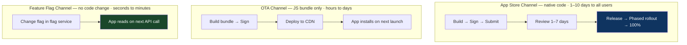
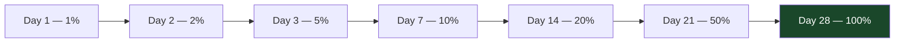
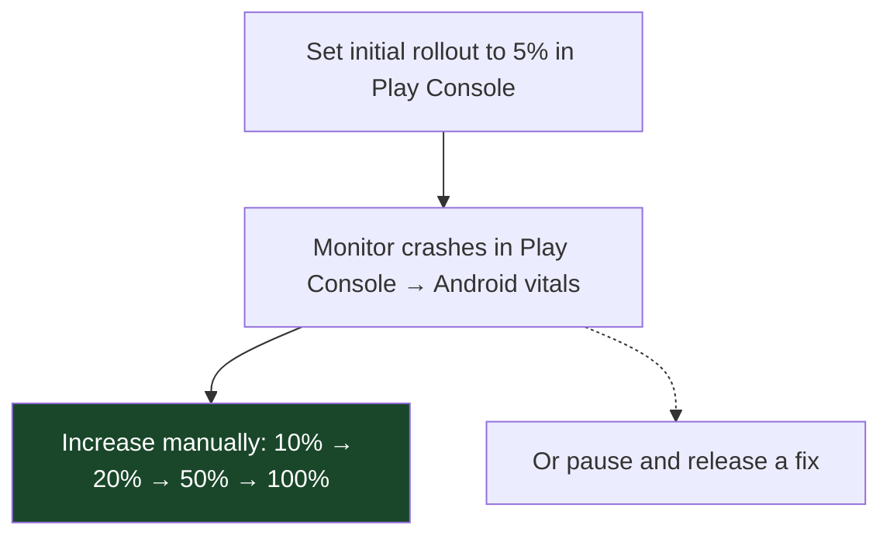
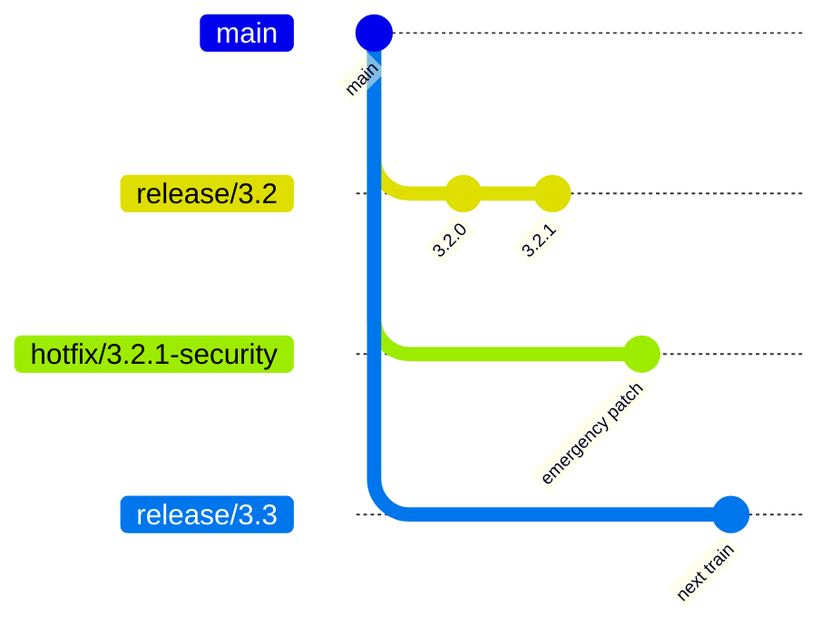

# Chapter 32: The Mobile Release Train Pattern
*Part VI: Cloud, Data & Edge Specialized Delivery*

> *"Our web team rolled back a bad deploy in 4 minutes.
> Our mobile team's bad deploy was in the App Store for 11 days
> waiting for review of the patch.
> Same company. Completely different deployment reality."*
> — CTO at a fintech company comparing their web and mobile pipelines

---

## The War Story

Clearfund is a personal finance app. In March, they ship version 3.2.0 with a critical security bug: a session token validation flaw that, under specific conditions, allows session hijacking via a man-in-the-middle attack on specific carrier networks.

The security team discovers it on a Wednesday morning. The engineers have a patch ready by Wednesday afternoon. They submit 3.2.1 to the App Store at 5 PM.

Apple's review queue is backed up. The patch sits in review for 9 days.

During those 9 days, the security team is operating in a tense state of partial disclosure. They've notified affected users individually. They've published a workaround (use only on WiFi). But the patched version is not available. Any user who updates their phone, reinstalls the app, or is a new user gets the vulnerable version.

On day 9, Apple approves 3.2.1. Clearfund immediately enables phased rollout at 100% (not using Apple's default phased rollout, because they want the patch deployed as fast as possible). Within 24 hours, 80% of users are on 3.2.1.

The postmortem produces two findings:
1. The security vulnerability should have been caught in the mobile CI pipeline's security scanning stage (it wasn't — the mobile CI only ran unit tests and UI tests, no SAST).
2. The OTA update infrastructure (React Native / CodePush) had been set up 18 months ago but had never been tested under emergency conditions. CodePush would have allowed shipping the validation fix within hours, bypassing App Store review — but nobody knew if it would work under real conditions.

---

## What You'll Learn

- The mobile deployment lifecycle: App Store/Play Store submission, review, phased rollout, and forced upgrades
- OTA (Over-The-Air) update strategies: CodePush for React Native, Expo Updates, and Flutter's Shorebird
- Feature flags as the mobile rollback mechanism: when you can't redeploy, flags are your kill switch
- Forced upgrade flows: enforcing minimum version requirements for critical security patches
- Mobile CI/CD pipeline structure: testing, signing, distribution, and App Store submission
- Mobile-specific branching: release trains, hotfix cherry-picks, and version branch management

---

## The Mobile Deployment Lifecycle

Mobile deployment has two distinct channels with different latencies:



The three channels address different use cases:
- **App Store channel**: native code changes, new capabilities, UI framework updates, OS API changes
- **OTA channel**: JavaScript/Dart logic changes, UI tweaks, bug fixes that don't touch native code
- **Feature flags**: on/off for specific features, gradual rollout, instant kill switch

---

## Mobile CI/CD Pipeline Structure

```yaml
# .github/workflows/mobile-ci.yml — iOS and Android CI pipeline
name: Mobile CI/CD

on:
  push:
    branches: [main, 'release/*']
  pull_request:

jobs:
  # Unit + integration tests (fast — runs on every PR)
  test:
    runs-on: ubuntu-22.04
    steps:
      - uses: actions/checkout@v4
      - uses: actions/setup-node@v4
        with:
          node-version: '20'
          cache: yarn

      - run: yarn install --frozen-lockfile
      - run: yarn test --ci --coverage

  # iOS build + TestFlight upload (runs on main + release branches)
  build-ios:
    if: github.ref == 'refs/heads/main' || startsWith(github.ref, 'refs/heads/release/')
    runs-on: macos-14  # Apple Silicon runner for faster builds
    steps:
      - uses: actions/checkout@v4

      - name: Setup Ruby (for Fastlane)
        uses: ruby/setup-ruby@v1
        with:
          bundler-cache: true  # Caches gem dependencies

      - name: Install CocoaPods
        run: |
          cd ios
          pod install --repo-update

      - name: Build and sign iOS app
        env:
          APP_STORE_CONNECT_API_KEY_ID: ${{ secrets.ASC_KEY_ID }}
          APP_STORE_CONNECT_ISSUER_ID: ${{ secrets.ASC_ISSUER_ID }}
          APP_STORE_CONNECT_API_KEY_CONTENT: ${{ secrets.ASC_KEY_CONTENT }}
          MATCH_PASSWORD: ${{ secrets.MATCH_PASSWORD }}  # Fastlane Match for cert management
        run: |
          bundle exec fastlane ios beta \
            --env release

      - name: Upload to TestFlight
        run: |
          bundle exec fastlane ios upload_to_testflight
          # TestFlight distributes to internal testers immediately
          # External TestFlight users and App Store require additional review steps

  # Android build + Play Console upload
  build-android:
    if: github.ref == 'refs/heads/main' || startsWith(github.ref, 'refs/heads/release/')
    runs-on: ubuntu-22.04
    steps:
      - uses: actions/checkout@v4

      - name: Setup Java
        uses: actions/setup-java@v4
        with:
          java-version: '17'
          distribution: 'temurin'

      - name: Build Android release bundle (AAB)
        env:
          KEYSTORE_FILE: ${{ secrets.ANDROID_KEYSTORE_BASE64 }}
          KEY_ALIAS: ${{ secrets.ANDROID_KEY_ALIAS }}
          KEY_PASSWORD: ${{ secrets.ANDROID_KEY_PASSWORD }}
        run: |
          echo $KEYSTORE_FILE | base64 -d > android/app/keystore.jks
          cd android
          ./gradlew bundleRelease \
            -Pandroid.injected.signing.store.file=app/keystore.jks \
            -Pandroid.injected.signing.key.alias=$KEY_ALIAS \
            -Pandroid.injected.signing.key.password=$KEY_PASSWORD

      - name: Upload to Play Console (internal track)
        uses: r0adkll/upload-google-play@v1
        with:
          serviceAccountJsonPlainText: ${{ secrets.PLAY_SERVICE_ACCOUNT_JSON }}
          packageName: com.clearfund.app
          releaseFiles: android/app/build/outputs/bundle/release/*.aab
          track: internal  # internal → alpha → beta → production tracks
          inAppUpdatePriority: 3
```

### The Fastlane Configuration

```ruby
# fastlane/Fastfile
platform :ios do
  lane :beta do
    # Sync code signing certificates (Fastlane Match)
    # match stores certs/profiles in a private git repo — all team members share them
    match(type: "appstore", readonly: true)
    
    # Increment build number to current timestamp (monotonically increasing)
    increment_build_number(build_number: Time.now.strftime("%Y%m%d%H%M"))
    
    # Build the app
    build_app(
      scheme: "Clearfund",
      configuration: "Release",
      export_method: "app-store",
      # Disable bitcode (deprecated in Xcode 14+)
      include_bitcode: false
    )
  end
end
```

---

## OTA Updates: React Native CodePush

CodePush (Microsoft App Center) allows pushing JavaScript bundle updates directly to React Native apps, bypassing App Store review. The app downloads the new bundle on the next launch.

```javascript
// App.js — CodePush integration
import CodePush from 'react-native-code-push';

const codePushOptions = {
  // checkFrequency: when to check for updates
  // ON_APP_RESUME: check every time app comes to foreground
  checkFrequency: CodePush.CheckFrequency.ON_APP_RESUME,
  
  // installMode: when to install a downloaded update
  // IMMEDIATE: install and restart immediately (use for critical security fixes)
  // ON_NEXT_RESUME: install when app is backgrounded and resumed (less disruptive)
  // ON_NEXT_RESTART: install on next app cold start (least disruptive)
  installMode: CodePush.InstallMode.ON_NEXT_RESUME,
  
  // mandatoryInstallMode: for mandatory updates (security patches)
  // Force immediate installation even if user is active
  mandatoryInstallMode: CodePush.InstallMode.IMMEDIATE,
  
  // rollbackRetryOptions: if an update causes crashes, CodePush automatically
  // rolls back to the previous bundle after this many crashes
  rollbackRetryOptions: {
    delayInHours: 0.25,
    maxRetryAttempts: 3
  }
};

// Wrap the App component with CodePush
export default CodePush(codePushOptions)(App);
```

```bash
# Deploy OTA update via CodePush CLI
# This bypasses App Store review entirely for JavaScript changes

# Deploy to staging deployment slot first (for testing)
appcenter codepush release-react \
  --app "Clearfund/Clearfund-iOS" \
  --deployment-name Staging \
  --description "Fix session token validation" \
  --target-binary-version "~3.2.0"  # Only targets 3.2.0 builds (exact bundle compatibility)

# After staging validation: promote to production
appcenter codepush promote \
  --app "Clearfund/Clearfund-iOS" \
  --source-deployment-name Staging \
  --destination-deployment-name Production \
  --rollout 20  # Start at 20% of production users

# Monitor for crashes and session validation metrics before 100%
# If clean: promote to 100%
appcenter codepush promote \
  --app "Clearfund/Clearfund-iOS" \
  --source-deployment-name Staging \
  --destination-deployment-name Production \
  --rollout 100
```

**The Clearfund incident resolution:** With a tested OTA infrastructure, the security patch for the session token vulnerability could have been deployed as a CodePush update within hours, not days. The validation fix was purely JavaScript logic — no native code change required. The 9-day App Store wait was avoidable.

---

## Forced Upgrade Flows

For critical security patches, you cannot rely on users to voluntarily update. A forced upgrade flow requires users to update before they can continue using the app.

```javascript
// version_check.js — runs on app startup and API requests
import { Alert, Linking } from 'react-native';
import semver from 'semver';

const APP_STORE_URL = 'https://apps.apple.com/app/clearfund/id123456789';
const PLAY_STORE_URL = 'market://details?id=com.clearfund.app';

async function checkVersionRequirements() {
  // Fetch version requirements from the server
  // The server can update these without an app release
  const response = await fetch('https://api.clearfund.com/v1/version-requirements');
  const { minimumVersion, recommendedVersion, forceUpdateMessage } = await response.json();
  
  const currentVersion = DeviceInfo.getVersion();  // e.g., "3.2.0"
  
  if (semver.lt(currentVersion, minimumVersion)) {
    // Forced upgrade: this version is below the minimum, show blocking dialog
    Alert.alert(
      'Update Required',
      forceUpdateMessage || 
      'A critical security update is required. Please update Clearfund to continue.',
      [
        {
          text: 'Update Now',
          onPress: () => {
            const url = Platform.OS === 'ios' ? APP_STORE_URL : PLAY_STORE_URL;
            Linking.openURL(url);
          }
        }
        // No "Later" button — this dialog cannot be dismissed
      ],
      { cancelable: false }  // Cannot dismiss by tapping outside
    );
    return false;  // App cannot proceed
  }
  
  if (semver.lt(currentVersion, recommendedVersion)) {
    // Soft upgrade prompt — user can dismiss, but we remind them
    // Use this for non-critical updates
  }
  
  return true;
}
```

The minimum version is controlled server-side. When the security patch is released (3.2.1), the server sets `minimumVersion: "3.2.1"`. Any user still on 3.2.0 who opens the app sees the forced upgrade dialog and cannot use the app until updated. This complements the OTA update — users who can't run the OTA bundle (older native code) are forced to the App Store update.

---

## App Store Phased Rollouts

Both Apple and Google support staged rollouts: releasing to a percentage of users over time.

**Apple App Store (App Store Connect):**



The phased rollout can be paused at any percentage via App Store Connect. If crash rates spike after day 2, pause the rollout, investigate, and release a fix before continuing.

**Google Play Store:**



Play Store allows you to halt a staged rollout and release a new version to the remaining users, effectively replacing the broken version before it reaches 100%.

---

## Mobile-Specific Branching



Key rule: **release branches are never merged back to main**. Instead:
- Bug fixes found in a release branch are cherry-picked to both `main` AND the release branch
- The release branch only lives for the duration of App Store review + phased rollout
- Once 100% of users are on the new version, the release branch is deleted

---

## The Anti-Patterns

### ❌ Anti-Pattern: No OTA Update Infrastructure

**What it looks like:** All changes go through App Store review. Every fix, every hotfix, every critical security patch waits 1–9 days.

**The fix:** Set up CodePush (React Native), Expo Updates (Expo), or Shorebird (Flutter) during initial app development. The infrastructure takes a sprint to set up. The first emergency security patch saves weeks.

---

### ❌ Anti-Pattern: Untested OTA Infrastructure

**What it looks like:** CodePush is configured. It has never been used in production. During a security incident, the team discovers that the deployment key is wrong, the target binary version string is incorrect, and the rollback mechanism was never enabled.

**What breaks:** The emergency response plan. The OTA infrastructure is a promise that breaks when you need it most.

**The fix:** Canary deploy a small OTA update every 2 weeks just to keep the infrastructure exercised. Treat OTA infrastructure as a production system with its own SLO, not a rarely-used emergency tool.

---

### ❌ Anti-Pattern: No Forced Upgrade Mechanism

**What it looks like:** The app has a "what's new" screen that mentions critical updates. Users can dismiss it and continue using vulnerable versions indefinitely.

**What breaks:** Security posture. A critical vulnerability remains exploitable indefinitely for users who don't update voluntarily.

**The fix:** Server-side minimum version enforcement with blocking dialogs. When `minimumVersion` is set, users below that version cannot proceed. The minimum version can be updated server-side without any app release.

---

## Field Notes

💀 **No OTA update infrastructure** → Security patch waits 9 days in App Store review → Set up OTA on day one. Exercise it monthly. It's the only "rollback" mechanism that works on mobile timelines.

💀 **Phased rollout at 100% for a critical security patch** → Good — you want it deployed fast → But also enable forced upgrade so users on older versions who don't auto-update are prompted. Both mechanisms working together reach maximum coverage fastest.

💀 **Release branches merged back to main** → Cherry-pick conflicts, version history confusion → Release branches are one-way. Fixes go: main → cherry-pick to release branch. Never merge release branch back to main.

---

## Chapter Summary

Mobile deployment is the domain where the fastest possible rollback is days, not seconds. The mobile release pipeline must be designed around this constraint from the start: OTA update infrastructure for same-day JavaScript fixes, phased App Store rollouts with pause capability for native code changes, forced upgrade flows for security critical patches, and feature flags as the runtime control mechanism that provides the instant kill switch that App Store deployment can't.

The Clearfund story is the canonical mobile release engineering failure: a critical security vulnerability, a 9-day App Store wait, and an OTA infrastructure that existed but had never been tested under real conditions. The technical solution was already in place. The operational discipline — regular OTA deployments, tested rollback, exercised emergency procedures — was not.

---

## What's Next

Part VI is complete. The specialized delivery patterns — database migrations, IaC promotion, serverless, edge, multi-region, and mobile — cover the deployment contexts where the general-purpose patterns from Parts III and IV break down.

Part VII enters the MLOps territory: Continuous Training, feature stores, model champion/challenger, and the deployment patterns specific to machine learning systems where the "artifact" being deployed is a trained model, not a compiled binary.
