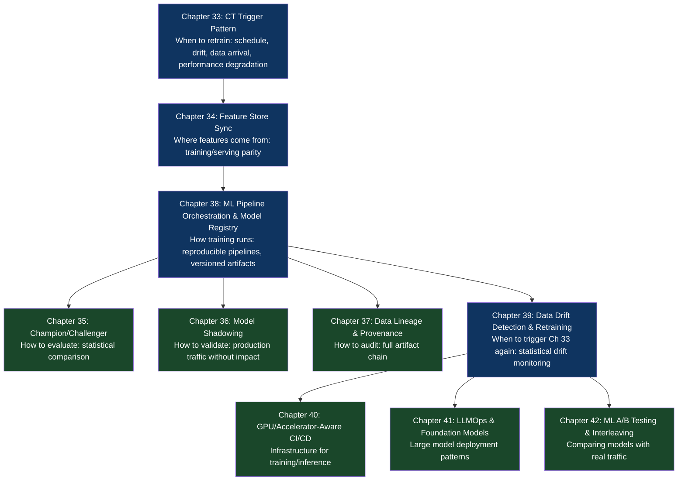

# Part VII: MLOps, AI & Continuous Training (CT)

## What This Part Is About

Software has a property that ML systems don't: a deployed binary doesn't degrade unless someone changes it. A deployed ML model degrades automatically as the world it was trained on diverges from the world it's running in. User behavior shifts. New fraud patterns emerge. Language evolves. The input distribution drifts. The model's performance decays — silently, invisibly, until the gap between expected and actual behavior is large enough to be noticed.

This property makes ML deployment fundamentally different from software deployment. In software, the deployment pipeline is a one-time event per commit. In ML, the deployment pipeline must be continuous: training, evaluation, deployment, monitoring, retraining, re-evaluation, re-deployment. The loop never closes because the target — the world — never stops moving.

The ten chapters in this part cover the patterns that make this loop reliable, reproducible, and automated. They address the unique challenges of ML deployment: training/serving skew (the features used for training don't match the features used for serving), model registry management (tracking which model is in production and when it was trained), drift detection (knowing when the model needs to be retrained before performance degrades visibly), and the increasingly critical LLMOps patterns for deploying and maintaining large language models.

## Why These Chapters Belong Together

All ten chapters address the ML artifact lifecycle: data → features → trained model → deployed model → monitored model → retrained model. Each chapter covers one stage of that lifecycle or a cross-cutting concern. They are sequential in the same way CI patterns are sequential: Chapter 33 (triggering retraining) is only meaningful in the context of Chapter 38 (the pipeline that executes training) and Chapter 39 (the drift detection that triggers it). Read them in order.

## Chapter Map

## Chapters in This Part

| Chapter | Title | Core Question Answered |
|---|---|---|
| [33](./chapter-33-continuous-training-trigger.md) | The Continuous Training (CT) Trigger Pattern | When and why should model retraining be triggered automatically? |
| [34](./chapter-34-feature-store-sync.md) | The Feature Store Synchronization Pattern | How do you guarantee that training and serving use identical features? |
| [35](./chapter-35-model-champion-challenger.md) | The Model Champion/Challenger Pattern | How do you statistically verify that a new model is better before promoting it? |
| [36](./chapter-36-model-shadowing.md) | The Model Shadowing Pattern | How do you validate a new model against production traffic with zero user impact? |
| [37](./chapter-37-ml-data-lineage.md) | The ML Data Lineage & Provenance Pattern | How do you track every artifact from raw data to deployed model? |
| [38](./chapter-38-ml-pipeline-orchestration.md) | The ML Pipeline Orchestration & Model Registry Pattern | How do you run reproducible training pipelines and manage model artifacts? |
| [39](./chapter-39-data-drift-retraining.md) | The Data Drift Detection & Automated Retraining Pattern | How do you detect when a model's input distribution has shifted and trigger retraining? |
| [40](./chapter-40-gpu-accelerator-cicd.md) | The GPU/Accelerator-Aware CI/CD Pattern | How do you build CI/CD pipelines that validate on the same hardware they deploy to? |
| [41](./chapter-41-llmops-foundation-model.md) | The LLMOps & Foundation Model Deployment Pattern | How do you deploy, version, and roll back large language models? |
| [42](./chapter-42-ml-ab-testing-interleaving.md) | The ML A/B Testing & Interleaving Pattern | How do you compare model versions with real traffic using statistical rigor? |
