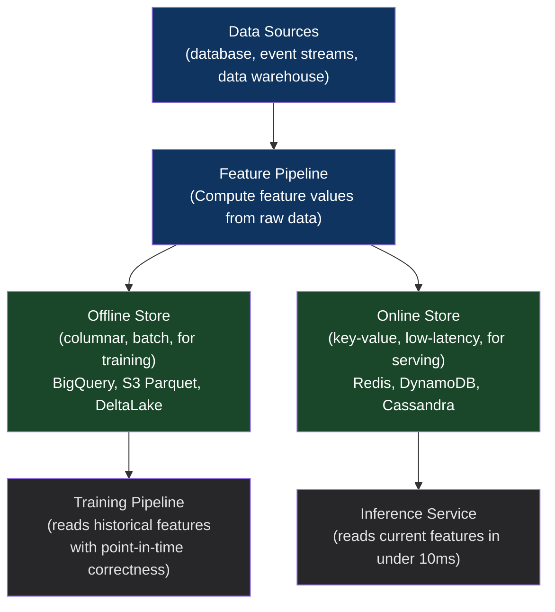

# Chapter 34: The Feature Store Synchronization Pattern
*Part VII: MLOps, AI & Continuous Training (CT)*

> *"Our model achieved 94% accuracy in offline evaluation.
> In production, it achieved 81%. We spent three months debugging.
> The problem was that training used a 30-day rolling average.
> Serving used a 7-day rolling average.
> Same feature name. Different computation. Neither system told us."*
> — ML engineer describing training/serving skew

---

## The War Story

The personalization team at Quartz Commerce trains a product recommendation model. During training, the `user_avg_order_value` feature is computed as: average of all orders in the last 30 days. The training code runs in a Jupyter notebook connected to the data warehouse.

The inference service also computes `user_avg_order_value` — but a different engineer wrote that code, independently, looking at the feature name in the model's feature list. He computed it as: average of all orders in the last 7 days. Seemed reasonable. The feature name didn't specify the window.

The model trains on 30-day averages. It serves predictions using 7-day averages. For users with stable spending patterns, the difference is negligible. For users with recent high-value purchases, the 7-day average is significantly inflated — and the model, trained on 30-day averages, produces suboptimal recommendations because the input it receives doesn't match the distribution it was trained on.

The gap between 94% offline accuracy (using training features) and 81% production accuracy (using serving features) is this single feature computation discrepancy. Three months of debugging, feature importance analysis, and residual error pattern investigation eventually surfaces the 30-day vs. 7-day window mismatch.

The fix: a feature store that computes features once and serves them to both training and inference. No more independently written feature computation code.

---

## What You'll Learn

- Training/serving skew: why it happens and why it's so hard to detect
- Feature store architecture: online store for low-latency serving, offline store for training
- Feast, Tecton, and Hopsworks compared honestly
- Point-in-time correctness: the most important and most ignored feature store concept
- Feature pipeline CI: validating feature transformations before they reach training
- Feature freshness SLOs: monitoring that online store features are recent enough for accurate predictions

---

## Training/Serving Skew: The Root Cause

Training/serving skew occurs whenever features used during model training are computed differently from features used during model serving. The skew is not always as obvious as a window size difference. Common sources:

| Source | Training | Serving | Result |
|---|---|---|---|
| Aggregation window | 30-day average | 7-day average | Different scale |
| Null handling | Replace nulls with mean | Replace nulls with -1 | Different distribution |
| Normalization | StandardScaler fit on training data | New StandardScaler at serving | Different scaling |
| Time zone | Features computed in UTC | Features computed in local time | Timezone-dependent bugs |
| Data freshness | Complete historical data | Recent data (incomplete for current day) | Recency bias |

A feature store eliminates training/serving skew by definition: there is one feature computation, one storage layer, and both training and serving read from the same source.

---

## Feature Store Architecture



### Online vs. Offline Store

**Online store:** Stores the most recent feature values per entity (user, product, transaction). Serves inference requests with sub-10ms latency. Updated continuously as new data arrives.

**Offline store:** Stores the complete historical time series of feature values. Used for training: "what were this user's features on January 15th?" The offline store must support point-in-time queries — looking up feature values as they existed at a specific historical timestamp.

---

## Point-in-Time Correctness

Point-in-time correctness (PIT) is the most important and most commonly violated feature store requirement. When building a training dataset from historical events, you must look up the feature values as they existed *at the time of the event*, not as they exist today.

Without PIT: you train on data that includes future information (feature values computed from data that didn't exist yet at the time of the training example). This causes target leakage — the model learns patterns that are only visible in hindsight.

```python
# feast_pit_example.py — point-in-time correct feature retrieval

import feast
from feast import FeatureStore

store = FeatureStore(repo_path="feature_repo/")

# Training dataset: historical fraud labels with timestamps
training_events = pd.DataFrame({
    "transaction_id": [...],
    "user_id": [...],
    "event_timestamp": [...],  # When the transaction occurred
    "is_fraud": [...]           # The label (known after investigation)
})

# Retrieve features AS THEY EXISTED at event_timestamp
# NOT as they exist today — this is point-in-time correctness
training_features = store.get_historical_features(
    entity_df=training_events,
    features=[
        "user_transaction_stats:avg_order_value_30d",    # 30-day window as of event time
        "user_transaction_stats:transaction_count_7d",
        "user_behavior:avg_session_duration",
        "device_features:is_new_device",
    ],
    # full_feature_names=True: use fully qualified names to prevent name collisions
    full_feature_names=True
).to_df()

# At this point, training_features contains feature values
# that were actually available at event_timestamp.
# A transaction on January 15th gets the user's 30-day average
# as of January 15th — not as of today.
```

---

## Feature Pipeline CI

Feature transformations are code. They must be tested in CI before reaching production:

```python
# tests/test_feature_pipelines.py

def test_avg_order_value_computation():
    """Feature computation must match the documented specification exactly."""
    
    # Test data: known orders for a test user
    test_orders = pd.DataFrame({
        "user_id": ["user_123"] * 5,
        "order_value": [100, 200, 150, 300, 250],
        "order_timestamp": pd.date_range("2024-01-01", periods=5, freq="7D")
    })
    
    reference_date = pd.Timestamp("2024-02-05")
    
    # Compute the feature using the canonical pipeline
    result = compute_avg_order_value_30d(
        orders=test_orders,
        user_id="user_123",
        reference_date=reference_date
    )
    
    # Orders in the 30-day window before Feb 5: Jan 22 ($300) and Jan 15 ($150)
    # (Jan 8, Jan 1 are outside the 30-day window)
    expected = (300 + 250) / 2  # = 275.0
    assert abs(result - expected) < 0.01, f"Expected {expected}, got {result}"

def test_feature_schema_compatibility():
    """Feature schema must match the model's expected input schema."""
    
    model = load_production_model("fraud-detection")
    feature_schema = get_feature_store_schema("user_transaction_stats")
    
    # Validate that every feature the model expects exists in the store
    # with the correct dtype
    for feature_name, expected_dtype in model.feature_schema.items():
        assert feature_name in feature_schema, \
            f"Model expects feature '{feature_name}' but it's not in the feature store"
        actual_dtype = feature_schema[feature_name]
        assert actual_dtype == expected_dtype, \
            f"Feature '{feature_name}' dtype mismatch: model expects {expected_dtype}, store has {actual_dtype}"
```

---

## Feature Freshness SLOs

Online store features must be recent enough to be meaningful for predictions. Stale features produce degraded predictions:

```yaml
# feature_freshness_slo.yaml — SLO definition for feature freshness
feature_slos:
  - feature_view: user_transaction_stats
    entity: user_id
    max_age_minutes: 60       # Features must be updated within the last hour
    alert_threshold_pct: 5   # Alert if >5% of entities have stale features
    
  - feature_view: real_time_behavior
    entity: user_id
    max_age_minutes: 5        # Real-time features must be very fresh
    alert_threshold_pct: 1
    
  - feature_view: device_risk_score
    entity: device_id
    max_age_minutes: 1440     # Daily features: 24-hour freshness is fine
    alert_threshold_pct: 10
```

```python
# Monitor feature freshness in Prometheus
from prometheus_client import Gauge

STALE_FEATURE_PCT = Gauge('feature_store_stale_pct', 
                           'Percentage of entities with stale features',
                           ['feature_view'])

def check_feature_freshness(feature_store, slos: list):
    for slo in slos:
        view = feature_store.get_feature_view(slo['feature_view'])
        stale_count = count_stale_entities(view, slo['max_age_minutes'])
        total_count = count_total_entities(view)
        stale_pct = stale_count / total_count * 100
        
        STALE_FEATURE_PCT.labels(feature_view=slo['feature_view']).set(stale_pct)
        
        if stale_pct > slo['alert_threshold_pct']:
            alert(f"Feature freshness SLO violated: {slo['feature_view']} "
                  f"has {stale_pct:.1f}% stale entities (threshold: {slo['alert_threshold_pct']}%)")
```

---

## Feature Store Comparison

| | Feast (OSS) | Tecton (commercial) | Hopsworks (OSS + commercial) |
|---|---|---|---|
| Hosting | Self-managed | Fully managed | Self-managed or managed |
| Online store | Redis, DynamoDB, BigTable | Proprietary | RonDB (MySQL NDB) |
| Offline store | S3, BigQuery, Snowflake | Proprietary | Hudi/Delta on S3 |
| Streaming features | Via Kafka adapter | Native | Native (Flink) |
| PIT correctness | Yes | Yes | Yes |
| Feature monitoring | Limited | Strong (built-in) | Built-in |
| Best for | Teams wanting control | Teams wanting managed | Teams wanting integrated monitoring |

**The honest verdict:** For small teams just starting out, Feast is the right choice — open source, well-documented, deployable on existing infrastructure. At scale with streaming feature requirements and strong monitoring needs, Tecton or Hopsworks justify their cost. The wrong choice is having no feature store and letting training/serving skew silently cost you 13% accuracy for three months.

---

## Anti-Patterns

### ❌ Anti-Pattern: Recomputing Features Independently in Training and Serving

**What it looks like:** The training notebook has feature computation code. The inference service has the same feature computation code. Written by different people, at different times, using different parameter values.

**What breaks:** Training/serving skew. The model is tested against training features, but served using different features. Accuracy degrades silently.

**The fix:** One canonical feature computation in the feature store. Both training and serving read from the same source with the same computation.

---

### ❌ Anti-Pattern: Ignoring Point-in-Time Correctness

**What it looks like:** Historical training data is assembled by joining the current feature values (as they exist today) to historical event labels.

**What breaks:** Target leakage. The model learns from future information. Offline accuracy is inflated. Online accuracy is much lower than expected.

**The fix:** Always use `get_historical_features` with event timestamps, not current feature values. Validate PIT correctness by checking that feature values in the training set predate the event timestamps.

---

## Field Notes

💀 **Feature name without specification of computation** → Different teams implement differently → Feature definitions must include the exact computation: window size, null handling, normalization method. Stored in the feature store definition, not in tribal knowledge.

💀 **No feature freshness monitoring** → Stale online store features produce degraded predictions invisibly → Set SLOs on feature freshness. Alert when features are stale. This is as important as application availability monitoring.

---

## Chapter Summary

The feature store is the infrastructure that makes training/serving parity enforceable rather than aspirational. Without it, training/serving skew accumulates silently — different window sizes, different null handling, different normalization — until offline accuracy and online accuracy diverge enough to notice. Point-in-time correctness is the feature store concept that prevents target leakage in historical training datasets. Feature pipeline CI is the test harness that catches computation regressions before they reach training.
