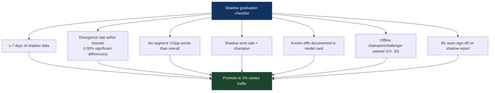

# Chapter 36: The Model Shadowing Pattern
*Part VII: MLOps, AI & Continuous Training (CT)*

> *"Shadow mode for two weeks revealed that the new model
> had dramatically different behavior for mobile users.
> The offline test set was 85% desktop. Production is 60% mobile.
> We found a 12-point precision gap on mobile before going live.
> Shadow mode gave us that. The test set would have hidden it."*
> — ML engineer at a media recommendation company

---

## The War Story

The ML team at Cascade Media trains a new content recommendation model that shows strong offline improvements: +8% NDCG across their holdout test set. The champion/challenger evaluation passes. They're ready to deploy.

Their MLOps engineer suggests running the new model in shadow mode for two weeks before promoting it to canary. The team agrees, somewhat reluctantly — they're excited about the new model and two weeks feels long.

Week one: the shadow comparison shows strong alignment between champion and challenger for desktop users. Small differences in recommendation ranking, mostly within expected bounds.

Week two: the team notices something. For mobile users accessing the app after 9 PM, the challenger's recommendations diverge significantly from the champion's. The challenger is recommending longer content (30+ minute videos) at a much higher rate. The champion serves shorter content (5–10 minutes) to late-night mobile users — because the training data showed that mobile users late at night have shorter attention spans.

The challenger was trained on a dataset where mobile platform labels were incorrectly encoded for a 3-week period. The model learned a corrupted signal. It would have degraded mobile evening engagement — a significant revenue driver for a streaming platform — if it had gone to canary.

Shadow mode found it in week two. The A/B test that would have run otherwise would have detected it after 2 weeks of real user impact.

---

## What You'll Learn

- Model shadow deployment architecture: dual-inference services and async scoring pipelines
- Response comparison methodology: what differences between champion and challenger outputs are meaningful
- The shadow-to-canary graduation decision: what two weeks of shadow data justifies
- Infrastructure for shadow scoring at high request volume without impacting latency
- Limitations: write-heavy models, external API side effects, and models where responses can't be directly compared

---

## Shadow Deployment Architecture for ML Models

ML model shadowing mirrors production inference requests to both the champion (production) and the challenger (shadow), collects both outputs, and compares them asynchronously without serving the challenger's output to users.

```python
# shadow_inference_service.py — wraps the champion model with shadow scoring

import asyncio
from typing import Optional

class ShadowInferenceService:
    def __init__(
        self,
        champion_model: Model,
        challenger_model: Optional[Model] = None,
        shadow_sample_rate: float = 1.0,  # Start at 100%, reduce if compute-constrained
        diff_threshold: float = 0.05      # Log differences > 5% rank overlap change
    ):
        self.champion = champion_model
        self.challenger = challenger_model
        self.shadow_sample_rate = shadow_sample_rate
        self.diff_threshold = diff_threshold
    
    async def predict(self, request: InferenceRequest) -> InferenceResponse:
        # Always score with champion — this is what the user gets
        champion_response = await self.champion.predict(request)
        
        # Shadow scoring: fire-and-forget, async, never blocks the user response
        if self.challenger and random.random() < self.shadow_sample_rate:
            asyncio.create_task(
                self._shadow_score_and_compare(request, champion_response)
            )
        
        return champion_response  # User always gets champion response
    
    async def _shadow_score_and_compare(
        self,
        request: InferenceRequest,
        champion_response: InferenceResponse
    ):
        """Score with challenger and log differences. Never affects user response."""
        
        try:
            challenger_response = await self.challenger.predict(request)
            
            diff = self._compare_responses(champion_response, challenger_response)
            
            if diff.is_significant:
                # Log to your analytics backend for analysis
                await log_shadow_diff({
                    "request_id": request.request_id,
                    "user_id": request.user_id,
                    "platform": request.context.get("platform"),
                    "hour_of_day": request.timestamp.hour,
                    "champion_top_items": [r.item_id for r in champion_response.recommendations[:5]],
                    "challenger_top_items": [r.item_id for r in challenger_response.recommendations[:5]],
                    "rank_overlap_at_5": diff.rank_overlap_at_5,
                    "score_diff_mean": diff.score_diff_mean
                })
        
        except Exception as e:
            # Shadow errors never surface to the user
            logger.warning(f"Shadow scoring failed (non-fatal): {e}")
    
    def _compare_responses(
        self,
        champion: InferenceResponse,
        challenger: InferenceResponse
    ) -> DiffResult:
        
        champ_ids = [r.item_id for r in champion.recommendations[:10]]
        chal_ids = [r.item_id for r in challenger.recommendations[:10]]
        
        # Rank overlap@10: fraction of top-10 recommendations that are the same
        overlap = len(set(champ_ids) & set(chal_ids)) / 10
        
        return DiffResult(
            rank_overlap_at_10=overlap,
            is_significant=(overlap < 1 - self.diff_threshold)
        )
```

---

## Shadow Analysis: Detecting Segment-Level Issues

The Cascade Media discovery was segment-level: the divergence was concentrated in mobile users after 9 PM. Shadow analysis must surface these patterns:

```python
# shadow_analysis.py — weekly shadow report generation

def generate_shadow_analysis_report(
    shadow_diffs: pd.DataFrame,
    evaluation_period_days: int = 7
) -> ShadowReport:
    """
    Analyze shadow scoring data for segment-level divergences.
    Run weekly as input to the shadow-to-canary graduation decision.
    """
    
    # Overall divergence rate
    overall_divergence = (shadow_diffs["rank_overlap_at_10"] < 0.6).mean()
    
    # Segment-level analysis
    segment_analysis = shadow_diffs.groupby(["platform", "hour_bucket"]).agg({
        "rank_overlap_at_10": ["mean", "std"],
        "request_id": "count"
    }).reset_index()
    
    # Flag segments with significantly lower overlap than overall
    flagged_segments = segment_analysis[
        segment_analysis["rank_overlap_at_10_mean"] < 
        overall_divergence - 0.15  # More than 15pp below overall
    ]
    
    report = ShadowReport(
        overall_divergence_rate=overall_divergence,
        total_requests_shadowed=len(shadow_diffs),
        flagged_segments=flagged_segments.to_dict("records"),
        graduation_ready=(
            len(flagged_segments) == 0 and
            overall_divergence < 0.3 and
            evaluation_period_days >= 7
        )
    )
    
    return report
```

---

## Shadow-to-Canary Graduation Criteria



When the checklist passes, promote to 1% canary traffic (not 100% — this is ML deployment, always start with canary after shadow).

---

## Limitations

**Write-heavy models:** If the model's output triggers downstream writes (fraud decisions, pricing), the shadow model's outputs must be discarded without executing the writes. This requires the same write-suppression mechanism as Chapter 22.

**External API side effects:** Models that call external APIs (email recommendations, push notifications) cannot be shadowed without either suppressing the external calls or accepting duplicate external effects.

**Models where outputs can't be compared directly:** If the champion and challenger produce different output formats (e.g., the challenger returns a new field), the comparison is impossible until both use compatible formats.

---

## Anti-Patterns

### ❌ Anti-Pattern: Shadow Mode Without Segment Analysis

**What it looks like:** Shadow logs are collected but only analyzed as aggregates. "Overall 72% rank overlap — looks fine." The mobile evening segment with 41% rank overlap is invisible in the aggregate.

**The fix:** Always segment shadow analysis by user characteristics, platform, time-of-day, and any other dimension that might affect model behavior differently.

---

### ❌ Anti-Pattern: Shadow Period Too Short

**What it looks like:** 24 hours of shadow data, looks good, promote to canary. The mobile evening segment is only 15% of daily traffic — 24 hours might not generate enough statistical power to detect the divergence.

**The fix:** Minimum 7-day shadow period to capture weekly traffic patterns. For seasonal models, 14 days may be warranted.

---

## Chapter Summary

Model shadowing is the ML equivalent of application shadow deployment (Chapter 22): validate the new version against real production traffic before any user sees its outputs. The key difference from application shadowing is the analysis layer: ML shadow analysis must segment by user characteristics and context to catch the non-representative test set problem that plagued the Cascade Media team. Two weeks of shadow data across all user segments is the right investment before a canary that affects real engagement metrics.
