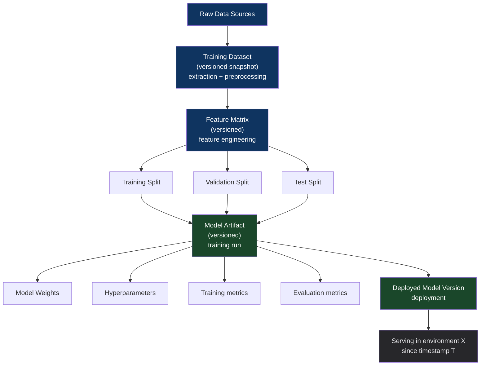

# Chapter 37: The ML Data Lineage & Provenance Pattern
*Part VII: MLOps, AI & Continuous Training (CT)*

> *"The GDPR request came in. Customer wants their data deleted.
> We deleted their records from the database.
> Then legal asked: 'Was their data used to train any of your models?'
> We didn't know. We had no lineage.
> We had to assume yes and retrain everything.
> That took three weeks and cost us $180,000 in compute."*
> — ML platform engineer at a European SaaS company

---

## The War Story

Meridian Health receives a GDPR right-to-erasure request from a patient. Standard procedure: delete all records associated with the patient ID from the production database. Done in 20 minutes.

Then the compliance team asks the ML team: "Was this patient's data used in any of your models?"

The ML team doesn't know. They have:
- A fraud detection model trained 3 months ago
- A length-of-stay prediction model trained 6 months ago
- A readmission risk model trained 2 months ago
- A drug interaction recommender trained 4 months ago

They know roughly when each model was trained. They don't know which patients were in the training datasets. The training scripts ran SQL queries against the database — those queries were ad hoc and not logged. The training data was extracted to S3, used for training, and the original extraction scripts were lost when someone cleaned up their workspace.

The only safe answer to "was this patient's data in the training set?" is "we don't know, so assume yes." The models must be retrained without this patient's data. That means reconstructing the training datasets from scratch (possible, since the source data is still in the database minus this one patient), retraining all four models, going through champion/challenger evaluation, shadow mode, and canary deployment for each.

Three weeks. $180,000 in compute costs. The entire cost was driven by the absence of data lineage tracking.

---

## What You'll Learn

- ML data lineage: tracking the complete artifact chain from raw data to deployed model
- Implementing lineage with MLflow Tracking, DVC, and Weights & Biases
- Model cards: structured documentation of training data, evaluation results, and intended use
- SLSA provenance for ML artifacts: extending software supply chain security to models
- Regulatory compliance: GDPR, CCPA, and model explainability requirements
- The right-to-erasure problem: what lineage enables when data must be deleted

---

## The ML Artifact Chain



Full lineage means every node in this graph is versioned, traceable, and queryable. Given a deployed model, you can answer: what training data was used? Which specific records from which source tables? What preprocessing was applied? What hyperparameters produced this model? What evaluation metrics did it achieve?

---

## Implementation: MLflow Tracking

```python
# training_with_full_lineage.py

import mlflow
import hashlib
import json

def train_with_lineage(
    training_data_path: str,
    hyperparams: dict,
    model_name: str
):
    """Train a model with complete lineage tracking via MLflow."""
    
    # Compute a content hash of the training data
    # This hash is the immutable identifier for this specific dataset version
    data_hash = compute_data_hash(training_data_path)
    
    with mlflow.start_run(
        run_name=f"{model_name}-{datetime.now().strftime('%Y%m%d-%H%M')}",
        tags={
            "model_name": model_name,
            "trigger_type": "scheduled",  # or "drift", "performance_degradation"
        }
    ) as run:
        
        # Log complete data provenance
        mlflow.log_param("training_data_path", training_data_path)
        mlflow.log_param("training_data_hash", data_hash)
        mlflow.log_param("training_data_row_count", get_row_count(training_data_path))
        mlflow.log_param("training_data_date_range_start", get_date_range_start(training_data_path))
        mlflow.log_param("training_data_date_range_end", get_date_range_end(training_data_path))
        
        # Log the SQL query or data extraction script that produced the training data
        # This is critical for GDPR compliance — allows reconstructing training data without specific records
        mlflow.log_artifact("data_extraction_query.sql")
        mlflow.log_artifact("preprocessing_pipeline.py")
        
        # Log hyperparameters
        mlflow.log_params(hyperparams)
        
        # Log environment: package versions, Python version, etc.
        mlflow.log_param("python_version", sys.version)
        mlflow.log_artifact("requirements.txt")  # Exact dependency versions
        
        # Train the model
        model = train(training_data_path, hyperparams)
        
        # Log evaluation metrics
        eval_metrics = evaluate(model, get_eval_data())
        mlflow.log_metrics(eval_metrics)
        
        # Log the model with signature (input/output schema)
        # The signature is part of provenance — documents what inputs the model expects
        signature = mlflow.models.infer_signature(
            X_sample,
            model.predict(X_sample)
        )
        mlflow.sklearn.log_model(
            model,
            "model",
            signature=signature,
            input_example=X_sample.head(3)  # Concrete examples for documentation
        )
        
        # Tag the run with git commit information
        mlflow.set_tag("git_commit", subprocess.check_output(["git", "rev-parse", "HEAD"]).decode().strip())
        mlflow.set_tag("git_branch", subprocess.check_output(["git", "branch", "--show-current"]).decode().strip())
        
        return run.info.run_id
```

---

## DVC for Data Versioning

MLflow tracks model artifacts and metrics. DVC (Data Version Control) tracks data files — the large binary datasets that Git can't handle efficiently.

```yaml
# dvc.yaml — DVC pipeline definition for a fraud detection model
stages:
  extract:
    cmd: python src/extract_training_data.py
    params:
      - training_config.yaml:
          - data.start_date
          - data.end_date
          - data.feature_list
    outs:
      - data/training/fraud_features.parquet  # DVC tracks this file by content hash

  preprocess:
    cmd: python src/preprocess.py
    deps:
      - data/training/fraud_features.parquet
    outs:
      - data/training/processed_features.parquet
      - data/training/feature_scaler.pkl

  train:
    cmd: python src/train.py
    deps:
      - data/training/processed_features.parquet
      - src/model.py
    params:
      - model_config.yaml:
          - model.n_estimators
          - model.max_depth
          - model.learning_rate
    outs:
      - models/fraud_detector.pkl
    metrics:
      - metrics/eval_metrics.json
```

```bash
# Reproduce any historical training run exactly
# Given a git commit, DVC can reproduce the entire pipeline including data
git checkout <historical_commit>
dvc pull  # Pull the exact data version used at that commit
dvc repro  # Reproduce the training run with the exact same data and code
```

This addresses the GDPR problem: given a deployed model version (which has a git commit tag), you can identify the exact training data version (via DVC), extract the training data, check whether it contains the patient's records, and retrain without them.

---

## Model Cards

A model card is a structured document that describes a model's purpose, training data, performance characteristics, limitations, and intended use. It is the model's "provenance document" — the human-readable lineage artifact.

```yaml
# model_card.yaml — generated as part of every training run
model_name: fraud-detection
version: v2.4.1
created_at: "2024-03-15T14:32:00Z"
created_by: ml-training-pipeline
git_commit: a3f8c2d

# Training data provenance
training_data:
  source: "bigquery://mycompany-data.transactions.fraud_labels"
  date_range: "2023-09-01 to 2024-03-14"
  row_count: 2847392
  data_hash: "sha256:e4b3e4a619..."
  # PII data usage documented for compliance
  contains_pii: true
  pii_fields: ["user_id", "ip_address"]
  pii_handling: "user_id hashed with SHA-256, ip_address truncated to /24"
  data_retention_policy: "Training data retained for 90 days, then deleted"

# Performance metrics
evaluation:
  test_set_precision: 0.934
  test_set_recall: 0.891
  auc_roc: 0.978
  eval_data_date_range: "2024-02-15 to 2024-03-14"
  
  # Segment-level performance (required for fairness documentation)
  segment_performance:
    - segment: "transaction_value < $100"
      precision: 0.921
      recall: 0.907
    - segment: "transaction_value > $10000"
      precision: 0.954
      recall: 0.863

# Limitations and intended use
limitations:
  - "Model performance may degrade for payment methods introduced after training cutoff"
  - "Not validated for use outside of US payment ecosystem"
  - "Requires feature freshness within 1 hour for accurate predictions"

intended_use:
  - "Real-time fraud scoring for e-commerce transactions"
  - "NOT intended for credit decisions or loan approvals"
```

---

## GDPR Compliance with Lineage

With full lineage tracking, the right-to-erasure process becomes tractable:

```python
# gdpr_erasure.py — with lineage tracking

def handle_erasure_request(user_id: str) -> ErasureReport:
    """
    Process a GDPR right-to-erasure request.
    
    With lineage tracking: identify exactly which models were trained on data
    from this user. Retrain only those models.
    
    Without lineage tracking: retrain all models (as Meridian Health had to do).
    """
    
    # Find all training datasets that included this user
    affected_datasets = mlflow.search_runs(
        filter_string=f"params.training_data_hash != ''",
        search_all_experiments=True
    )
    
    models_to_retrain = []
    
    for _, run in affected_datasets.iterrows():
        data_path = run["params.training_data_path"]
        data_hash = run["params.training_data_hash"]
        
        # Check if this user's data is in this training dataset
        is_in_dataset = check_user_in_dataset(
            user_id=user_id,
            data_path=data_path,
            extraction_query=run["params.data_extraction_query"]
        )
        
        if is_in_dataset:
            # Find all models trained from this dataset
            model_run_id = run["run_id"]
            dependent_models = find_models_from_run(model_run_id)
            models_to_retrain.extend(dependent_models)
    
    # Retrain only the affected models
    for model in models_to_retrain:
        trigger_retrain_without_user(
            model_name=model.name,
            exclude_user_id=user_id
        )
    
    return ErasureReport(
        user_id=user_id,
        affected_model_count=len(models_to_retrain),
        retrain_initiated=True
    )
```

With lineage tracking, the Meridian Health team would have known in 10 minutes that only the fraud detection model (trained 3 months ago) included the patient's data. One retrain instead of four. Three days instead of three weeks.

---

## Anti-Patterns

### ❌ Anti-Pattern: Training Without Logging Data Provenance

**What it looks like:** `model.fit(X_train, y_train)` — no logging of where `X_train` came from.

**What breaks:** All compliance queries ("was this data used?") become "assume yes and retrain everything."

**The fix:** Every training run logs: data source path, content hash, date range, row count, SQL query used.

---

### ❌ Anti-Pattern: Model Cards Written Manually After Training

**What it looks like:** Model cards are created by ML engineers who write them in a Google Doc after the model is deployed. They're incomplete and often out of date.

**The fix:** Generate model cards programmatically from MLflow run metadata at the end of every training pipeline. The pipeline creates the card; the engineer reviews and augments it.

---

## Chapter Summary

ML data lineage is the audit infrastructure that makes regulatory compliance possible and debugging tractable. Without it, a single GDPR erasure request triggers full model retraining across all deployed models. With it, the impact of a data deletion event is precisely scoped to the models that actually used that data. MLflow provides the run tracking layer; DVC provides the data versioning layer; model cards provide the human-readable provenance document. All three are required for a complete lineage system.
