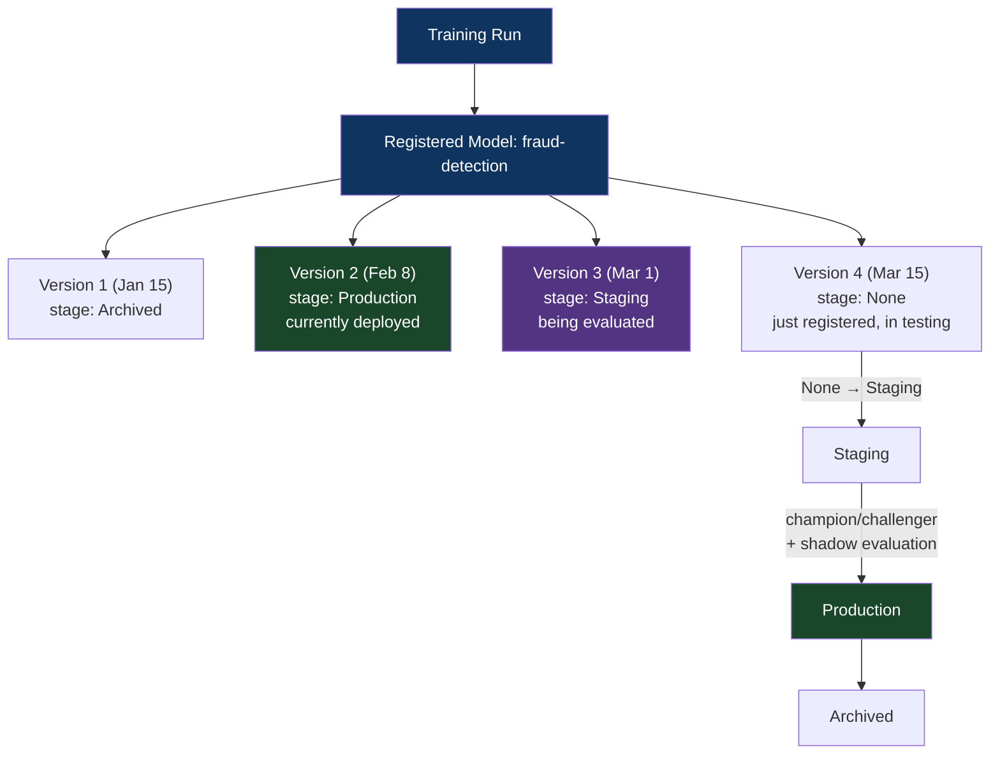

# Chapter 38: The ML Pipeline Orchestration & Model Registry Pattern
*Part VII: MLOps, AI & Continuous Training (CT)*

> *"We had 14 models in production. Zero of them had version numbers.
> The deployment method was: SSH to the inference server, copy the .pkl file,
> restart the process. We didn't know which model was running in production.
> We found out the hard way when we tried to roll back and discovered
> we had overwritten the previous version."*
> — ML platform engineer describing pre-registry infrastructure

---

## The War Story

The ML team at Nexus Analytics has been shipping models for two years. Their process: train locally in a Jupyter notebook, save the model as a `.pkl` file with the date in the filename (`fraud_model_2024_01_15.pkl`), upload to an S3 bucket (`s3://ml-models/fraud/`), SSH to the inference server, copy the file, restart the service.

In February, a new fraud detection model shows improved offline metrics. The ML engineer deploys it by copying `fraud_model_2024_02_08.pkl` to the inference server. The old file (`fraud_model_2024_01_15.pkl`) is overwritten.

Two days later, online metrics show degradation — the new model has higher recall but lower precision, causing 40% more false positives. The fraud operations team is overwhelmed with false alerts. The decision is made to roll back.

To which version? The previous file was overwritten. The only way to recover is to find the training code (in the engineer's local Jupyter notebook history), retrain the January model (3 hours), and redeploy it.

The incident takes 8 hours. The root cause: no model registry, no immutable artifact versioning, no rollback capability.

---

## What You'll Learn

- The model registry concept: treating models as versioned, promotable artifacts
- MLflow Model Registry in depth: stages, transitions, approval workflows
- Vertex AI, SageMaker, and Azure ML model registries compared
- Reproducible training pipelines: Kubeflow, Metaflow, and ZenML
- The experiment-to-production promotion path: from notebook to registry to deployment
- Pipeline testing: validating pipeline logic before it executes

---

## The Model Registry as Artifact Registry for ML

The model registry for ML is the direct analog of a container image registry for software. It stores versioned model artifacts, tracks which version is deployed to which environment, and enables rollback to any previous version.



```python
# mlflow_registry_workflow.py — manage model lifecycle with MLflow Registry

import mlflow
from mlflow.tracking import MlflowClient

client = MlflowClient()

# After a successful training run: register the model
run_id = "a3f8c2d..."  # From the training pipeline

# Register the model — creates version 3 of "fraud-detection"
model_version = mlflow.register_model(
    model_uri=f"runs:/{run_id}/model",
    name="fraud-detection",
    tags={
        "training_date": "2024-03-01",
        "trigger": "scheduled",
        "champion_comparison": "passed",  # Set after champion/challenger eval
        "shadow_weeks": "2",              # Set after 2 weeks of shadow mode
    }
)

print(f"Registered model version: {model_version.version}")
# → Registered model version: 3

# Transition to Staging after basic validation
client.transition_model_version_stage(
    name="fraud-detection",
    version=model_version.version,
    stage="Staging",
    archive_existing_versions=False  # Keep previous versions in Staging for comparison
)

# After shadow evaluation and champion/challenger pass:
# Transition to Production (this is what the deployment pipeline reads)
client.transition_model_version_stage(
    name="fraud-detection",
    version=model_version.version,
    stage="Production",
    archive_existing_versions=True  # Archive the previous production version
)

# Rollback: promote the previous version back to Production
def rollback_model(model_name: str):
    """Rollback to the most recent archived version."""
    
    # Find the most recent archived version
    all_versions = client.search_model_versions(f"name='{model_name}'")
    archived_versions = [v for v in all_versions if v.current_stage == "Archived"]
    archived_versions.sort(key=lambda v: int(v.version), reverse=True)
    
    if not archived_versions:
        raise ValueError(f"No archived versions of {model_name} to roll back to")
    
    rollback_version = archived_versions[0]
    
    # Archive current production
    production_versions = [v for v in all_versions if v.current_stage == "Production"]
    for v in production_versions:
        client.transition_model_version_stage(
            name=model_name, version=v.version, stage="Archived"
        )
    
    # Restore the archived version to production
    client.transition_model_version_stage(
        name=model_name,
        version=rollback_version.version,
        stage="Production"
    )
    
    print(f"Rolled back {model_name} to version {rollback_version.version}")
```

---

## The Inference Service: Reading from the Registry

The inference service loads the production model from the registry at startup and periodically checks for updates:

```python
# inference_service.py — production model loading with registry integration

import mlflow

class InferenceService:
    def __init__(self, model_name: str, poll_interval_seconds: int = 300):
        self.model_name = model_name
        self.poll_interval = poll_interval_seconds
        self.current_model = None
        self.current_version = None
        
        # Load model at startup
        self._load_production_model()
        
        # Start background polling for model updates
        threading.Thread(target=self._poll_for_updates, daemon=True).start()
    
    def _load_production_model(self):
        """Load the current production model from MLflow Registry."""
        model_uri = f"models:/{self.model_name}/Production"
        
        self.current_model = mlflow.pyfunc.load_model(model_uri)
        
        # Get the version number for observability
        client = MlflowClient()
        production_versions = client.get_latest_versions(
            self.model_name, stages=["Production"]
        )
        self.current_version = production_versions[0].version if production_versions else None
        
        print(f"Loaded {self.model_name} version {self.current_version}")
    
    def _poll_for_updates(self):
        """Periodically check if a new production model has been registered."""
        while True:
            time.sleep(self.poll_interval)
            
            client = MlflowClient()
            production_versions = client.get_latest_versions(
                self.model_name, stages=["Production"]
            )
            
            if production_versions:
                latest_version = production_versions[0].version
                if latest_version != self.current_version:
                    print(f"New production model detected: version {latest_version}. Reloading.")
                    self._load_production_model()
    
    def predict(self, features: pd.DataFrame) -> np.ndarray:
        return self.current_model.predict(features)
```

---

## ML Pipeline Orchestration: Kubeflow vs. Metaflow vs. ZenML

| | Kubeflow Pipelines | Metaflow | ZenML |
|---|---|---|---|
| Hosting | Kubernetes (self-managed) | AWS/GCP native + self-managed | Cloud + self-managed |
| DSL | Python SDK + YAML | Python decorators | Python SDK |
| Artifact tracking | Metadata store | S3/GCS natively | Artifact stores |
| Experiment tracking | KFP metadata | MLflow integration | MLflow/W&B integration |
| Learning curve | High (Kubernetes knowledge) | Medium | Low |
| Best for | Teams with Kubernetes expertise | Netflix-style data science teams | Teams wanting a batteries-included MLOps platform |

```python
# metaflow_pipeline.py — clean, readable pipeline definition

from metaflow import FlowSpec, step, Parameter, card
import mlflow

class FraudDetectionTrainingFlow(FlowSpec):
    
    # Pipeline parameters: configurable without code changes
    n_estimators = Parameter("n_estimators", default=500)
    max_depth = Parameter("max_depth", default=8)
    
    @step
    def start(self):
        print("Starting fraud detection training pipeline")
        self.next(self.extract_data)
    
    @step
    def extract_data(self):
        """Extract training data from BigQuery."""
        from google.cloud import bigquery
        client = bigquery.Client()
        
        self.training_data = client.query("""
            SELECT * FROM fraud_features.training_data
            WHERE date >= DATE_SUB(CURRENT_DATE(), INTERVAL 90 DAY)
        """).to_dataframe()
        
        self.data_row_count = len(self.training_data)
        self.next(self.preprocess)
    
    @step
    def preprocess(self):
        """Feature engineering and preprocessing."""
        from sklearn.preprocessing import StandardScaler
        
        feature_cols = [c for c in self.training_data.columns if c != "is_fraud"]
        self.scaler = StandardScaler()
        self.X_train = self.scaler.fit_transform(self.training_data[feature_cols])
        self.y_train = self.training_data["is_fraud"].values
        self.next(self.train)
    
    @card  # Metaflow card: generates an HTML report visible in the UI
    @step
    def train(self):
        """Train the model with MLflow tracking."""
        import xgboost as xgb
        
        with mlflow.start_run():
            mlflow.log_params({
                "n_estimators": self.n_estimators,
                "max_depth": self.max_depth,
                "training_rows": self.data_row_count
            })
            
            self.model = xgb.XGBClassifier(
                n_estimators=self.n_estimators,
                max_depth=self.max_depth,
                eval_metric="aucpr"
            )
            self.model.fit(self.X_train, self.y_train)
            
            # Log to MLflow
            mlflow.xgboost.log_model(self.model, "model")
            mlflow.log_metric("training_auc", self.model.best_score)
        
        self.next(self.evaluate)
    
    @step
    def evaluate(self):
        """Champion/Challenger evaluation."""
        # Load champion model from registry
        champion = mlflow.xgboost.load_model("models:/fraud-detection/Production")
        
        challenger_metrics = evaluate_model(self.model, self.X_test, self.y_test)
        champion_metrics = evaluate_model(champion, self.X_test, self.y_test)
        
        self.promotion_recommended = (
            challenger_metrics["precision"] > champion_metrics["precision"] * 1.01
        )
        self.next(self.register)
    
    @step
    def register(self):
        """Register model if it beats the champion."""
        if self.promotion_recommended:
            mlflow.register_model(
                f"runs:/{mlflow.active_run().info.run_id}/model",
                "fraud-detection"
            )
        self.next(self.end)
    
    @step
    def end(self):
        print(f"Pipeline complete. Promotion recommended: {self.promotion_recommended}")


if __name__ == "__main__":
    FraudDetectionTrainingFlow()
```

---

## Anti-Patterns

### ❌ Anti-Pattern: The Overwritten `.pkl` File

**What it looks like:** The Nexus Analytics story. Models deployed by copying files. Previous versions overwritten. Rollback requires retraining.

**The fix:** Model registry with immutable versioning. Every model version is permanently addressable. Rollback is a registry API call.

---

### ❌ Anti-Pattern: Models Trained in Notebooks, Deployed from Notebooks

**What it looks like:** The training notebook is also the "deployment script." Running it locally produces a model that gets copied to production.

**What breaks:** Reproducibility, lineage, CI gates, and the champion/challenger evaluation that requires a pipeline to compare against. Notebook-based deployment is the ML equivalent of `ssh && scp` deployment.

**The fix:** Convert notebook experiments to pipeline-orchestrated training runs. Notebooks are for exploration; pipelines are for production.

---

## Chapter Summary

The model registry is the artifact registry for ML. Without it, you're copying `.pkl` files between S3 buckets and SSH servers with no version history, no rollback capability, and no audit trail. With it, every model version is immutable, the deployment state is queryable ("what's in production right now?"), and rollback is a registry stage transition — not a 3-hour retrain.

[→ Next: Chapter 39 — The Data Drift Detection & Automated Retraining Pattern](./chapter-39-data-drift-retraining.md)

---
*[← Previous: Chapter 37 — The ML Data Lineage & Provenance Pattern](./chapter-37-ml-data-lineage.md) |
[→ Next: Chapter 39 — The Data Drift Detection & Automated Retraining Pattern](./chapter-39-data-drift-retraining.md)*
