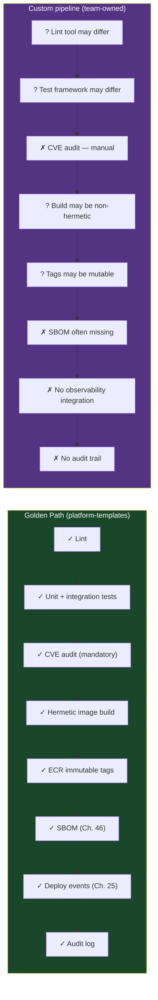
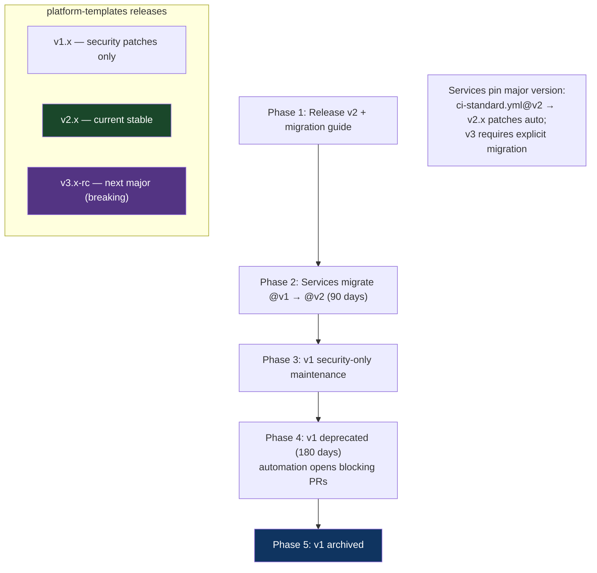

# Chapter 43: The Pipeline-as-Code & Template Pattern
*Part VIII: Pipeline Architecture & Day-Two Operations*

> *"A CVE required adding a dependency scan to every pipeline.
> We had 40 services. Each pipeline was different.
> It took three weeks and four engineers.
> The week after we finished, another CVE required a second change.
> That's when we decided to build a template system."*
> — platform engineering lead at a SaaS company, 2022

---

## The War Story

Sigma Software has 43 microservices, each with its own CI/CD pipeline written by the team that owned the service. The pipelines have diverged over 3 years of organic growth: different test frameworks, different Docker build strategies, different deployment scripts, different secret management patterns. The only thing they share is that they run on GitHub Actions.

In October, a critical vulnerability in a logging library requires adding a dependency audit step to every pipeline. The security team sends a mandate: all services must run `npm audit --audit-level=critical` (or the language-specific equivalent) as a blocking CI gate within 10 business days.

The platform team audits the 43 pipelines. They find:
- 12 use npm, 9 use yarn, 4 use pnpm (JavaScript)
- 8 use Maven, 4 use Gradle (Java)
- 6 use pip with requirements.txt, 3 use poetry (Python)
- 7 use Go modules

That's 7 different dependency management systems, each requiring a different audit command, different output parsing, different failure conditions. Each pipeline needs to be modified individually. Each modification needs to be reviewed by the service team that owns it, tested, and merged.

Three weeks. Four platform engineers. 43 individual PRs. Two missed deadlines. One service that went unpatched for 11 days because the team lead was on vacation and the PR sat unreviewed.

After the incident, the platform team builds a shared pipeline template system. The next mandatory security gate change takes 4 hours and requires a single PR to the template repository.

---

## What You'll Learn

- GitHub Actions reusable workflows: the architecture for shared pipeline logic with versioning
- GitLab CI `include` directives and component catalog
- The "golden path" concept: making the right thing the easy thing
- Template governance: central templates vs. team-owned pipelines with guardrails
- Pipeline testing: how to validate pipeline logic before it runs in production
- Dependency management for pipelines: versioning templates and managing breaking changes

---

## GitHub Actions Reusable Workflows

Reusable workflows allow a called workflow to be invoked from multiple caller workflows with parameterized inputs. This is GitHub Actions' native template mechanism.

```yaml
# .github/workflows/templates/ci-standard.yml
# In the platform team's shared repository: myorg/platform-templates

name: Standard CI Pipeline Template

on:
  workflow_call:
    inputs:
      service_name:
        required: true
        type: string
        description: "Name of the service being built"
      
      language:
        required: true
        type: string
        description: "Language: node, python, java, go"
      
      node_version:
        required: false
        type: string
        default: "20"
        description: "Node.js version (only for language: node)"
      
      run_integration_tests:
        required: false
        type: boolean
        default: false
        description: "Run integration tests (requires additional setup)"
      
      dockerfile_path:
        required: false
        type: string
        default: "Dockerfile"
    
    secrets:
      ECR_REGISTRY:
        required: true
      AWS_ROLE_ARN:
        required: true

jobs:
  lint:
    runs-on: ubuntu-22.04
    steps:
      - uses: actions/checkout@v4
      
      - name: Lint (${{ inputs.language }})
        uses: myorg/platform-templates/.github/actions/lint@v2
        with:
          language: ${{ inputs.language }}
          node_version: ${{ inputs.node_version }}

  test:
    runs-on: ubuntu-22.04
    steps:
      - uses: actions/checkout@v4
      
      - name: Run unit tests
        uses: myorg/platform-templates/.github/actions/test@v2
        with:
          language: ${{ inputs.language }}
          node_version: ${{ inputs.node_version }}
      
      - name: Run integration tests
        if: inputs.run_integration_tests
        uses: myorg/platform-templates/.github/actions/integration-test@v2
        with:
          language: ${{ inputs.language }}

  # MANDATORY: This security gate is not optional.
  # Every service using this template automatically gets dependency auditing.
  # This is the fix for the 3-week incident: adding a gate to the template
  # adds it to all 43 services in one PR.
  dependency-audit:
    runs-on: ubuntu-22.04
    steps:
      - uses: actions/checkout@v4
      
      - name: Dependency audit (${{ inputs.language }})
        uses: myorg/platform-templates/.github/actions/dependency-audit@v2
        with:
          language: ${{ inputs.language }}
          # severity: fail only on critical. Moderate/high are advisory.
          severity: critical
          # This step is blocking — it must pass for the pipeline to proceed.
          # Teams cannot opt out of critical CVE detection.

  build:
    needs: [lint, test, dependency-audit]
    runs-on: ubuntu-22.04
    steps:
      - uses: actions/checkout@v4
      
      - name: Configure AWS credentials
        uses: aws-actions/configure-aws-credentials@v4
        with:
          role-to-assume: ${{ secrets.AWS_ROLE_ARN }}
          aws-region: us-east-1
      
      - name: Build and push container image
        uses: myorg/platform-templates/.github/actions/docker-build@v2
        with:
          image_name: ${{ inputs.service_name }}
          dockerfile: ${{ inputs.dockerfile_path }}
          registry: ${{ secrets.ECR_REGISTRY }}
```

```yaml
# payment-service/.github/workflows/ci.yml
# A service team's pipeline: just 20 lines instead of 200

name: CI

on:
  push:
    branches: [main]
  pull_request:

jobs:
  # Call the platform template.
  # The template handles: lint, test, dependency audit, build, push.
  # The service team provides: service-specific configuration.
  ci:
    uses: myorg/platform-templates/.github/workflows/ci-standard.yml@v2
    with:
      service_name: payment-service
      language: node
      node_version: "20"
      run_integration_tests: true
    secrets:
      ECR_REGISTRY: ${{ secrets.ECR_REGISTRY }}
      AWS_ROLE_ARN: ${{ secrets.AWS_ROLE_ARN }}
```

This is the critical property: when the platform team adds the `dependency-audit` job to `ci-standard.yml` and releases `v2`, every service that uses `@v2` gets the audit automatically. No 43-PR migration required.

---

## Composite Actions: Reusable Steps

For individual steps (rather than full workflows), GitHub Actions composite actions allow packaging multiple steps into a single reusable action:

```yaml
# .github/actions/dependency-audit/action.yml
# In: myorg/platform-templates/.github/actions/dependency-audit/

name: Dependency Audit
description: Run language-appropriate dependency vulnerability audit

inputs:
  language:
    required: true
  severity:
    required: false
    default: critical

runs:
  using: composite
  steps:
    - name: Audit Node.js dependencies
      if: inputs.language == 'node'
      shell: bash
      run: |
        # --audit-level=critical: fail only on CVSS >= 9.0
        # --json: machine-readable output for the summary step
        npm audit --audit-level=${{ inputs.severity }} --json > audit-results.json || {
          # npm audit exits non-zero even for lower severity findings
          # We only want to fail for the specified severity level
          cat audit-results.json | jq '.vulnerabilities | to_entries[] | select(.value.severity == "critical") | .key' > critical-vulns.txt
          if [ -s critical-vulns.txt ]; then
            echo "Critical vulnerabilities found:"
            cat critical-vulns.txt
            exit 1
          fi
          echo "No critical vulnerabilities. Informational findings present (run 'npm audit' locally for details)."
        }

    - name: Audit Python dependencies
      if: inputs.language == 'python'
      shell: bash
      run: |
        pip install pip-audit
        pip-audit --severity=${{ inputs.severity }} --format json > audit-results.json

    - name: Audit Go dependencies
      if: inputs.language == 'go'
      shell: bash
      run: |
        go install golang.org/x/vuln/cmd/govulncheck@latest
        govulncheck ./... -json > audit-results.json

    - name: Audit Java dependencies (Maven)
      if: inputs.language == 'java-maven'
      shell: bash
      run: |
        mvn org.owasp:dependency-check-maven:check \
          -DfailBuildOnCVSS=9 \
          -Dformat=JSON \
          -DoutputDirectory=.

    - name: Upload audit results
      uses: actions/upload-artifact@v4
      with:
        name: dependency-audit-${{ github.run_id }}
        path: audit-results.json
        retention-days: 30
```

---

## The Golden Path

The "golden path" (a term from Backstage/Spotify's platform engineering philosophy) is the opinionated, well-maintained path that platform teams provide for service teams. Using the golden path means: your CI pipeline works correctly, is secure, and handles platform requirements. Deviating from the golden path is allowed but means the service team takes on the maintenance burden.



The golden path provides free compliance: any service on the template automatically satisfies security requirements because those requirements are in the template. Custom pipelines must implement compliance manually.

---

## Template Versioning and Breaking Changes

Pipeline templates must be versioned. A breaking change to a template (removing a step, changing a required input) cannot be applied to all consuming services simultaneously without coordination.



---

## Pipeline Testing

Pipelines are code. They should be tested. Two categories:

**Static validation:** YAML linting and schema validation before the pipeline runs.

```yaml
# .github/workflows/validate-pipeline.yml
# Runs on every PR to the platform-templates repository

jobs:
  validate:
    runs-on: ubuntu-22.04
    steps:
      - uses: actions/checkout@v4

      - name: YAML lint all workflows
        run: |
          pip install yamllint
          yamllint -d relaxed .github/

      - name: Validate GitHub Actions syntax
        uses: reviewdog/action-actionlint@v1
        # actionlint: static analysis for GitHub Actions workflow files
        # Catches: undefined secret references, invalid expression syntax,
        # incorrect action input names, step ID references to non-existent steps

      - name: Validate action input/output contracts
        run: |
          # Custom script: verify that composite actions declare all inputs
          # that their steps use, and all outputs that callers expect
          python scripts/validate_action_contracts.py
```

**Integration testing:** Actually running the pipeline against a test repository.

```yaml
  integration-test:
    runs-on: ubuntu-22.04
    steps:
      - name: Create test repository
        uses: actions/github-script@v7
        with:
          script: |
            // Create a temporary test repo that uses the template
            const repo = await github.rest.repos.createInOrg({
              org: 'myorg',
              name: `template-test-${context.runId}`,
              auto_init: true,
              private: true
            });
            core.setOutput('repo_name', repo.data.name);

      - name: Run template against test repo
        run: |
          # Trigger the template workflow on the test repo
          # and verify it completes successfully
          gh workflow run ci.yml --repo myorg/${{ steps.create.outputs.repo_name }}
          gh run watch --repo myorg/${{ steps.create.outputs.repo_name }}

      - name: Cleanup test repo
        if: always()
        run: gh repo delete myorg/${{ steps.create.outputs.repo_name }} --yes
```

---

## Anti-Patterns

### ❌ Anti-Pattern: 43 Hand-Crafted Pipelines

**What it looks like:** The Sigma Software story. Every service team wrote their own pipeline. No shared templates. Security mandate requires updating 43 pipelines individually.

**The fix:** Shared templates from day one. Services opt into the golden path and get free compliance; custom pipelines take on the maintenance burden.

---

### ❌ Anti-Pattern: Unversioned Templates with Breaking Changes

**What it looks like:** The platform team updates the shared template. Every service that uses it breaks simultaneously because the template changed a required input name.

**The fix:** Semantic versioning for templates. Breaking changes go into a new major version. Services migrate at their own pace within a published deprecation window.

---

### ❌ Anti-Pattern: No Mandatory Gates in Templates

**What it looks like:** The template provides a good default but every step is optional. Teams opt out of the dependency audit because it adds 2 minutes to CI. The audit is present in zero pipelines.

**The fix:** Security gates are not optional in templates. The template design must distinguish between configurable steps (test frameworks, linting rules) and mandatory compliance gates (CVE scanning, SBOM generation, audit logging). Document the distinction explicitly.

---

## Field Notes

💀 **Security mandate requiring N individual PRs** → 3 weeks, missed deadlines, unpatched services → Templates. One PR to the template repository. N services automatically pick it up on next build.

💀 **Template with no versioning** → Breaking changes affect all consumers simultaneously → Semantic versioning. Major = breaking, minor = additive. Services pin to major versions.

💀 **Reusable workflow that can't be tested without running it** → Template regressions discovered in production pipelines → Static validation with actionlint + integration tests against throwaway test repos.

---

## Chapter Summary

Pipeline-as-code templates are the platform engineering solution to the pipeline sprawl problem. Without templates, CI/CD maintenance scales linearly with service count — every compliance change requires N individual modifications. With templates, compliance changes require one template PR and become available to all services on the next build.

The golden path is the product the platform team ships to service teams: an opinionated, well-maintained pipeline that handles compliance, security, and observability by default. Making the golden path easy to adopt is the design challenge; making deviation from it clearly more expensive than adopting it is the governance challenge.

---

## What's Next

Chapter 44 covers the break-glass pattern: what happens when the pipeline is correct, the gates are necessary, but right now, at 11 PM, a critical vulnerability is active and you need to ship a patch in 15 minutes, not 45. The break-glass mechanism allows pipeline bypass with full auditability — and the organizational discipline to ensure that bypass is rare, reviewed, and never becomes the normal path.

[→ Next: Chapter 44 — The Break-Glass (Emergency Hotfix) Pattern](./chapter-44-break-glass-hotfix.md)

---
*[← Previous: Chapter 42 — The ML A/B Testing & Interleaving Pattern](../part-07-mlops-ct/chapter-42-ml-ab-testing-interleaving.md) |
[→ Next: Chapter 44 — The Break-Glass (Emergency Hotfix) Pattern](./chapter-44-break-glass-hotfix.md)*
