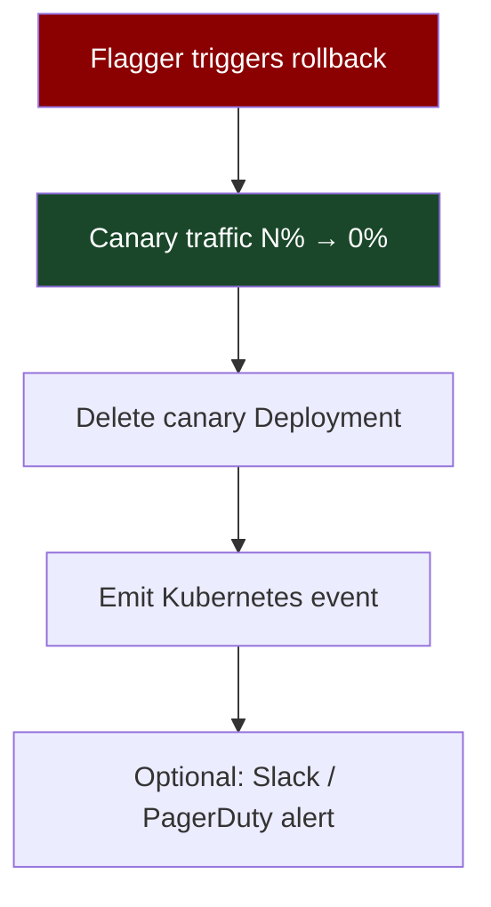

# Chapter 45: The Rollback & Roll-forward Patterns
*Part VIII: Pipeline Architecture & Day-Two Operations*

> *"Just rollback" is the advice of someone who has never
> tried to rollback through a NOT NULL migration
> that ran five minutes ago on a 50-million-row table.*
> — database reliability engineer, talking from experience

---

## The War Story

Friday, 2:47 PM. The payment processing team at Meridian Commerce deploys version 4.1.2 — a new transaction batching feature that improves throughput by 40%. The deployment completes. The team watches the metrics for 10 minutes. Everything looks normal. The team lead marks the deployment complete and signs off for the weekend.

At 3:32 PM, the on-call fires. Payment failure rate is climbing: 2%, 5%, 8%. The error:

```
psycopg2.errors.NotNullViolation: null value in column "batch_id" of relation
"transactions" violates not-null constraint
```

The new code creates transactions with a `batch_id` field. The migration ran at 2:47 PM:

```sql
ALTER TABLE transactions ADD COLUMN batch_id UUID NOT NULL DEFAULT gen_random_uuid();
```

The column was added as NOT NULL, which means any transaction created without `batch_id` — including by any version of the code older than 4.1.2 — will fail.

The on-call runs the rollback: `kubectl rollout undo deployment/payment-processor`. The old code (4.1.1) deploys. The error rate immediately jumps to 40%: old code cannot insert transactions without `batch_id`. The NOT NULL constraint, added by the 4.1.2 migration, is still in place. Rolling back the application binary made things significantly worse.

The on-call rolls back the rollback. Back to 4.1.2. Error rate returns to 8%. Better than 40%, but still degraded. At 4:15 PM (43 minutes into the incident), the database team identifies the actual fix: a transaction_validator bug that, under high concurrency, occasionally submits a transaction without the `batch_id` field despite the code that should populate it. The fix: a one-line null coalescing guard in the validator.

Version 4.1.3 is deployed at 4:38 PM. Error rate drops to 0.1% (residual in-flight transactions). Recovery complete at 4:51 PM. Total incident duration: 79 minutes.

The rollback attempt extended the incident, not shortened it. The incident required a roll-forward.

---

## What You'll Learn

- The rollback decision framework: when rollback is safe and when it will make things worse
- Automated rollback triggers: health check failures, SLO violations, error rate thresholds
- Making rollback safe: artifact retention, database compatibility, state management
- The roll-forward pattern: when fixing forward is faster and safer than reverting
- Kubernetes rollback mechanics: `kubectl rollout undo`, Flagger automatic rollback
- Feature flag kill switches as zero-deployment rollback

---

## The Rollback Decision Framework

Before triggering a rollback, answer three questions:

**Question 1: Is the current version worse than the previous version?**
This sounds obvious, but isn't always. If the current version has a 2% error rate and the previous version also had a 2% error rate (you're rolling back through a change that didn't affect the error rate), rollback accomplishes nothing.

**Question 2: Can the previous version run against the current database schema?**
This is the Meridian Commerce question. If a NOT NULL migration ran, the previous binary cannot run. Rollback will fail.

**Question 3: Is the fix shorter than the rollback + redeployment time?**
If you can write the fix in 10 minutes and the rollback takes 5 minutes of rollback + 5 minutes of observing the rollback + 10 minutes of diagnosing that the rollback made things worse + 5 minutes of rolling forward + 5 minutes of observing... the fix was faster.

```python
# rollback_decision.py

def should_rollback(
    current_error_rate: float,
    previous_error_rate: float,
    schema_migration_ran: bool,
    migration_is_backward_compatible: bool,
    estimated_fix_time_minutes: int,
    rollback_deployment_time_minutes: int
) -> RollbackDecision:
    
    # Hard block: schema migration makes rollback unsafe
    if schema_migration_ran and not migration_is_backward_compatible:
        return RollbackDecision(
            rollback=False,
            reason="Schema migration ran and is not backward-compatible. "
                   "Rolling back the binary without reverting the migration will "
                   "cause the previous binary to fail. Roll forward instead.",
            action="roll_forward"
        )
    
    # No improvement: rollback achieves nothing
    if current_error_rate <= previous_error_rate * 1.1:
        return RollbackDecision(
            rollback=False,
            reason=f"Current error rate ({current_error_rate:.1%}) is not significantly "
                   f"worse than previous ({previous_error_rate:.1%}). "
                   f"Rollback unlikely to improve the situation.",
            action="investigate_and_fix"
        )
    
    # Fix is faster: roll forward
    if estimated_fix_time_minutes < rollback_deployment_time_minutes:
        return RollbackDecision(
            rollback=False,
            reason=f"Estimated fix time ({estimated_fix_time_minutes} min) is less than "
                   f"rollback time ({rollback_deployment_time_minutes} min). "
                   f"Roll forward for faster recovery.",
            action="roll_forward"
        )
    
    # Safe to rollback
    return RollbackDecision(
        rollback=True,
        reason="Schema is backward-compatible, rollback will improve error rate, "
               "and rollback is faster than fixing forward.",
        action="rollback"
    )
```

---

## Automated Rollback Triggers

For Kubernetes deployments, automated rollback should trigger when the health checks fail within the observation window:

```yaml
# kubernetes-deployment-with-rollback.yaml
apiVersion: apps/v1
kind: Deployment
metadata:
  name: payment-processor
spec:
  strategy:
    type: RollingUpdate
    rollingUpdate:
      # maxSurge: deploy 1 new pod before removing old pods
      maxSurge: 1
      # maxUnavailable: keep all old pods running until new pods are ready
      maxUnavailable: 0  # Zero-downtime rolling update
  
  template:
    spec:
      containers:
        - name: payment-processor
          # Readiness probe: pod only receives traffic when this passes
          # If readiness probe fails, the old pods continue receiving traffic
          readinessProbe:
            httpGet:
              path: /ready
              port: 8080
            initialDelaySeconds: 10
            periodSeconds: 5
            failureThreshold: 3   # 3 failures = not ready
            successThreshold: 1
          
          # Liveness probe: if this fails repeatedly, restart the pod
          livenessProbe:
            httpGet:
              path: /health
              port: 8080
            initialDelaySeconds: 30
            periodSeconds: 10
            failureThreshold: 6   # 6 failures = restart pod
```

```bash
# deploy_with_auto_rollback.sh — deployment with automatic rollback on failure

SERVICE=$1
IMAGE_TAG=$2
OBSERVATION_SECONDS=${3:-300}  # Default: 5-minute observation window

# Deploy the new version
kubectl set image deployment/${SERVICE} \
  app=${ECR_REGISTRY}/${SERVICE}:${IMAGE_TAG} \
  -n production

# Wait for the rollout to complete (readiness probes must pass)
if ! kubectl rollout status deployment/${SERVICE} -n production --timeout=5m; then
  echo "Rollout failed — readiness probes didn't pass. Automatic rollback triggered."
  kubectl rollout undo deployment/${SERVICE} -n production
  exit 1
fi

echo "Rollout complete. Observing for ${OBSERVATION_SECONDS} seconds..."

# Monitor error rate during the observation window
START_TIME=$(date +%s)
while [ $(( $(date +%s) - START_TIME )) -lt $OBSERVATION_SECONDS ]; do
  ERROR_RATE=$(query_prometheus \
    "sum(rate(http_requests_total{service='${SERVICE}',status_code=~'5..'}[1m])) / sum(rate(http_requests_total{service='${SERVICE}'}[1m])) * 100")
  
  if (( $(echo "$ERROR_RATE > 2.0" | bc -l) )); then
    echo "Error rate ${ERROR_RATE}% exceeds 2% threshold. Automatic rollback triggered."
    kubectl rollout undo deployment/${SERVICE} -n production
    exit 1
  fi
  
  sleep 30
done

echo "Observation window passed. Deployment ${IMAGE_TAG} is stable."
```

---

## Flagger Automatic Rollback (Canary-Based)

For services using Flagger for canary deployment (Chapter 18), rollback is automatic when the canary's metrics fail:

```yaml
# Flagger Canary with automatic rollback
apiVersion: flagger.app/v1beta1
kind: Canary
spec:
  analysis:
    threshold: 5  # 5 consecutive metric failures → automatic rollback to 0%
    metrics:
      - name: request-success-rate
        thresholdRange:
          min: 99
        interval: 1m
      - name: request-duration
        thresholdRange:
          max: 500
        interval: 30s
  
  # rollback: Flagger automatically rolls back and sends an alert
  # No human intervention required for canary metric failures
```



This is the "rollback happens in seconds" model — because the rollback is a load balancer change (redirect traffic from canary back to stable), not a new deployment.

---

## Feature Flag Kill Switches: Zero-Deployment Rollback

The fastest rollback is not a deployment at all. For features gated behind a feature flag (Chapter 21), disabling the flag is a zero-deployment rollback that takes effect in seconds.

```python
# kill_switch.py — instant feature rollback via LaunchDarkly

def emergency_disable_feature(
    flag_key: str,
    reason: str,
    actor: str
):
    """
    Disable a feature flag immediately for all users.
    This is a zero-deployment rollback — no Kubernetes deployment required.
    Takes effect within seconds of execution.
    """
    
    ld_client = ldclient.get()
    
    # Update the flag to off for all users, all environments
    response = requests.patch(
        f"https://app.launchdarkly.com/api/v2/flags/production/{flag_key}",
        headers={"Authorization": os.environ["LD_API_KEY"]},
        json={
            "comment": f"Emergency kill switch activated. Reason: {reason}. By: {actor}",
            "patch": [
                {"op": "replace", "path": "/environments/production/on", "value": False}
            ]
        }
    )
    
    # Audit log
    write_audit_record({
        "event": "feature_kill_switch",
        "flag_key": flag_key,
        "actor": actor,
        "reason": reason,
        "timestamp": datetime.now().isoformat()
    })
    
    notify_slack(
        channel="#incidents",
        message=f"🚨 Feature kill switch activated\n"
                f"Flag: {flag_key}\nReason: {reason}\nBy: {actor}"
    )
    
    print(f"Feature '{flag_key}' disabled. Kill switch will propagate within 30 seconds.")
```

The kill switch is the first tool to reach for when a deployment introduces a regression on a feature-flagged capability. It takes 30 seconds, requires no deployment pipeline, and provides instant relief while a proper fix is prepared.

---

## What "Just Rollback" Actually Requires

For rollback to work reliably, these preconditions must hold:

**Artifact retention:** The previous version's container image must still exist in the registry. If it was garbage-collected, the rollback target doesn't exist. Set retention policies that keep the last N production images indefinitely.

```bash
# ECR lifecycle policy: keep last 20 production images, never delete tagged
aws ecr put-lifecycle-policy \
  --repository-name payment-processor \
  --lifecycle-policy-text '{
    "rules": [
      {
        "rulePriority": 1,
        "description": "Keep last 20 images for any tag matching v*",
        "selection": {
          "tagStatus": "tagged",
          "tagPrefixList": ["v"],
          "countType": "imageCountMoreThan",
          "countNumber": 20
        },
        "action": {"type": "expire"}
      },
      {
        "rulePriority": 2,
        "description": "Never expire images tagged with git SHAs (production deployments)",
        "selection": {
          "tagStatus": "tagged",
          "tagPrefixList": ["sha-"],
          "countType": "imageCountMoreThan",
          "countNumber": 100
        },
        "action": {"type": "expire"}
      }
    ]
  }'
```

**Database compatibility:** The previous binary must be compatible with the current database schema. This requires the Expand-and-Contract migration pattern (Chapter 27). NOT NULL migrations without a backfill phase make rollback impossible.

**Stateless service design:** Rollback is cleanest for stateless services. Services that maintain in-memory state, connection pools, or local caches may behave unexpectedly when rolled back mid-flight.

---

## Anti-Patterns

### ❌ Anti-Pattern: Reflexive Rollback Without Diagnosis

**What it looks like:** Error rate spikes. On-call immediately triggers rollback. Rollback makes things worse (Meridian Commerce story). Now you've extended the incident.

**The fix:** 60 seconds of diagnosis before rollback. Is the error rate actually caused by the new deployment? Is there a schema migration that would make rollback dangerous? Is there a faster fix available?

---

### ❌ Anti-Pattern: No Artifact Retention Policy

**What it looks like:** `kubectl rollout undo` is issued. The previous image tag was garbage-collected two days ago. The rollback fails because the target doesn't exist.

**The fix:** ECR/GCR lifecycle policies that retain production deployment images for at least 30 days. Production deployment artifacts are never auto-deleted.

---

### ❌ Anti-Pattern: Backward-Incompatible Migrations Before Deployment

**What it looks like:** Migration runs first (changes schema). Old binary immediately fails on the new schema. New binary is deployed. If the new binary has a bug, rollback to old binary fails because old binary can't handle the schema.

**The fix:** Backward-compatible migrations only (Expand-and-Contract, Chapter 27). Migration adds new structure without breaking old code. Old and new binaries can both run on the migrated schema. Rollback is safe.

---

## Field Notes

💀 **"Just rollback"** → Rollback through a NOT NULL migration → Answer the three questions before triggering rollback. Schema compatibility is the most dangerous unknown.

💀 **No feature flag kill switch** → Rollback requires full deployment pipeline (3–15 minutes) → Every production feature should have a feature flag. The kill switch is the 30-second rollback that every deployment-based rollback can't match.

💀 **Garbage-collected rollback target** → kubectl rollout undo fails, no previous image → ECR retention policy: keep last 100 production images. Storage cost is trivial; incident cost is not.

---

## Chapter Summary

Rollback is not a free action. It requires artifact retention, database compatibility, and an understanding of what the previous version actually does against the current state of the world. The decision to rollback vs. roll-forward is a real-time risk calculation with imperfect information, and getting it wrong (as the Meridian Commerce incident showed) extends the incident duration.

The fastest rollback is a feature flag kill switch — zero deployment time, takes effect in 30 seconds, requires no coordination with the deployment pipeline. The next fastest is a canary rollback (Flagger — traffic shift in seconds). A deployment-based rollback is slowest and requires the most preconditions. Design your deployment architecture so that the fastest option is available for most regression scenarios.

---

## What's Next

Chapter 46 closes Part VIII with the supply chain security dimension: what guarantees do you have that the artifact you deployed is the one your CI pipeline built, and that no one tampered with it between build and deploy? Container image signing, SBOM generation, and SLSA provenance attestations are the controls that answer these questions.
