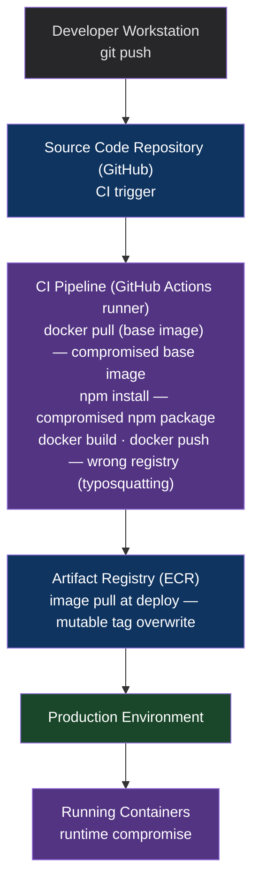

# Chapter 46: The Artifact Registry & Supply Chain Security Pattern
*Part VIII: Pipeline Architecture & Day-Two Operations*

> *"The XZ Utils backdoor was hidden in plain sight for two years.
> The attacker contributed to the project, built trust, and inserted
> the malicious code in a release tarball — not in the git repository.
> The source code was clean. The artifact was not.
> This is the supply chain attack surface most teams ignore."*
> — security researcher commenting on CVE-2024-3094

---

## The War Story

The platform team at Vantage Dynamics performs a quarterly security audit in November. One item on the checklist: "Review container image base dependencies for known vulnerabilities."

The audit reveals something unexpected: the `node:18-alpine` base image used by seven production services was pulled and cached in Vantage's ECR registry on August 3rd. The image has been in use since then — 3 months — without being refreshed. Trivy scanning reveals 14 critical CVEs in the cached image, 11 of which have patches available in the current `node:18-alpine`.

That's the minor finding. The major finding: the SHA256 digest of the cached image in ECR does not match the current SHA256 digest of `node:18-alpine` in Docker Hub. The digests diverged. The ECR cache contains a version of the image that doesn't correspond to any version Vantage intentionally pulled.

Investigation: three months ago, someone on the team ran `docker pull node:18-alpine` on a developer laptop and pushed it to ECR with `docker push $ECR_REGISTRY/node:18-alpine`. The tag was mutable (no immutable tag enforcement in ECR). When someone else later ran the same commands with a newer version of `node:18-alpine`, the ECR image was silently overwritten. The services that were using the cached image were building against an inconsistent, potentially tampered base image.

The digests don't match any known good version. Nobody can explain how the image got to its current state. Nobody knows if it was tampered with.

The response: treat the image as potentially compromised, rebuild all seven services from scratch using a known-good base image, audit all recent deployments from affected services. Three days of work, no confirmed breach, but no ability to prove there wasn't one.

---

## What You'll Learn

- The software supply chain attack surface: where artifacts can be compromised between build and deploy
- Container image signing with Cosign (Sigstore): how to cryptographically verify that an image is what it claims to be
- SBOM (Software Bill of Materials) generation with Syft: a complete inventory of every component in your artifact
- SLSA (Supply-chain Levels for Software Artifacts): the framework for provenance attestation
- Artifact registry security: ECR immutable tags, Artifact Registry policies, JFrog Artifactory
- Dependency confusion and typosquatting attacks: the supply chain attacks your pipeline must defend against

---

## The Supply Chain Attack Surface



The attacks that supply chain security addresses:
- **Compromised base image:** A base image you depend on is modified to include malicious code
- **Compromised package:** A dependency on npm/PyPI/Maven is modified after you included it in your lockfile
- **Mutable tag overwrite:** An image tag (`:latest`, `:v1.2`) is overwritten with a different image
- **Dependency confusion:** A public package with the same name as your private package is published, and your build picks up the wrong one
- **MITM in the registry:** An attacker intercepts the image pull and serves a modified image

---

## Container Image Signing with Cosign

Cosign (part of the Sigstore project) provides cryptographic signing for container images. A signed image can be verified: the signature proves that a specific entity (your CI pipeline) created this exact image at this exact time.

```bash
# In the CI pipeline: sign the image after building and pushing

# Install cosign
curl -O https://github.com/sigstore/cosign/releases/download/v2.2.3/cosign-linux-amd64
chmod +x cosign-linux-amd64
sudo mv cosign-linux-amd64 /usr/local/bin/cosign

# Sign the image using keyless signing (OIDC-based — no key management required)
# The signature is stored in the OCI registry alongside the image
# The signing identity is the GitHub Actions OIDC token for this workflow run

cosign sign \
  --yes \
  --oidc-issuer=https://token.actions.githubusercontent.com \
  "${ECR_REGISTRY}/${SERVICE}@${IMAGE_DIGEST}"
  # Sign by digest, not tag — signing a tag is signing a pointer, not the content
  # The digest (sha256:...) uniquely and immutably identifies the image content
```

```bash
# At deployment: verify the signature before pulling the image

cosign verify \
  --certificate-identity "https://github.com/myorg/my-repo/.github/workflows/ci.yml@refs/heads/main" \
  --certificate-oidc-issuer "https://token.actions.githubusercontent.com" \
  "${ECR_REGISTRY}/${SERVICE}@${IMAGE_DIGEST}"

# Output on success:
# Verification for ${IMAGE_DIGEST} --
# The following checks were performed on each of these signatures:
#   - The cosign claims were validated
#   - Existence of the claims in the transparency log was verified offline
#   - The code-signing certificate claims were validated
# [{"critical":{"identity":{"docker-reference":"..."},...}}]

# Output on failure:
# Error: no matching signatures: ...
# This means: the image was not signed by the expected CI workflow.
# Do NOT deploy this image.
```

Integration with Kubernetes admission control (using Kyverno):

```yaml
# kyverno-policy-verify-signature.yaml
# Cluster admission policy: reject pods with unsigned images
apiVersion: kyverno.io/v1
kind: ClusterPolicy
metadata:
  name: verify-image-signature
spec:
  validationFailureAction: Enforce  # Block unsigned images
  background: false
  rules:
    - name: verify-signature
      match:
        resources:
          kinds: [Pod]
          namespaces: [production, staging]
      verifyImages:
        - imageReferences:
            - "${ECR_REGISTRY}/*"  # Apply to all images from our registry
          attestors:
            - entries:
                - keyless:
                    subject: "https://github.com/myorg/*/.github/workflows/*.yml@refs/heads/main"
                    issuer: "https://token.actions.githubusercontent.com"
                    rekor:
                      url: "https://rekor.sigstore.dev"
```

---

## SBOM Generation with Syft

A Software Bill of Materials (SBOM) is a complete inventory of every software component in your artifact — every library, their versions, their licenses, and their known vulnerabilities. The SBOM is the "ingredient list" for your container image.

```yaml
# CI: generate SBOM after every image build
      - name: Generate SBOM
        run: |
          # Install Syft
          curl -sSfL https://raw.githubusercontent.com/anchore/syft/main/install.sh | sh

          # Generate SBOM in SPDX format (standard, toolchain-agnostic)
          syft "${ECR_REGISTRY}/${SERVICE}:${IMAGE_TAG}" \
            --output spdx-json \
            > sbom.spdx.json

          # Also generate in CycloneDX format (required by some compliance tools)
          syft "${ECR_REGISTRY}/${SERVICE}:${IMAGE_TAG}" \
            --output cyclonedx-json \
            > sbom.cyclonedx.json

      - name: Attach SBOM to image (OCI artifact)
        run: |
          # Attach the SBOM as an OCI artifact alongside the image
          # It can be retrieved later with: cosign download sbom $IMAGE
          cosign attach sbom \
            --sbom sbom.spdx.json \
            --type spdx \
            "${ECR_REGISTRY}/${SERVICE}@${IMAGE_DIGEST}"

      - name: Scan SBOM for vulnerabilities
        run: |
          # Grype: vulnerability scanner that accepts SBOM as input
          grype sbom:./sbom.spdx.json \
            --fail-on critical \
            --output json \
            > vulnerability-scan.json

          # Fail the build if critical vulnerabilities found
          CRITICAL_COUNT=$(cat vulnerability-scan.json | jq '[.matches[] | select(.vulnerability.severity == "Critical")] | length')
          if [ "$CRITICAL_COUNT" -gt 0 ]; then
            echo "FAILED: $CRITICAL_COUNT critical vulnerabilities in SBOM"
            cat vulnerability-scan.json | jq '.matches[] | select(.vulnerability.severity == "Critical") | {id: .vulnerability.id, package: .artifact.name, version: .artifact.version}'
            exit 1
          fi

      - name: Upload SBOM as build artifact
        uses: actions/upload-artifact@v4
        with:
          name: sbom-${{ github.sha }}
          path: |
            sbom.spdx.json
            sbom.cyclonedx.json
            vulnerability-scan.json
          retention-days: 365  # Keep for 1 year for compliance
```

---

## SLSA Provenance Attestations

SLSA (Supply-chain Levels for Software Artifacts, pronounced "salsa") is a framework for progressively improving build provenance. A SLSA provenance attestation answers: "I certify that this artifact was built by this system from this source code at this time using these inputs."

SLSA levels:
- **SLSA 1:** Provenance exists (some documentation of how the artifact was built)
- **SLSA 2:** Hosted build service produced the provenance (not a developer's laptop)
- **SLSA 3:** Hardened build service with non-falsifiable provenance (the build service itself enforces the provenance)
- **SLSA 4:** Two-party review + hermetic builds (strictest — used by Google's internal builds)

```yaml
# GitHub Actions SLSA provenance generation (SLSA 3 achievable)
jobs:
  build:
    outputs:
      image_digest: ${{ steps.build.outputs.digest }}
    steps:
      - name: Build and push
        id: build
        uses: docker/build-push-action@v5
        with:
          push: true
          tags: ${{ env.REGISTRY }}/${{ env.IMAGE_NAME }}:${{ github.sha }}

  # Generate SLSA provenance using the official SLSA GitHub generator
  # This generates a provenance attestation signed by the GitHub OIDC token
  provenance:
    needs: build
    permissions:
      actions: read
      id-token: write
      packages: write
    uses: slsa-framework/slsa-github-generator/.github/workflows/generator_container_slsa3.yml@v1.9.0
    with:
      image: ${{ needs.build.outputs.image_digest }}
      registry-username: ${{ github.actor }}
    secrets:
      registry-password: ${{ secrets.GITHUB_TOKEN }}
```

The provenance attestation records:
- The source repository and commit SHA
- The exact GitHub Actions workflow that triggered the build
- The time of the build
- The specific runner configuration
- All environment variables (sanitized)

This attestation can be verified to confirm that a production image was built from your CI pipeline and not from a compromised developer workstation or a tampered registry.

---

## Defending Against Dependency Confusion

Dependency confusion attacks occur when a private package name is also published to a public registry. Your build system may pick up the public (malicious) version instead of your private (legitimate) one.

```bash
# npm: configure to prefer private registry
# .npmrc (committed to repo)
registry=https://npm.pkg.github.com/myorg
@myorg:registry=https://npm.pkg.github.com/myorg

# pip: configure trusted indexes
# pip.conf or pyproject.toml
[global]
index-url = https://pypi.mycompany.com/simple/
extra-index-url = https://pypi.org/simple/
trusted-host = pypi.mycompany.com

# go: configure module proxy
# go.env
GOPROXY=https://goproxy.mycompany.com,direct
GONOSUMCHECK=*.mycompany.internal

# Hermetic builds prevent this by pinning exact versions with content hashes
# (requirements.txt with --require-hashes, package-lock.json with integrity, go.sum)
```

---

## Immutable Tags in Artifact Registries

The Vantage Dynamics incident was enabled by mutable ECR tags. Enable immutable tags:

```bash
# AWS ECR: enable immutable tags for a repository
aws ecr put-image-tag-mutability \
  --repository-name payment-processor \
  --image-tag-mutability IMMUTABLE

# GCP Artifact Registry: enable immutable tags
gcloud artifacts repositories update my-repo \
  --location=us-east1 \
  --immutable-tags

# After enabling: pushing to an existing tag returns an error
# docker push myregistry/service:v1.2.3
# Error: The image tag v1.2.3 already exists and is immutable.
```

---

## Anti-Patterns

### ❌ Anti-Pattern: Pulling Base Images Without Digest Pinning

**What it looks like:** `FROM node:18-alpine` — the tag is pulled fresh at every build. Yesterday's build and today's build may use different base images.

**What breaks:** Hermetic builds, reproducibility, and supply chain security. A compromised base image reaches production automatically.

**The fix:** `FROM node:18.19.0-alpine3.19@sha256:...` — pin by digest. The digest is the content hash — if the digest matches, the content is identical. Automate digest refresh with Dependabot or Renovate.

---

### ❌ Anti-Pattern: No SBOM Generation

**What it looks like:** "We scan images for CVEs." Scanning without SBOM loses the component-level detail. You know a CVE exists in the image; you don't know which component it's in or how it got there.

**The fix:** Generate SBOMs with Syft at build time, attach to the image as an OCI artifact, scan the SBOM with Grype. The SBOM is the artifact; the scan is the gate.

---

### ❌ Anti-Pattern: Signing Images with a Stored Key

**What it looks like:** A signing key is stored in GitHub Secrets. The key is used to sign all images. If the key is leaked, an attacker can sign arbitrary images.

**The fix:** Keyless signing with Cosign + OIDC. The signing identity is bound to the specific GitHub Actions workflow run — it cannot be used to sign from outside that workflow. There's no key to leak.

---

## Field Notes

💀 **Mutable image tags in production registry** → Silent image replacement, undetectable tampering → Enable immutable tags in ECR/GCR. Takes 30 seconds. Makes the Vantage incident impossible.

💀 **Deploying without signature verification** → Compromised image reaches production undetected → Verify Cosign signatures at admission control (Kyverno policy). Unsigned images do not run in production.

💀 **No SBOM for deployed services** → A new CVE is disclosed; you don't know which services are affected → SBOM attached to every image at build time. Given a CVE, query the SBOM registry to find all affected services in minutes.

---

## Chapter Summary

Supply chain security is the class of attacks that targets the pipeline rather than the application. Every step between source code commit and running production container is an attack surface: the base image, the package registry, the CI runner, the artifact registry, the image tag. The defenses are layered: hermetic builds with pinned digests eliminate base image drift, lockfiles with integrity hashes eliminate package substitution, immutable tags prevent registry overwrite, Cosign signing proves provenance, and SLSA attestations provide non-falsifiable audit trails. No single control is sufficient; all are necessary for a defense-in-depth supply chain security posture.

Part VIII is complete. The pipeline architecture patterns — templates, break-glass, rollback, and supply chain — are the operational discipline that transforms a working CI/CD system into a production-grade, auditable, and secure delivery infrastructure.

---

## What's Next

Part IX enters planetary-scale release engineering: the patterns used by Google, Netflix, and Meta to ship to hundreds of millions of users while maintaining sub-1% change failure rates. Chapter 47 opens with merge queues — the speculative pre-submit testing that keeps a monorepo's main branch perpetually green even with thousands of commits per day.

[→ Next: Chapter 47 — The Merge Queue (Pre-Submit) Pattern](../part-09-planetary-scale/chapter-47-merge-queue-pre-submit.md)

---
*[← Previous: Chapter 45 — The Rollback & Roll-forward Patterns](./chapter-45-rollback-roll-forward.md) |
[→ Next: Chapter 47 — The Merge Queue (Pre-Submit) Pattern](../part-09-planetary-scale/chapter-47-merge-queue-pre-submit.md)*
