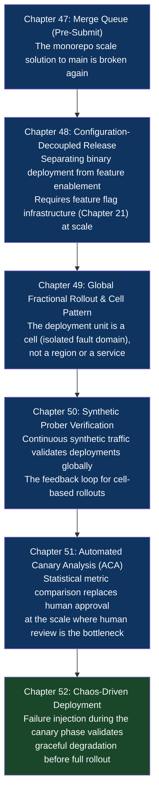

# Part IX: Planetary-Scale Release Engineering

## What This Part Is About

At a certain scale, the patterns in earlier parts of this book are necessary but insufficient. A team of 10 can maintain a green main branch through discipline and communication. A team of 10,000 committing to a monorepo cannot — the combinatorial explosion of parallel changes means main breaks continuously without mechanical enforcement. A startup can deploy to two regions and manage the coordination manually. A global platform with 500 million users cannot afford a 4-minute global deployment window where regions are inconsistent. A team with 20 services can run canary analysis by watching dashboards. A team with 2,000 services needs that analysis to be automated, statistical, and self-acting.

This part covers the patterns that emerged from organizations that hit those walls: Google, Netflix, Amazon, Meta, Microsoft. These patterns are documented here not because every reader needs them today, but because:

1. They reveal the logical extension of every pattern in the earlier parts — the "what does this become at 1000x scale" answer
2. Several of them have become accessible to mid-scale teams through open source (Kayenta for ACA, Chaos Mesh for chaos testing, GitHub Merge Queue for pre-submit)
3. Understanding them changes how you design systems today — the cell architecture influences service design at any scale

## Chapter Map

## Chapters in This Part

| Chapter | Title | Core Question Answered |
|---|---|---|
| [47](./chapter-47-merge-queue-pre-submit.md) | The Merge Queue (Pre-Submit) Pattern | How do you keep main permanently green with thousands of commits per day? |
| [48](./chapter-48-config-decoupled-release.md) | The Configuration-Decoupled Release Pattern | How do you change behavior without deploying a new binary? |
| [49](./chapter-49-global-fractional-rollout-cell.md) | The Global Fractional Rollout & Cell Pattern | How do you deploy to a mathematically precise fraction of global traffic? |
| [50](./chapter-50-synthetic-prober-verification.md) | The Synthetic Prober Verification Pattern | How do you verify a deployment is healthy globally, not just locally? |
| [51](./chapter-51-automated-canary-analysis.md) | The Automated Canary Analysis (ACA) Pattern | How do you automate the canary promotion/rollback decision with statistical rigor? |
| [52](./chapter-52-chaos-driven-deployment.md) | The Chaos-Driven Deployment Pattern | How do you verify graceful degradation during a rollout before it reaches full traffic? |
