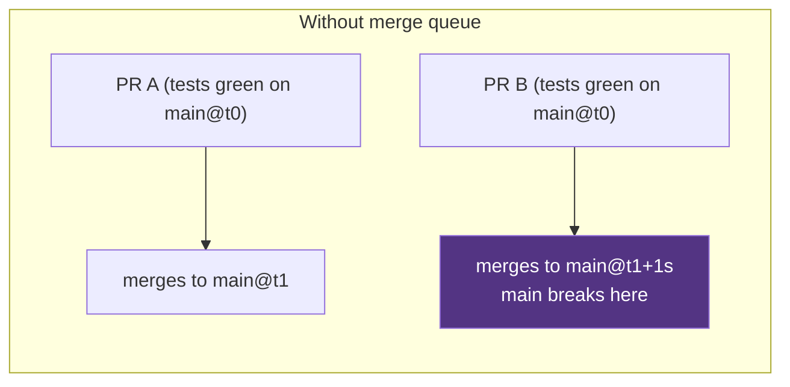
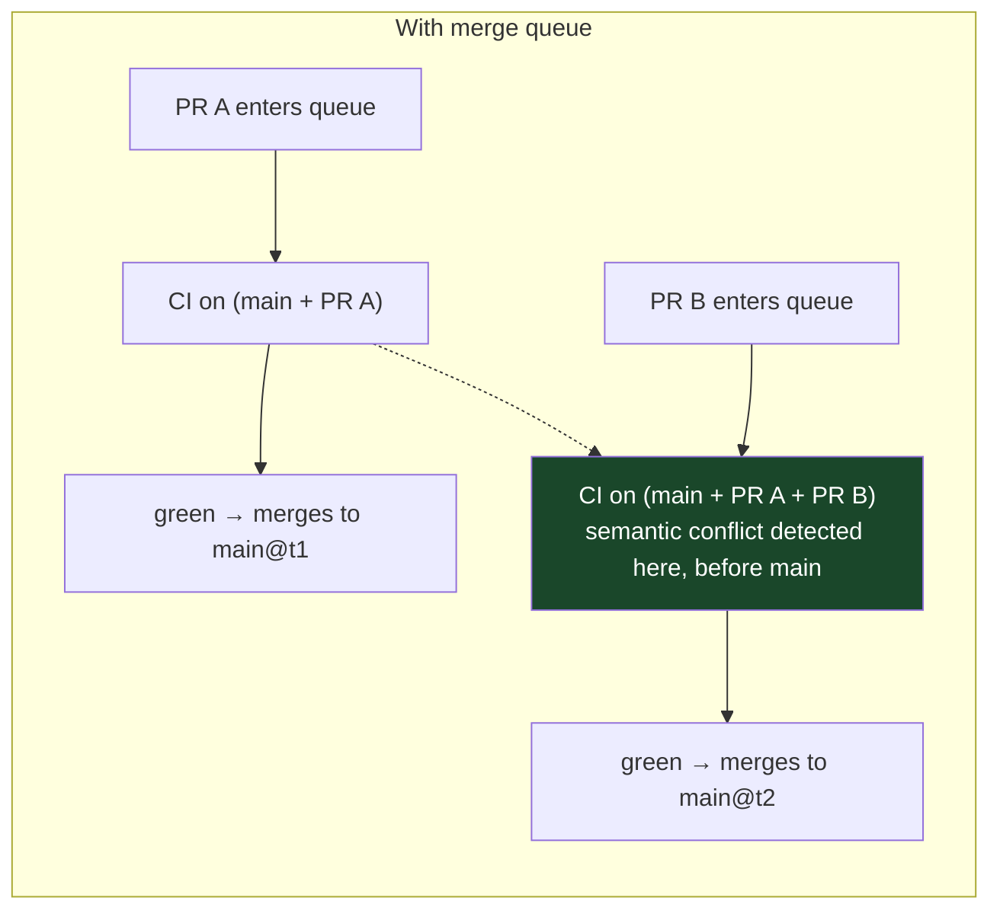

# Chapter 47: The Merge Queue (Pre-Submit) Pattern
*Part IX: Planetary-Scale Release Engineering*

> *"Main broke 7 times today. That's Tuesday.
> Last Tuesday it broke 9 times.
> We have 340 engineers. The time to diagnose and fix a broken main
> is about 45 minutes per break. You do the math.
> We spent 6.75 engineer-hours today on 'main is broken.'
> That's not a people problem. That's a pipeline architecture problem."*
> — engineering director at a high-growth startup, 2022

---

## The War Story

Vertex Software has grown from 40 to 340 engineers over 18 months. Their main branch breaks 5–9 times per week. The pattern is always the same: two PRs, each passing CI independently, conflict when merged together.

PR #1847: changes the user authentication middleware to reject malformed JWT tokens (previously it was silently passing them). Tests pass — all existing tests use valid JWTs.

PR #1923: changes the user profile endpoint's test to use a malformed JWT to test error handling. Tests pass — the test expects the malformed JWT to be rejected, which it is.

Both PRs are green. Both are approved. PR #1847 merges at 2:15 PM. PR #1923 merges at 2:17 PM. Main breaks: the profile endpoint test now fails because the authentication middleware (updated by #1847) rejects the malformed JWT before it reaches the profile endpoint (tested by #1923). Neither PR is wrong; they conflict.

The engineering manager does the math: 7 breaks × 45 minutes × 340 engineers distracted = effectively 2.1 engineer-days of lost productivity. Per week. Every week.

The fix is not a cultural intervention ("be more careful about merging") — culture doesn't scale to 340 engineers. The fix is mechanical: a merge queue that tests PRs after all previously approved PRs have been speculatively combined.

---

## What You'll Learn

- The merge queue model: how speculative execution prevents the semantic conflict problem
- GitHub Merge Queue and Mergify: implementation and configuration
- GitLab Merge Trains: the GitLab equivalent
- Batching strategies: when to combine multiple PRs in a single CI run
- The mathematics of merge queue throughput: batch size vs. failure probability vs. CI capacity
- When merge queues are necessary vs. overkill

---

## The Core Problem: Semantic Conflicts

A merge queue addresses *semantic conflicts* — conflicts that pass independent CI but fail when combined. These are distinct from *syntactic conflicts* (Git merge conflicts that prevent automated merging) which are visible before CI runs.

Without a merge queue:



With a merge queue:



The merge queue tests each PR's merge result against the queue's projected future state, not the current main branch. When PR B is tested, it runs against main + PR A — the state that main will be in when PR A merges. If that combined test fails, PR B is ejected from the queue (and must be fixed) before it can merge.

---

## Implementation: GitHub Merge Queue

GitHub Merge Queue (available in GitHub Teams/Enterprise since 2023) is the native implementation. Configuration in the repository's branch protection rules:

```yaml
# .github/workflows/merge-queue.yml
# This workflow runs when a PR is added to the merge queue.
# It receives merge_group as the trigger — GitHub creates a temporary
# branch that contains main + all queued PRs + this PR.

name: Merge Queue CI

on:
  merge_group:  # Triggered when PR enters the merge queue
    types: [checks_requested]

jobs:
  # This job runs against the merge group — the projected merge result.
  # If it fails, this PR is ejected from the queue.
  # Other PRs continue through the queue.
  test-merged-result:
    runs-on: ubuntu-22.04
    steps:
      - uses: actions/checkout@v4
        # checkout@v4 automatically checks out the merge group ref
        # which contains main + all queued PRs + this PR

      - name: Run full test suite
        run: |
          # Run the complete test suite against the merged result.
          # This is more expensive than PR CI (runs all tests, not TIA-selected)
          # because the merge queue is the final gate before main.
          make test-all

      - name: Build
        run: make build

      - name: Run integration tests
        run: make integration-test
```

Branch protection rule configuration (in repository settings or via GitHub API):

```python
import requests

# Enable merge queue via GitHub API
response = requests.put(
    f"https://api.github.com/repos/myorg/myrepo/rulesets",
    headers={
        "Authorization": f"token {GITHUB_TOKEN}",
        "Accept": "application/vnd.github.v3+json"
    },
    json={
        "name": "main branch protection",
        "target": "branch",
        "enforcement": "active",
        "conditions": {
            "ref_name": {
                "include": ["refs/heads/main"],
                "exclude": []
            }
        },
        "rules": [
            {
                "type": "merge_queue",
                "parameters": {
                    # Minimum 1 PR before a batch runs
                    # (setting to 1 means each PR gets its own CI run)
                    "min_entries_to_merge": 1,
                    # Maximum PRs batched in a single CI run
                    # Higher = fewer CI runs = lower cost but higher blast radius if CI fails
                    "max_entries_to_merge": 5,
                    # Merge method: squash, merge, or rebase
                    "merge_method": "squash",
                    # If CI fails: eject only the failing PR, retry the rest
                    "check_response_timeout_minutes": 60
                }
            },
            {
                "type": "required_status_checks",
                "parameters": {
                    "strict_required_status_checks_policy": True,
                    "required_status_checks": [
                        {"context": "test-merged-result"}
                    ]
                }
            }
        ]
    }
)
```

---

## Mergify: Advanced Queue Strategies

Mergify (open source + managed service) provides more sophisticated queue configurations than GitHub's native merge queue:

```yaml
# .mergify.yml — advanced merge queue configuration

queue_rules:
  - name: default
    # Conditions that a PR must satisfy to enter the queue
    merge_conditions:
      - "#approved-reviews-by >= 1"  # At least 1 approval
      - "check-success=test-merged-result"
      - "label!=do-not-merge"

    # Speculative checks: run CI before all queued PRs are merged
    # This is the core semantic conflict detection
    speculative_checks: 3  # Test up to 3 PRs speculatively

    # Batching: combine multiple PRs in a single CI run to reduce cost
    # batch_size: how many PRs to combine
    # batch_max_wait_time: how long to wait for additional PRs before running
    batch_size: 5
    batch_max_wait_time: 10 min  # Wait up to 10 minutes for more PRs to batch

pull_request_rules:
  - name: Auto-add to merge queue when approved
    conditions:
      - "approved-reviews-by >= 1"
      - "check-success=ci"
      - "-draft"
      - "-conflict"
    actions:
      queue:
        name: default
        method: squash
```

---

## The Mathematics of Merge Queue Throughput

The merge queue imposes a throughput limit. Understanding the math helps right-size the configuration:

```python
def merge_queue_throughput(
    ci_duration_minutes: float,
    batch_size: int,
    parallel_queues: int,
    pr_failure_rate: float  # Fraction of PRs that fail CI
) -> dict:
    """
    Calculate merge queue throughput and expected queue depth.
    
    Without batching: 1 PR per CI_DURATION_MINUTES
    With batch_size=5: 5 PRs per CI_DURATION_MINUTES (if all pass)
    With failure rate: each failure ejects PRs from the batch and requires re-runs
    """
    
    # Base throughput: PRs merged per hour
    base_throughput = (60 / ci_duration_minutes) * batch_size * parallel_queues
    
    # Adjust for failure rate: when a batch fails, the non-failing PRs
    # are retested individually (worst case: each PR gets its own CI run)
    # Expected additional CI runs due to failures:
    failure_overhead = pr_failure_rate * batch_size  # Average PRs retested per batch failure
    effective_batch_size = batch_size * (1 - pr_failure_rate)
    
    adjusted_throughput = (60 / ci_duration_minutes) * effective_batch_size * parallel_queues
    
    return {
        "max_prs_per_hour": base_throughput,
        "adjusted_prs_per_hour": adjusted_throughput,
        "bottleneck_at_team_size": adjusted_throughput / 3,  # Assuming 3 PRs/engineer/day
    }

# Example: 340-engineer team
result = merge_queue_throughput(
    ci_duration_minutes=15,  # 15-min CI with TIA
    batch_size=5,
    parallel_queues=1,
    pr_failure_rate=0.05  # 5% of PRs fail CI
)
print(result)
# max_prs_per_hour: 20
# adjusted_prs_per_hour: 19
# bottleneck_at_team_size: 6.3 engineers

# At 340 engineers with 3 PRs/day = ~21 PRs/hour peak
# This is right at the throughput limit.
# Solution: reduce CI time (TIA) or add parallel queues (multiple merge targets)
```

The insight: at high engineer counts, CI duration becomes the system's throughput bottleneck. A 15-minute CI with a batch size of 5 supports ~6 engineers before queuing. The solutions are faster CI (TIA, build cache) or batching larger groups.

---

## GitLab Merge Trains

GitLab's equivalent is Merge Trains: a sequence of MRs that are tested in series, each against the projected state of the branch after all previous MRs in the train merge.

```yaml
# .gitlab-ci.yml with merge train support
include:
  - template: Jobs/MergeRequest.latest.gitlab-ci.yml

variables:
  # Enable pipeline-for-merged-results: run CI against the merged result,
  # not just the MR branch
  CI_MERGE_REQUEST_EVENT_TYPE: "merge_train"

merge_train_job:
  stage: test
  script:
    - make test-all
  # This job only runs for merge train pipelines
  rules:
    - if: '$CI_MERGE_REQUEST_EVENT_TYPE == "merge_train"'
    - if: '$CI_PIPELINE_SOURCE == "merge_request_event"'
```

---

## When Merge Queues Are Not Worth It

Merge queues add latency to the merge process (PRs must wait for their CI run in the queue) and complexity to the pipeline configuration. They're the right solution when:

- **Main breaks more than 2–3 times per week** from semantic conflicts
- **Team size exceeds ~50 engineers** actively committing to a shared branch
- **CI runs in <30 minutes** (longer CI makes the queue latency prohibitive)

They're overkill when:
- Small teams (< 20 engineers) where communication prevents most conflicts
- Slow CI (>30 minutes) where queue latency compounds unacceptably
- Feature-branch development where main is updated only for releases

The controversial take: **merge queues are not a substitute for trunk-based development with feature flags** (Chapter 2, 21). Teams that use long-lived feature branches and batch merges at sprint end don't need a merge queue — they need to stop using long-lived branches. The merge queue's value is specifically for trunk-based teams where frequent small merges cause integration conflicts.

---

## Anti-Patterns

### ❌ Anti-Pattern: Merge Queue with 60-Minute CI

**What it looks like:** A merge queue configured with batch_size=1 and a 60-minute CI pipeline. Each PR waits 60 minutes in queue + CI time. With 20 engineers committing daily, PRs wait 4+ hours.

**What breaks:** Developer productivity. The merge queue becomes the bottleneck, not the solution.

**The fix:** Reduce CI time to <15 minutes (TIA, build cache, fan-out) before implementing a merge queue. A merge queue amplifies both good and bad CI performance.

---

### ❌ Anti-Pattern: No Merge Queue with 300+ Engineers

**What it looks like:** "We use communication to avoid main breaks." This worked at 40 engineers. It does not work at 340 engineers.

**What breaks:** Main breaks 5–9 times weekly (the Vertex Software story). Each break costs 45 minutes across the team.

**The fix:** Implement a merge queue. The automation cost is one-time; the productivity recovery is daily.

---

## Field Notes

💀 **Main breaks repeatedly from semantic conflicts** → 6.75 engineer-hours/day lost to diagnosis → Merge queue. The math is inexorable: N engineers × break frequency × diagnosis time > merge queue setup cost very quickly.

💀 **Merge queue with batch_size=10 and 10% CI failure rate** → Every batch failure ejects 9 good PRs that need re-run → Keep batch_size conservative (3–5). The cost savings from batching are outweighed by the re-run cost when failure rate is high.

---

## Chapter Summary

The merge queue converts the speculative execution model of CPU branch prediction into a software delivery pattern: test the future state, not the current state. When PR B is added to the queue, it runs against main + all queued PRs — the state main will be in when B's turn comes. Semantic conflicts surface in the queue, not in production. At 340 engineers with 7 breaks per week and 45 minutes of lost productivity per break, the ROI calculation is not subtle.
