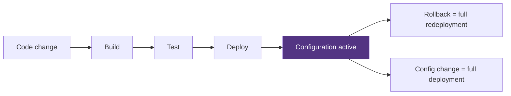
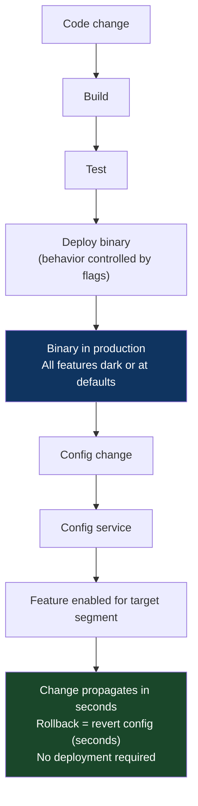

# Chapter 48: The Configuration-Decoupled Release Pattern
*Part IX: Planetary-Scale Release Engineering*

> *"We needed to change one rate limit value. One integer.
> The next planned deployment was three weeks away.
> We shipped an entire release to change `max_requests_per_minute = 1000`
> to `max_requests_per_minute = 2000`.
> The deployment took 45 minutes and required two approvals.
> There has to be a better way."*
> — backend engineer at an enterprise SaaS platform

---

## The War Story

Apex Analytics provides a data processing API to 2,400 enterprise customers. In November, a large customer reports that their batch jobs are hitting the API's rate limit of 1,000 requests per minute. The limit was set 18 months ago when the infrastructure was less capable. Current infrastructure can easily handle 2,000 RPM for enterprise customers.

The fix is trivial: change one number in one configuration file. The problem: that configuration file is baked into the application binary. Changing it requires:

1. Code change (update the constant)
2. Code review and approval
3. CI pipeline: 38 minutes
4. Staging deployment and observation: 45 minutes
5. Production approval gate (2 approvers)
6. Production deployment: 12 minutes
7. Production verification: 15 minutes

Total: ~3 hours for a one-integer change. The customer has a critical batch job that runs in 4 hours. They miss their window.

Worse: the rate limit is a customer-specific value. Enterprise customer A needs 2,000 RPM. Enterprise customer B has a contract specifying 500 RPM. Enterprise customer C wants 5,000 RPM. If configuration is in the binary, the only way to have per-customer limits is to deploy different binaries to different customers — which is operationally insane.

The solution: configuration-decoupled releases. The rate limit is a runtime configuration value, loaded from a configuration service at runtime. Changing it requires no deployment: update the config, it propagates in seconds, customers see the new limit immediately.

---

## What You'll Learn

- The configuration-decoupled release model: separating binary deployment from behavioral configuration
- Runtime configuration services: AWS AppConfig, Google Cloud Runtime Configurator, etcd, LaunchDarkly
- Configuration-as-code with separate promotion pipelines
- Per-customer and per-segment configuration: targeting specific users without deployment
- The risk model: what configuration changes can break production without a deployment safety net
- Configuration drift detection and rollback

---

## The Decoupling Model

In the coupled model, binary deployment and configuration change are the same event:



In the decoupled model, they're independent:



The key operational benefits:

**Decoupled release risk.** The binary deployment risk is separate from the feature activation risk. Deploy the binary first (dark, no user impact). Activate the feature when ready. Rollback if needed — no redeployment.

**Instant configuration changes.** Rate limits, timeouts, feature flags, A/B test weights, circuit breaker thresholds — all can change in seconds with no deployment pipeline involved.

**Per-customer configuration without per-customer deployments.** Customer A gets rate_limit=2000, Customer B gets rate_limit=500, from the same binary, via runtime configuration.

---

## Implementation: AWS AppConfig

AWS AppConfig is a managed configuration service that supports versioned configuration, staged rollouts, and validation before propagation:

```python
# config_loader.py — load configuration from AWS AppConfig at runtime

import boto3
import json
from functools import lru_cache
from threading import Thread
import time

class AppConfigLoader:
    def __init__(
        self,
        app_name: str,
        env_name: str,
        config_profile: str,
        refresh_interval_seconds: int = 30
    ):
        self.client = boto3.client('appconfigdata', region_name='us-east-1')
        self.session_token = None
        self._config = {}
        self._last_refreshed = None
        
        # Initialize session
        response = self.client.start_configuration_session(
            ApplicationIdentifier=app_name,
            EnvironmentIdentifier=env_name,
            ConfigurationProfileIdentifier=config_profile,
            RequiredMinimumPollIntervalInSeconds=15
        )
        self.session_token = response['InitialConfigurationToken']
        
        # Load initial configuration
        self._refresh_config()
        
        # Start background polling thread
        Thread(target=self._poll_config, daemon=True).start()
    
    def _refresh_config(self):
        """Fetch latest configuration from AppConfig."""
        try:
            response = self.client.get_latest_configuration(
                ConfigurationToken=self.session_token
            )
            # Next token for subsequent requests
            self.session_token = response['NextPollConfigurationToken']
            
            if response['Configuration'].read():
                # Configuration changed — update in memory
                self._config = json.loads(response['Configuration'].read())
                self._last_refreshed = time.time()
                
        except Exception as e:
            # Log but don't crash — use last known configuration
            print(f"AppConfig refresh failed: {e}. Using cached config.")
    
    def _poll_config(self):
        """Background polling thread — refresh config on interval."""
        while True:
            time.sleep(30)  # Poll every 30 seconds
            self._refresh_config()
    
    def get(self, key: str, default=None):
        """Get a configuration value by key."""
        return self._config.get(key, default)


# Initialize once at application startup
config = AppConfigLoader(
    app_name="apex-analytics-api",
    env_name="production",
    config_profile="api-settings"
)

# Usage in the rate limiter
def check_rate_limit(customer_id: str, requests_this_minute: int) -> bool:
    # Configuration loaded at runtime, not from the binary
    customer_tier = get_customer_tier(customer_id)  # "enterprise", "standard", "free"
    
    # Per-tier limits — all runtime configuration, no deployment required to change
    tier_limits = config.get("rate_limits", {
        "enterprise": 1000,
        "standard": 100,
        "free": 10
    })
    
    limit = tier_limits.get(customer_tier, 10)
    return requests_this_minute < limit
```

### AppConfig with Staged Rollout

AppConfig supports deployment strategies — rolling out configuration changes progressively:

```python
# deploy_config.py — deploy a configuration change via AppConfig

import boto3

def deploy_config_change(
    app_name: str,
    env_name: str,
    config_profile: str,
    new_config: dict,
    description: str,
    # Deployment strategy: control how fast the change propagates
    # Options: AppConfig.AllAtOnce, AppConfig.Linear50PercentEvery30Seconds,
    #          AppConfig.Canary10Percent20Minutes
    strategy: str = "AppConfig.Linear50PercentEvery30Seconds"
):
    client = boto3.client('appconfig')
    
    # Create a new hosted configuration version
    version = client.create_hosted_configuration_version(
        ApplicationId=app_name,
        ConfigurationProfileId=config_profile,
        Content=json.dumps(new_config).encode(),
        ContentType='application/json',
        Description=description
    )
    
    # Start a deployment with the progressive strategy
    deployment = client.start_deployment(
        ApplicationId=app_name,
        EnvironmentId=env_name,
        DeploymentStrategyId=strategy,  # 50% every 30 seconds = full rollout in 60s
        ConfigurationProfileId=config_profile,
        ConfigurationVersion=version['VersionNumber'],
        Description=description
    )
    
    return deployment['DeploymentNumber']

# Example: change the rate limit for enterprise tier
deploy_config_change(
    app_name="apex-analytics-api",
    env_name="production",
    config_profile="api-settings",
    new_config={
        "rate_limits": {
            "enterprise": 2000,  # Changed from 1000 to 2000
            "standard": 100,
            "free": 10
        }
    },
    description="Increase enterprise rate limit per customer request - ticket #4521",
    strategy="AppConfig.Linear50PercentEvery30Seconds"
)
```

---

## etcd for Real-Time Configuration in High-Throughput Services

For services requiring sub-millisecond configuration propagation (latency-sensitive services, trading systems, gaming backends), etcd provides distributed key-value storage with watch-based change notification:

```python
# etcd_config.py — real-time configuration with watch-based propagation

import etcd3
import json

class EtcdConfig:
    def __init__(self, etcd_host: str, prefix: str = "/config/api/"):
        self.client = etcd3.client(host=etcd_host)
        self.prefix = prefix
        self._cache = {}
        
        # Load all config under the prefix
        for value, metadata in self.client.get_prefix(prefix):
            key = metadata.key.decode().replace(prefix, "")
            self._cache[key] = json.loads(value.decode())
        
        # Watch for changes — propagates in <10ms
        self._watch_thread = self.client.add_watch_prefix_callback(
            prefix,
            self._on_config_change
        )
    
    def _on_config_change(self, event):
        """Called immediately when any config key changes."""
        for change in event.events:
            key = change.key.decode().replace(self.prefix, "")
            if isinstance(change, etcd3.events.PutEvent):
                self._cache[key] = json.loads(change.value.decode())
                print(f"Config updated: {key} = {self._cache[key]}")
            elif isinstance(change, etcd3.events.DeleteEvent):
                self._cache.pop(key, None)
    
    def get(self, key: str, default=None):
        return self._cache.get(key, default)
```

---

## Configuration-as-Code with Separate Promotion

Configuration changes should follow a promotion pipeline similar to application changes: dev → staging → production. This prevents a configuration change from bypassing the normal review and testing process.

```yaml
# .github/workflows/config-deploy.yml
# Configuration has its own pipeline, separate from the application pipeline.
# Configuration is code — it must be reviewed and tested before production.

name: Configuration Deploy

on:
  push:
    branches: [main]
    paths:
      - 'config/**'  # Only trigger when config files change

jobs:
  validate-config:
    runs-on: ubuntu-22.04
    steps:
      - uses: actions/checkout@v4
      
      - name: Validate configuration schema
        run: |
          # JSON Schema validation: config values must satisfy type and range constraints
          # This prevents "rate_limits.enterprise": "two thousand" (string instead of int)
          python scripts/validate_config_schema.py config/api-settings.json schemas/api-settings-schema.json

      - name: Validate config values against business rules
        run: |
          # Business rule validation: enterprise limit must be >= standard limit, etc.
          python scripts/validate_config_business_rules.py config/api-settings.json

  deploy-to-staging:
    needs: validate-config
    runs-on: ubuntu-22.04
    steps:
      - name: Deploy config to staging
        run: |
          aws appconfig create-hosted-configuration-version \
            --application-id apex-analytics-api \
            --configuration-profile-id api-settings \
            --environment-id staging \
            --content file://config/api-settings.json \
            --content-type application/json
          
          aws appconfig start-deployment \
            --application-id apex-analytics-api \
            --environment-id staging \
            --deployment-strategy-id AppConfig.AllAtOnce \
            --configuration-version $VERSION

      - name: Run config smoke tests against staging
        run: |
          # Verify the new config took effect and behaves as expected
          python scripts/test_config_in_staging.py

  deploy-to-production:
    needs: deploy-to-staging
    runs-on: ubuntu-22.04
    environment: production-config  # Requires manual approval
    steps:
      - name: Deploy config to production
        run: |
          aws appconfig start-deployment \
            --application-id apex-analytics-api \
            --environment-id production \
            --deployment-strategy-id AppConfig.Linear50PercentEvery30Seconds \
            --configuration-version $VERSION
```

---

## Configuration Drift Detection

Configuration, like infrastructure, drifts. What's in the config repo and what's in the config service can diverge if someone makes a manual change directly to the config service:

```python
# config_drift_detector.py — runs daily, detects config drift

def detect_config_drift(config_repo_path: str, appconfig_app: str, env: str):
    """Compare config-as-code to actual AppConfig state."""
    
    # What's in the repository (source of truth)
    with open(config_repo_path) as f:
        repo_config = json.load(f)
    
    # What's actually in AppConfig
    client = boto3.client('appconfig')
    response = client.get_latest_configuration(...)
    live_config = json.loads(response['Configuration'].read())
    
    if repo_config != live_config:
        diff = deepdiff.DeepDiff(repo_config, live_config)
        notify_slack(
            channel="#configuration-alerts",
            message=f"⚠️ Configuration drift detected in {env}.\n"
                    f"Live config differs from repository state.\n"
                    f"Diff: {diff}\n"
                    f"Was a manual change made directly to AppConfig?"
        )
```

---

## The Risk Model: What Can Go Wrong

Configuration changes are not deployment-free risk. A configuration change that sets `max_request_timeout_seconds = 0.001` will break all API requests instantly, with no CI pipeline to catch it.

The risk controls for configuration changes:
1. **Schema validation** (type checking, range constraints) — prevents nonsensical values
2. **Staged rollout** (AppConfig deployment strategies) — limits blast radius during propagation
3. **Instant rollback** — revert the config to the previous version in seconds
4. **Change management** — configuration-as-code with PR review means config changes are reviewed before deployment

The key insight: **configuration rollback is faster than deployment rollback**. AppConfig can revert a config change in <60 seconds. A deployment rollback takes 5–15 minutes. For behavioral changes that can be expressed as configuration, configuration-decoupled releases have a smaller blast radius and faster rollback than deployment-coupled changes.

---

## Anti-Patterns

### ❌ Anti-Pattern: Configuration in the Binary

**What it looks like:** Rate limits, timeouts, feature flags, and A/B test parameters baked into the compiled binary as constants or environment variables set at deploy time.

**What breaks:** Every configuration change requires a full deployment pipeline. Configuration and code are coupled in risk and release cadence. Per-customer configuration requires per-customer deployments.

**The fix:** Any value that might need to change faster than the deployment cycle (rate limits, feature flags, A/B weights, circuit breaker thresholds) should be runtime configuration, not compile-time configuration.

---

### ❌ Anti-Pattern: Configuration Changes Without Schema Validation

**What it looks like:** A configuration value is changed directly in the config service. The new value is a string where an integer is expected. All services crash on the next config refresh.

**The fix:** JSON Schema validation as a gate before any configuration deployment. The schema is the contract; validation is the test.

---

## Field Notes

💀 **45-minute deployment to change one integer** → Customer misses critical batch window → Decouple configuration from the binary. Rate limits, timeouts, feature flags are configuration values, not code.

💀 **Configuration changed manually in AWS console without updating the repo** → Config drift, next deployment overwrites the manual change, behavior unexpectedly reverts → Config-as-code + drift detection. Manual console changes create drift that the next config deployment will silently revert.

---

## Chapter Summary

Configuration-decoupled releases separate the risk profile of "new binary" from "new behavior." The binary is the stable, tested unit; configuration is the live-fire control surface. At scale, the ability to change behavior without deploying code is not a convenience — it is the operational model that makes frequent deployment economical and that makes per-customer behavior variation practical without per-customer deployments.

[→ Next: Chapter 49 — The Global Fractional Rollout & Cell Pattern](./chapter-49-global-fractional-rollout-cell.md)

---
*[← Previous: Chapter 47 — The Merge Queue (Pre-Submit) Pattern](./chapter-47-merge-queue-pre-submit.md) |
[→ Next: Chapter 49 — The Global Fractional Rollout & Cell Pattern](./chapter-49-global-fractional-rollout-cell.md)*
