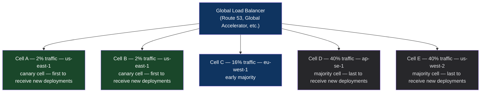

# Chapter 49: The Global Fractional Rollout & Cell Pattern
*Part IX: Planetary-Scale Release Engineering*

> *"We deployed a bug globally. 100% of users affected simultaneously.
> We call it our 'how not to do deployments' case study.
> The cell architecture exists because of that day.
> We now deploy to 2% of traffic first. Always."*
> — VP of Engineering at a global platform company

---

## The War Story

Prism Global provides a real-time data synchronization platform used by 80 million users across 140 countries. In July, they deploy a new version of the sync engine — a significant refactor that improves throughput by 35%. The deployment strategy: deploy to all regions simultaneously to minimize the version skew window.

At 14:23 UTC, the deployment completes globally. By 14:31 UTC, the on-call fires across all regions simultaneously. The new sync engine has a memory leak that only manifests under real production load patterns — it wasn't visible in staging because staging receives synthetically generated load, not real user traffic with specific session duration distributions.

The memory usage climbs: 512MB → 800MB → 1.2GB → OOM kill on all pods globally. By 14:47 UTC, the sync service is down for 80 million users worldwide.

Total outage: 23 minutes globally. Recovery required rolling back across 12 regions in sequence, coordinating 6 on-call teams across 3 timezones. The post-mortem estimate: $4.8M in direct contractual penalties and $12M in customer churn impact over the following quarter.

The cell architecture would have limited this to 2% of users (the first cell) for 8 minutes, with automatic rollback triggered before the second cell received any traffic.

---

## What You'll Learn

- The cell architecture: isolated fault domains that limit blast radius by design
- Traffic routing to cells: consistent hashing, geographic routing, and weighted traffic distribution
- Cell promotion criteria: automated health evaluation before advancing to the next cell
- Google's approach to global rollouts (from public engineering documentation)
- Cell size math: how to calculate the right cell granularity for your blast radius requirements
- What "2% of global traffic" actually means in practice

---

## The Cell Architecture

A cell is an isolated, self-contained deployment unit. Each cell has its own:
- Compute (pods/instances)
- Load balancer
- Database (or database shard)
- Configuration
- Health monitoring

Cells are designed for failure isolation: a problem in cell A cannot directly affect cell B. The blast radius of any failure is bounded by cell size.



Each cell is independent:
```yaml
# cell-a deployment (2% of global traffic)
apiVersion: apps/v1
kind: Deployment
metadata:
  name: sync-engine-cell-a
  namespace: cell-a
  labels:
    cell: "a"
    traffic_weight: "2"
spec:
  replicas: 5  # Sized for 2% of global traffic
  selector:
    matchLabels:
      app: sync-engine
      cell: "a"
  template:
    metadata:
      labels:
        app: sync-engine
        cell: "a"
        version: "v4.2.1"  # Each cell tracks its own version
    spec:
      containers:
        - name: sync-engine
          image: myregistry.io/sync-engine:v4.2.1
          env:
            - name: CELL_ID
              value: "a"
            - name: CELL_TRAFFIC_WEIGHT
              value: "2"
```

---

## Traffic Routing to Cells

Consistent hashing assigns users deterministically to cells: the same user always goes to the same cell. This prevents the mixed-version consistency problems described in Chapter 31.

```python
# cell_router.py — consistent hash-based cell routing

import hashlib

CELL_CONFIG = {
    "a": {"traffic_weight": 2, "status": "canary"},
    "b": {"traffic_weight": 2, "status": "canary"},
    "c": {"traffic_weight": 16, "status": "early_majority"},
    "d": {"traffic_weight": 40, "status": "majority"},
    "e": {"traffic_weight": 40, "status": "majority"},
}

def get_cell_for_user(user_id: str) -> str:
    """
    Deterministically assign a user to a cell using consistent hashing.
    The same user_id always routes to the same cell, ensuring consistency
    across requests and preventing mixed-version issues.
    """
    
    # Hash the user ID to get a value in [0, 100)
    hash_value = int(hashlib.sha256(user_id.encode()).hexdigest(), 16) % 100
    
    # Map hash value to cell based on traffic weights
    cumulative = 0
    for cell_id, config in CELL_CONFIG.items():
        cumulative += config["traffic_weight"]
        if hash_value < cumulative:
            return cell_id
    
    return "e"  # Default to majority cell
```

---

## Cell Deployment Pipeline

The deployment pipeline deploys to cells sequentially, evaluating health at each boundary:

```yaml
# cell-deployment-pipeline.yml

name: Cell-Based Global Rollout

on:
  workflow_dispatch:
    inputs:
      image_tag:
        required: true
      deployment_id:
        required: true

jobs:
  # Phase 1: Canary cells (4% of global traffic)
  deploy-canary-cells:
    strategy:
      matrix:
        cell: [a, b]  # 2% + 2% = 4% total
      fail-fast: true  # If cell A fails, don't deploy to cell B
    runs-on: ubuntu-22.04
    steps:
      - name: Deploy to cell ${{ matrix.cell }}
        run: |
          kubectl config use-context cell-${{ matrix.cell }}-cluster
          kubectl set image deployment/sync-engine \
            sync-engine=myregistry.io/sync-engine:${{ inputs.image_tag }} \
            -n cell-${{ matrix.cell }}
          kubectl rollout status deployment/sync-engine \
            -n cell-${{ matrix.cell }} --timeout=10m

  evaluate-canary-health:
    needs: deploy-canary-cells
    runs-on: ubuntu-22.04
    steps:
      - name: Wait for observation window (15 minutes)
        run: sleep 900

      - name: Evaluate canary cell health
        run: |
          python ci/evaluate_cell_health.py \
            --cells "a,b" \
            --baseline-cells "c,d,e" \
            --observation-minutes 15 \
            --fail-on-regression

  # Phase 2: Early majority (16% of traffic)
  # Only runs if canary evaluation passed
  deploy-early-majority:
    needs: evaluate-canary-health
    runs-on: ubuntu-22.04
    environment: cell-c-approval  # Optional manual gate for high-risk changes
    steps:
      - name: Deploy to cell c
        run: |
          kubectl config use-context cell-c-cluster
          kubectl set image deployment/sync-engine \
            sync-engine=myregistry.io/sync-engine:${{ inputs.image_tag }} \
            -n cell-c

  # Phase 3: Majority cells (80% of traffic)
  # Only after 30-minute observation of early majority
  deploy-majority:
    needs: [deploy-early-majority]
    runs-on: ubuntu-22.04
    steps:
      - name: Wait 30 minutes for early majority observation
        run: sleep 1800

      - name: Evaluate early majority health
        run: |
          python ci/evaluate_cell_health.py \
            --cells "c" --baseline-cells "a,b" \
            --observation-minutes 30

      - name: Deploy to majority cells d and e
        run: |
          for cell in d e; do
            kubectl config use-context cell-${cell}-cluster
            kubectl set image deployment/sync-engine \
              sync-engine=myregistry.io/sync-engine:${{ inputs.image_tag }} \
              -n cell-${cell}
          done
```

---

## Cell Health Evaluation

```python
# evaluate_cell_health.py

def evaluate_cell_health(
    treatment_cells: list[str],  # Cells with new version
    baseline_cells: list[str],   # Cells with previous version (control)
    observation_minutes: int,
    regression_threshold_pct: float = 5.0
) -> HealthResult:
    """
    Compare metrics between cells running new version (treatment)
    vs cells running old version (baseline).
    
    If treatment cells show >5% regression on any critical metric,
    the deployment is blocked.
    """
    
    metrics_to_compare = [
        ("error_rate_pct", "lower_is_better"),
        ("p99_latency_ms", "lower_is_better"),
        ("memory_usage_mb", "lower_is_better"),
        ("cpu_usage_pct", "lower_is_better"),
    ]
    
    regressions = []
    
    for metric_name, direction in metrics_to_compare:
        treatment_val = get_metric_for_cells(treatment_cells, metric_name, observation_minutes)
        baseline_val = get_metric_for_cells(baseline_cells, metric_name, observation_minutes)
        
        if direction == "lower_is_better":
            regression_pct = (treatment_val - baseline_val) / baseline_val * 100
        else:
            regression_pct = (baseline_val - treatment_val) / baseline_val * 100
        
        if regression_pct > regression_threshold_pct:
            regressions.append(CellRegression(
                metric=metric_name,
                treatment_value=treatment_val,
                baseline_value=baseline_val,
                regression_pct=regression_pct
            ))
    
    if regressions:
        # Auto-rollback the treatment cells
        rollback_cells(treatment_cells)
        return HealthResult(
            healthy=False,
            regressions=regressions,
            action_taken="auto_rollback"
        )
    
    return HealthResult(healthy=True)
```

---

## Cell Size Math: Calculating the Right Granularity

The right cell size depends on your blast radius tolerance:

```python
def calculate_cell_size(
    total_users: int,
    acceptable_blast_radius_pct: float,  # e.g., 0.02 = 2% of users
    detection_time_minutes: int,          # How fast can you detect a problem?
    recovery_time_minutes: int            # How fast can you rollback?
) -> dict:
    """
    Calculate the right cell configuration.
    
    The cell size determines how many users are affected before detection/rollback.
    Impact = cell_size * (detection_time + recovery_time)
    """
    
    max_affected_users = int(total_users * acceptable_blast_radius_pct)
    
    # Canary cell: must be detectable before advancing to the next cell
    # Users affected during canary = canary_size * detection_time
    # We want this to be < max_affected_users / 2 (leave headroom for recovery)
    
    canary_user_limit = max_affected_users / 2 / (detection_time_minutes + recovery_time_minutes)
    
    # Express as percentage
    canary_pct = canary_user_limit / total_users * 100
    
    return {
        "recommended_canary_cell_pct": round(canary_pct, 1),
        "max_users_affected_in_worst_case": max_affected_users,
        "worst_case_user_impact": f"{total_users * acceptable_blast_radius_pct:,.0f} users",
        "detection_required_within": f"{detection_time_minutes} minutes",
    }

# Prism Global's should-have configuration
result = calculate_cell_size(
    total_users=80_000_000,
    acceptable_blast_radius_pct=0.02,    # 2% = 1.6M users maximum
    detection_time_minutes=8,            # Memory leak manifested in 8 min
    recovery_time_minutes=5              # Rollback takes 5 min per cell
)
print(result)
# recommended_canary_cell_pct: 0.3%  (240,000 users)
# max_users_affected_in_worst_case: 1,600,000 users
# worst_case_user_impact: 1,600,000 users
# detection_required_within: 8 minutes
```

For Prism Global, the math says: start with 0.3% of traffic, detect within 8 minutes. If they had done this, the July incident would have affected 240,000 users for 13 minutes instead of 80 million users for 23 minutes.

---

## Anti-Patterns

### ❌ Anti-Pattern: Global Simultaneous Deployment

**What it looks like:** Deploy to all regions simultaneously. The July Prism Global incident, exactly.

**The fix:** Cells. Deploy to the smallest cell first. Observe. Advance. Never deploy globally simultaneously unless the change is validated across representative cells first.

---

### ❌ Anti-Pattern: Cells Without Isolation

**What it looks like:** "We have cells, but they share a database." A bug that corrupts database state in cell A propagates to cells B-E via the shared database. The cell architecture provides no fault isolation.

**The fix:** True cell isolation requires independent data stores. If a shared database is unavoidable, implement cell-level database sharding with blast radius boundaries at the shard level.

---

## Chapter Summary

The cell pattern converts global deployments into local experiments. By routing a mathematically precise fraction of global traffic to isolated cells, you bound the blast radius of every deployment to the cell size. The Prism Global incident — 80 million users affected for 23 minutes — becomes 240,000 users affected for 13 minutes. The cell architecture is not just about deployment safety; it's about making the worst case survivable.
