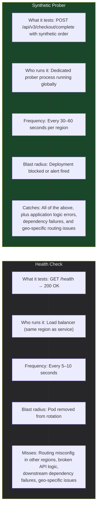
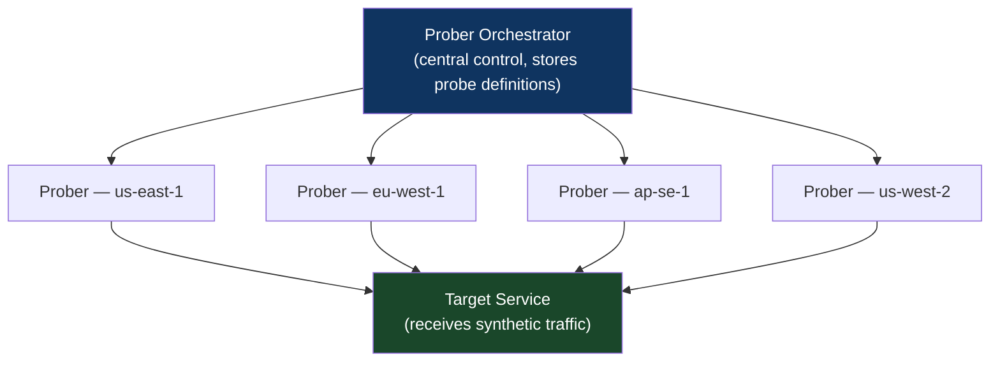

# Chapter 50: The Synthetic Prober Verification Pattern
*Part IX: Planetary-Scale Release Engineering*

> *"The health check passed. The service was healthy.
> From the perspective of us-east-1.
> European users couldn't reach the new endpoint at all
> because of a routing misconfiguration specific to eu-west-1.
> The health check didn't catch it because the health check
> was in the same region as the deployment."*
> — SRE postmortem note

---

## The War Story

Meridian Commerce deploys a new checkout API endpoint — `/api/v3/checkout/complete` — as part of a major checkout flow redesign. The deployment completes. Health checks pass. Kubernetes reports all pods running. The deployment is marked complete.

For the next 47 minutes, European users attempting to complete a purchase receive `404 Not Found` on the new endpoint. The routing table in the eu-west-1 API gateway had not been updated as part of the deployment automation. The deployment workflow correctly updated us-east-1 and ap-southeast-1, but the eu-west-1 gateway update failed silently (the API gateway IAM role had insufficient permissions, and the error was logged but not propagated as a deployment failure).

The us-east-1 health check probes `/api/v3/checkout/complete` from a us-east-1 runner. It gets a 200 response. It reports healthy. The eu-west-1 problem is invisible to it.

European checkout revenue drops to zero for 47 minutes. The issue is caught when a European customer service representative notices the support ticket volume spike.

The fix: synthetic probers in every region that the service serves, testing the specific endpoints that real users use, from the network perspective of each region.

---

## What You'll Learn

- The synthetic prober architecture: what it is, how it differs from health checks, and where it runs
- Critical user journey simulation: what to probe and how to design probes that catch real problems
- Multi-region prober deployment: why probers must run from where users run
- Prober-as-code: storing probe definitions in the repository alongside deployment configuration
- Prober-driven deployment gates: how synthetic probers integrate with the deployment pipeline
- Limitations: what synthetic probers miss and how real traffic complements them

---

## Synthetic Probers vs. Health Checks

A health check answers: "Is the service process running and able to respond to a simple HTTP request?"

A synthetic prober answers: "Can a user in Frankfurt complete a checkout right now using the actual checkout flow?"



---

## Prober Architecture



Each regional prober executes the same probes from its geographic location. The probe results are aggregated centrally. A failure in eu-west-1 that doesn't appear in us-east-1 is identified as a geo-specific issue — exactly what would have caught the Meridian Commerce problem.

---

## Prober-as-Code

Probe definitions are stored in the repository, versioned alongside the service they test:

```python
# probes/checkout-service.py — synthetic probes for the checkout service

from prober_sdk import Probe, ProbeResult, expect

CHECKOUT_PROBES = [
    Probe(
        name="checkout_complete_happy_path",
        description="Verify a user can complete a synthetic purchase",
        # This probe runs from every region where the service is deployed
        regions=["us-east-1", "eu-west-1", "ap-southeast-1"],
        frequency_seconds=60,
        timeout_seconds=10,
        
        async def run(self, context) -> ProbeResult:
            # Step 1: Add item to cart
            cart_response = await context.http.post(
                "/api/v3/cart/add",
                json={"sku": "PROBE-SKU-001", "quantity": 1},
                headers={"X-Synthetic-Probe": "true"}  # Tagged for filtering from real analytics
            )
            expect(cart_response.status_code).to_equal(200)
            cart_id = cart_response.json()["cart_id"]
            
            # Step 2: Complete checkout
            checkout_response = await context.http.post(
                "/api/v3/checkout/complete",
                json={
                    "cart_id": cart_id,
                    "payment_method": "PROBE-CARD",  # Test payment method that doesn't charge
                    "shipping_address": "PROBE-ADDRESS"
                }
            )
            expect(checkout_response.status_code).to_equal(200)
            
            order_id = checkout_response.json().get("order_id")
            expect(order_id).to_be_defined()
            
            # Step 3: Verify order is retrievable
            order_response = await context.http.get(f"/api/v3/orders/{order_id}")
            expect(order_response.status_code).to_equal(200)
            
            return ProbeResult(
                success=True,
                latency_ms=context.elapsed_ms,
                metadata={"order_id": order_id}
            )
    ),
    
    Probe(
        name="checkout_invalid_payment",
        description="Verify proper error handling for invalid payment",
        regions=["us-east-1"],  # Single region sufficient for error handling tests
        frequency_seconds=300,
        
        async def run(self, context) -> ProbeResult:
            response = await context.http.post(
                "/api/v3/checkout/complete",
                json={"cart_id": "invalid-cart", "payment_method": "INVALID"}
            )
            expect(response.status_code).to_equal(400)
            expect(response.json()["error_code"]).to_equal("INVALID_CART")
            return ProbeResult(success=True, latency_ms=context.elapsed_ms)
    ),
]
```

---

## Prober-Driven Deployment Gates

The deployment pipeline queries prober health before and after each deployment step:

```bash
# deploy_with_prober_validation.sh

SERVICE=$1
IMAGE_TAG=$2
REGION=$3

echo "Pre-deployment prober validation for ${SERVICE} in ${REGION}..."

# Step 1: Verify probers are currently green (pre-deploy baseline)
PRE_STATUS=$(python ci/query_prober_status.py \
  --service "${SERVICE}" \
  --region "${REGION}" \
  --time-window-minutes 10)

if [[ "$PRE_STATUS" != "healthy" ]]; then
  echo "Pre-deployment prober check failed. Service is already degraded in ${REGION}."
  echo "Blocking deployment to avoid compounding an existing issue."
  exit 1
fi

# Step 2: Deploy
kubectl set image deployment/${SERVICE} \
  app=${ECR_REGISTRY}/${SERVICE}:${IMAGE_TAG} \
  -n ${REGION}
kubectl rollout status deployment/${SERVICE} -n ${REGION} --timeout=10m

echo "Deployment complete. Waiting 3 minutes for probers to evaluate..."
sleep 180

# Step 3: Post-deployment prober validation
POST_STATUS=$(python ci/query_prober_status.py \
  --service "${SERVICE}" \
  --region "${REGION}" \
  --time-window-minutes 3)

if [[ "$POST_STATUS" == "failing" ]]; then
  echo "Post-deployment probers failing in ${REGION}. Triggering rollback."
  kubectl rollout undo deployment/${SERVICE} -n ${REGION}
  
  # Notify with specific probe failure details
  python ci/notify_prober_failure.py \
    --service "${SERVICE}" \
    --region "${REGION}" \
    --slack-channel "#deployments"
  
  exit 1
fi

echo "Post-deployment prober validation passed. ${SERVICE} healthy in ${REGION}."
```

---

## What Synthetic Probers Miss

Probers are not a complete substitute for real traffic monitoring:

**Problems probers catch:**
- Service endpoints returning wrong status codes
- Endpoint routing configuration missing in specific regions
- Response format changes that break the probe's parsing
- Latency regressions detectable by a single sequential request
- Infrastructure misconfigurations (wrong security groups, missing DNS records)

**Problems probers miss:**
- Bugs that only appear under real concurrency (the prober sends sequential requests)
- Issues with specific real customer data that the probe's synthetic data doesn't exercise
- Slow memory leaks that require 30+ minutes of sustained load to manifest
- Load-dependent behaviors (queueing, connection pool exhaustion)

This is why the prober is used alongside, not instead of, canary analysis (Chapter 51) and chaos engineering (Chapter 52). Each catches different failure modes.

---

## Anti-Patterns

### ❌ Anti-Pattern: Region-Local Probers Only

**What it looks like:** Probers run in the same region as the service. The probe tests from the same network position as the deployment — geographic or network issues in remote regions are invisible.

**The fix:** Probers must run from *outside* the deployment target region, simulating user traffic geographically.

---

### ❌ Anti-Pattern: Probing Only `/health`

**What it looks like:** The prober hits `/health` and checks for `200 OK`. This catches "service is down" but misses "service is returning wrong data" and "this specific endpoint is broken."

**The fix:** Probe critical user journeys, not just health endpoints. The checkout probe must complete a checkout, not just check if the checkout service is alive.

---

### ❌ Anti-Pattern: No Synthetic Probe Filter in Analytics

**What it looks like:** Synthetic probe traffic is counted in real user analytics. Revenue dashboard shows $X in checkout completions including test orders. The A/B testing system counts probe traffic as user sessions.

**The fix:** Tag all synthetic traffic (`X-Synthetic-Probe: true`) and filter it in all analytics, A/B testing, and revenue reporting systems.

---

## Chapter Summary

Synthetic probers are the deployment verification mechanism that validates the thing health checks can't: "does the actual user journey work, from the user's geographic and network perspective?" The Meridian Commerce incident — 47 minutes of invisible European checkout failure — is caught by a eu-west-1 prober that attempts a synthetic checkout and receives a 404. The prober fails. The deployment gate blocks advancement to the next cell. Root cause is found in minutes.

[→ Next: Chapter 51 — The Automated Canary Analysis (ACA) Pattern](./chapter-51-automated-canary-analysis.md)

---
*[← Previous: Chapter 49 — The Global Fractional Rollout & Cell Pattern](./chapter-49-global-fractional-rollout-cell.md) |
[→ Next: Chapter 51 — The Automated Canary Analysis (ACA) Pattern](./chapter-51-automated-canary-analysis.md)*
