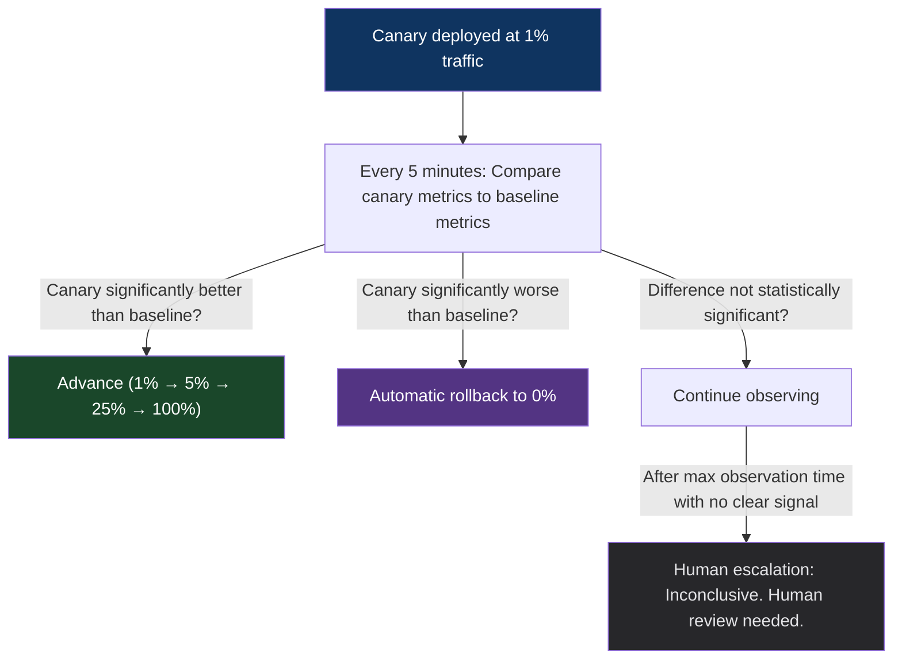

# Chapter 51: The Automated Canary Analysis (ACA) Pattern
*Part IX: Planetary-Scale Release Engineering*

> *"We had 2,000 services. Each one had a canary.
> Each canary needed a human to watch dashboards and decide to promote.
> The humans were the bottleneck.
> The humans were also tired at 4 PM on a Friday.
> A tired human who just wants to go home is not the right
> control plane for a 2,000-service production system."*
> — Netflix release engineering presentation, 2018

---

## The War Story

At a platform engineering company with 180 services and 60 engineers, every canary deployment requires the engineer who deployed it to watch dashboards for 30 minutes and manually decide to promote or rollback. This is fine when it's one service. At 180 services deploying 3 times per week each, it's 1,620 30-minute dashboard-watching sessions per week — 810 engineer-hours. That's 20 engineer-weeks of "watching metrics" per week.

Worse: the quality of human canary analysis is inconsistent. Under time pressure (end of day, on-call handoff, other incidents active), engineers approve canaries with elevated p99 latency that they'd have caught if they were paying close attention. Of 12 recent incidents traced to deployment regressions, 8 of them had anomalous metrics during the canary period that were visible in retrospect but were approved by a human anyway.

Automated Canary Analysis (ACA) removes the human from the routine promotion/rollback decision. Humans are consulted only when the automated analysis is inconclusive or when a business decision is required beyond what metrics can determine.

---

## What You'll Learn

- The ACA model: statistical comparison of canary vs. baseline time-series metrics
- Kayenta (Netflix/Google): the reference ACA implementation
- Metric classifier design: choosing high-signal metrics and configuring failure thresholds
- Mann-Whitney U test: the statistical test underlying most ACA implementations
- Tuning ACA sensitivity: the false positive / false negative tradeoff
- When to keep humans in the loop: inconclusive results, business-critical deployments

---

## The ACA Model

Automated Canary Analysis continuously evaluates whether the canary instance is performing significantly worse than the baseline (the running stable version) across a set of configured metrics. The decision — promote or rollback — is made by the analysis system, not a human.



The statistical test determines "significantly worse/better." Simple threshold comparisons ("error rate > 1% → fail") are insufficient because they don't account for baseline variance. If the baseline error rate is 0.8%, a canary at 1.0% might look "worse than 1%", but the difference isn't statistically meaningful given normal variance.

---

## Mann-Whitney U Test

The Mann-Whitney U test (also called the Wilcoxon rank-sum test) is the statistical engine under most ACA implementations. It compares two distributions of time-series metric samples without assuming normal distribution — important because production metrics like latency are often skewed.

```python
# automated_canary_analyzer.py

from scipy.stats import mannwhitneyu
import numpy as np
from dataclasses import dataclass
from enum import Enum

class CanaryDecision(Enum):
    PASS = "pass"
    FAIL = "fail"
    INCONCLUSIVE = "inconclusive"

@dataclass
class MetricAnalysisResult:
    metric_name: str
    canary_samples: list[float]
    baseline_samples: list[float]
    u_statistic: float
    p_value: float
    direction: str          # "canary_better", "canary_worse", "no_difference"
    decision: CanaryDecision
    score: float            # 0.0 (worst) to 1.0 (best)

def analyze_metric(
    metric_name: str,
    canary_samples: list[float],
    baseline_samples: list[float],
    higher_is_better: bool = False,
    critical: bool = False,   # Critical metrics fail the canary if they regress
    significance_level: float = 0.05
) -> MetricAnalysisResult:
    """
    Compare canary vs baseline metric distributions using Mann-Whitney U test.
    
    For error rate: higher is worse (higher_is_better=False)
    For throughput: higher is better (higher_is_better=True)
    """
    
    if len(canary_samples) < 10 or len(baseline_samples) < 10:
        return MetricAnalysisResult(
            metric_name=metric_name,
            canary_samples=canary_samples,
            baseline_samples=baseline_samples,
            u_statistic=0,
            p_value=1.0,
            direction="no_difference",
            decision=CanaryDecision.INCONCLUSIVE,
            score=0.5
        )
    
    # Mann-Whitney U test: alternative="less" tests if canary < baseline
    # For error rate (lower is better): we test if canary is significantly higher
    u_stat, p_value = mannwhitneyu(
        canary_samples,
        baseline_samples,
        alternative="greater"  # Test if canary > baseline
    )
    
    canary_median = np.median(canary_samples)
    baseline_median = np.median(baseline_samples)
    
    if p_value < significance_level:
        # Statistically significant: canary IS greater than baseline
        if higher_is_better:
            direction = "canary_better"
            decision = CanaryDecision.PASS
            score = 1.0
        else:
            direction = "canary_worse"
            decision = CanaryDecision.FAIL if critical else CanaryDecision.FAIL
            score = 0.0
    else:
        # Not statistically significant: no meaningful difference
        direction = "no_difference"
        decision = CanaryDecision.PASS
        score = 0.75  # No regression detected: partial pass
    
    return MetricAnalysisResult(
        metric_name=metric_name,
        canary_samples=canary_samples,
        baseline_samples=baseline_samples,
        u_statistic=u_stat,
        p_value=p_value,
        direction=direction,
        decision=decision,
        score=score
    )

def run_full_canary_analysis(
    canary_metrics: dict,    # {metric_name: [time_series_samples]}
    baseline_metrics: dict,
    metric_config: list      # List of MetricConfig objects
) -> CanaryAnalysisReport:
    """
    Run ACA across all configured metrics.
    Returns an overall pass/fail/inconclusive and a score (0-100).
    """
    
    results = []
    total_score = 0
    
    for config in metric_config:
        result = analyze_metric(
            metric_name=config.name,
            canary_samples=canary_metrics.get(config.name, []),
            baseline_samples=baseline_metrics.get(config.name, []),
            higher_is_better=config.higher_is_better,
            critical=config.critical
        )
        results.append(result)
        total_score += result.score
    
    # Any critical metric failure = overall failure
    has_critical_failure = any(
        r.decision == CanaryDecision.FAIL 
        for r in results 
        if next(c for c in metric_config if c.name == r.metric_name).critical
    )
    
    # Calculate weighted score (0-100)
    overall_score = (total_score / len(results)) * 100
    
    # Decision logic
    if has_critical_failure:
        overall_decision = CanaryDecision.FAIL
    elif overall_score >= 70:
        overall_decision = CanaryDecision.PASS
    elif overall_score >= 40:
        overall_decision = CanaryDecision.INCONCLUSIVE
    else:
        overall_decision = CanaryDecision.FAIL
    
    return CanaryAnalysisReport(
        overall_decision=overall_decision,
        overall_score=overall_score,
        metric_results=results,
        recommendation={
            CanaryDecision.PASS: "promote",
            CanaryDecision.FAIL: "rollback",
            CanaryDecision.INCONCLUSIVE: "human_review"
        }[overall_decision]
    )
```

---

## Metric Configuration for ACA

The choice of metrics determines ACA quality. Too few metrics → real regressions get promoted. Too many noisy metrics → good canaries get rolled back (alert fatigue, false positives).

```python
# canary_metric_config.py — metric configuration for the payment service

PAYMENT_SERVICE_METRICS = [
    MetricConfig(
        name="http_5xx_rate",
        query="sum(rate(http_requests_total{service='payment-api',status_code=~'5..'}[5m])) / sum(rate(http_requests_total{service='payment-api'}[5m])) * 100",
        higher_is_better=False,
        critical=True,        # Any increase in 5xx is critical
        weight=3.0            # Highest weight — most important metric
    ),
    MetricConfig(
        name="p99_latency_ms",
        query="histogram_quantile(0.99, rate(http_request_duration_seconds_bucket{service='payment-api'}[5m])) * 1000",
        higher_is_better=False,
        critical=True,        # Latency regression is critical for payment service
        weight=2.0
    ),
    MetricConfig(
        name="payment_success_rate",
        query="sum(rate(payment_completed_total{service='payment-api'}[5m])) / sum(rate(payment_attempted_total{service='payment-api'}[5m])) * 100",
        higher_is_better=True,
        critical=True,        # Business metric — must not degrade
        weight=3.0
    ),
    MetricConfig(
        name="p50_latency_ms",
        query="histogram_quantile(0.50, rate(http_request_duration_seconds_bucket{service='payment-api'}[5m])) * 1000",
        higher_is_better=False,
        critical=False,       # Median latency: informational, not critical
        weight=1.0
    ),
    MetricConfig(
        name="memory_usage_bytes",
        query="container_memory_working_set_bytes{container='payment-api'}",
        higher_is_better=False,
        critical=False,       # Memory: warning, not blocking (unless extreme)
        weight=1.0
    ),
]
```

---

## Kayenta: The Reference ACA Implementation

Kayenta is Netflix's open-source automated canary analysis service, now part of Spinnaker. It implements the full ACA pipeline: metric retrieval from multiple observability backends, statistical analysis using configurable classifiers, scoring, and pass/fail decisions.

```yaml
# kayenta-canary-config.yaml — Kayenta configuration for a service

canaryConfig:
  name: payment-service-canary-config
  
  # Metric stores: Kayenta can query Prometheus, Datadog, Stackdriver, etc.
  metrics:
    - name: http_5xx_rate
      query:
        serviceType: prometheus
        customInlineTemplate: >
          sum(rate(http_requests_total{job="${scope}",status_code=~"5.."}[${window}]))
          / sum(rate(http_requests_total{job="${scope}"}[${window}])) * 100
      analysisConfigurations:
        canary:
          # direction: increase means "higher is worse" (more 5xx = bad)
          direction: increase
          # nanStrategy: what to do when the metric returns NaN
          # (e.g., no traffic yet — treat as zero)
          nanStrategy: ReplaceWithZero
          # critical: fail the entire canary analysis if this metric fails
          critical: true
      scopeName: default
      
    - name: p99_latency
      query:
        serviceType: prometheus
        customInlineTemplate: >
          histogram_quantile(0.99, sum(rate(http_request_duration_seconds_bucket{job="${scope}"}[${window}])) by (le)) * 1000
      analysisConfigurations:
        canary:
          direction: increase
          nanStrategy: ReplaceWithZero
          critical: true
  
  # Classifier configuration
  classifier:
    scoreThresholds:
      marginal: 50    # Score 50-74: inconclusive, human review
      pass: 75        # Score >= 75: automatic promote
    
    groupWeights:
      # Weight groups differently — latency and error rate count more than memory
      latency: 30
      errors: 40
      business: 30
```

---

## Tuning ACA Sensitivity

ACA has two failure modes:

**False positive** (promote a bad canary): The analysis doesn't detect a real regression. The canary is promoted and the regression reaches full traffic. Cause: significance threshold too high, metrics too few, not critical enough metrics.

**False negative** (rollback a good canary): The analysis detects noise as a regression. A good canary is rolled back unnecessarily. Cause: significance threshold too low, too many metrics, noisy metrics included.

The tuning approach: analyze historical data from manually-evaluated canaries to calibrate thresholds.

```python
def calibrate_aca_thresholds(
    historical_canaries: list[HistoricalCanary]
) -> ThresholdRecommendations:
    """
    Use historical canary data to calibrate ACA thresholds.
    
    historical_canaries: list of past canaries with known outcomes
    (was the human judgment "promote" or "rollback"?)
    """
    
    results = []
    for canary in historical_canaries:
        aca_score = run_aca_analysis(canary.metrics)
        human_decision = canary.human_outcome  # "promoted" or "rolled_back"
        results.append((aca_score, human_decision))
    
    # Find the threshold that maximizes agreement with human judgments
    best_threshold = 75
    best_agreement_rate = 0
    
    for threshold in range(50, 95, 5):
        agreements = sum(
            1 for score, human in results
            if (score >= threshold and human == "promoted") or
               (score < threshold and human == "rolled_back")
        )
        agreement_rate = agreements / len(results)
        if agreement_rate > best_agreement_rate:
            best_agreement_rate = agreement_rate
            best_threshold = threshold
    
    return ThresholdRecommendations(
        recommended_pass_threshold=best_threshold,
        agreement_rate=best_agreement_rate,
        historical_canaries_analyzed=len(historical_canaries)
    )
```

---

## Anti-Patterns

### ❌ Anti-Pattern: Using CPU and Memory as Critical Metrics

**What it looks like:** ACA configured with CPU usage as a critical metric. A canary that has 5% higher CPU due to a new connection pool strategy gets rolled back.

**What breaks:** Good canaries get rejected for irrelevant resource metrics. CPU and memory are noisy and rarely correlate with user-facing quality.

**The fix:** Critical metrics = error rate + user-facing latency + business metrics. CPU and memory are informational, not critical.

---

### ❌ Anti-Pattern: ACA Without Minimum Sample Size Check

**What it looks like:** A canary at 0.1% traffic on a low-traffic service. The canary receives 3 requests in the first 5-minute analysis window. ACA makes a decision based on 3 data points.

**The fix:** Minimum sample size requirement before analysis. If the canary hasn't received at least N requests (e.g., 100), the analysis is deferred and synthetic load is added.

---

## Field Notes

💀 **Human canary analysis on 180 services** → 810 engineer-hours/week of dashboard watching → ACA. Humans review inconclusive results only (~5% of canaries). Routine promotions and rollbacks are fully automated.

💀 **ACA with p50 latency as a critical metric** → Good canaries with natural p50 variance get rolled back → p99 is the right latency metric for ACA. p50 is too stable and too unresponsive to tail latency regressions.

---

## Chapter Summary

Automated Canary Analysis is the control loop that makes canary deployments scalable. At 2,000 services, human-in-the-loop canary analysis is not a process — it's a staffing crisis. ACA moves the decision to statistics: Mann-Whitney U tests on time-series metrics, configurable weights for each metric, and a scoring system that produces pass/fail/inconclusive decisions. Kayenta is the reference implementation; the statistical principles are portable to any canary infrastructure.
