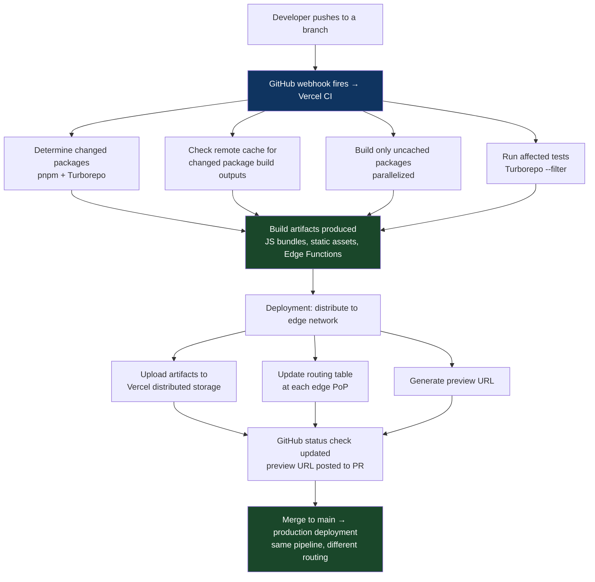

# Chapter 53: The Startup Pipeline — How Vercel Ships
*Part X: Real-World Architectures (Case Studies)*

> *"We ship 50+ times a day to production.
> Our deployment pipeline is not internal tooling.
> It is the product. When our pipeline is slow,
> our customers feel it directly."*
> — Vercel engineering, on the relationship between
> their deployment infrastructure and their product

---

## Why Vercel

Vercel is a frontend cloud platform that handles deployment and hosting for millions of web projects. At the time of writing, Vercel deploys more than 2 billion requests per day to a global edge network spanning 70+ Points of Presence. Their infrastructure is interesting not because of scale alone, but because of the unique relationship between their internal deployment pipeline and the product they sell: **Vercel's CI/CD system is their product**.

When Vercel builds a preview deployment for a customer's pull request, they are executing the same infrastructure they use internally. When a customer uses Turborepo for build caching, they're using a tool Vercel open-sourced from their own monorepo build infrastructure. This makes Vercel's deployment architecture unusually well-documented and unusually instructive: optimizations that benefit Vercel's engineers also benefit their customers, so both sides push quality forward.

---

## The Monorepo Foundation

Vercel operates their product from a JavaScript/TypeScript monorepo managed with pnpm workspaces and Turborepo. The monorepo contains the dashboard, the CLI, the edge runtime, documentation, and shared internal libraries.

The build system is Turborepo — a tool Vercel developed internally and open-sourced — which provides:

- **Content-addressed remote caching**: Every build task is keyed by the hash of its inputs (source files + dependencies + environment). A cache hit skips execution entirely. The remote cache is shared across all developers and all CI runners.

- **Dependency-aware task scheduling**: Turborepo understands the package dependency graph. When package A depends on package B, the `build` task for A runs only after B's `build` task completes. Unchanged packages are never rebuilt.

- **Affected-only execution**: `turbo run test --filter=...[HEAD^1]` runs tests only for packages changed since the previous commit and their dependents. This is the Test Impact Analysis pattern (Chapter 7) implemented at the JavaScript package level.

The practical result: a developer changing a single package sees CI run in under 2 minutes on a warm cache. A full cold build of the entire monorepo takes approximately 12 minutes. The delta between "everything" and "affected changes" is the productivity multiplier that makes 50+ deployments per day economical.

---

## Preview Deployments as a Product

Vercel's signature feature is preview deployments: every pull request against a Vercel-connected repository automatically receives a unique, globally deployed URL — `https://myapp-git-my-branch-myteam.vercel.app` — where the proposed changes are live and accessible.

This is the Ephemeral Environment pattern (Chapter 12) implemented as a first-class product feature, not as an internal platform hack. The architecture that makes preview deployments work:

**Build artifact reuse.** When a PR is pushed, Vercel's CI determines which files changed and uses the Turborepo cache to build only what's necessary. If only a CSS file changed, the JavaScript bundle is served from cache. The "deployment" is the union of cached artifacts from unchanged parts and freshly built artifacts from changed parts. This makes preview deployments fast even for large applications — typically 15–60 seconds for most changes.

**Edge-native deployment.** Preview deployments are not deployed to a central server — they're deployed to Vercel's edge network via their distributed key-value store. A new deployment doesn't "start containers" in the traditional sense; it updates routing tables at each edge PoP to serve the new bundle when that URL is requested. The routing update propagates to 70+ PoPs in under 1 second.

**Immutable deployments.** Every deployment has a permanent URL tied to that exact build artifact. The preview URL for a PR always shows the last pushed commit, but the build artifact for each commit is permanently addressable. This is the Immutable Artifact principle (Chapter 2) applied at the edge layer: you can always deploy the exact artifact from commit X, regardless of what's happened since.

---

## The Deployment Pipeline Architecture

The key architectural insight: the pipeline doesn't distinguish between "build" and "deploy" in the traditional sense. Building IS deploying — the build output is directly the edge-deployable artifact. There's no container registry, no Kubernetes manifest, no Helm chart. The artifact format (JavaScript bundles, Edge Function code, static assets) is the deployment format.

---

## Edge Functions: Deployment Without Cold Starts

Vercel's Edge Functions run at the edge using V8 isolates (same technology as Cloudflare Workers and Deno Deploy), not containers. The implications for deployment:

- **No cold start in the traditional sense.** V8 isolates start in milliseconds, not seconds. There's no container to spin up, no OS to boot. The "cold start" for an Edge Function is the time to compile the JavaScript — typically under 50ms.

- **Stateless by design.** Edge Functions cannot maintain state between requests. This constraint eliminates the class of deployment problems that come from stateful services (connection pools, in-memory caches, session state). Rollback is instant: update the routing table to point to the previous version. No drain time, no session migration.

- **Deployment is atomic at the PoP level.** When a new Edge Function version is deployed, each PoP atomically switches from serving the old version to the new version. There's no rolling update; the switch is immediate at each edge location as the routing table update arrives.

---

## What Startups Can Learn from Vercel

**Preview deployments are achievable without edge infrastructure.** Vercel's preview deployment system sounds exotic but the pattern is accessible. A startup can implement preview deployments on Kubernetes using Argo CD ApplicationSets (Chapter 12), on Heroku using Review Apps, or on Render/Railway using their native preview features. The architectural decision to give every PR its own environment is more important than the specific implementation.

**The build cache is the most important performance investment.** Turborepo's remote cache enables the "affected only" build model that makes 50+ deployments per day economical. The equivalent for any stack is a content-addressed remote build cache: Docker BuildKit with registry caching (Chapter 5), Bazel remote execution, or Gradle Enterprise. The ROI on build cache investment is immediate and measurable.

**Treating the pipeline as a product.** Vercel invests heavily in their pipeline because their customers use it. Most engineering organizations treat their pipeline as infrastructure that "just needs to work." The organizations that outperform on deployment velocity treat the pipeline as a product with users, SLOs, and a roadmap. The platform engineering pattern (Chapter 43) formalizes this: the platform team ships a product to service teams.

**Fast feedback is a feature, not a nice-to-have.** Vercel's 15-60 second preview deployment is not accidental — it's a product requirement that drives architectural decisions throughout the stack. The build cache, the edge-native format, the content-addressed artifacts — all exist partly to make the preview deployment fast. For most engineering organizations, the "product requirement" for CI/CD is implicit and often ignored. Making it explicit ("our CI must produce a deployable artifact in under 10 minutes for any change") changes the architectural decisions.

---

## The Patterns in Use

| Pattern | Chapter | How Vercel Uses It |
|---|---|---|
| Hermetic Build | 3 | pnpm lockfile + pinned node versions across all environments |
| Build Cache & Fan-Out | 5 | Turborepo remote cache with content-addressed keys |
| Test Impact Analysis | 7 | `--filter=...[HEAD^1]` runs tests only for changed packages |
| Ephemeral Environment | 12 | Preview deployments for every PR |
| Immutable Artifacts | 2 | Permanent deployment URLs per commit |
| Dynamic Provisioning | 9 | V8 isolates: zero idle cost, instantaneous scaling |
| Feature Flag | 21 | Internal feature flags for edge configuration changes |

---

## The Controversial Take

Vercel's architecture is optimized for a specific kind of application: JavaScript/TypeScript frontend and serverless backend. The edge-native, V8-isolate-based model is excellent for these workloads and produces delivery capabilities that are genuinely impressive. But it's worth being explicit about what Vercel's architecture doesn't address:

- Long-running stateful services (databases, message queues, ML training) cannot run as Edge Functions
- Languages other than JavaScript/TypeScript and WebAssembly are not natively supported
- The "no cold start" claim is true for V8 isolates but not for serverless functions that use external resources (database connections, heavy initialization)

The lesson is not "build like Vercel" — it's "invest in your pipeline with the same seriousness that Vercel invests in theirs, because that investment compounds into delivery velocity."

---

## Chapter Summary

Vercel's pipeline is instructive because the feedback loop is tight: their internal deployment speed directly affects their product quality. The specific technologies (Turborepo, V8 isolates, edge-native deployment) are less important than the principles: build caching as a foundation for all other performance improvements, preview environments as a baseline developer experience, immutable artifacts as the deployment primitive, and the pipeline as a product with users and requirements.

The most actionable lesson for startups: implement preview deployments and a remote build cache on day one, before the codebase grows to the size where retrofitting them is painful. Both are available in open-source form (Turborepo for JavaScript, Bazel for polyglot) and both have a similar ROI profile: small investment, compounding returns over the lifetime of the product.
