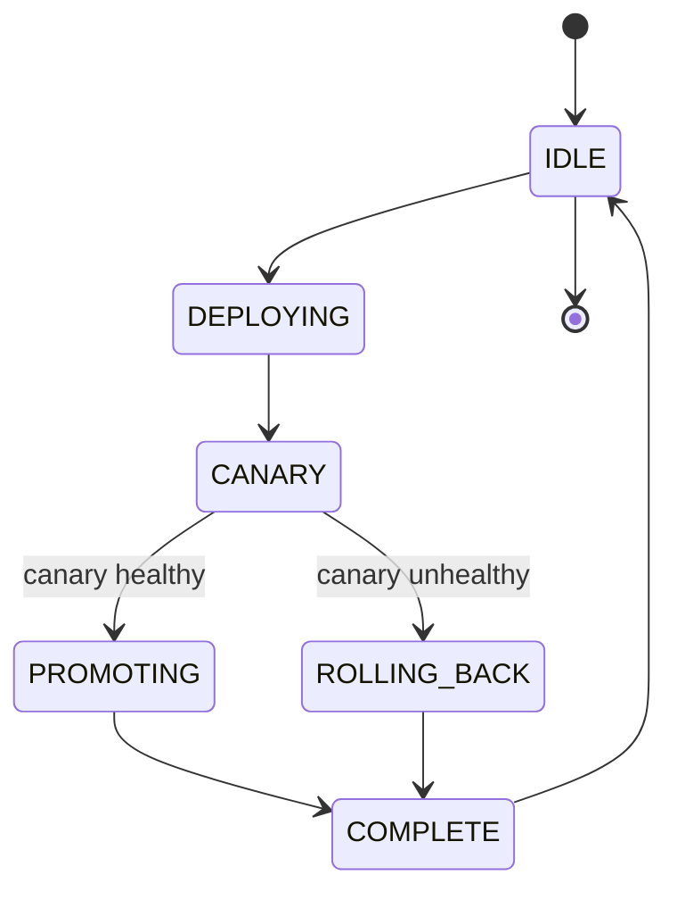

# Chapter 58: The Formally Verified Release Pattern
*Part XI: Beyond Hyperscale — The Absolute Frontier*

> *"Testing shows the presence of bugs, not their absence.
> A proof shows their absence.
> For deployment protocols that must never fail in specific ways,
> a proof is worth more than a test suite."*
> — paraphrase of E.W. Dijkstra, applied to release engineering

---

## Why Formal Verification for Deployments

The patterns in this book reduce deployment risk. They don't eliminate it. A canary release with automated rollback reduces the blast radius of a bad deployment. It doesn't prove that the canary analysis logic itself is correct. A feature flag kill switch provides instant rollback. It doesn't prove that the kill switch is reachable from every state the system can enter.

Formal verification — the application of mathematical proof to software behavior — can provide guarantees that testing cannot. A test says "this deployment state machine passed these 1,000 test cases." A proof says "this deployment state machine satisfies these properties for every possible execution, including ones nobody thought to test."

AWS has publicly documented their use of TLA+ for verifying the internal protocols of DynamoDB, S3 replication, and EBS volume management. Their engineers found bugs in designs that had passed extensive review and testing — bugs that only manifested under rare concurrency conditions. The same methodology applies to deployment systems where correctness properties matter absolutely.

---

## The Deployment State Machine

A canary deployment protocol can be modeled as a state machine. The states:



The **safety property** we want to guarantee: *"A version is never promoted to 100% of production traffic without first passing canary analysis."*

The **liveness property** we want to guarantee: *"Every deployment that starts eventually terminates — either in COMPLETE or in a final ROLLING_BACK state."*

These sound obvious. The formal verification exercise reveals the subtle ways they can be violated.

---

## TLA+ Specification of the Canary Deployment Protocol

TLA+ (Temporal Logic of Actions) is a formal specification language developed by Leslie Lamport. It allows you to specify a system's behavior and properties, then use the TLC model checker to verify that the properties hold under all possible execution sequences.

```tla
---- MODULE CanaryDeployment ----
EXTENDS Naturals, TLC

CONSTANTS 
    Services,      \* Set of service names
    Versions       \* Set of possible version identifiers

VARIABLES
    deployment_state,    \* state per service: one of States
    canary_version,      \* the version being evaluated in canary
    stable_version,      \* the version currently serving 100% traffic
    canary_health        \* result of canary analysis: Pending, Healthy, Unhealthy

States == {"idle", "deploying", "canary", "promoting", "rolling_back", "complete"}

\* Type invariant: all variables have the right types
TypeInvariant ==
    /\ deployment_state \in [Services -> States]
    /\ canary_version \in [Services -> Versions \union {"none"}]
    /\ stable_version \in [Services -> Versions \union {"none"}]
    /\ canary_health \in [Services -> {"pending", "healthy", "unhealthy"}]

\* ----- SAFETY PROPERTY -----
\* A version is NEVER promoted to stable without passing canary health check.
\* This must hold in every reachable state.
SafetyProperty ==
    \A s \in Services:
        \* If we're in the "promoting" state, the canary must be healthy.
        \* This is the invariant we want TLC to verify holds forever.
        (deployment_state[s] = "promoting") => (canary_health[s] = "healthy")

\* ----- LIVENESS PROPERTY -----
\* Every deployment eventually terminates (reaches "complete" or "idle").
\* This is a temporal logic property: [] means "always", <> means "eventually".
LivenessProperty ==
    \A s \in Services:
        \* If we start deploying, we eventually return to idle
        (deployment_state[s] = "deploying") ~> (deployment_state[s] = "idle")

\* ----- STATE TRANSITIONS -----

\* Action: Start a deployment
StartDeployment(s, v) ==
    /\ deployment_state[s] = "idle"
    /\ v \notin {stable_version[s]}  \* Must be a different version
    /\ deployment_state' = [deployment_state EXCEPT ![s] = "deploying"]
    /\ canary_version' = [canary_version EXCEPT ![s] = v]
    /\ canary_health' = [canary_health EXCEPT ![s] = "pending"]
    /\ UNCHANGED stable_version

\* Action: Canary is now running (deployment completed, traffic shifted to N%)
CanaryRunning(s) ==
    /\ deployment_state[s] = "deploying"
    /\ deployment_state' = [deployment_state EXCEPT ![s] = "canary"]
    /\ UNCHANGED <<canary_version, stable_version, canary_health>>

\* Action: Canary analysis completes with a result
CanaryAnalysisComplete(s, result) ==
    /\ deployment_state[s] = "canary"
    /\ result \in {"healthy", "unhealthy"}
    /\ canary_health' = [canary_health EXCEPT ![s] = result]
    /\ deployment_state' = [deployment_state EXCEPT 
            ![s] = IF result = "healthy" THEN "promoting" ELSE "rolling_back"]
    /\ UNCHANGED <<canary_version, stable_version>>

\* Action: Promotion completes — canary version becomes stable
\* SAFETY CHECK: This action is only reachable when canary_health = "healthy"
\* (enforced by CanaryAnalysisComplete above, but verified by TLC)
PromotionComplete(s) ==
    /\ deployment_state[s] = "promoting"
    \* TLC will verify that SafetyProperty holds here — that
    \* we can only reach "promoting" with a healthy canary
    /\ stable_version' = [stable_version EXCEPT ![s] = canary_version[s]]
    /\ canary_version' = [canary_version EXCEPT ![s] = "none"]
    /\ deployment_state' = [deployment_state EXCEPT ![s] = "complete"]
    /\ canary_health' = [canary_health EXCEPT ![s] = "pending"]

\* Action: Rollback completes — revert to stable version
RollbackComplete(s) ==
    /\ deployment_state[s] = "rolling_back"
    /\ canary_version' = [canary_version EXCEPT ![s] = "none"]
    /\ deployment_state' = [deployment_state EXCEPT ![s] = "complete"]
    /\ UNCHANGED <<stable_version, canary_health>>

\* Action: Deployment cycle resets to idle
ResetToIdle(s) ==
    /\ deployment_state[s] = "complete"
    /\ deployment_state' = [deployment_state EXCEPT ![s] = "idle"]
    /\ UNCHANGED <<canary_version, stable_version, canary_health>>

\* The complete next-state relation: any of the above actions can happen
Next ==
    \E s \in Services, v \in Versions, result \in {"healthy", "unhealthy"}:
        \/ StartDeployment(s, v)
        \/ CanaryRunning(s)
        \/ CanaryAnalysisComplete(s, result)
        \/ PromotionComplete(s)
        \/ RollbackComplete(s)
        \/ ResetToIdle(s)

\* The initial state
Init ==
    /\ deployment_state = [s \in Services |-> "idle"]
    /\ canary_version = [s \in Services |-> "none"]
    /\ stable_version = [s \in Services |-> "none"]
    /\ canary_health = [s \in Services |-> "pending"]

\* The specification: Init, then any sequence of Next steps
Spec == Init /\ [][Next]_<<deployment_state, canary_version, stable_version, canary_health>>

\* Properties to check with TLC model checker
THEOREM Spec => []SafetyProperty
THEOREM Spec => LivenessProperty

====
```

Running TLC on this specification with a small model (2 services, 3 versions) will:
1. Enumerate every reachable state
2. Verify that `SafetyProperty` holds in every state
3. Verify that `LivenessProperty` holds in every execution

If TLC finds a violation, it produces a **counterexample trace** — the exact sequence of actions that leads to the violation. This is what AWS found when verifying DynamoDB: not "the protocol is broken" but "under this specific 5-step sequence that can only happen when 3 nodes fail simultaneously, the invariant is violated."

---

## What TLA+ Found in Practice

AWS's seminal paper "Use of Formal Methods at Amazon Web Services" (available on their engineering blog) describes finding 10 bugs in their distributed systems specifications — bugs that "would have been difficult or impossible to find by testing alone." The classes of bugs:

- **Safety violations**: states where the system could enter an inconsistent configuration
- **Liveness violations**: paths through the protocol where the system could deadlock indefinitely
- **Assumption violations**: implicit assumptions in the design that the model revealed as non-obvious

For deployment systems specifically, the most common formal verification finding is the liveness violation: a deployment that starts but never terminates. This happens when:
- A health check is never defined for a specific failure mode, leaving the deployment stuck in CANARY state
- A timeout is not properly modeled, allowing the promotion state to be entered indefinitely
- A concurrent deployment to the same service creates a state that neither the promotion nor rollback logic handles

---

## Safety vs. Liveness: The Fundamental Distinction

**Safety properties** ("nothing bad ever happens") are verified by checking every reachable state:
- *"The stable version never changes without a healthy canary result"*
- *"A deployment never enters 'promoting' without passing canary analysis"*
- *"No two conflicting deployments to the same service run simultaneously"*

**Liveness properties** ("something good eventually happens") require temporal logic:
- *"Every deployment eventually terminates"*
- *"If the canary health check produces a result, the deployment eventually responds to it"*
- *"If rollback is triggered, the rollback eventually completes"*

Safety violations are typically bugs (the system can reach a bad state). Liveness violations are typically design flaws (the system can get stuck). Both are worth finding before production.

---

## Practical Application

Full TLA+ specification of a production deployment system is a significant engineering investment. The practical application is targeted:

**When to apply formal verification:**
- The deployment protocol has concurrent operations that interact (simultaneous deployments, concurrent canary + infrastructure changes)
- The deployment system is a shared platform (used by 50+ services — bugs affect everyone)
- The deployment protocol has been changed after an incident (verify the fix doesn't introduce new issues)
- A correctness property is non-obvious and important (formal proof vs. code review)

**When testing is sufficient:**
- The deployment protocol is simple and sequential (no concurrency)
- The state space is small enough for exhaustive testing
- The correctness properties are trivially obvious from the code

The key insight from Amazon's experience: TLA+ is most valuable for systems with complex concurrency. The canary deployment protocol is a good candidate precisely because it involves time-varying state (canary percentage), concurrent metric evaluation, and multiple possible terminal states.

---

## Anti-Patterns

### ❌ Specifying the Implementation, Not the Protocol

TLA+ should specify the *what* (the protocol's intended behavior), not the *how* (the implementation details). A TLA+ spec that mirrors the code is only verifying that the code is self-consistent — it misses the higher-level properties that matter.

### ❌ Skipping Liveness Because It's Hard

Liveness properties require fairness assumptions (that actions enabled eventually occur) and are harder to verify than safety. Teams skip them and miss deadlock potential.

---

## Field Notes

💀 **"We reviewed the protocol and it looks correct"** → Concurrent failure modes that review doesn't surface → TLA+ for any deployment protocol with concurrent state. The time to write the spec is the time spent in the review meeting, done once with mathematical rigor.

💀 **Safety properties only, no liveness** → Deployment that starts and never terminates → Model both. Safety catches the "bad state" bugs. Liveness catches the "stuck forever" bugs.

---

## Chapter Summary

Formal verification with TLA+ converts deployment protocol correctness from "we believe it's correct" to "we have proved it's correct under all possible execution sequences." The investment is significant but finite: a production-quality TLA+ spec for a canary deployment protocol takes 2–4 weeks of an experienced engineer's time. The return is the class of correctness guarantees that testing cannot provide.
