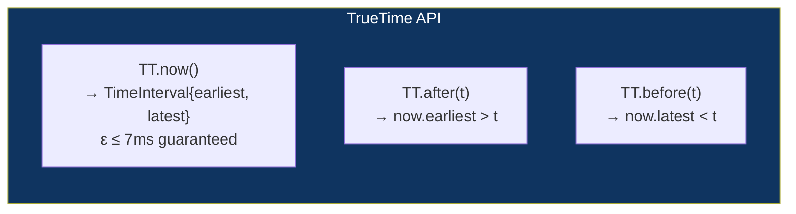

# Chapter 60: The TrueTime & Distributed Clock Rollout Pattern
*Part XI: Beyond Hyperscale — The Absolute Frontier*

> *"If you cannot tell what time it is, you cannot tell what order events happened in.
> If you cannot tell what order events happened in,
> you cannot safely coordinate a globally consistent state change.
> TrueTime gives you a bound on the uncertainty.
> NTP gives you hope."*
> — interpretation of the Spanner paper (Google, 2012)

---

## The Clock Synchronization Problem

Every computer has a clock. Every clock drifts. On a Linux server, the system clock drifts approximately 100–300 microseconds per second from actual time. NTP (Network Time Protocol) periodically corrects this drift by synchronizing with a time server. After a successful NTP sync, a typical server's clock is accurate to within 1–50 milliseconds of actual UTC.

For most applications, 50ms clock skew is irrelevant. For some deployment scenarios, it matters enormously.

**The scenario**: You want to flip a feature flag at exactly midnight UTC in every region simultaneously. Not "approximately midnight" — exactly midnight. The flag must be off before midnight and on at or after midnight globally, so that:
- Users in New York and Tokyo experience the feature change at the same instant
- Revenue calculations that use midnight as a billing boundary are consistent
- Audit logs that record "feature enabled at midnight UTC" are accurate and consistent

With NTP, "midnight UTC" on servers in different regions could mean "anywhere from 11:59:59.950 UTC to 00:00:00.050 UTC." That's a 100ms window of inconsistency. For a billing boundary change, that's wrong.

---

## TrueTime: GPS and Atomic Clocks

Google's Spanner distributed database solves this with TrueTime — an API that returns not a single time value but a time interval: `TT.now()` returns `[TT.earliest, TT.latest]`, guaranteed to contain the actual current time.

The guarantee: the true current time is always within the interval. The width of the interval (typically 1–7ms in Google's implementation) represents the maximum uncertainty about the current time.

How does Google achieve this bound?

**GPS receivers in data centers**: Each Google data center runs GPS receiver hardware. GPS signals carry atomic clock time with nanosecond accuracy. The GPS receiver provides a highly accurate time reference.

**Atomic clocks**: Each data center also maintains atomic clocks (cesium or rubidium oscillators). Atomic clocks don't drift — they count time based on quantum-mechanical oscillations of atoms, accurate to nanoseconds over years.

**Two-layer time synchronization**: GPS provides the reference; atomic clocks maintain accuracy between GPS signal updates. The combination provides time accuracy of ~1 microsecond, and the interval width (the uncertainty bound) is kept to 1–7ms by conservative accounting for all possible error sources.



---

## Using TrueTime for Globally Consistent Deployments

The classic Spanner use case: commit a distributed transaction at a global timestamp. For deployments, the use case is: coordinate a global state change (feature flag flip, configuration change, version activation) that must be precisely ordered relative to a target timestamp.

```python
# truetime_flag_flip.py — globally consistent feature flag flip at a target time

from truetime import TrueTime  # Hypothetical SDK for TrueTime-equivalent systems

tt = TrueTime()

def flip_flag_at_precisely(
    flag_key: str,
    new_value: bool,
    target_utc: datetime,
    max_early_ms: int = 0,     # Never flip early
    max_late_ms: int = 100     # Allow up to 100ms late (acceptable tolerance)
):
    """
    Flip a feature flag at or after target_utc, with bounded lateness.
    
    The algorithm:
    1. Wait until TT.now().earliest > target_utc (certain we're past the target)
    2. Apply the flag flip with timestamp = TT.now().earliest
    
    This guarantees the flip happens AFTER target_utc everywhere,
    within TT's uncertainty bound.
    """
    
    while True:
        now = tt.now()
        
        if now.earliest > target_utc:
            # We are definitely past the target time.
            # The actual current time is >= now.earliest > target_utc.
            # Safe to flip.
            apply_flag_flip(
                flag_key=flag_key,
                value=new_value,
                commit_timestamp=now.earliest  # Use lower bound as the commit time
            )
            print(f"Flag {flag_key} flipped at {now.earliest}")
            print(f"Uncertainty: ±{(now.latest - now.earliest).total_seconds() * 1000:.1f}ms")
            return
        
        # Not yet past target time. Wait for the interval to advance.
        sleep_ms = max(1, (target_utc - now.latest).total_seconds() * 1000)
        time.sleep(sleep_ms / 1000)
```

---

## NTP vs. PTP vs. GPS: The Accuracy Hierarchy

For organizations that cannot run GPS receivers in their data centers, the accuracy hierarchy:

| Clock source | Accuracy | Infrastructure | Use case |
|--------------|----------|----------------|----------|
| GPS receivers | ~1 μs | Hardware in each DC | Google Spanner, TrueTime |
| GPS + atomic clock | ~100 ns | Hardware in each DC | Google TrueTime |
| PTP (IEEE 1588v2) | ~1 μs | Software + network hardware | Financial exchanges |
| PTP with hardware | ~100 ns | Dedicated network + NICs | High-frequency trading |
| NTP (chrony) | 1–10 ms | Software only, network access | Most production servers |
| NTP (ntpd) | 10–50 ms | Software only | Legacy systems |
| Software clock | ±minutes | None (drift) | Dev environments |

For most deployment coordination scenarios, NTP with chrony (1–10ms accuracy) is sufficient. The TrueTime approach is necessary only when you need sub-millisecond coordination guarantees.

---

## When Clock Precision Actually Matters for Deployments

The honest assessment: most deployment scenarios do NOT require TrueTime-level precision. The cases where it matters:

**Financial systems**: Deploying changes to trading systems that must be precisely synchronized with market open/close times. A feature that activates at 09:30:00 ET must not activate at 09:29:59.800 on any server.

**Globally consistent feature flags**: Flipping a flag that changes pricing simultaneously across all regions for a promotional event. If different regions flip at different times, customers see inconsistent prices.

**Coordinating multi-region database schema changes**: Chapter 27 describes the Expand-and-Contract pattern. In multi-region active-active systems (Chapter 31), the timing of when the "old column is no longer written" across all regions must be coordinated — too early in one region while another still writes creates a consistency window.

**Billing period boundaries**: Changes that affect what's billed in the current period vs. the next period need precise time coordination.

For most deployment scenarios — "deploy this new version to the canary" — the 50ms NTP accuracy window is entirely irrelevant.

---

## Practical Implementation Without GPS Hardware

For organizations that want bounded clock uncertainty without GPS infrastructure, AWS Time Sync Service provides a cloud-based time source that achieves sub-millisecond accuracy using PTP:

```bash
# Configure AWS Time Sync Service (available on EC2)
# Provides sub-millisecond accuracy without GPS hardware

# Check if using AWS Time Sync
chronyc sources | grep "169.254.169.123"
# 169.254.169.123 is the AWS Time Sync Service endpoint

# Configure chrony to use AWS Time Sync as primary source
cat >> /etc/chrony.conf << 'EOF'
server 169.254.169.123 prefer iburst minpoll 4 maxpoll 4
EOF

# Verify synchronization status
chronyc tracking
# "System time" offset should be <1ms when synchronized to AWS Time Sync
```

For globally coordinated flag flips with sub-10ms precision requirements:

```python
# Practical TrueTime equivalent using AWS Time Sync + uncertainty estimation

import ntplib
import time

def get_time_with_uncertainty() -> tuple[float, float]:
    """
    Returns (best_estimate_utc, uncertainty_seconds).
    Practical equivalent of TrueTime for systems without GPS hardware.
    """
    client = ntplib.NTPClient()
    
    try:
        response = client.request("169.254.169.123", version=3)
        # NTP response includes round-trip delay as a proxy for uncertainty
        best_estimate = response.tx_time
        # Uncertainty = half the round-trip delay (conservative estimate)
        uncertainty = response.delay / 2
        return best_estimate, uncertainty
    except Exception:
        # Fallback: use system clock with larger uncertainty estimate
        return time.time(), 0.050  # 50ms uncertainty for NTP without AWS Time Sync
```

---

## Anti-Patterns

### ❌ Using Wall Clock for Distributed Event Ordering

**What it looks like:** Two events on different servers, both timestamped using `time.time()`. The server with the slightly earlier clock shows its event as happening first, even if it happened after.

**What breaks:** Any system that uses timestamps for ordering (audit logs, conflict resolution) in a distributed context.

**The fix:** Use logical clocks (Lamport timestamps or vector clocks) for ordering when you need ordering. Use TrueTime or bounded-uncertainty time when you need real-time coordination.

---

### ❌ Assuming NTP Is "Good Enough" for Financial Coordination

**What it looks like:** A trading system deploys a pricing change timed to activate at market open. NTP provides "approximately market open" timing. Some nodes activate 50ms early, some 50ms late.

**What breaks:** Market manipulation regulations that require precise timing of order submissions. Audit logs that don't match actual market event times.

**The fix:** PTP with hardware timestamps for financial systems. GPS receivers for the highest requirements.

---

## Chapter Summary

TrueTime is the solution to a problem most engineering organizations don't have: globally consistent real-time coordination with sub-millisecond guarantees. For organizations that do have it — financial exchanges, globally coordinated billing changes, multi-region database schema coordination — the architecture (GPS + atomic clocks + bounded uncertainty API) is the only principled solution. For most deployment scenarios, NTP with chrony and AWS Time Sync Service provides sufficient accuracy. The discipline is recognizing which category your use case falls into before assuming the simpler answer is adequate.
