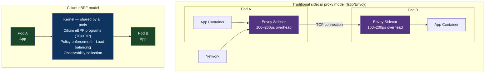

# Chapter 61: The eBPF & Kernel-Bypass Traffic Shaping Pattern
*Part XI: Beyond Hyperscale — The Absolute Frontier*

> *"Envoy is a brilliant piece of software.
> It's also 100–200μs of added latency per hop.
> eBPF removes the proxy from the data path entirely.
> Same capabilities. Zero proxy overhead.
> The kernel is the service mesh."*
> — Cilium project documentation, paraphrased

---

## What eBPF Is

eBPF (extended Berkeley Packet Filter) is a technology that allows running sandboxed programs in the Linux kernel without modifying the kernel itself. An eBPF program is:

1. Written in a restricted C subset (or higher-level languages that compile to eBPF bytecode)
2. Compiled to eBPF bytecode
3. Verified by the kernel's eBPF verifier (proves the program terminates and doesn't access invalid memory)
4. JIT-compiled to native machine code
5. Attached to a kernel hook point, where it executes in response to events

The kernel hook points relevant to deployment traffic management:

```mermaid
flowchart TD
    A[Network packet arrival] --> B["XDP hook (eXpress Data Path)<br/>Network Driver<br/><i>Fastest: runs before skb allocation</i>"]
    B --> C["TC ingress hook (Traffic Control)<br/>Network Stack<br/><i>After skb allocation, before routing</i>"]
    C --> D["Socket filter hook<br/>Socket layer<br/><i>Per-connection filtering</i>"]
    D --> E[Application (userspace)]

    style B fill:#0f3460,color:#ffffff
    style C fill:#533483,color:#ffffff
    style E fill:#1a472a,color:#ffffff
```

**XDP** (eXpress Data Path): Executes in the network driver, before the kernel allocates a socket buffer (skb). This is the highest-performance hook — at 10Gbps wire speed, an XDP program can process 14+ million packets per second on a single CPU core. Typical XDP program latency: 80–100 nanoseconds per packet.

**TC** (Traffic Control): Executes after the skb is allocated, in the traffic control layer. Slightly less performance than XDP but more flexible — it can inspect full packet contents and modify headers.

---

## An Actual BPF Program: XDP Traffic Counter

```c
// xdp_traffic_count.c — a minimal XDP program that counts packets by destination port
// This is the "hello world" of eBPF deployment tooling

#include <linux/bpf.h>
#include <linux/if_ether.h>
#include <linux/ip.h>
#include <linux/tcp.h>
#include <bpf/bpf_helpers.h>

// BPF map: stores packet counts per destination port
// MAP_TYPE_ARRAY: fixed-size array, fast access
struct {
    __uint(type, BPF_MAP_TYPE_ARRAY);
    __uint(max_entries, 65536);  // One entry per port number
    __type(key, __u32);
    __type(value, __u64);
} port_packet_count SEC(".maps");

// BPF program attached to XDP hook
// Returns XDP_PASS to let the packet continue, XDP_DROP to drop it
SEC("xdp")
int count_packets(struct xdp_md *ctx) {
    // ctx->data and ctx->data_end define the packet boundaries
    void *data_end = (void *)(long)ctx->data_end;
    void *data = (void *)(long)ctx->data;
    
    // Parse Ethernet header
    struct ethhdr *eth = data;
    if (eth + 1 > data_end) return XDP_PASS;  // Bounds check (required by verifier)
    if (eth->h_proto != bpf_htons(ETH_P_IP)) return XDP_PASS;  // Only IPv4
    
    // Parse IP header
    struct iphdr *ip = (void *)(eth + 1);
    if (ip + 1 > data_end) return XDP_PASS;
    if (ip->protocol != IPPROTO_TCP) return XDP_PASS;
    
    // Parse TCP header
    struct tcphdr *tcp = (void *)(ip + 1);
    if (tcp + 1 > data_end) return XDP_PASS;
    
    // Increment counter for this destination port
    __u32 dst_port = bpf_ntohs(tcp->dest);
    __u64 *count = bpf_map_lookup_elem(&port_packet_count, &dst_port);
    if (count) {
        __sync_fetch_and_add(count, 1);  // Atomic increment
    }
    
    return XDP_PASS;  // Allow the packet to continue
}

char LICENSE[] SEC("license") = "GPL";
```

Loading and attaching this program:

```bash
# Compile eBPF program
clang -O2 -target bpf -c xdp_traffic_count.c -o xdp_traffic_count.o

# Load and attach to network interface (eth0)
ip link set dev eth0 xdp obj xdp_traffic_count.o sec xdp

# Read packet counts from the BPF map (userspace)
bpftool map dump name port_packet_count | grep -v "value: 0"
```

---

## Cilium: eBPF-Based Service Mesh

Cilium is a CNCF graduated project that replaces the traditional sidecar proxy model (Envoy/Istio) with eBPF programs running in the kernel. The architectural difference:



No sidecar containers. eBPF in the kernel handles routing. Overhead: ~10μs vs 100–200μs for the proxy model.

**For deployment traffic management**, Cilium provides:

```yaml
# Cilium CiliumNetworkPolicy — enforced at kernel level via eBPF
# This deploys traffic splitting rules WITHOUT a userspace proxy
apiVersion: "cilium.io/v2"
kind: CiliumNetworkPolicy
metadata:
  name: canary-traffic-split
spec:
  endpointSelector:
    matchLabels:
      app: payment-api
  egress:
    - toEndpoints:
        - matchLabels:
            app: pricing-service
            version: v2     # New version
      toPorts:
        - ports:
            - port: "8080"
              protocol: TCP
          # 10% of traffic from payment-api goes to pricing-service v2
          # Enforced by eBPF in the kernel, not by a userspace proxy
```

---

## eBPF for Deployment Observability

Before the deployment traffic actually switches, eBPF can be used to collect the baseline metrics needed for ACA (Chapter 51) with zero-overhead instrumentation:

```python
# ebpf_latency_monitor.py — kernel-level latency measurement for deployment analysis
# Uses BCC (BPF Compiler Collection) for Python-based eBPF

from bcc import BPF

bpf_program = """
#include <uapi/linux/ptrace.h>
#include <net/sock.h>

// Map: track request start times by socket fd
BPF_HASH(start_times, u32, u64);

// Map: histogram of response latencies in microseconds  
BPF_HISTOGRAM(latency_hist, u64, 1000);

// Probe: TCP connect (outbound request start)
int trace_connect(struct pt_regs *ctx) {
    u32 pid = bpf_get_current_pid_tgid();
    u64 ts = bpf_ktime_get_ns();
    start_times.update(&pid, &ts);
    return 0;
}

// Probe: TCP receive (response received)
int trace_receive(struct pt_regs *ctx) {
    u32 pid = bpf_get_current_pid_tgid();
    u64 *ts = start_times.lookup(&pid);
    if (ts) {
        u64 latency_us = (bpf_ktime_get_ns() - *ts) / 1000;  // nanoseconds to microseconds
        latency_hist.increment(bpf_log2l(latency_us));
        start_times.delete(&pid);
    }
    return 0;
}
"""

b = BPF(text=bpf_program)
b.attach_kprobe(event="tcp_connect", fn_name="trace_connect")
b.attach_kprobe(event="tcp_rcv_established", fn_name="trace_receive")

print("Measuring TCP latency (Ctrl+C to stop)...")
while True:
    time.sleep(5)
    print("Latency histogram (microseconds):")
    b["latency_hist"].print_log2_hist("μs")
    b["latency_hist"].clear()
```

This collects latency data at the TCP layer — capturing all application traffic regardless of protocol, encryption, or application-level instrumentation. It adds zero overhead to the application because it runs in the kernel.

---

## XDP vs. TC: When to Use Each

| | XDP | TC |
|---|---|---|
| Location | Before skb allocation | After skb allocation |
| Latency | ~80ns | ~100–150ns |
| Access to packet | Raw bytes only | Full skb metadata |
| Can redirect packets | Yes | Yes |
| Can modify headers | Yes (before checksum) | Yes |
| Can inspect conntrack | No | Yes |
| Complexity | Low | Medium |
| Right for | DDoS mitigation, load balancing | Service policy enforcement, traffic shaping |

For deployment traffic splitting, TC hooks are generally preferred because they have access to connection tracking metadata (allowing sticky session enforcement) and full TCP/IP header modification.

---

## The Performance Numbers

Comparing Cilium (eBPF) to Istio (Envoy sidecar) for a typical microservices deployment:

| Metric | Istio (Envoy) | Cilium (eBPF) | Improvement |
|---|---|---|---|
| Added latency per hop | 100–200μs | 8–15μs | 10–20× |
| CPU overhead per 1Gbps | ~0.5 vCPU | ~0.05 vCPU | 10× |
| Memory per node | ~200MB (Envoy sidecars) | ~50MB (kernel) | 4× |
| Connection setup overhead | Per-request proxy handshake | Kernel socket hook | 5–10× |

For services where p99 latency matters and is in the range of 1–10ms, an Envoy sidecar adding 200μs per hop across a 5-hop request chain adds 1ms of pure proxy overhead. That's 10–100% of the total request budget. eBPF eliminates that overhead while maintaining the same traffic management capabilities.

---

## Anti-Patterns

### ❌ eBPF for Simple Traffic Splitting on Low-Throughput Services

**What it looks like:** Adopting Cilium and replacing Istio for a service that handles 100 RPS and has p99 latency of 500ms.

**Why it doesn't help:** The 200μs sidecar overhead is 0.04% of the 500ms latency. The complexity of the Cilium migration far exceeds any measurable performance benefit.

**The fix:** Use eBPF where the latency matters (high-throughput, latency-sensitive services) or where the sidecar overhead is itself a significant fraction of the request budget. Don't optimize the infrastructure for services where the application is the bottleneck.

---

### ❌ Writing eBPF Programs Without Understanding the Verifier

**What it looks like:** An eBPF program that dereferences a pointer without a prior bounds check. The kernel's eBPF verifier rejects it with `invalid mem access 'map_value'`.

**What breaks:** The program doesn't load. The verifier is strict about bounds checking because a kernel bug is a kernel crash.

**The fix:** Every pointer dereference in an eBPF program must be preceded by a bounds check against `ctx->data_end`. This is not optional — it's a kernel contract.

---

## Chapter Summary

eBPF represents the convergence of deployment traffic management with the Linux kernel. For high-throughput, latency-sensitive services, replacing userspace proxies with eBPF programs in the kernel eliminates 100–200μs of proxy overhead per hop — a meaningful improvement when the total request budget is measured in milliseconds. Cilium's implementation of service mesh capabilities via eBPF makes this accessible without writing custom BPF programs. The decision point: if your service's p99 latency is more than 2ms and the proxy overhead represents more than 10% of that budget, the Cilium migration cost is justified by the performance return.

[→ Next: Chapter 62 — The Agentic CI/CD & Self-Evolving Infrastructure Pattern](./chapter-62-agentic-cicd-self-evolving.md)

---
*[← Previous: Chapter 60 — The TrueTime & Distributed Clock Rollout Pattern](./chapter-60-truetime-distributed-clock.md) |
[→ Next: Chapter 62 — The Agentic CI/CD & Self-Evolving Infrastructure Pattern](./chapter-62-agentic-cicd-self-evolving.md)*
