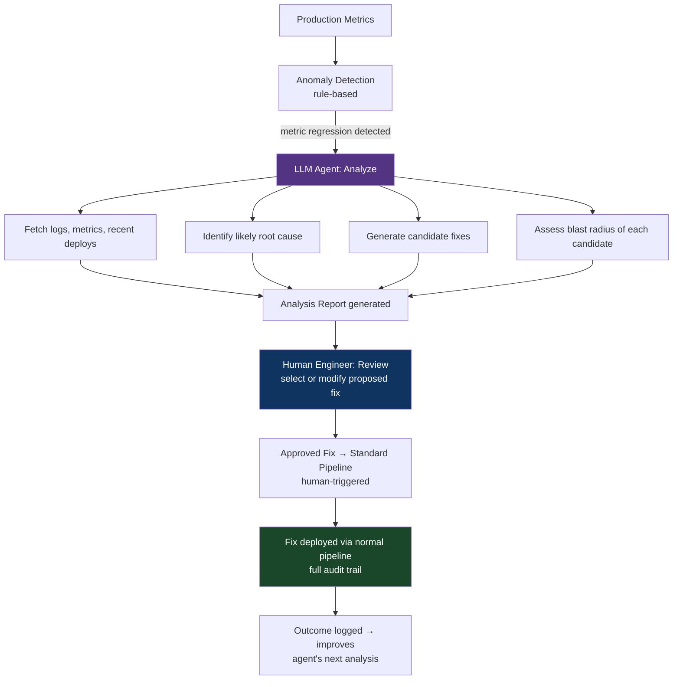

# Chapter 62: The Agentic CI/CD & Self-Evolving Infrastructure Pattern
*Part XI: Beyond Hyperscale — The Absolute Frontier*

> *"The question is not whether LLMs can help with CI/CD.
> They clearly can. The question is which tasks they do reliably enough
> to put in an automated loop without a human reviewing every output.
> That list is shorter than the hype suggests
> and longer than the skeptics admit."*
> — BOOK_AUTHOR, 2024

---

## Distinguishing Hype from Reality

The term "agentic CI/CD" describes a spectrum from "LLM helps a developer write a GitHub Actions YAML" to "an autonomous agent modifies the production deployment pipeline in response to metrics." These are not the same thing, and conflating them leads to either overclaiming (we have self-healing infrastructure!) or underclaiming (LLMs can't be trusted near deployments).

This chapter maps the specific capabilities that are reliable today, the specific capabilities that aren't, and the feedback loop architecture that connects them safely.

---

## What Works Today: The Reliable Zone

### 1. Failure Log Analysis and Triage

LLMs are excellent at analyzing CI failure logs. A 2,000-line error log that takes a developer 15 minutes to parse takes an LLM 2 seconds. The LLM's analysis is consistently useful for identifying:
- The root cause line in a stack trace buried in noise
- Patterns across multiple recent failures ("this test has failed 3 times in the last 7 days")
- Whether a failure is likely flaky, infrastructure, or code-related
- The specific file and function that needs attention

This is the failure triage pattern from Chapter 8. At the level of "summarize this failure and suggest where to look," current LLMs are reliable and production-deployed at multiple large engineering organizations.

```python
# failure_analyzer.py — production-deployed LLM failure triage

import anthropic

def analyze_ci_failure(
    log_output: str,
    changed_files: list[str],
    recent_failures: list[str]  # Last 5 failure summaries for this test/service
) -> FailureAnalysis:
    """Analyze a CI failure log and produce actionable triage."""
    
    client = anthropic.Anthropic()
    
    message = client.messages.create(
        model="claude-opus-4-7",
        max_tokens=1024,
        messages=[{
            "role": "user",
            "content": f"""You are a senior engineer triaging a CI failure.

Changed files in this build:
{chr(10).join(changed_files)}

Recent failure history (last 5 failures on this branch/test):
{chr(10).join(recent_failures)}

CI failure output (last 100 lines):
{log_output[-4000:]}

Provide:
1. Root cause (1-2 sentences, be specific)
2. Is this likely caused by the changed files? (yes/no/unlikely, with reason)
3. Is this likely a flaky test? (yes/no, with evidence from recent history)
4. Recommended next action (specific: file path and function if applicable)

Be direct. No caveats. If you don't have enough information, say so."""
        }]
    )
    
    return parse_triage_response(message.content[0].text)
```

**Reliability assessment**: Very high. This task is well within current LLM capabilities. The output is advisory — a developer reads it and decides whether to act on it. Errors in the analysis cause a developer to investigate the wrong place, not production incidents.

### 2. Pipeline Configuration Generation

Current LLMs generate correct GitHub Actions YAML, GitLab CI configurations, and Dockerfile syntax at a quality that exceeds most developer's first drafts. They are good at:
- Generating a CI pipeline from a description ("a Node.js service with PostgreSQL integration tests")
- Converting between CI systems ("convert this GitHub Actions workflow to GitLab CI")
- Adding specific steps ("add a dependency audit step to this existing workflow")

**Reliability assessment**: High for generation; medium for security-correctness. A generated workflow may have security issues (improper secret handling, overly permissive permissions, fork PR vulnerabilities) that require human review. Use LLM generation as a starting point, not a finished artifact.

### 3. Documentation and Runbook Generation

LLMs generate accurate documentation from pipeline code. Given a complex Jenkinsfile or GitHub Actions workflow, an LLM can produce a human-readable explanation, a runbook for common failure scenarios, and a decision tree for on-call engineers.

**Reliability assessment**: Very high. Documentation errors are low-blast-radius.

---

## What Doesn't Work Today: The Unreliable Zone

### 1. Autonomous Pipeline Modification

An LLM agent that analyzes a failing pipeline and modifies the pipeline configuration autonomously (without human review) is not reliable enough for production use in 2024. The failure modes:

- **Security regressions**: The agent "fixes" a security gate by lowering the threshold or disabling it
- **Subtle logical errors**: The agent modifies a conditional that looks wrong but was correct for a non-obvious reason
- **Context blindness**: The agent doesn't have access to the organizational history behind a pipeline decision; it removes a "redundant" check that was added after a specific incident
- **Cascading modifications**: An agent that triggers other agents creates compounding errors

**The principled reason**: LLMs generate plausible-looking code, not correct code. For application code, tests and code review catch errors. For pipeline code, the "test suite" is production — you find out the pipeline is wrong when it fails to catch a regression. The blast radius of a pipeline error is every deployment through that pipeline.

### 2. Novel Debugging of Complex Distributed System Failures

LLMs are pattern matchers over training data. For failure modes that have well-documented patterns (OOM errors, race conditions, network timeouts), they perform well. For novel failures — a specific interaction between three services under unusual load conditions — they produce confident-sounding but often incorrect analyses.

**The test**: ask an LLM to debug a production incident from a postmortem with an unusual root cause. The LLM will produce plausible-sounding explanations that may or may not match reality. For a human engineer reading the analysis, distinguishing "this is correct" from "this sounds correct" is non-trivial.

### 3. Long-Horizon Autonomous Tasks with Irreversible Consequences

An agent that executes multi-step tasks in a production environment — "investigate this incident and fix the root cause" — has the same problem as break-glass deployments (Chapter 44) without the two-person rule: the blast radius of an error accumulates across steps, and intermediate steps may be irreversible.

---

## The Feedback Loop Architecture: Agents as Advisors

The right architecture for agentic CI/CD today treats LLMs as advisors in a human-reviewed loop, not as autonomous actors:



This is the pattern from Chapter 26 (incident-driven feedback loop) with an LLM in the analysis phase, not the execution phase. The agent dramatically accelerates the "understand what happened and what to do about it" work. The human maintains control of "execute the fix."

```python
# incident_analysis_agent.py — LLM as advisor in incident response

import anthropic
from typing import Generator

def analyze_incident_and_propose_fixes(
    incident_id: str,
    service: str,
    error_rate: float,
    recent_deployments: list[dict],
    recent_logs: str,
    open_issues: list[dict]
) -> IncidentAnalysis:
    """
    Analyze a production incident and propose candidate fixes.
    
    Returns analysis for human review — NOT for autonomous execution.
    """
    
    client = anthropic.Anthropic()
    
    response = client.messages.create(
        model="claude-opus-4-7",
        max_tokens=2048,
        messages=[{
            "role": "user",
            "content": f"""You are analyzing a production incident for human engineers to review.

Service: {service}
Current error rate: {error_rate:.1%}
Incident ID: {incident_id}

Recent deployments (last 3):
{format_deployments(recent_deployments)}

Open issues in this service:
{format_issues(open_issues)}

Recent error logs:
{recent_logs[-3000:]}

Provide a structured analysis with:
1. Most likely root cause (be specific; cite the deployment or code change if visible)
2. Confidence: high/medium/low with one sentence of reasoning
3. Top 3 candidate fixes, ordered by likelihood of success:
   - Fix description
   - Risk level: low/medium/high
   - Estimated blast radius if wrong
   - How to verify before executing
4. Recommended immediate mitigation if available (rollback, feature flag, config change)

CRITICAL: This analysis will be reviewed by a human engineer before any action is taken.
Be accurate over being confident. Flag uncertainty explicitly."""
        }]
    )
    
    analysis = parse_incident_analysis(response.content[0].text)
    
    # Store analysis for feedback loop
    store_incident_analysis(incident_id, analysis, model_used="claude-opus-4-7")
    
    return analysis
```

---

## Current State of the Art

The most sophisticated production deployments of agentic CI/CD as of 2024:

**GitHub Copilot for CLI**: Suggests shell commands based on natural language. Does not execute autonomously. Human approves each command.

**Devin (Cognition)**: An AI software engineer that can execute multi-step coding tasks. Demonstrated ability to fix bugs, write tests, and make pull requests. Reliability for novel/complex tasks is not at human engineer level. Not deployed for autonomous production pipeline modification.

**Internal tooling at major cloud providers**: Amazon, Google, and Microsoft have internal LLM-assisted incident response tools that accelerate root cause analysis and generate runbook suggestions. Based on public presentations, these tools are advisory — they generate analysis for engineers to review, not automated fixes to execute.

**Cursor/Copilot for pipeline code**: LLM-assisted writing of GitHub Actions YAML, Terraform, and Dockerfile code. Widely adopted, high value, human reviews all output.

---

## The Safety Constraints That Cannot Be Removed

Regardless of how capable LLMs become:

**1. Every production-affecting change must have an audit trail.** An agent that makes changes without recording who authorized them violates compliance requirements and makes incident investigation impossible.

**2. Every production-affecting change must be reversible.** An agent cannot make irreversible changes (destructive database migrations, resource deletions, configuration changes with no rollback path) without explicit human sign-off.

**3. The blast radius must be bounded.** An agent operating in the deployment pipeline has access to a system that affects all users. The scope of any autonomous action must be bounded — no agent should be able to affect more than a small percentage of users without human approval.

**4. Human override must always be available.** If the agent's recommendation is wrong, a human must be able to stop it and take manual control. This requires the agent to operate through the same pipeline mechanisms (GitHub Actions, kubectl, Terraform) that humans use, not through privileged direct access.

---

## Anti-Patterns

### ❌ Anti-Pattern: Agents with Direct Production Access

**What it looks like:** An LLM agent with kubectl cluster-admin credentials that analyzes incidents and applies fixes directly, without any human review or pipeline.

**What breaks:** Every safety property the deployment pipeline was designed to maintain. An agent with direct production access that makes an error has the same blast radius as a human engineer with direct production access who makes the same error — which is why the pipeline exists in the first place.

**The fix:** Agents operate through the pipeline, not around it. An agent that wants to deploy a fix creates a PR that goes through the normal review process.

---

## Chapter Summary

Agentic CI/CD is real, useful, and deployed in production today — in the advisory role. LLMs accelerate failure triage, generate pipeline configuration, and summarize incident analysis faster than any human can. These are high-value, production-safe applications with clear blast radius limits.

Autonomous pipeline modification without human review is not safe or reliable with current LLM capabilities. The failure modes are subtle (security regressions, context blindness), the blast radius is high (affects all deployments through the pipeline), and the "test suite" for pipeline correctness is production. The architecture that's right for today: LLMs as fast, tireless advisors; humans as the decision-makers for production-affecting actions.
