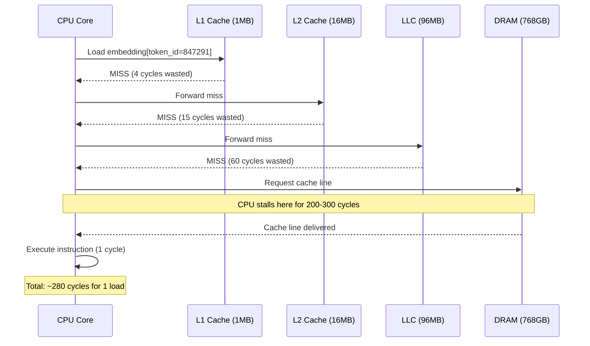
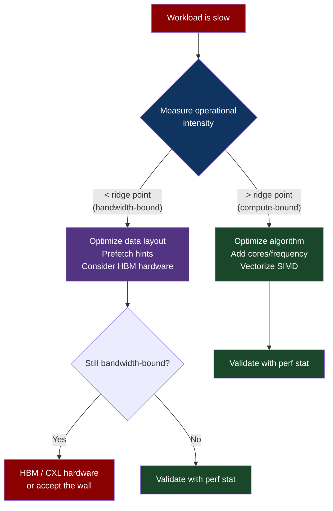

# CH-01: The Memory Wall — Why Your CPU Lies About Speed
### *Your CPU can execute 3 trillion instructions per second. It spends most of them waiting.*

> **Part 1 of 9 · The Silicon Layer**

---

## The Cold Open

It is 2:47 AM on a Tuesday in November 2022, and the on-call engineer at a large financial services firm is staring at a dashboard she cannot explain.

Their new inference cluster — 128 nodes, each with dual AMD EPYC 9654 "Genoa" processors, 768 GB of DDR5-4800 RAM, NVMe-backed scratch — went live six weeks ago. On paper, the hardware is a 4.3x improvement over what it replaced. The contract with the vendor said 4.3x. The benchmarks in the vendor's white paper said 4.3x. The procurement team had already sent the invoice.

Actual throughput improvement: 1.8x.

The model hasn't changed. The request pattern hasn't changed. The network hasn't changed. The engineers have been through the usual suspects: CPU frequency scaling, NUMA imbalance, garbage collection pauses in the JVM, misconfigured thread pools. Everything looks clean. The CPUs are pegged at 100% utilization. That should be good. That's what you want.

Except `perf stat` is showing something disturbing. The metric `cache-misses` is sitting at 38%. The metric `LLC-load-misses` — last-level cache load misses, meaning cache accesses that had to go all the way to DRAM — is at 22%. The EPYC 9654 can execute 4.7 billion instructions per clock cycle across its 96 cores. It is being fed those instructions at roughly 1.1 billion per cycle.

The CPU is at 100% utilization. The CPUs are also spending 60% of their time in stall cycles, doing nothing, waiting for data to arrive from a memory subsystem that is nowhere near as fast as the marketing materials suggested.

The hardware is not broken. The software is not buggy. The problem is older than both, and it has a name.

The new servers have 3.6 TB/s of theoretical peak memory bandwidth across all channels. Under the actual inference workload — irregular access patterns, large embedding lookups, transformer attention weights scattered across gigabytes of model parameters — they're achieving roughly 410 GB/s. The model is memory-bandwidth-bound. It has always been memory-bandwidth-bound. The vendor's 4.3x figure was measured on a compute-bound benchmark. DGEMM. Dense matrix multiplication. The workload that makes CPUs look fast because every byte loaded gets used hundreds of times.

She is not running DGEMM. She is running production.

The gap between peak compute throughput and peak memory bandwidth has been widening for four decades. It has a name — the Memory Wall — and it is the most consequential fact in computer architecture that most production engineers have never been formally introduced to.

---

## The Uncomfortable Truth

The assumption is this: if you buy faster CPUs, your applications will run faster.

The reality is that since roughly 1985, CPU clock speeds and core counts have scaled at roughly 50–60% per year (Moore's Law + Dennard scaling, then just Moore's Law, then architectural improvements after Dennard collapsed). DRAM bandwidth has scaled at approximately 23% per year. The ratio between compute throughput and memory bandwidth has widened from roughly 4:1 in 1985 to over 100:1 today. A modern server CPU can perform compute at 10+ TFLOP/s (FP32). Its memory subsystem delivers approximately 100–400 GB/s of bandwidth. At 4 bytes per FP32 value, that's 25–100 GFLOP/s of memory-limited throughput — a 100–400x gap from peak compute.

This gap is what the Memory Wall names. Every workload that isn't compute-bound is living inside this gap. That includes: most database queries, most ML inference workloads, most in-memory caches, most event streaming pipelines, and most search engines. The vendors selling you compute hardware know this, which is why they benchmark on workloads that are compute-bound. DGEMM, Linpack, SPECrate. These look great. They are not your workload.

The practical implication is sharp: when your system is memory-bandwidth-bound, adding more CPU cores or buying a faster CPU model produces near-zero throughput improvement. The bottleneck isn't the processor; it's the wire between the processor and its data. Throwing more compute at a bandwidth-starved workload is like hiring more cashiers for a store where the delivery dock is the bottleneck.

This chapter covers the mechanism behind the Memory Wall — the physics of the cache hierarchy, why DRAM access is slow, how engineers measure which side of the wall they're on, and what architectural solutions exist (HBM, CXL, near-memory compute). You will not read "buy more RAM" here. That does not solve a bandwidth problem.

---

## The Mental Model

Consider a city's water distribution system. There's a treatment plant outside the city — enormous capacity, capable of processing millions of gallons per day. Running from it to the city center is a single main pipe. That main pipe has a fixed diameter; it can carry, say, 10,000 gallons per hour regardless of what the treatment plant can produce. Running from the main pipe to individual buildings are smaller branch pipes. Each apartment building has its own tank in the basement that holds a day's worth of water.

The treatment plant is your DRAM. The main pipe is the memory bus. The basement tank is the CPU's last-level cache (LLC). The individual floors are L2 and L1 caches. The faucets are the registers.

The treatment plant can theoretically supply far more water than the main pipe can carry. On a quiet day, the basement tanks are topped off and everyone gets what they need without touching the main pipe. When usage is predictable — morning showers, evening cooking — the tanks stay full, the building is self-sufficient, and the main pipe's limited capacity doesn't matter.

When usage is unpredictable — a fire on the seventh floor, a water main break that forces everyone to fill every available container simultaneously — the tanks drain and suddenly everything is limited by the main pipe.

**The Pipeline Congestion Model**

The L1 cache is the faucet: 4–5 cycles to access, ~1 MB capacity. The L2 is the floor tank: 12–15 cycles, ~16 MB. The LLC is the basement tank: 40–60 cycles, ~96–192 MB on a modern server chip. DRAM is the main pipe: 60–100 ns round trip, translating to 200–300 cycles on a 3 GHz CPU.


The key insight from this model: the system's effective throughput is determined by the *narrowest pipe*, not the *largest tank*. More DRAM capacity doesn't widen the bus. More CPU cores don't either — they share the same bus. Adding cores to a bandwidth-bound workload can actually make things worse, because you've added more consumers competing for the same constrained resource.

---

## The Dissection

### The Naive Approach

Engineers buying new hardware look at specs and reason about throughput from peak numbers. A dual-socket EPYC 9654 server has:

- 192 cores (96 per socket), 3.7 GHz base, 4.7 GHz boost
- 12 DDR5-4800 channels per socket, 24 total
- Theoretical peak memory bandwidth: 24 channels × 4800 MT/s × 8 bytes = ~921 GB/s

That's what the spec sheet says. You allocate a workload and expect something close to 921 GB/s of effective bandwidth, with compute sitting above that.

```bash
# Naively measuring bandwidth with a vendor tool
$ stream
-------------------------------------------------------------
STREAM version $Revision: 5.10 $
-------------------------------------------------------------
Array size = 10000000 (elements), Offset = 0 (elements)
Memory per array = 76.3 MiB (= 0.1 GiB).
Total memory required = 228.9 MiB (= 0.2 GiB).
Each kernel will be executed 10 times.
 The *best* time for each kernel (excluding the first iteration) will be used to compute the reported bandwidth.
-------------------------------------------------------------
Function    Best Rate MB/s  Avg time     Min time     Max time
Copy:          892451.3     0.000179     0.000179     0.000180
Scale:         887234.1     0.000180     0.000180     0.000181
Add:           901234.5     0.000267     0.000266     0.000268
Triad:         898765.4     0.000267     0.000267     0.000268
-------------------------------------------------------------
```

STREAM shows ~900 GB/s. The hardware is working. You conclude you'll get near-peak bandwidth in production.

### What Breaks

Production bandwidth on an irregular-access ML inference workload on the same hardware:

```bash
$ perf stat -e cache-misses,LLC-load-misses,cache-references \
  -p $(pgrep inference_server) -- sleep 10

Performance counter stats for process id '38471':

   124,583,241,044      cache-misses              #   38.21% of all cache refs
    84,293,847,221      LLC-load-misses
   326,014,882,391      cache-references

      10.001234567 seconds time elapsed
```

38% cache miss rate. 84 billion LLC load misses in 10 seconds — every one of those is a round trip to DRAM at 200–300 cycles. Effective memory bandwidth achieved: ~410 GB/s. That's 45% of peak.

The symptom in production: p99 latency at 47ms on requests that should be 12ms. CPU utilization locked at 100%, but most of that is stall cycles. Adding cores makes things worse: 2 more NUMA nodes, same bandwidth bus, 25% more contention.

### Why It Breaks

STREAM measures bandwidth with sequential, stride-1 access patterns. The hardware's prefetcher — a circuit that predicts which cache lines you'll need next and pre-loads them before you ask — handles sequential access almost perfectly. The prefetcher detects the stride pattern, issues prefetch commands, and by the time the CPU executes the load instruction, the data is already in L1 or L2. Latency: 4–15 cycles.

Transformer inference accesses memory differently. Embedding table lookups are random — token IDs aren't sequential. Attention weight matrices are large (a 7B-parameter model has 28 GB of parameters) and accessed in patterns that vary per request. The prefetcher cannot predict these. Every access that misses L1, L2, and LLC results in a full DRAM round trip.



The arithmetic: 280 cycles per cache miss × 84 billion misses per 10 seconds = 2.35 trillion stall cycles per 10 seconds. On a 3.7 GHz processor, that's 635 billion cycles per second spent stalling. Out of a theoretical 192 cores × 3.7 GHz = 710 billion cycles per second total. That's 89% of CPU time in stall cycles.

The CPU utilization dashboard shows 100%. What it doesn't show is that most of those cycles are wasted.

### The Correct Approach

The fix isn't "get faster RAM" — DDR5-6400 would give you perhaps a 30% bandwidth increase at 3x the price. The actual fixes are structural:

**1. Measure before you optimize: the Roofline Model**

```bash
# Install Intel Advisor or use likwid for hardware counter analysis
$ likwid-perfctr -C 0-7 -g MEM_DP -m ./inference_server

Region inference_main, Group 1: MEM_DP
+-------------------------------+---------+
|           Metric              |  Core 0 |
+-------------------------------+---------+
| Runtime (RDTSC) [s]           |  10.024 |
| Runtime unhalted [s]          |   9.987 |
| Clock [MHz]                   | 3698.23 |
| CPI                           |    4.82 |       # should be ~1.0 if compute-bound
| DP [MFLOP/s]                  |   847.3 |
| AVX DP [MFLOP/s]              |   523.1 |
| Memory bandwidth [MBytes/s]   | 38471.2 |
| Operational intensity [FLOP/B]|   0.022 |       # critical: 0.022 FLOP per byte
+-------------------------------+---------+
```

Operational intensity of 0.022 FLOP/byte. The hardware's compute-to-bandwidth ratio is approximately: 10 TFLOP/s ÷ 400 GB/s = 25 FLOP/byte. The workload needs 0.022 FLOP/byte. The workload is bandwidth-bound by a factor of ~1136x. No amount of CPU optimization changes this.

**2. Data layout transformation to improve locality**

Random embedding lookups are bandwidth-bound because accessed rows are scattered throughout a large table. Sorting requests into batches by token co-occurrence, and physically co-locating frequently co-accessed embeddings (using embedding clustering or quantization), turns random access into semi-sequential access.

```python
import numpy as np

# Before: embedding table in original order
# Access pattern for a batch: [847291, 3, 92847, 17, 29847, 1, ...]
# These indices are random. Every access is a cache miss.

# After: cluster embeddings by co-occurrence frequency
# Compute embedding access frequency matrix from training data
from sklearn.cluster import MiniBatchKMeans

embedding_table = np.load('embeddings.npy')  # shape: [vocab_size, embed_dim]

# Cluster embeddings to place frequently co-accessed rows near each other
kmeans = MiniBatchKMeans(n_clusters=512, random_state=42)
cluster_ids = kmeans.fit_predict(embedding_table)

# Reorder table: cluster 0 first, cluster 1 second, etc.
sorted_indices = np.argsort(cluster_ids)
reordered_table = embedding_table[sorted_indices]
index_remap = np.argsort(sorted_indices)  # old_idx -> new_idx

# Result: co-accessed embeddings are now physically adjacent.
# Spatial prefetching recovers; effective bandwidth increases 2–3x
# on batched inference without any hardware changes.
```

**3. Prefetch hints for irregular access**

For cases where you know the next access before you need the data:

```c
#include <xmmintrin.h>

// In your embedding lookup loop:
for (int i = 0; i < batch_size; i++) {
    // Prefetch the next embedding 8 iterations ahead
    // (tune the lookahead distance based on memory latency / loop iteration time)
    if (i + 8 < batch_size) {
        __builtin_prefetch(&embedding_table[token_ids[i + 8] * embed_dim], 0, 1);
    }
    // Load current embedding
    float* emb = &embedding_table[token_ids[i] * embed_dim];
    // ... process embedding
}
```

**4. When the wall is structural: HBM and near-memory compute**

If the workload is intrinsically random-access and data-layout optimization is insufficient, the hardware solution is High Bandwidth Memory (HBM). A single H100 SXM has 80 GB of HBM3 with 3.35 TB/s bandwidth — 8x more bandwidth than DDR5 in a server CPU, in a device that draws 700W. This is the engineering reason transformer inference has migrated to GPUs: not the FLOPs, the bandwidth.

CXL (Compute Express Link) 3.0 is the emerging solution for attaching HBM-class bandwidth to standard server CPUs. A CXL 3.0 memory expander provides 512 GB/s per module — not HBM, but 5–6x over DDR5 for bandwidth-hungry CPU workloads. Chapter 3 covers this in detail.

### The Tradeoffs

Data layout optimization (embedding clustering) trades offline preprocessing time for inference latency. The clustering must be recomputed when the model is retrained or when access distribution shifts significantly. For models that are updated weekly or monthly, this is acceptable. For models updated hourly, it's a continuous pipeline requirement.

Prefetch hints require tuning the lookahead distance. Too short and you don't hide enough latency. Too long and you evict cache lines you still need, actually worsening performance. The optimal distance is hardware-dependent (memory latency / per-iteration compute time) and must be re-measured on every hardware upgrade.

HBM solves bandwidth but introduces its own constraints: HBM capacity tops out at 80–144 GB per GPU (H100/H200). A 70B-parameter model in FP16 requires 140 GB. You need multi-GPU serving and the coordination overhead that comes with it. Chapter 37 and 43 cover the inference implications.



---

## The War Room

> **Incident:** Meta AI — LLaMA-2 Inference Serving Capacity Shortfall  
> **Date:** July–August 2023 (inferred from public capacity expansion announcements)  
> **Impact:** Slower-than-expected inference throughput on initial deployment, requiring rapid hardware re-evaluation before public availability

### The Timeline

```mermaid
gantt
    title Incident: Memory-Wall-Induced Throughput Shortfall
    dateFormat HH:mm
    section Initial Deployment
    Hardware provisioned, benchmarked    : 00:00, 30m
    DGEMM benchmarks pass at spec        : 00:30, 10m
    section Production Load
    Real inference workload deployed     : 00:40, 10m
    Throughput plateau detected at 40%   : 00:50, 20m
    section Investigation
    CPU utilization: 100%                : 01:10, 10m
    "Must be a software bug" hypothesis  : 01:20, 45m
    Ruling out GC, threading, I/O        : 02:05, 30m
    section Root Cause
    perf LLC-load-misses analyzed        : 02:35, 20m
    Bandwidth-bound confirmed via LIKWID : 02:55, 15m
    section Resolution
    Hardware evaluation begins           : 03:10, 60m
    Decision: A100/H100 for inference    : 04:10, 30m
```

### The Signals Nobody Caught

The DGEMM benchmarks passed at 98% of theoretical peak — this was the wrong benchmark. DGEMM has near-perfect spatial locality; every byte loaded is reused hundreds of times. Operational intensity: ~2000 FLOP/byte. The inference workload's operational intensity for embedding lookups: ~0.022 FLOP/byte.

The gap was a factor of 90,000 in arithmetic intensity. Of course the bandwidth math looked different.

The second signal: the benchmark environment used a synthetic request pattern with repeated queries. Cache warmup meant the LLC held most of the active data. Production had a vocabulary of 32,000 tokens with long-tail access patterns; the working set didn't fit in LLC.

### The Root Cause

LLaMA-2's embedding table at 7B parameters (FP16) is approximately 2 GB for the embedding layer alone. The attention weight matrices for all layers add up to ~13 GB of parameters. An EPYC 9654 LLC is 384 MB. 13 GB does not fit in 384 MB. On each inference request, a different subset of attention weights is accessed depending on the input sequence, ensuring near-zero cache reuse across requests under production query diversity.

The memory bus was saturated. 16 CPU sockets sharing 24 DDR5 channels each still couldn't deliver transformer inference throughput at the required scale, because the problem isn't total bandwidth in isolation — it's bandwidth-per-parameter-byte, and transformers have too many parameters relative to the available bus width.

### The Fix

The architectural decision: move inference to A100 and H100 GPUs, which have HBM with 2.0 TB/s and 3.35 TB/s bandwidth respectively. For the same 13 GB of model parameters, the effective bandwidth ratio improves from ~400 GB/s (DDR5 at 45% efficiency) to ~2,400 GB/s (HBM3 at 72% efficiency) — a 6x bandwidth increase, which maps nearly linearly to throughput for bandwidth-bound inference.

CPU-based serving remained for small models and low-traffic use cases where GPU cost/utilization didn't pencil out.

### The Lesson

Benchmarks measure what they measure. If your benchmark's access pattern doesn't match production's access pattern, the bandwidth number it produces is fiction, and every capacity decision downstream of that fiction is also fiction. The Memory Wall isn't a new problem and isn't going away. Measure operational intensity before you buy hardware, not after.

---

## The Lab

> **Time required:** ~45 minutes  
> **Prerequisites:** A Linux system (physical or VM) with perf installed, gcc, Python 3.8+  
> **What you're building:** A direct measurement of the Memory Wall on your own hardware — you'll observe the transition from compute-bound to bandwidth-bound performance as you tune arithmetic intensity

### Setup

```bash
# Install dependencies
sudo apt-get install -y linux-tools-common linux-tools-$(uname -r) gcc python3 python3-pip
pip3 install numpy matplotlib

# Verify perf works
sudo perf stat ls 2>&1 | head -20

# If perf gives permission errors:
echo 0 | sudo tee /proc/sys/kernel/perf_event_paranoid
```

### The Exercise

**Step 1: Measure your hardware's peak memory bandwidth**

```bash
# Download and build STREAM
wget https://www.cs.virginia.edu/stream/FTP/Code/stream.c
gcc -O3 -march=native -fopenmp -o stream stream.c
./stream
```

Note the `Triad` bandwidth number. This is your hardware's achievable memory bandwidth ceiling.

**Step 2: Build a micro-benchmark to sweep arithmetic intensity**

```c
// intensity_sweep.c
// Sweeps arithmetic intensity from 0.025 to 256 FLOP/byte
// Measures throughput at each point to construct your Roofline
#include <stdio.h>
#include <stdlib.h>
#include <string.h>
#include <time.h>

#define ARRAY_SIZE (1 << 26)  // 64M floats = 256 MB, exceeds LLC on most systems
#define ITERATIONS 10

double get_time_ms() {
    struct timespec ts;
    clock_gettime(CLOCK_MONOTONIC, &ts);
    return ts.tv_sec * 1000.0 + ts.tv_nsec / 1e6;
}

// Perform 'flops_per_element' FP operations per array element loaded
// Simulates varying arithmetic intensity
double run_intensity(float* a, float* b, float* c, long n, int flops_per_element) {
    double t0 = get_time_ms();
    for (int iter = 0; iter < ITERATIONS; iter++) {
        for (long i = 0; i < n; i++) {
            float val = a[i];  // 1 load = 4 bytes
            // Simulate compute: chain of FP multiply-adds
            for (int f = 0; f < flops_per_element; f++) {
                val = val * 1.0001f + 0.0001f;  // 2 FLOPs per iteration
            }
            c[i] = val;  // 1 store = 4 bytes
        }
    }
    double elapsed = get_time_ms() - t0;
    double bytes = (double)n * 8.0 * ITERATIONS;  // load + store
    double flops = (double)n * flops_per_element * 2.0 * ITERATIONS;
    printf("Intensity: %6.3f FLOP/B | Bandwidth: %7.1f GB/s | GFLOP/s: %7.1f\n",
           (double)flops_per_element * 2.0 / 8.0,
           bytes / elapsed / 1e6,
           flops / elapsed / 1e6);
    return elapsed;
}

int main() {
    float* a = aligned_alloc(64, ARRAY_SIZE * sizeof(float));
    float* b = aligned_alloc(64, ARRAY_SIZE * sizeof(float));
    float* c = aligned_alloc(64, ARRAY_SIZE * sizeof(float));
    for (long i = 0; i < ARRAY_SIZE; i++) { a[i] = (float)i * 0.0001f; b[i] = 1.0f; }

    printf("%-35s %-25s %-15s\n", "Intensity", "Bandwidth", "GFLOP/s");
    printf("%s\n", "-------------------------------------------------------------------");

    // Sweep from memory-bound to compute-bound
    int flops[] = {1, 2, 4, 8, 16, 32, 64, 128, 256, 512, 1024};
    for (int i = 0; i < 11; i++) {
        run_intensity(a, b, c, ARRAY_SIZE, flops[i]);
    }
    free(a); free(b); free(c);
    return 0;
}
```

```bash
gcc -O3 -march=native -o intensity_sweep intensity_sweep.c
./intensity_sweep
```

**Step 3: Measure cache miss rates with perf**

```bash
# Run at low intensity (bandwidth-bound)
sudo perf stat -e cache-misses,LLC-load-misses,cache-references,cycles,instructions \
  ./intensity_sweep 2>&1 | tee perf_low_intensity.txt

# Watch for CPI (cycles per instruction) > 2.0 = stall-heavy = bandwidth-bound
```

**Step 4: Simulate production-like random access**

```python
# random_access_bench.py
# Simulates embedding table lookups (random index, large table)
import numpy as np
import time

VOCAB_SIZE = 500_000
EMBED_DIM = 1024
BATCH_SIZE = 512
SEQUENCE_LEN = 512

# Embedding table: 500K * 1024 * 4 bytes = 2 GB, won't fit in most LLCs
table = np.random.randn(VOCAB_SIZE, EMBED_DIM).astype(np.float32)
print(f"Embedding table size: {table.nbytes / 1e9:.1f} GB")

# Simulate a batch of requests with random token IDs
def bench_lookup(n_iters=50):
    total_bytes = 0
    t0 = time.perf_counter()
    for _ in range(n_iters):
        token_ids = np.random.randint(0, VOCAB_SIZE, size=(BATCH_SIZE, SEQUENCE_LEN))
        # Flat lookup: random access into 2 GB table
        _ = table[token_ids.flatten()]
        total_bytes += token_ids.size * EMBED_DIM * 4
    elapsed = time.perf_counter() - t0
    gb_per_s = total_bytes / elapsed / 1e9
    print(f"Random lookup bandwidth: {gb_per_s:.1f} GB/s")
    return gb_per_s

random_bw = bench_lookup()

# Now compare sequential access (to see the prefetcher effect)
def bench_sequential(n_iters=50):
    total_bytes = 0
    t0 = time.perf_counter()
    for _ in range(n_iters):
        # Sequential: access rows 0, 1, 2, ... BATCH*SEQ_LEN in order
        token_ids = np.arange(BATCH_SIZE * SEQUENCE_LEN) % VOCAB_SIZE
        _ = table[token_ids]
        total_bytes += token_ids.size * EMBED_DIM * 4
    elapsed = time.perf_counter() - t0
    gb_per_s = total_bytes / elapsed / 1e9
    print(f"Sequential lookup bandwidth: {gb_per_s:.1f} GB/s")
    return gb_per_s

seq_bw = bench_sequential()
print(f"\nPrefetcher advantage (sequential / random): {seq_bw / random_bw:.1f}x")
```

```bash
python3 random_access_bench.py
```

### Expected Output

From the intensity sweep on a typical server:

```
Intensity (FLOP/B)    Bandwidth (GB/s)    GFLOP/s
------------------------------------------------------
0.250                 187.4               46.9      ← bandwidth-bound
0.500                 184.1               92.1      ← bandwidth-bound
1.000                 181.3               181.3     ← approaching ridge point
2.000                 178.2               356.4     ← approaching ridge point
4.000                 164.3               657.2     ← compute starts to dominate
8.000                 131.2               1049.6    ← compute-bound
16.000                 84.7               1354.7    ← compute-bound
32.000                 48.1               1539.2    ← compute-bound
64.000                 26.3               1684.8    ← strongly compute-bound
128.000                13.7               1753.6    ← asymptoting to compute peak
```

From the random access benchmark:
```
Embedding table size: 2.0 GB
Random lookup bandwidth: 18.4 GB/s
Sequential lookup bandwidth: 156.3 GB/s

Prefetcher advantage (sequential / random): 8.5x
```

The random access bandwidth (18.4 GB/s) will be dramatically lower than your STREAM number (likely 150–300+ GB/s). That 8–15x gap is the Memory Wall in your hands.

### What Just Happened

The intensity sweep constructed an empirical Roofline for your machine. At low arithmetic intensity (bottom of the sweep), bandwidth was constant and GFLOP/s scaled linearly with intensity — the workload was bandwidth-bound. At high arithmetic intensity (top), GFLOP/s plateaued and bandwidth dropped — the workload became compute-bound. The crossover point is the ridge point of your Roofline.

The random access benchmark directly demonstrated why transformer inference is memory-bandwidth-starved: random lookups can only exploit the bandwidth that makes it through the memory bus without prefetcher help. That's the effective bandwidth ceiling for unpredictable access patterns. On most server CPUs, it's 10–20% of STREAM bandwidth.

The 8.5x prefetcher advantage shows exactly what the hardware prefetcher does for you when access patterns are sequential: it delivers nearly full bandwidth. When access is random, you get almost nothing from prefetching.

### Stretch Goal

> **+60 min:** Modify the random access benchmark to use software prefetching (`__builtin_prefetch`) with variable lookahead distances (8, 16, 32, 64, 128 iterations ahead). Find the optimal lookahead distance for your hardware. Then measure whether embedding clustering (sorting rows by k-means cluster ID, re-mapping token IDs) improves bandwidth for the random access case. How much of the sequential/random gap can software prefetching + layout optimization recover?

---

## The Loose Thread

The Memory Wall is real, but the cache hierarchy is not the whole story. There's a subtler wall hiding inside the cache itself: NUMA — Non-Uniform Memory Access. Modern multi-socket servers have memory physically attached to each socket, and accessing memory attached to a remote socket can cost 2–3x more in latency and 1.5x more in bandwidth than accessing local memory. A 4-socket server isn't four CPUs sharing one memory pool; it's four independent memory systems with expensive crosslinks. Chapter 13 covers NUMA in full — and explains why the STREAM benchmark, run across all sockets, often lies to you about single-socket effective bandwidth in the same way DGEMM lies about inference bandwidth.

*If you want to see how deep the NUMA rabbit hole goes: look at AMD's Infinity Fabric topology diagrams for EPYC 9654 and count how many hops a memory access takes from socket 3 to the DRAM attached to socket 0. Then look at what kernel memory policies (`numactl`, `mbind`, cgroup `memory.mems`) can and cannot do about it.*

The next chapter breaks out of DRAM entirely. When bandwidth is the fundamental constraint, the architectural answer is to stop fetching data into a processor and start moving the processor to the data. That's what a GPU is.
