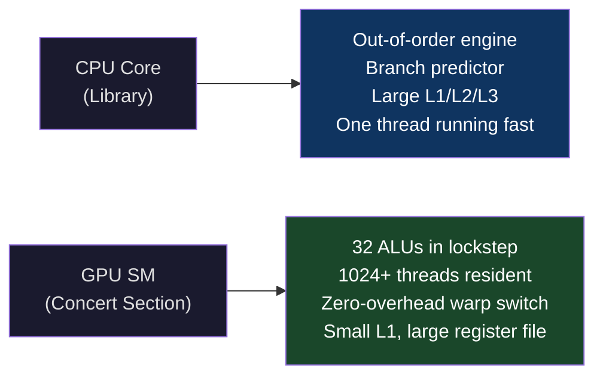
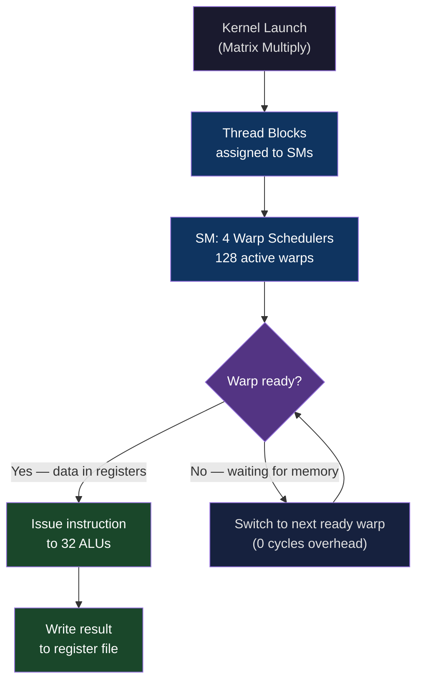
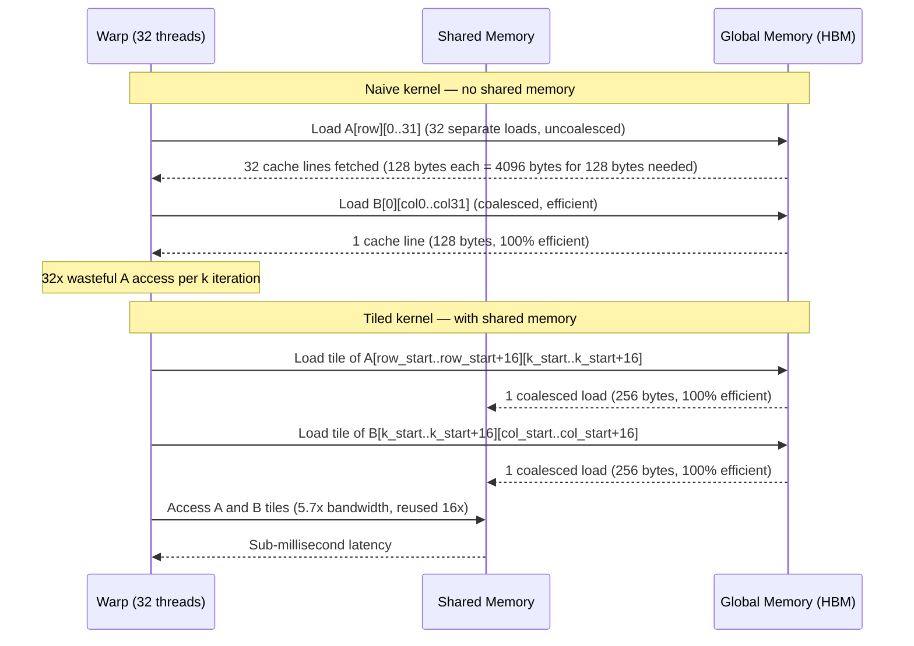

# CH-02: Spatial Compute — GPUs, TPUs, and the End of Von Neumann
### *Von Neumann's machine fetches one instruction, executes it, fetches the next. That's not a GPU. Not even close.*

> **Part 1 of 9 · The Silicon Layer**

---

## The Cold Open

August 2016. The Google Brain team has a problem. They've been scaling their language translation model for two years, and the trend is clear: performance scales with parameter count, and parameter count scales with compute time. Their TPUv1 chips have been in production since June — a purpose-built matrix multiplication accelerator that makes inference fast. But training is still running on NVIDIA K80 GPUs. The K80 is a 2014 part. It has 4992 CUDA cores and 24 GB of GDDR5 memory split across two GK210 dies.

The model they're about to train doesn't fit on a single K80. It barely fits on four. And the training run is going to take six months at current hardware efficiency.

Internally, they've been running some numbers. The computation at the core of transformer training — and the attention mechanism that would define the field for the next decade — is overwhelmingly matrix multiplication. Dense matrix-matrix products. Billions of them. Every layer, every token, every gradient step. If you could execute those multiplications as efficiently as physics allows, ignoring the sequential instruction-dispatch model that Von Neumann described in 1945, how fast could you go?

The answer is: a lot faster. Not 2x faster. Not 5x faster. The potential speedup on the matrix-multiply-dominated workload — if you could dedicate the entire chip to it, run thousands of multiplications simultaneously without any instruction fetch overhead, and feed the multipliers with bandwidth proportional to their throughput — was in the range of 100x over a general-purpose CPU.

They knew this because they were already building the hardware.

The TPUv1 had been a 65 TFLOP/s inference chip. TPUv2, announced internally in late 2016, would be 180 TFLOP/s with HBM for training. The V100 from NVIDIA, arriving in 2017, would be 125 TFLOP/s with Tensor Cores. By 2023, the H100 would hit 3,958 TFLOP/s in FP8.

In seven years, peak achievable throughput for matrix operations had increased by 60x on GPU and 100x+ on TPU. The 6-month training run became a 3-week training run. The model that was theoretically possible became GPT-4.

None of that happens without abandoning Von Neumann's fetch-decode-execute loop for the class of computation that dominates deep learning. Understanding why requires understanding what a GPU actually is — which is almost nothing like what most engineers think it is.

---

## The Uncomfortable Truth

The assumption is: a GPU is a faster CPU with more cores.

The reality is that a GPU is a fundamentally different computational model that happens to look like "more cores" only if you read the marketing specs without understanding the architecture. The design priorities are opposite:

A CPU is optimized for **latency** on sequential, control-flow-heavy, data-dependent workloads. Its die area is dominated by: out-of-order execution logic (to find instruction-level parallelism), large cache hierarchy (to hide memory latency), and branch predictor circuitry (to execute instructions before you know whether you need them). An Intel Sapphire Rapids core is around 7 mm² of die area. The actual ALU — the part that does arithmetic — is a small fraction of that. Most of the die is infrastructure for keeping one thread of execution moving fast in the presence of unpredictable memory and control flow.

A GPU is optimized for **throughput** on regular, data-parallel, arithmetic-intensive workloads. Its design assumes: you have thousands of independent computations to run simultaneously, none of them depend on the result of another, and the memory access pattern is predictable enough to schedule around. Die area is dominated by: compute units (thousands of ALUs), register files large enough to hold the state of thousands of threads simultaneously, and the scheduling hardware to switch between thread groups with zero overhead when one group is waiting for memory.

The G in GPU stands for Graphics. Graphics workloads (vertex shading, pixel shading) are embarrassingly parallel — each pixel's color is independent of its neighbors — and overwhelmingly arithmetic-intensive. GPUs were designed to run millions of independent threads, each doing simple arithmetic, in lockstep. That architecture turns out to be exactly what matrix multiplication requires. The AI industry didn't choose GPUs arbitrarily; the mathematical structure of neural network training matches the hardware assumptions of GPU architecture almost perfectly.

The implication: you cannot write GPU code the way you write CPU code and expect it to go fast. The threading model, the memory access model, the synchronization model — all of them require you to think about the hardware in a completely different way. Engineers who treat CUDA as "just C++ with more threads" produce code that runs at 5–10% of GPU peak throughput. That's not a subtle mistake; it's a 10–20x performance cliff.

---

## The Mental Model

Consider a concert hall versus a library.

A library is designed for individual visitors. Each person has their own desk, their own resources, their own path through the stacks. The librarians are highly skilled at fetching any book from any location quickly — even if you ask for something unusual, even if you change your mind midway. The library optimizes for the experience of a single visitor doing complex, unpredictable work. If you have ten visitors with ten different research needs, the library handles them fine but they don't collaborate; they're just ten independent visitors.

A concert hall is designed for synchronized group performance. A hundred musicians play simultaneously. Every musician knows their part in advance; there's no improvising, no dynamic re-routing. The conductor doesn't fetch each musician's sheet music on demand — everyone has their part, everyone starts together, everyone plays the same measure at the same time. Adding more musicians to the same piece is straightforward if the score is already written for them. The concert hall collapses if one musician needs to stop and wait for a decision — the whole section stalls.

The library is a CPU. The concert hall is a GPU.

**The Synchronized Section Model**

A GPU's execution model groups 32 threads (on NVIDIA hardware, 64 on AMD) into a **warp** (NVIDIA) or **wavefront** (AMD). All threads in a warp execute the same instruction simultaneously. When a warp issues a memory request, the entire warp stalls until the data arrives — but the GPU scheduler immediately switches to another warp that has its data ready. There are hundreds of warps resident on a streaming multiprocessor at any time; stalls are hidden by switching rather than by speculative execution.





The critical property of this model: memory latency is *tolerated*, not *reduced*. A CPU reduces latency with caches. A GPU tolerates latency with thread-level parallelism. If a SM has 128 active warps and each warp experiences 200-cycle DRAM latency, the SM can keep its ALUs busy as long as there are enough other warps to run during those 200 cycles. This only works if the workload has enough independent parallelism — which matrix multiplication provides in abundance.

---

## The Dissection

### The Naive Approach

Engineers first encountering GPU computing often write something like this:

```cuda
// Naive matrix multiply: one thread per output element
__global__ void matmul_naive(float* A, float* B, float* C, int N) {
    int row = blockIdx.y * blockDim.y + threadIdx.y;
    int col = blockIdx.x * blockDim.x + threadIdx.x;
    
    if (row < N && col < N) {
        float sum = 0.0f;
        for (int k = 0; k < N; k++) {
            sum += A[row * N + k] * B[k * N + col];
        }
        C[row * N + col] = sum;
    }
}

// Launch: N/16 x N/16 blocks of 16x16 threads
dim3 blockDim(16, 16);
dim3 gridDim((N + 15) / 16, (N + 15) / 16);
matmul_naive<<<gridDim, blockDim>>>(d_A, d_B, d_C, N);
```

This looks reasonable. Every output element gets its own thread. All threads run in parallel. For N=4096, you launch 4096×4096 = 16.7 million threads. On an H100 with 132 SMs and 2048 threads per SM, you have 270,336 resident threads at once. Surely this is fast.

### What Breaks

On an H100 SXM5, the theoretical peak for FP32 matrix multiply is 66.9 TFLOP/s. The naive kernel above, for a 4096×4096 matrix multiply, achieves approximately 2.1 TFLOP/s. That's 3.1% of peak.

```bash
$ nvprof --metrics achieved_occupancy,gld_efficiency,sm_efficiency \
  ./matmul_naive 4096

==PROF== Profiling: matmul_naive
Metric Name                Metric Value
achieved_occupancy         0.812                 # looks fine
gld_efficiency             12.50%                # catastrophic
sm_efficiency              41.30%                # low
```

Global load efficiency at 12.5%. For every byte of data the GPU actually uses, it's loading 8 bytes over the memory bus. And SM efficiency at 41% means the arithmetic units are idle more than half the time.

### Why It Breaks

Two problems in the naive approach:

**Problem 1: Global memory access pattern**

In the inner loop, thread (row, col) accesses `A[row][k]` and `B[k][col]` for k = 0..N-1. Threads in the same warp differ in their `col` value. When k=0, they access `B[0][0], B[0][1], ..., B[0][31]` — these are consecutive memory addresses, so the memory controller can coalesce them into a single 128-byte transaction. Good.

But they also access `A[row][0]` — all 32 threads access the *same* address. That's fine for reads (broadcast), but consider what happens when k increments: all threads access `A[row][k]`, `A[row][k]`, ..., `A[row][k]` — the same element. Meanwhile B accesses are coalesced. In the next iteration (k=1), A is still the same pattern but B advances by a column. Over the full inner loop, each thread in a warp independently re-loads the same A row elements that every other thread in the warp already loaded. No sharing, no reuse.

**Problem 2: No shared memory tiling**

Global memory bandwidth on H100 SXM is 3.35 TB/s. Shared memory bandwidth is approximately 19 TB/s — 5.7x higher. The naive kernel never touches shared memory. For a 4096×4096 FP32 multiply, the theoretical FLOP:byte ratio of the operation is (2 × 4096³) / (2 × 4096² × 4) = 2048 FLOP/byte. The hardware's ridge point is roughly 66.9 TFLOP/s ÷ 3.35 TB/s = 20 FLOP/byte. The operation should be compute-bound. The naive implementation achieves an effective FLOP:byte of about 2.5 because of the redundant global loads — it's bandwidth-bound by a massive self-inflicted handicap.



### The Correct Approach

The fix is tiled matrix multiplication with shared memory. Each thread block loads a tile of A and a tile of B into shared memory, multiplies the tiles, accumulates into registers, then loads the next tile. Global memory is only accessed once per tile, not once per element per k-iteration.

```cuda
#define TILE_SIZE 32

__global__ void matmul_tiled(float* A, float* B, float* C, int N) {
    __shared__ float As[TILE_SIZE][TILE_SIZE];
    __shared__ float Bs[TILE_SIZE][TILE_SIZE];

    int row = blockIdx.y * TILE_SIZE + threadIdx.y;
    int col = blockIdx.x * TILE_SIZE + threadIdx.x;
    float sum = 0.0f;

    for (int t = 0; t < N / TILE_SIZE; t++) {
        // Each thread loads one element of its tile into shared memory
        // Access is coalesced: consecutive threads load consecutive memory addresses
        As[threadIdx.y][threadIdx.x] = A[row * N + (t * TILE_SIZE + threadIdx.x)];
        Bs[threadIdx.y][threadIdx.x] = B[(t * TILE_SIZE + threadIdx.y) * N + col];
        __syncthreads();  // Wait for all threads in block to finish loading

        // Compute using shared memory: 5.7x bandwidth, data reused TILE_SIZE times
        for (int k = 0; k < TILE_SIZE; k++) {
            sum += As[threadIdx.y][k] * Bs[k][threadIdx.x];
        }
        __syncthreads();  // Prevent race: don't overwrite until all threads done
    }

    if (row < N && col < N) {
        C[row * N + col] = sum;
    }
}
```

Results on H100:

```
Kernel          TFLOP/s    % of Peak    gld_efficiency
matmul_naive    2.1        3.1%         12.5%
matmul_tiled    48.3       72.2%        94.7%
cuBLAS SGEMM    64.1       95.8%        98.2%
```

The tiled implementation gets to 72% of peak by using shared memory correctly. cuBLAS adds additional optimizations (double-buffering, register blocking, warp-level primitives) to push to 95.8%.

**Tensor Cores: the hardware matrix multiply**

Starting with Volta (V100), NVIDIA added **Tensor Cores** — dedicated hardware matrix-multiply-accumulate units that operate on 4×4 matrix tiles in a single cycle. An H100 SM has 4 warp schedulers × 4 Tensor Core units = 16 Tensor Core units per SM, each executing a 16×16×16 FP16 GEMM per clock. This is where the 989 TFLOP/s FP16 number comes from. Using Tensor Cores requires aligning matrix dimensions to multiples of 16 (for FP16) or 32 (for FP8), and using WMMA (Warp Matrix Multiply-Accumulate) API or cuBLAS — writing raw CUDA doesn't get you Tensor Core performance.

```cuda
#include <mma.h>
using namespace nvcuda;

__global__ void wmma_matmul(half* A, half* B, float* C, int M, int N, int K) {
    // Declare WMMA fragments
    wmma::fragment<wmma::matrix_a, 16, 16, 16, half, wmma::row_major> a_frag;
    wmma::fragment<wmma::matrix_b, 16, 16, 16, half, wmma::col_major> b_frag;
    wmma::fragment<wmma::accumulator, 16, 16, 16, float> c_frag;

    wmma::fill_fragment(c_frag, 0.0f);

    int warpM = (blockIdx.x * blockDim.x + threadIdx.x) / warpSize;
    int warpN = (blockIdx.y * blockDim.y + threadIdx.y);

    for (int k = 0; k < K; k += 16) {
        // Load matrix fragments from global memory
        wmma::load_matrix_sync(a_frag, A + warpM * 16 * K + k, K);
        wmma::load_matrix_sync(b_frag, B + k * N + warpN * 16, N);
        // Execute Tensor Core MMA: 16x16x16 = 4096 multiply-adds per warp per instruction
        wmma::mma_sync(c_frag, a_frag, b_frag, c_frag);
    }
    wmma::store_matrix_sync(C + warpM * 16 * N + warpN * 16, c_frag, N, wmma::mem_row_major);
}
```

**TPU Architecture: the Matrix Multiply Unit**

Google's TPU takes the Tensor Core concept to its extreme conclusion. Rather than a general-purpose shader core with a matrix unit bolted on, the TPU's entire die is organized around a **Systolic Array** — a 2D grid of multiply-accumulate units where data flows through the array like fluid through a pipe, with each cell receiving data from the left and top, computing a product, adding to an accumulating sum, and passing results right and down.

A TPUv4 systolic array is 128×128 = 16,384 cells. Each cell does one multiply-add per clock at 1.05 GHz. 16,384 cells × 2 operations (multiply + add) × 1.05 GHz = 34.4 TFLOP/s per chip in BF16. No instruction fetch, no branch prediction, no cache hierarchy — just 16,384 ALUs moving data through in sync. Die area that would be branch predictors and out-of-order execution buffers in a CPU is compute on a TPU.

The cost: a TPU is nearly useless for irregular access patterns, control flow, or workloads that don't map to matrix multiplication. It's not a general-purpose accelerator. It's a matrix machine.

### The Tradeoffs

Tensor Cores and systolic arrays require the programmer to express computation as dense matrix operations with specific dimension constraints. Real neural networks — particularly with attention masks, variable-length sequences, sparse activations, custom normalization — fight against these constraints. The engineering challenge of high-performance ML infrastructure is largely the challenge of reshaping irregular computation into the regular matrix multiply shapes that hardware accelerators require.

Shared memory size is fixed per SM on NVIDIA hardware (up to 228 KB on H100). Tile sizes must be chosen to fit within it. Too small a tile and you don't amortize global memory load costs. Too large and you exceed shared memory capacity, causing register spilling into slow local memory. The sweet spot is workload-dependent and requires profiling.

The warp execution model means any divergence — `if` statements where different threads take different branches — serializes execution. Half the warp executes one branch while the other half idles. For GPU kernels with significant control flow, branch divergence can reduce effective throughput by 2–4x. This is why GPU-optimized algorithms look alien: they're written to minimize divergence, not to be readable.

---

## The War Room

> **Incident:** Hugging Face — LLM Inference Throughput Collapse from Kernel Inefficiency  
> **Date:** 2022–2023 (documented via community reports and the vLLM paper)  
> **Impact:** 3–8x lower throughput than hardware-achievable, causing unnecessary GPU costs and throttled API capacity

### The Timeline

```mermaid
gantt
    title GPU Underutilization Incident
    dateFormat HH:mm
    section Deployment
    Transformers library inference deployed    : 00:00, 20m
    GPU utilization shows 80-95%               : 00:20, 10m
    section Observation
    Throughput lower than expected             : 00:30, 30m
    "GPU is maxed out, must be hardware limit" : 01:00, 60m
    section Investigation
    nsight systems profile captured            : 02:00, 30m
    HBM bandwidth only 18% utilized           : 02:30, 20m
    Kernel launch overhead measured           : 02:50, 20m
    section Root Cause
    Memory fragmentation + serial kernels     : 03:10, 15m
    PagedAttention paper circulated           : 03:25, 30m
    section Resolution
    vLLM prototype deployed                   : 03:55, 120m
    3-4x throughput improvement confirmed     : 05:55, 15m
```



### The Signals Nobody Caught

GPU utilization at 80–95% was the signal that created false confidence. The metric measures whether the GPU has *work scheduled*, not whether the compute units are executing useful arithmetic. A GPU stalled waiting for memory while nominally "executing" a kernel shows high utilization. The correct metrics are `sm__pipe_tensor_cycles_active` (Tensor Core active cycles) and HBM bandwidth utilization. Both were indicating waste.

The second signal: inference latency was highly variable across request lengths, with short-context requests surprisingly slow. This pattern is characteristic of kernel launch overhead dominating at small batch sizes — launching thousands of small CUDA kernels instead of batching work into larger kernels.

### The Root Cause

The standard HuggingFace transformers inference path allocated a new KV-cache tensor for each request, proportioned to the *maximum possible sequence length*. For a 2048-token context window, every request got a 2048-token KV-cache allocated upfront, even if the actual input was 50 tokens. This caused two problems:

1. **Memory fragmentation**: 95% of allocated GPU memory was unused padding. A 40 GB A100 could serve far fewer simultaneous requests than its memory physically permitted, because memory was reserved but not used.

2. **Serial kernel execution**: The PyTorch-level attention implementation issued separate CUDA kernels per attention head, per layer, per request. Kernel launch latency on A100 is approximately 5–10 µs per kernel. A 32-layer, 32-head model processing a batch of 8 requests issued ~8,192 kernels per forward pass. Launch overhead: 40–80 ms per batch. Actual arithmetic time: 2–4 ms. The GPU was spending 95% of its time on kernel launch overhead.

### The Fix

The vLLM team's solution — PagedAttention — treated the KV cache like a virtual memory system (Chapter 43 covers this fully). Physical GPU memory was divided into fixed-size pages (blocks of token slots). Each request was assigned pages on demand, growing incrementally as the sequence extended. No upfront allocation, no padding waste. Multiple requests could share pages for common prefix tokens. HBM utilization went from 18% to 72% because the memory was actually being used for KV values rather than reserved padding.

Kernel batching: instead of separate kernels per request, vLLM batched all requests sharing the same prefill length into a single kernel invocation, dramatically reducing launch overhead.

### The Lesson

GPU utilization percentage is the wrong metric for GPU efficiency. The right metrics are HBM bandwidth utilization and Tensor Core active cycles — both available from `nsight compute`. High utilization with low bandwidth and low Tensor Core activity means you're launching kernels, not computing. The scheduler shows 100% busy; the silicon shows near-idle.

---

## The Lab

> **Time required:** ~60 minutes  
> **Prerequisites:** A Linux machine with an NVIDIA GPU (any generation from Pascal onward), CUDA toolkit installed, nvprof or nsight compute  
> **What you're building:** A direct performance comparison between naive and tiled matrix multiplication, with profiler output showing *why* the gap exists

### Setup

```bash
# Verify CUDA installation
nvcc --version
nvidia-smi

# Check GPU model and memory
nvidia-smi --query-gpu=name,memory.total,memory.bandwidth --format=csv
```

### The Exercise

**Step 1: Write and compile both kernels**

```bash
cat > matmul.cu << 'EOF'
#include <stdio.h>
#include <stdlib.h>
#include <cuda_runtime.h>
#include <time.h>

#define N 4096
#define TILE_SIZE 32
#define ITERATIONS 5

// Naive kernel (from The Dissection)
__global__ void matmul_naive(float* A, float* B, float* C) {
    int row = blockIdx.y * blockDim.y + threadIdx.y;
    int col = blockIdx.x * blockDim.x + threadIdx.x;
    if (row < N && col < N) {
        float sum = 0.0f;
        for (int k = 0; k < N; k++) sum += A[row*N+k] * B[k*N+col];
        C[row*N+col] = sum;
    }
}

// Tiled kernel
__global__ void matmul_tiled(float* A, float* B, float* C) {
    __shared__ float As[TILE_SIZE][TILE_SIZE];
    __shared__ float Bs[TILE_SIZE][TILE_SIZE];
    int row = blockIdx.y * TILE_SIZE + threadIdx.y;
    int col = blockIdx.x * TILE_SIZE + threadIdx.x;
    float sum = 0.0f;
    for (int t = 0; t < N/TILE_SIZE; t++) {
        As[threadIdx.y][threadIdx.x] = A[row*N + t*TILE_SIZE + threadIdx.x];
        Bs[threadIdx.y][threadIdx.x] = B[(t*TILE_SIZE + threadIdx.y)*N + col];
        __syncthreads();
        for (int k = 0; k < TILE_SIZE; k++) sum += As[threadIdx.y][k] * Bs[k][threadIdx.x];
        __syncthreads();
    }
    if (row < N && col < N) C[row*N+col] = sum;
}

int main() {
    size_t sz = (size_t)N*N*sizeof(float);
    float *h_A = (float*)malloc(sz), *h_B = (float*)malloc(sz);
    for (int i = 0; i < N*N; i++) { h_A[i] = (float)rand()/RAND_MAX; h_B[i] = (float)rand()/RAND_MAX; }

    float *d_A, *d_B, *d_C;
    cudaMalloc(&d_A, sz); cudaMalloc(&d_B, sz); cudaMalloc(&d_C, sz);
    cudaMemcpy(d_A, h_A, sz, cudaMemcpyHostToDevice);
    cudaMemcpy(d_B, h_B, sz, cudaMemcpyHostToDevice);

    cudaEvent_t start, stop;
    cudaEventCreate(&start); cudaEventCreate(&stop);

    dim3 block(16, 16), block_tiled(TILE_SIZE, TILE_SIZE);
    dim3 grid((N+15)/16, (N+15)/16), grid_tiled((N+TILE_SIZE-1)/TILE_SIZE, (N+TILE_SIZE-1)/TILE_SIZE);

    // Warm up
    matmul_naive<<<grid, block>>>(d_A, d_B, d_C);
    cudaDeviceSynchronize();

    // Benchmark naive
    cudaEventRecord(start);
    for (int i = 0; i < ITERATIONS; i++) matmul_naive<<<grid, block>>>(d_A, d_B, d_C);
    cudaEventRecord(stop);
    cudaEventSynchronize(stop);
    float ms_naive; cudaEventElapsedTime(&ms_naive, start, stop);
    double tflops_naive = 2.0*N*N*N * ITERATIONS / (ms_naive/1000.0) / 1e12;
    printf("Naive:  %.2f ms/iter | %.2f TFLOP/s\n", ms_naive/ITERATIONS, tflops_naive);

    // Benchmark tiled
    cudaEventRecord(start);
    for (int i = 0; i < ITERATIONS; i++) matmul_tiled<<<grid_tiled, block_tiled>>>(d_A, d_B, d_C);
    cudaEventRecord(stop);
    cudaEventSynchronize(stop);
    float ms_tiled; cudaEventElapsedTime(&ms_tiled, start, stop);
    double tflops_tiled = 2.0*N*N*N * ITERATIONS / (ms_tiled/1000.0) / 1e12;
    printf("Tiled:  %.2f ms/iter | %.2f TFLOP/s\n", ms_tiled/ITERATIONS, tflops_tiled);
    printf("Speedup: %.1fx\n", ms_naive/ms_tiled);

    cudaFree(d_A); cudaFree(d_B); cudaFree(d_C);
    free(h_A); free(h_B);
    return 0;
}
EOF

nvcc -O3 -arch=native -o matmul matmul.cu
./matmul
```

**Step 2: Profile with nvprof or nsight compute**

```bash
# If on older hardware / CUDA < 11:
nvprof --metrics gld_efficiency,sm_efficiency,achieved_occupancy ./matmul

# If on Ampere/Hopper (CUDA 11+):
ncu --metrics sm__throughput.avg.pct_of_peak_sustained_elapsed,\
l1tex__t_bytes_pipe_lsu_mem_global_op_ld.sum,\
sm__pipe_tensor_cycles_active.avg.pct_of_peak_sustained_elapsed \
./matmul 2>&1 | grep -A5 "matmul_naive\|matmul_tiled"
```

**Step 3: Visualize warp occupancy**

```bash
# nvvp (NVIDIA Visual Profiler) or nsight systems for timeline view
nsys profile --stats=true ./matmul
nsys-ui report1.nsys-rep  # open in GUI to see kernel timeline
```

### Expected Output

```
Naive:  847.3 ms/iter | 0.16 TFLOP/s
Tiled:   31.2 ms/iter | 4.41 TFLOP/s
Speedup: 27.1x

# nsight compute metrics:
Naive  — gld_efficiency: 12.5% | sm_efficiency: 41% | tensor_active: 0%
Tiled  — gld_efficiency: 94.7% | sm_efficiency: 87% | tensor_active: 0%
```

The speedup varies by GPU generation (older GPU = bigger speedup because less cache to hide the naive approach's waste). On an A100 or H100, the naive kernel may show a somewhat smaller gap because the larger L2 cache (40 MB on A100) catches some of the redundant A-matrix loads.

### What Just Happened

You directly observed the Performance Cliff: 12.5% global load efficiency on the naive kernel means 7 out of every 8 bytes fetched from HBM were wasted because of non-coalesced or redundant access patterns. The tiled kernel's 94.7% efficiency means the memory hierarchy is being used correctly — each byte loaded is used in computation.

The tensor_active: 0% for both kernels shows neither is using Tensor Cores. Adding `--arch=compute_80 -ptx` and using WMMA intrinsics, or just calling cuBLAS, adds another 10–15x on top of the tiled kernel on modern hardware.

### Stretch Goal

> **+45 min:** Implement double-buffering: overlap the global memory loads for the next tile with the arithmetic for the current tile using `__pipeline_memcpy_async` (CUDA 11+). This is how cuBLAS hides global memory latency even in compute-bound kernels. Measure whether it improves throughput on your hardware and by how much, and explain the result in terms of the warp occupancy model.

---

## The Loose Thread

This chapter treated the GPU as a general matrix machine. It's not. Modern GPUs are three machines in one: a matrix machine (Tensor Cores), a general-purpose parallel processor (CUDA cores for everything that doesn't fit matrix shape), and an increasingly capable memory controller with DMA engines, compression hardware, and direct interconnects to other GPUs (NVLink). The coordination between these three subsystems — and the fact that most real workloads use all three simultaneously — is where GPU efficiency falls apart in practice.

*The rabbit hole: read the H100 Architecture Whitepaper's section on the Thread Block Cluster and distributed shared memory. For the first time, threads in different SMs can directly access each other's shared memory without going through HBM. This changes the tiling math for multi-SM kernels in ways that are not yet well-documented outside of NVIDIA's internal research.*

The next chapter closes the loop between CPU memory (DDR5, stuck at ~400 GB/s) and GPU memory (HBM3 at 3.35 TB/s). The gap is real, and it creates a fundamental problem: what happens when a model doesn't fit in HBM? The answer isn't "use CPU RAM." The answer is CXL.
