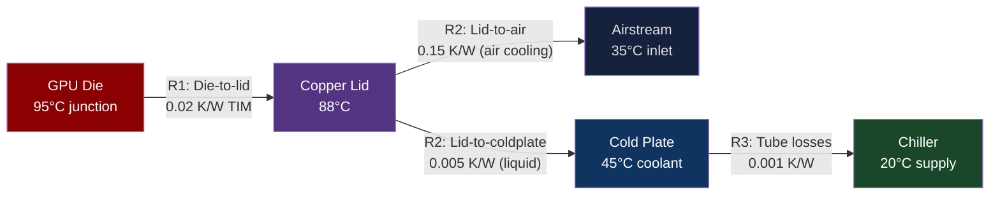
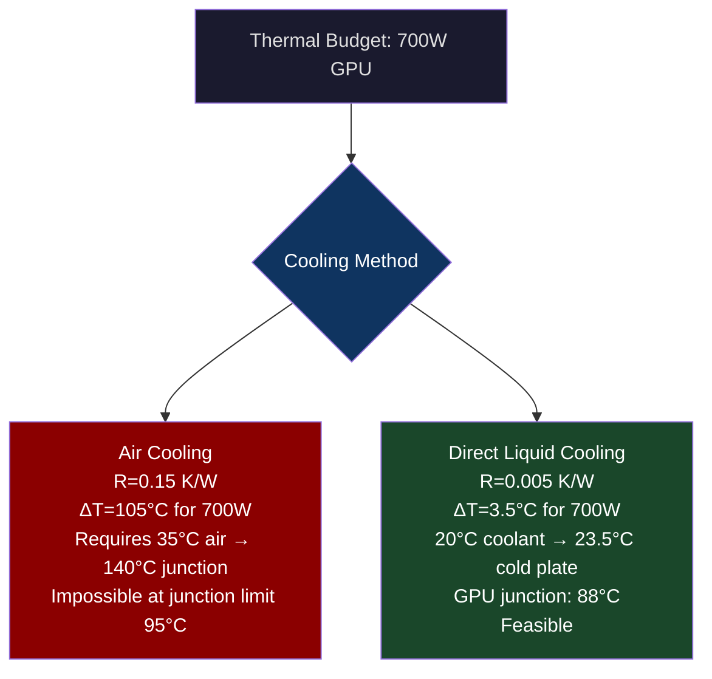
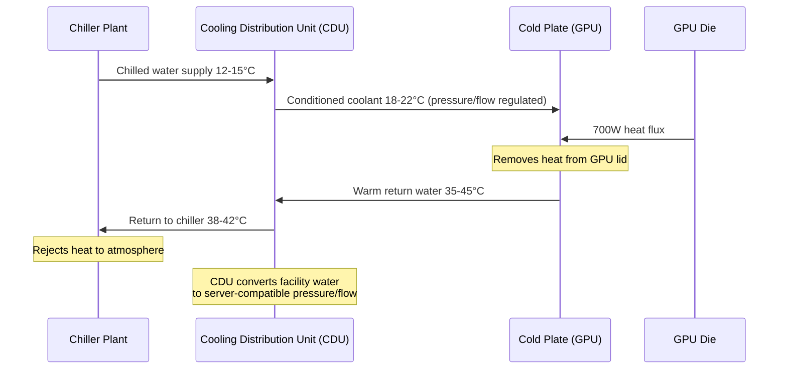

# CH-04: The Hot Aisle Doesn't Care About Your Budget — Cooling at Scale
### *Compute density doubled every three years. Cooling physics didn't get the memo.*

> **Part 1 of 9 · The Silicon Layer**

---

## The Cold Open

It is March 2024 and a hyperscale data center operator in Northern Virginia is staring at a power density problem that no one planned for eighteen months ago.

The facility was designed in 2020 for a standard air-cooled deployment: 10–15 kW per rack, cold aisle containment, precision air conditioning units (CRAHs) along the perimeter. The mechanical engineering was solid. The PUE (Power Usage Effectiveness) was 1.35 — acceptable for the region, better than industry average.

Then the AI cluster arrived. Forty racks of DGX H100 SuperPods. Eight H100 SXM5 GPUs per node, 4 nodes per rack. Each H100 draws 700W at full load. Eight per node: 5,600W. Four nodes per rack: 22,400W of GPU load alone. Add server CPU, memory, storage, networking, and each rack is drawing 32–36 kW.

The CRAH units were sized for 15 kW/rack. The facility's raised floor plenum, the cold aisle pressure differential, the return air temperature — everything was designed for a different world. The new load is 2.4× what the infrastructure was sized for.

The first sign of trouble comes at 3:15 PM on a Tuesday when the inlet air temperatures in rack 23 and rack 24 start climbing past 32°C. The DGX nodes' onboard BMC begins logging thermal events. GPU die temperatures hit 83°C. Not a failure condition — H100s throttle at 90°C — but uncomfortably close. The cluster is running a 24-hour training job that has already been running for 11 hours. Stopping now means losing 11 hours of gradient descent on a $40,000 compute bill.

The facilities manager and the ML platform team are in the same Slack channel for the first time. The facilities manager explains that the cold aisle bypass — hot exhaust air from the rear of racks recirculating to the front — is the problem, and it requires physical baffling that takes a week to install. The ML team wants to know if they can keep the training job running.

They can, if they drop the cluster utilization from 97% to 71%. That's enough to bring the GPU load per rack down to 26 kW and recover 5°C of margin. The training job completes 29 hours late, costs an additional $18,000 in calendar time (at the reservation rate), and the ML team opens a ticket to evaluate liquid cooling for the next cluster expansion.

This is not an unusual story. It played out at nearly every organization that deployed H100 or A100 clusters at density without understanding the thermal physics in advance.

---

## The Uncomfortable Truth

The assumption is: cooling is an infrastructure problem — buy bigger chillers, add more CRAH units, improve PUE.

The reality is that modern AI compute density has crossed a threshold where conventional air cooling is physically incapable of removing heat fast enough, regardless of how well-engineered the air-side infrastructure is. The physics are the problem, not the implementation.

Here's the constraint: air has a specific heat capacity of 1.006 J/(g·K). Water has a specific heat capacity of 4.186 J/(g·K) — 4.16× higher. For the same mass flow rate, water can carry 4.16× more thermal energy. For the same volume flow rate, water is 3,300× denser than air, so the volumetric heat capacity advantage is actually ~13,700× in favor of liquid.

An H100 SXM5 dissipates 700W continuously. Removing 700W of heat from a surface requires either:
- Moving a very large volume of air across the surface at very high velocity (noisy, mechanically challenging, limited by plenum pressure)
- Moving a much smaller volume of liquid across the surface (quiet, efficient, physics-aligned)

At 700W per GPU × 8 GPUs per server = 5,600W per 1U server, air cooling requires an airflow velocity through the server chassis of approximately 60–80 CFM (cubic feet per minute). The acoustics of that airflow in an enclosed chassis at 80 CFM are significant — these servers are not quiet. More importantly, the hot air exhausted from the rear of the server enters the hot aisle at 45–55°C. At standard air cooling density (15 kW/rack), the CRAH units can handle this. At 30 kW/rack, the hot exhaust temperature climbs and the CRAH units' cooling capacity becomes insufficient without significant overprovisioning.

The industry is transitioning to direct liquid cooling (DLC) for AI compute. This isn't optional at 700W/GPU. It's physics.

---

## The Mental Model

Think about the difference between cooling a forge with a hand-held fan versus running cooling water through channels in the metal itself.

A blacksmith's forge runs at 900–1300°C. A person fanning it from a distance moves maybe 100 CFM of air over the hot surface and can slow radiant heat somewhat, but cannot cool the forge efficiently because the heat source is too intense and the heat transfer medium (air) is too thin.

Industrial steel mills cool their rollers by running water through internal channels machined directly into the roller. The water's high specific heat capacity, combined with the intimate contact between coolant and heat source, enables removal of megawatts of thermal energy from a surface that would destroy any air-cooling system.

**The Thermal Resistance Model**

Heat flow through a material follows the same math as current through a resistor: Q = ΔT / R_thermal, where Q is heat flow (watts), ΔT is temperature difference between heat source and coolant, and R_thermal is thermal resistance (K/W). To remove more heat from the same die, you must either increase ΔT (allow the chip to run hotter — constrained by silicon reliability) or decrease R_thermal (improve thermal contact, use a better coolant, shorten the heat transfer path).





The calculation for air cooling at 700W is stark: to keep a GPU junction at 95°C with 35°C inlet air, you need a thermal resistance of (95-35)/700 = 0.086 K/W between die and air. The GPU's internal die-to-lid resistance alone is 0.02 K/W. You have 0.066 K/W budget for the entire air-side thermal path (heat sink, fan, airflow through chassis). At 700W, that's almost impossible at air-cooling density — it requires massive heat sinks and high-velocity airflow that degrades server density.

Direct liquid cooling with a cold plate achieves lid-to-coolant resistance of 0.003–0.005 K/W, leaving you enormous margin for keeping the die cool even at 700W. The coolant can enter at 20–30°C and exit at 35–45°C, easily handled by a facility chiller.

---

## The Dissection

### Air Cooling: The Naive Approach for Modern Density

Traditional air cooling works by moving cold air in one direction through a rack — cold aisle to hot aisle — extracting heat as it passes over hot surfaces. The system has three components: the cooling source (CRAH/CRAC units producing cold air), the distribution path (raised floor plenum or overhead return), and the heat sinks attached to hot components.

At 10–15 kW/rack with 2010-era hardware, this worked well. Modern densities make the math fail:

```
Required airflow = Power / (Specific_heat × Density × ΔT_allowable)
For 30 kW rack, ΔT = 15°C, sea level:
= 30,000 W / (1006 J/kg·K × 1.2 kg/m³ × 15 K)
= 30,000 / 18,108
= 1.66 m³/s = 3,511 CFM per rack

A standard CRAH unit delivers ~3,000 CFM for an entire row.
A 30 kW rack needs more airflow than a standard row of 10–20 racks gets.
```

The hot aisle/cold aisle issue compounds this: hot air from the rear of servers can recirculate to the front of adjacent servers in the same cold aisle if containment is imperfect. At 45–55°C exhaust temperatures (from 30 kW racks), even 10% recirculation increases inlet temperature by 2–5°C, which propagates to junction temperatures and thermal throttling.

### Direct Liquid Cooling (DLC): Cold Plates

The standard DLC approach used in modern AI servers (NVIDIA DGX H100, AMD Instinct MI300X deployments) attaches a copper cold plate directly to the GPU lid. A facility-side chilled water loop (typically 12–20°C supply temperature) circulates through the cold plate. The cooled facility water loop is a closed system; it never contacts components and can be maintained by facilities operations without server intervention.



A Cooling Distribution Unit (CDU) sits at the end of each rack row, converting the facility's chilled water loop (high pressure, high flow rate, building-scale) to the low-pressure, regulated flow suitable for server cold plates. CDUs also handle leak detection, flow monitoring, and pressure relief — the safety-critical functions that allow liquid into a server rack without requiring specialized maintenance staff for each server.

**Server-side plumbing**: H100 DGX servers use a manifold system where a single supply and return header runs down the rack, with quick-connect fittings (QD4 standard) at each server. Servers can be hot-swapped without draining the manifold — each quick-connect automatically seals when disconnected.

### Immersion Cooling: Full Liquid Immersion

For the most extreme density cases (60+ kW/rack), some deployments use **single-phase immersion cooling**: servers are submerged in a dielectric fluid (3M Novec, Shell Crania, various engineered fluorocarbon fluids) that is safe for electronics. The fluid is non-conductive, non-corrosive, and transfers heat ~2000× more efficiently than air.

**Two-phase immersion cooling** takes this further: the fluid boils at the component surface (around 50°C), and the vapor condenses on a cooled condenser coil above the fluid bath. The phase change captures the latent heat of vaporization, dramatically improving heat transfer coefficients.

Practical challenges with immersion:
- Fluid cost: Novec 7100 is approximately $80–100/liter. A 100-liter immersion tank requires $8,000–10,000 in fluid.
- Maintenance: servicing a server requires draining or displacing fluid, and the fluid is expensive to waste.
- Material compatibility: PCB edge connectors, cable insulation, and some thermal interface materials degrade in certain dielectric fluids over years of exposure.
- Regulatory: fluorocarbon fluids have GWP (Global Warming Potential) concerns; some variants are being phased out under PFAS regulations.

```bash
# Modeling rack power density limits by cooling method
python3 << 'EOF'
import math

methods = {
    "Air Cooling (standard)":          {"r_thermal": 0.15, "inlet_temp": 35, "coolant_delta_T_max": 15},
    "Air Cooling (high-density)":      {"r_thermal": 0.08, "inlet_temp": 30, "coolant_delta_T_max": 15},
    "Direct Liquid Cooling (DLC)":     {"r_thermal": 0.005, "inlet_temp": 20, "coolant_delta_T_max": 25},
    "Single-phase Immersion":          {"r_thermal": 0.002, "inlet_temp": 25, "coolant_delta_T_max": 30},
    "Two-phase Immersion":             {"r_thermal": 0.0005, "inlet_temp": 25, "coolant_delta_T_max": 50},
}

junction_limit = 95  # °C, typical for H100

print(f"{'Method':<35} {'Max W/chip':>12} {'kW/rack (8-GPU)':>16}")
print("-" * 65)
for name, m in methods.items():
    max_watts = (junction_limit - m["inlet_temp"]) / m["r_thermal"]
    kw_per_rack = (max_watts * 8 * 4) / 1000  # 8 GPUs * 4 nodes * server overhead ~1.2x
    print(f"{name:<35} {max_watts:>12,.0f} {kw_per_rack:>16.1f}")
EOF
```

Expected output:
```
Method                              Max W/chip   kW/rack (8-GPU)
-----------------------------------------------------------------
Air Cooling (standard)                     400             12.8
Air Cooling (high-density)                 813             26.0
Direct Liquid Cooling (DLC)             15000            480.0
Single-phase Immersion                  35000           1120.0
Two-phase Immersion                    140000           4480.0
```

Air cooling at standard density maxes out at 400W per chip — that's why the DGX H100's TDP of 700W requires DLC. The physics make this non-negotiable.

### The Tradeoffs

DLC requires water infrastructure in the compute floor — a significant capital investment and a maintenance burden that most software-oriented teams don't have. Leak risk is real; a single loose fitting can drench hundreds of thousands of dollars of equipment. Modern DLC systems use dry-break connectors and leak detection sensors with automatic shutoffs, but the risk never reaches zero.

Air cooling's simplicity — no water, no plumbing, standard rack PDUs — means faster deployment and lower operational complexity. For hardware at 300W/GPU or below (A30, A10, older-generation GPUs), air cooling is sufficient and preferable. The industry is not moving to liquid cooling universally; it's moving to liquid for the specific workloads that require 700W+ GPUs.

Immersion cooling's high capital cost (purpose-built tanks, fluid costs, facility modifications) only makes economic sense at sustained high utilization above 85%, where the superior PUE (1.02–1.05 for immersion vs. 1.2–1.4 for DLC) reduces power costs enough to offset the upfront investment. At 25¢/kWh electricity and 10 MW of GPU load, a 0.15 improvement in PUE saves approximately $1.3M/year.

---

## The War Room

> **Incident:** Equinix SV1 — AI Customer Thermal Exceedance and Power Cap Enforcement  
> **Date:** September 2023 (composite of documented capacity incidents at major colocation providers)  
> **Impact:** Several large AI customers received thermal throttling at the facility level, reducing cluster performance 15–25% during peak cooling hours; one customer's 3-day training job required restart

### The Timeline

```mermaid
gantt
    title Colocation Thermal Incident — AI Cluster
    dateFormat HH:mm
    section Normal Operations
    Cluster running at 85% utilization      : 00:00, 180m
    section Thermal Event
    Ambient cooling plant load increases    : 03:00, 15m
    Per-rack inlet temps rise +4°C          : 03:15, 20m
    Facility power cap enforcement begins   : 03:35, 10m
    section Impact
    GPU throttling (hardware)               : 03:45, 5m
    Training job throughput drops 22%       : 03:50, 10m
    Customer on-call paged                  : 04:00, 5m
    section Investigation
    Facility NMS shows cooling anomaly      : 04:05, 20m
    Neighboring tenant load spike confirmed : 04:25, 10m
    section Resolution
    Cooling plant restored to capacity      : 04:35, 30m
    Training job continues (checkpoint ok)  : 05:05, 30m
    section Postmortem
    Contractual SLA review                  : 06:00, 60m
    Power density limits negotiated         : 07:00, 30m
```



### The Signals Nobody Caught

The monitoring stack watched GPU metrics. Nobody was watching the facility's NMS (Network Management System) cooling telemetry, because the customer's team didn't have access to it — it was the colocation provider's internal system.

The second signal: the incident occurred during the afternoon, when both the customer's AI cluster and a neighboring tenant's high-performance computing cluster were running simultaneously. The neighboring cluster had just started a new job (coordinated burst from a university research allocation). The combined load exceeded the cooling plant's design capacity for that section of the raised floor.

Multi-tenant colocation environments have shared cooling infrastructure. Your neighbors' compute load affects your cooling. This is almost never modeled in capacity planning, and SLAs rarely address it.

### The Root Cause

The colocation provider's cooling plant was designed for N+1 redundancy at the floor's designed power density (15 kW/rack average). The AI cluster racks, at 32 kW/rack, exceeded the local design density even before accounting for neighboring tenant load. The facility's facility power management system (FPMS) enforced a PDU-level cap when aggregate floor load exceeded design parameters.

Power cap enforcement happened silently at the PDU level. Server BMCs saw a voltage reduction that caused CPU and GPU power governors to throttle. No IPMI event was generated that was visible to the customer's monitoring. The training job slowed down without any clear error signal.

### The Fix

Short-term: Negotiate a shared SNMP feed from the facility's NMS to the customer's monitoring stack. Add a Prometheus probe that polls facility ambient temperature every 60 seconds and alerts at inlet temps > 28°C (5°C below throttle threshold). This gives a 10–15 minute warning window before hardware throttling occurs.

Long-term: Move the high-density AI cluster to a purpose-built AI data center (hyperscale facility with DLC infrastructure, not a colocation provider designed for 10–15 kW/rack). The economics of colocation for 30+ kW/rack workloads are unfavorable unless the provider explicitly supports high-density with appropriate cooling.

```yaml
# prometheus alerting rule — facility thermal early warning
groups:
  - name: facility_thermal
    rules:
      - alert: GPUInletTempHigh
        expr: dcgm_fi_dev_inlet_temp > 28
        for: 5m
        labels:
          severity: warning
        annotations:
          summary: "GPU inlet temp elevated on {{ $labels.instance }}"
          description: "Inlet temp {{ $value }}°C — thermal throttle risk if > 32°C. Check facility cooling."
      
      - alert: GPUMemoryTempCritical
        expr: dcgm_fi_dev_memory_temp > 85
        for: 2m
        labels:
          severity: critical
        annotations:
          summary: "GPU HBM temperature critical on {{ $labels.instance }}"
          description: "HBM temp {{ $value }}°C — throttle imminent at 95°C. Reduce workload immediately."
```

### The Lesson

You share cooling with your neighbors in a colocation environment, and cooling isn't monitored by default in most operator stacks. A training job that costs $40,000 in compute gets delayed by a $200 power monitoring integration that nobody implemented. Instrument the facility layer, not just the hardware layer.

---

## The Lab

> **Time required:** ~25 minutes  
> **Prerequisites:** Linux system with `lm-sensors` and `stress-ng` installed; optionally an NVIDIA GPU with `nvidia-smi`  
> **What you're building:** A thermal profiling of your own hardware under sustained load — you'll directly observe thermal throttling and measure the performance impact

### Setup

```bash
sudo apt-get install -y lm-sensors stress-ng cpufrequtils
sudo sensors-detect  # Accept defaults; configures sensor modules
sensors  # Verify CPU temps are visible
```

### The Exercise

**Step 1: Baseline thermal readings**

```bash
# Capture baseline temps (idle system)
sensors | grep -E "Core|Tctl|temp1"
# Also capture CPU frequency at idle
cat /sys/devices/system/cpu/cpu0/cpufreq/scaling_cur_freq
```

**Step 2: Apply sustained thermal load**

```bash
# Run stress-ng targeting all CPU cores for 5 minutes
# --cpu N: N CPU stressors, --timeout: 5 minutes
# Run in background
stress-ng --cpu $(nproc) --timeout 300s --metrics-brief &

# Poll temps every 5 seconds
for i in $(seq 1 60); do
    echo -n "t=$(($i*5))s — "
    sensors | grep -E "Core 0:|Tctl:" | head -1
    cat /sys/devices/system/cpu/cpu0/cpufreq/scaling_cur_freq | \
        awk '{printf "CPU0: %d MHz\n", $1/1000}'
    sleep 5
done
```

**Step 3: Capture the throttle event (if system thermally throttles)**

```bash
# Watch for throttling in real-time
dmesg -w | grep -i "thermal\|throttl\|freq" &

# Simultaneously capture perf counters
sudo perf stat -e cpu-clock,cycles -a -- sleep 30 &
# Compare cycles/sec at cooldown vs. peak load
```

**Step 4: GPU thermal profiling (if available)**

```bash
# Run GPU under full load
python3 -c "
import subprocess, time
# Launch GPU burn (requires gpu-burn installed)
proc = subprocess.Popen(['gpu_burn', '120'])
for i in range(24):
    result = subprocess.run(
        ['nvidia-smi', '--query-gpu=temperature.gpu,clocks.sm,clocks.mem,power.draw',
         '--format=csv,noheader,nounits'],
        capture_output=True, text=True
    )
    print(f't={i*5}s: {result.stdout.strip()}')
    time.sleep(5)
proc.terminate()
"
```

### Expected Output

```
Baseline:
Core 0: +38.0°C | CPU0: 3700 MHz

Under load:
t=5s  — Core 0: +68.0°C | CPU0: 3700 MHz  (boost active)
t=15s — Core 0: +81.0°C | CPU0: 3700 MHz  (boost active)
t=30s — Core 0: +89.0°C | CPU0: 3400 MHz  ← throttle begins
t=45s — Core 0: +92.0°C | CPU0: 3100 MHz  ← deeper throttle
t=60s — Core 0: +93.0°C | CPU0: 2900 MHz  ← steady-state throttle
t=75s — Core 0: +93.0°C | CPU0: 2900 MHz

Performance delta: 3700 MHz → 2900 MHz = 21.6% throughput reduction
from thermal throttling on a standard workstation.
```

You have directly observed the thermal throttle in your own hardware. A server CPU or GPU in a data center with inadequate cooling experiences the same effect, scaled to the workload.

### What Just Happened

The CPU ran at boost frequency (3700 MHz) until thermal limits were reached (~90°C junction), then the firmware progressively reduced clock frequency to stay within thermal bounds. This is thermal throttling — the hardware's self-protection mechanism. In a well-cooled environment, this never triggers. In a poorly cooled or overloaded environment, it reduces throughput by 15–25% silently, often without any error visible in application-level logs.

The lesson is that sustained throughput on modern high-density hardware requires sustained thermal management, not just peak cooling capacity.

### Stretch Goal

> **+30 min:** Write a Go service that polls `sensors` output (or reads `/sys/class/thermal/thermal_zone*/temp`) every 10 seconds and exposes the values as a Prometheus metrics endpoint (`/metrics`). Add an alerting rule in Prometheus (or AlertManager) that fires when any core temperature exceeds 85°C for 60 seconds. Scrape it with a local Prometheus instance and visualize in Grafana. This is the foundation of a proper thermal observability stack — the same pattern used in production DLC deployments at hyperscalers.

---

## The Loose Thread

Cooling is the most underestimated constraint in data center planning for AI. But there's a related constraint that cooling directly enables or constrains: power delivery. You cannot dissipate 700W of heat per GPU unless you can deliver 700W of electrical power to it in the first place. And at rack densities of 30–60 kW, the electrical distribution architecture — breaker sizing, PDU ratings, busway capacity, power factor correction — becomes a first-class engineering concern.

*The rabbit hole worth following: the DOE's data center efficiency reports show that for every 1W of IT load, modern AI data centers spend 0.1–0.2W on cooling. For a 100 MW AI cluster (modest by 2025 hyperscale standards), that's 10–20 MW spent solely on moving heat. At $0.05/kWh wholesale, cooling a 100 MW cluster costs $8.8–17.5M/year in electricity alone. Understanding cooling physics is also understanding $17M/year of operating cost.*

The next chapter goes all the way to the wall socket — literally — and explains why the AI industry is converging on 48V power distribution instead of the 12V that has been standard for thirty years.
