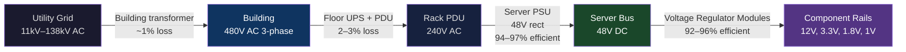
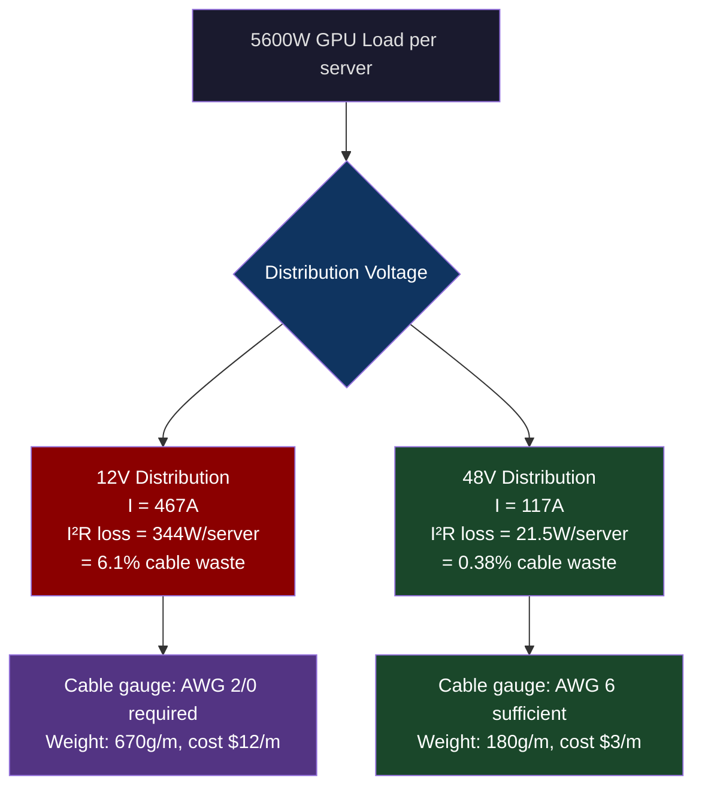
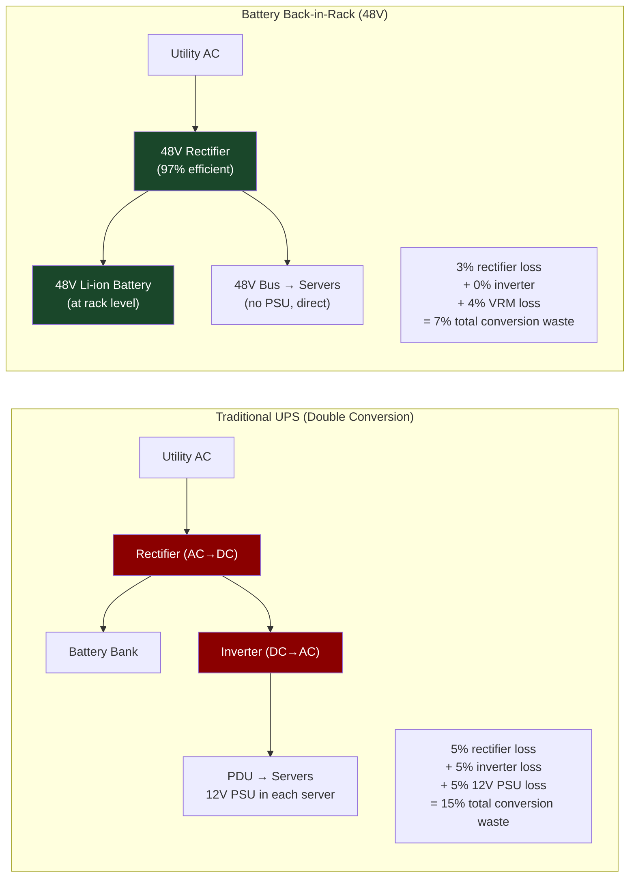

# CH-05: Power Distribution — 48V vs 12V and the Physics of Kilowatts
### *Ohm's Law doesn't negotiate. At 700W and 12V, your cables are heating the room.*

> **Part 1 of 9 · The Silicon Layer**

---

## The Cold Open

The design review for what would become one of the largest AI training clusters in North America was going well until the power architect asked a question that stopped the room: "Have you modeled I²R losses on the 12V distribution at this scale?"

Nobody had.

The cluster was 10,000 NVIDIA H100 SXM5 GPUs. Eight per server, 4 servers per rack, 312 racks, 10 megawatts of GPU load alone. The initial design used conventional 12V power distribution from rack-mount PDUs to server power supplies — the same approach that had worked reliably for every previous cluster.

The power architect pulled out a whiteboard and did the math live. At 12V, drawing 5,600W from the server bus for the GPU load alone means a current of 5600 / 12 = 467 amps per server. Practical cable runs from the PDU to the server PSU are 1–2 meters of AWG 6 wire (one of the heavier gauge options that fits through cable management). AWG 6 has a resistance of approximately 0.395 mΩ/meter. Two meters of cable, two conductors (positive and return), four meters total: R_total = 0.395 × 4 = 1.58 mΩ. Power loss: P = I² × R = (467)² × 0.00158 = 344 watts per server, in the cable alone.

344 watts of heat being generated in the cable run, for every 5,600 watts delivered to the server. That's 6.1% conversion loss in the power distribution before electricity even reaches the GPU. For 312 racks of 4 servers each, cable losses total: 344W × 4 servers × 312 racks = 428 kilowatts. Not delivered to the GPUs — dissipated as heat in power cables.

$428 kilowatts of heat in cables. Cables that run through the same overhead cable trays as the servers. Hot cables in the same thermal zone as servers that already needed aggressive cooling. And that's before accounting for PSU conversion losses (typically 5–8% at 12V → server internal rails), which add another 600 kW.

Switching to 48V power distribution — the voltage standard adopted by telecom decades ago and now moving into hyperscale compute — reduces current by a factor of 4 for the same power. Current drops from 467A to 117A. I²R losses drop by a factor of 16: 344W → 21.5W per server. Aggregate cable losses: 26 kW vs. 428 kW.

The cluster was redesigned for 48V distribution before a single server was ordered.

---

## The Uncomfortable Truth

The assumption is: power distribution is an electrician's problem, not a systems engineer's problem.

The reality is that power distribution architecture is one of the highest-leverage decisions in large-scale compute infrastructure, with direct implications for cluster efficiency, hardware cost, cable plant design, rack density, and cooling requirements. Engineers who treat it as a solved problem in 2025 are making it with 2005 hardware assumptions.

Ohm's Law is P_loss = I² × R. This relationship has a crucial implication: for a fixed power transfer requirement, halving the voltage doubles the current, which quadruples the I²R loss. This means power distribution efficiency is extremely sensitive to the distribution voltage. The history of power distribution is largely the history of increasing voltage to reduce current losses.

The electrical grid runs at 110–230V to your building. Inside the building, it's stepped down for safety (240V → 48V → 12V → 1.8V at the CPU core). Each conversion step introduces losses and heat. The question is: which conversion steps are necessary, and how far can you push the "high voltage" stage before you're forced to step down?

The traditional data center answer was 12V at the rack PDU. That worked for 200–400W servers. It's wrong for 5,600W servers. The physics have not changed. The workload has.

---

## The Mental Model

Consider a city water distribution system (yes, the same water metaphor — it's genuinely the right one for electrical systems). The city pumping station maintains high pressure throughout the main distribution pipes. High pressure allows small-diameter pipes to carry large volumes of water — low current analogy. When water reaches a neighborhood, local pressure regulators step it down. When it reaches your building, there's another pressure reduction at the meter. Your faucet is the final low-pressure endpoint.

If you tried to run the entire system at faucet pressure, you'd need enormous-diameter pipes throughout the city to carry enough volume for everyone. The pipe cost and diameter constraints would be prohibitive. The solution — maintain high pressure at the distribution layer, step it down only at the end point — is exactly what 48V server power does.

**The Voltage-Efficiency Ladder**





---

## The Dissection

### The Standard 12V Architecture

Traditional server power works as follows: wall AC (240V or 208V) enters the server PSU, which rectifies to 12V DC. The 12V bus powers everything internal. Voltage Regulator Modules (VRMs) on the motherboard step 12V down to the processor-specific rails (1.8V for DRAM, 0.85V for CPU core, 3.3V for PCIe signaling).

This architecture made sense for servers drawing 200–400W. At 300W and 12V, current is 25A — manageable with standard ATX connectors and cable gauges. The 2×4 EATX connector (8 pins at 12V, 6A per pin, 72W max) and 6+2 PCIe power connector (144W per connector) were designed for this current range.

For H100 SXM GPU servers, the GPU alone draws 700W × 8 = 5,600W. No standard connector ecosystem handles 467A at 12V. The connectors don't exist at that current rating within a reasonable physical size. The H100's SXM design moves the power delivery to a custom high-current midplane — but the fundamental 12V architecture still forces high current from PDU to PSU.

### The 48V Architecture: How It Works

**Open Rack V3 and ORv3**

The Open Compute Project (OCP) Open Rack V3 standard defines a 48V rack power architecture. Instead of individual PSUs per server converting AC to 12V, the rack has a set of shared, high-efficiency AC-to-48V rectifiers at the bottom (or top) of the rack. These are called **Bus Bar Power Systems (BBPS)** or shelf-mount rectifiers. 48V DC is distributed via busbars (thick copper bus bars, not cables) directly to server bays.

Inside the server, a 48V-to-point-of-load (PoL) conversion happens close to each major component. Modern VRMs accept 48V input and step directly to 0.85V for CPU cores — eliminating the 48V → 12V → 0.85V conversion chain used in traditional designs, which saves 3–5% in conversion efficiency.

```
Traditional:  AC → 12V (PSU, 94% eff) → 0.85V (VRM, 90% eff) = 84.6% end-to-end
48V Direct:   AC → 48V (rectifier, 97% eff) → 0.85V (VRM, 96% eff) = 93.1% end-to-end
```

That 8.5-point efficiency improvement, at 10 MW of IT load, is 850 kW of power saved — $7.4M/year at $0.10/kWh wholesale electricity pricing.

### Battery Back-in-Rack (BiBR) and Power Shelf Architecture

The 48V standard also enables a more efficient UPS architecture. Traditional UPS systems convert AC to DC, store energy in a central battery bank, and then invert back to AC to power the PDU chain. Each AC → DC → AC conversion introduces 5–10% efficiency loss. The central battery bank is large, expensive, and requires its own floor space.

At 48V, lithium battery modules can be integrated directly into the power shelf at rack level. The battery operates at 48V, same as the distribution voltage — no inverter required. The power path is: utility AC → 48V rectifier → 48V bus (powers servers directly) → 48V bus also floats batteries. On power outage, batteries discharge directly to the bus with no conversion step. End-to-end efficiency of this Battery Back-in-Rack (BiBR) architecture: 96–98% vs. 85–90% for traditional double-conversion UPS.



### Current Hyperscale Practice

Meta's Open Rack v3 deployments (used in their AI Research SuperCluster and RSC clusters) run 48V distribution throughout the rack. Google's TPU Pod infrastructure uses custom 48V busbar distribution. NVIDIA's DGX GB200 NVL72 (the next-generation AI server chassis) is specifically designed for 48V with 240V AC input, eliminating the traditional 12V stage entirely.

The transition isn't instantaneous across the industry. Legacy colocation facilities were built for 12V servers; adapting them to 48V requires new PDU hardware, new cable infrastructure, and in some cases new building-side electrical panels. The transition horizon for newly-built AI-specific facilities is 2023–2026; for legacy facilities serving general compute, it's slower.

```yaml
# Terraform: AWS rack power configuration (conceptual — internal API)
resource "aws_rack_power_config" "ai_cluster" {
  facility_id    = "IAD29"
  power_standard = "48V_ORv3"       # vs "12V_ATX" for legacy
  
  power_shelf {
    rectifier_count = 6             # N+2 redundancy
    rectifier_capacity_kw = 6       # 6 kW per unit, 36 kW shelf capacity
    battery_backup_minutes = 5      # 5-minute BiBR backup
  }
  
  busbar {
    capacity_amps = 800             # 800A × 48V = 38.4 kW per busbar
    redundancy    = "A+B"           # Dual busbar, each server draws from both
  }
}
```

### The Tradeoffs

48V is not universally compatible. The existing server ecosystem (standard rack servers, switches, storage, everything that isn't a custom AI accelerator) runs on 12V ATX PSUs. A 48V data center needs step-down conversion for mixed workloads — which partially negates the efficiency advantage.

The safe voltage limit for technicians working on live equipment is 60V DC in most jurisdictions. 48V is below this threshold; live work is permitted under standard electrical safety procedures (NFPA 70E, OSHA 1910.269). If distribution voltage ever moves toward 380V DC (sometimes discussed for ultra-high-density racks), live work restrictions become significantly more complex and require specialized PPE.

Power factor correction becomes more important at 48V. Server-side loads are reactive (switching power supplies have power factors of 0.95–0.99 with active PFC, but lower without it). Poor power factor means the utility delivers more apparent power (VA) than active power (W), and you pay for apparent power capacity even if you only use active power. Large 48V deployments benefit from centralized active power factor correction at the rectifier stage.

---

## The War Room

> **Incident:** Cloudflare — UPS Failure During Grid Event Causes Brief Cascade  
> **Date:** July 2020 (documented in Cloudflare's postmortem blog)  
> **Impact:** Brief data center power event caused cascading failures in multiple PoPs; some locations experienced ~27 minutes of degraded performance

### The Timeline

```mermaid
gantt
    title Cloudflare Power Event — UPS Cascade
    dateFormat HH:mm
    section Utility Event
    Grid voltage anomaly detected           : 00:00, 2m
    UPS enters battery mode                 : 00:02, 1m
    section Battery Failure
    Some UPS units battery not charged      : 00:03, 1m
    Power drops on affected server rows     : 00:03, 2m
    section Cascade
    Servers restart — network churn         : 00:05, 5m
    BGP flaps from restarted routers        : 00:10, 8m
    Traffic rerouted to healthy PoPs        : 00:18, 9m
    section Recovery
    Generator comes online                  : 00:27, 3m
    Normal operations restored              : 00:30, 5m
```



### The Signals Nobody Caught

Battery state-of-health (SoH) monitoring was implemented for the UPS units but not alerting on gradual capacity degradation. The UPS units showed "battery healthy" in the monitoring dashboard because the threshold was set to "will it start" (>20% capacity), not "will it last the generator transfer time" (>95% capacity for the required hold time).

The generator transfer time in this facility was 25 seconds. Battery hold time at full load with degraded batteries: 8 seconds. The gap was unmonitored.

### The Root Cause

Double-conversion UPS systems continuously discharge and recharge batteries at a small rate (float charging). Over 3–5 years, lithium or VRLA (valve-regulated lead-acid) batteries lose capacity. The monitoring system flagged batteries below 20% as failed, but batteries at 40–60% capacity appeared "healthy" in the dashboard despite being unable to sustain the facility for the required transfer time.

This is a known failure mode called **battery walk-down**: batteries degrade gradually, capacity tests are infrequent (typically quarterly), and the monitoring only catches fully failed batteries, not degraded batteries.

### The Fix

Quarterly capacity tests replaced by continuous battery health monitoring via battery management system (BMS) integration. BMS publishes per-cell voltage, internal resistance (correlated with capacity), and temperature to Prometheus. Alert rule:

```yaml
- alert: UPSBatteryCapacityLow
  expr: ups_battery_capacity_percent < 85
  for: 30m
  annotations:
    summary: "UPS battery at {{ $value }}% capacity — may not sustain generator transfer"
    runbook: "https://wiki/power/ups-battery-replacement"
```

Battery replacement triggered at <85% capacity (not <20%). Under BiBR 48V architecture with lithium cells, BMS integration is native rather than bolted-on, making this monitoring significantly simpler.

### The Lesson

Monitoring binary "healthy/failed" states for batteries misses the entire degradation curve. The interesting failure mode isn't "battery dead" — it's "battery at 60% capacity that can't sustain the 25-second transfer time." Monitoring requires knowing the target (transfer time), measuring continuously, and alerting when the gap between measured capacity and required capacity closes to an unsafe margin.

---

## The Lab

> **Time required:** ~20 minutes  
> **Prerequisites:** Linux, Python 3.8+, optionally a server with IPMI access  
> **What you're building:** A power consumption analysis tool that computes I²R losses for different distribution voltages and models the efficiency impact on a given cluster

### Setup

```bash
pip3 install matplotlib numpy
```

### The Exercise

**Step 1: Build a power distribution efficiency model**

```python
#!/usr/bin/env python3
# power_model.py
import numpy as np
import matplotlib.pyplot as plt

# Cluster configuration
servers = 1250          # 312 racks × 4 servers
gpus_per_server = 8
gpu_tdp_w = 700         # H100 SXM5 TDP
cpu_power_w = 350       # 2× EPYC 9654
memory_power_w = 150    # 768 GB DDR5
network_power_w = 100   # 400G NIC
misc_power_w = 100      # storage, fans, motherboard

server_it_load_w = (gpus_per_server * gpu_tdp_w + cpu_power_w + 
                    memory_power_w + network_power_w + misc_power_w)
total_it_load_kw = server_it_load_w * servers / 1000

print(f"Server IT load: {server_it_load_w:,} W")
print(f"Total cluster IT load: {total_it_load_kw:,.1f} kW")

# Model I²R losses for different distribution voltages
cable_resistance_per_meter = {
    'AWG_6':   0.395e-3,   # Ω/m — typical for 12V high-current runs
    'AWG_4':   0.249e-3,   # Ω/m — heavier gauge
    'AWG_2/0': 0.0675e-3,  # Ω/m — very heavy, used for 12V extreme current
}

cable_run_meters = 2.0      # PDU to server PSU, one way
conductors = 2              # positive + return

voltages = [12, 24, 48, 380]
cable_type = 'AWG_6'
R_per_server = cable_resistance_per_meter[cable_type] * cable_run_meters * conductors

print(f"\nCable: {cable_type}, {cable_run_meters*2}m round-trip")
print(f"Cable resistance: {R_per_server*1000:.2f} mΩ")
print(f"\n{'Voltage':>8} {'Current(A)':>12} {'I²R Loss(W)':>14} {'Loss%':>8} {'Cluster Loss(kW)':>18}")
print("-" * 70)

for v in voltages:
    I = server_it_load_w / v          # Amps per server
    P_loss = (I ** 2) * R_per_server  # Watts lost in cable
    loss_pct = P_loss / server_it_load_w * 100
    cluster_loss_kw = P_loss * servers / 1000
    print(f"{v:>7}V {I:>12.1f} {P_loss:>14.1f} {loss_pct:>7.1f}% {cluster_loss_kw:>18.1f}")

# PSU / rectifier efficiency comparison
print("\n--- End-to-End Efficiency Comparison ---")
architectures = {
    "12V (traditional ATX)": {
        "ac_to_dc_eff": 0.93,   # PSU efficiency
        "dc_to_cpu_eff": 0.88,  # 12V VRM to core rail
        "cable_loss_pct": 0.061, # from 12V calculation above
    },
    "48V (OCP ORv3)": {
        "ac_to_dc_eff": 0.97,   # 48V rectifier efficiency
        "dc_to_cpu_eff": 0.96,  # 48V direct-to-PoL VRM
        "cable_loss_pct": 0.004, # from 48V calculation above
    },
}
for name, arch in architectures.items():
    end_to_end = (1 - arch['cable_loss_pct']) * arch['ac_to_dc_eff'] * arch['dc_to_cpu_eff']
    wall_power_for_cluster = total_it_load_kw / end_to_end
    overhead_kw = wall_power_for_cluster - total_it_load_kw
    annual_cost = overhead_kw * 8760 * 0.08  # $0.08/kWh wholesale
    print(f"\n{name}")
    print(f"  End-to-end efficiency: {end_to_end*100:.1f}%")
    print(f"  Wall power for {total_it_load_kw:.0f} kW IT load: {wall_power_for_cluster:.0f} kW")
    print(f"  Conversion overhead: {overhead_kw:.0f} kW")
    print(f"  Annual electricity cost (overhead only): ${annual_cost:,.0f}")
```

```bash
python3 power_model.py
```

**Step 2: Read live server power (if IPMI access available)**

```bash
# Read server power via IPMI
ipmitool dcmi power reading

# Or via Redfish API (modern servers)
curl -s -k -u admin:password \
  https://<bmc-ip>/redfish/v1/Chassis/1/Power \
  | python3 -m json.tool | grep -A2 PowerConsumedWatts

# Compare to the model's prediction for your server config
```

### Expected Output

```
Server IT load: 6,500 W
Total cluster IT load: 8,125.0 kW

Cable: AWG_6, 4.0m round-trip
Cable resistance: 1.58 mΩ

Voltage   Current(A)    I²R Loss(W)    Loss%  Cluster Loss(kW)
----------------------------------------------------------------------
    12V        541.7          463.5     7.1%            579.4
    24V        270.8          115.9     1.8%            144.9
    48V        135.4           28.9     0.4%             36.2
   380V         17.1            0.5     0.0%              0.6

--- End-to-End Efficiency Comparison ---

12V (traditional ATX)
  End-to-end efficiency: 80.6%
  Wall power for 8125 kW IT load: 10081 kW
  Conversion overhead: 1956 kW
  Annual electricity cost (overhead only): $1,370,557

48V (OCP ORv3)
  End-to-end efficiency: 92.6%
  Wall power for 8125 kW IT load: 8773 kW
  Conversion overhead: 648 kW
  Annual electricity cost (overhead only): $454,090

Annual savings from 48V: $916,467
```

### What Just Happened

You modeled the real economics of power distribution architecture at cluster scale. The $916K/year difference between 12V and 48V distribution is purely the efficiency improvement from lower current losses — same compute, less electricity. At 100 MW of IT load (a medium-scale hyperscale cluster), the savings scale linearly to $9M/year.

This is why hyperscalers invest heavily in custom power infrastructure. The ROI on 48V conversion is measured in months at scale, not years.

### Stretch Goal

> **+30 min:** Extend the model to include PUE (Power Usage Effectiveness). Add cooling overhead as a function of server waste heat: PUE_air = 1.4 for air-cooled, PUE_dlc = 1.1 for direct liquid cooling. Calculate total facility power (IT + cooling + lighting + overhead) for each combination of [12V air, 12V DLC, 48V air, 48V DLC]. Determine which combination minimizes total facility power and by what percentage. Then add a CO2 impact calculation assuming 0.4 kg CO2/kWh (US grid average) and compute the annual emissions difference.

---

## The Loose Thread

Power distribution defines how much energy reaches the compute. But there's a layer below that: the silicon process node determines how efficiently the compute uses that energy. An H100 built on TSMC's 4N (modified 4nm) process can execute a tensor operation at a certain energy cost per FLOP. The same operation on the previous generation's 7nm process costs roughly 2–3x more energy per FLOP. That difference, multiplied by millions of operations per second across thousands of GPUs, is why process node advancement matters economically — not just performance-wise.

*If you want to follow this thread: read NVIDIA's chip analyst filings and TSMC's technology symposium presentations for their N3 (3nm) and N2 (2nm) process nodes. The performance-per-watt improvements between process nodes are typically 15–30% per generation. At 10 MW of compute load, 20% better performance-per-watt is 2 MW of electricity — $1.75M/year. That's the economic value of a single process node tick.*

The next chapter explains what happens when the chip itself can no longer be manufactured as a single die — when the transistor count needed for a competitive AI accelerator exceeds what a single piece of silicon can economically produce. The answer is chiplets, and it's reshaping the entire semiconductor industry.
