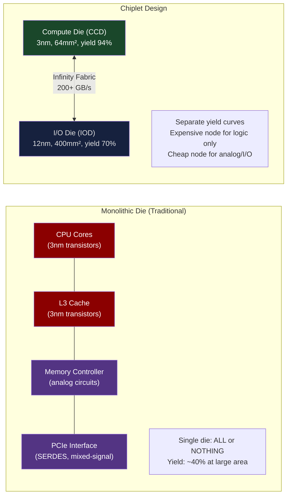
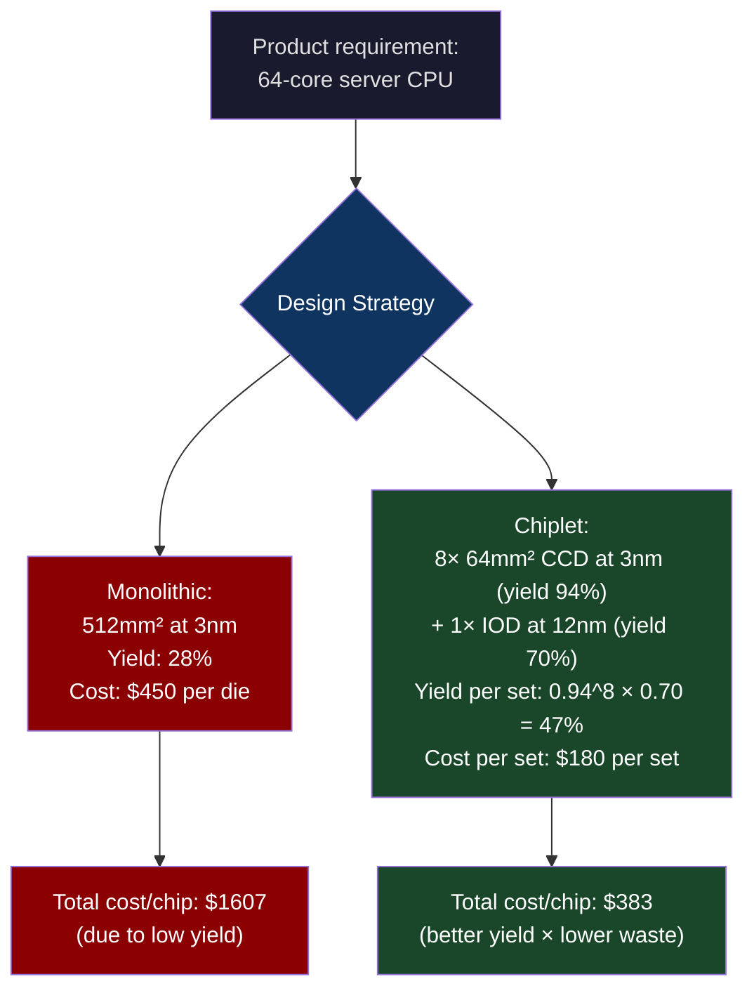
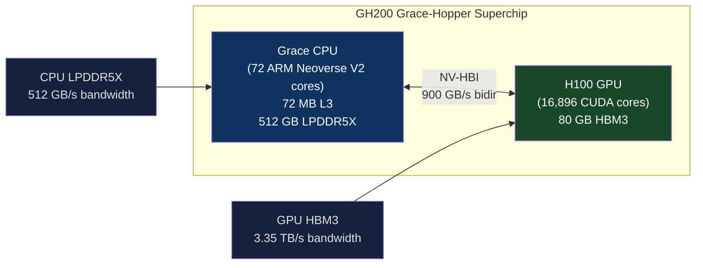

# CH-06: Chiplets and Silicon Interposers — When the Die Is Too Big to Fail
### *You cannot manufacture a perfect 1000mm² die. You can manufacture several imperfect 250mm² dies and glue them together.*

> **Part 1 of 9 · The Silicon Layer**

---

## The Cold Open

In 2017, AMD was two years away from bankruptcy proceedings, or so many analysts believed. Intel had 90%+ market share in server CPUs. AMD's server processor line — Bulldozer and its derivatives — was technically inferior to Intel's Broadwell in nearly every measurable dimension: IPC, memory bandwidth, clock speed, cache architecture.

Jim Keller returned to AMD in 2012. He brought with him a completely different approach to microprocessor design that would, within five years, fundamentally alter the economics of the semiconductor industry. The idea was not a better processor architecture, exactly. It was a better manufacturing strategy.

At the time, Intel's manufacturing philosophy was monolithic integration: one enormous die containing all CPU cores, caches, memory controllers, PCIe lanes, and I/O. The 14nm Broadwell-EP die was approximately 456 mm². Intel's yields at 14nm were excellent — it had been mass-producing at that node for two years. But as die size grows, yield drops exponentially. A 456 mm² die at a node with 0.1 defects/cm² has a yield of approximately:

yield = exp(-defect_rate × area) = exp(-0.1 × 4.56) = e^-0.456 ≈ 63%

37% of fabricated dies are defective. For a $20,000 processor die (at late 14nm pricing), that's meaningful waste. And the formula gets brutal as die sizes grow. Double the die to 900 mm² at the same defect rate: yield = e^-0.9 = 40.7%. The waste rate climbs from 37% to 59%.

Keller's insight: instead of building one 512mm² die with 64 cores, build eight 64mm² dies with 8 cores each. Connect them via a fast interconnect. The yield equation becomes: yield = e^-0.1 × 0.64)^8 = (0.938)^8 = 0.60. Total working chips per 100 dies: 60 sets of 8 ≈ 48 complete 64-core processors. From the same silicon area, making eight small dies instead of one large die: 48 complete chips vs. 40 on the monolithic approach, with significantly lower manufacturing complexity.

This was the core of AMD's Zen chiplet strategy. The first Zen 2 EPYC processors launched in 2019 with eight 8-core compute chiplets (CCD, Core Chiplet Die) and one central I/O die, all connected via AMD's Infinity Fabric. They outperformed Intel's monolithic designs in both compute density and manufacturing cost. By 2021, AMD owned 20% of the server CPU market, up from near zero.

The chiplet revolution didn't start with AMD. But AMD made it economically decisive.

---

## The Uncomfortable Truth

The assumption is: bigger dies are better because they have more transistors, lower interconnect latency, and tighter integration.

The reality is that semiconductor physics impose a yield-area tradeoff that makes very large dies increasingly uneconomical, and this tradeoff has become acute at advanced process nodes (5nm, 3nm, 2nm) where per-defect density is lower but per-wafer costs are dramatically higher.

The defect density model explains the math: Poisson yield model: Y = exp(-A × D), where A is die area in cm² and D is defects per cm². As process nodes advance:

| Node | Typical D (defects/cm²) | Source |
|---|---|---|
| 28nm | 0.08–0.12 | TSMC 2014 yield data |
| 7nm | 0.06–0.10 | TSMC 2018 data |
| 5nm | 0.05–0.08 | TSMC 2021 data |
| 3nm | 0.04–0.06 | TSMC 2023 data |

Better defect rates are good, but costs per wafer at 3nm are approximately $20,000–25,000 vs. $3,000–4,000 at 28nm. The cost-per-mm² of silicon area is 6–8× higher at 3nm. A defective die at 3nm wastes far more money than a defective die at 28nm.

The chiplet strategy addresses this by:
1. Manufacturing compute-intensive parts (CPU cores, GPU shader arrays, neural processing units) on the expensive advanced node, where density and power efficiency matter most
2. Manufacturing I/O-intensive parts (memory controllers, PCIe interfaces, SERDES, USB) on cheaper, mature nodes (28nm, 12nm) where transistor density doesn't matter but analog precision and cost do
3. Connecting them via a dense, high-bandwidth die-to-die interconnect

The result is that the expensive node is used only for the parts that benefit from it, and the yield hit of large die area is avoided.

---

## The Mental Model

Think about manufacturing a complicated mechanical watch. A watchmaker has two choices:
- Machine all 300 parts from a single block of titanium. Any flaw in the block — an inclusion, a micro-crack, a surface imperfection — and the entire block is scrap.
- Machine each part (gears, springs, jewel bearings) separately, from material and using processes appropriate to each part, then assemble.

The second approach allows you to use the best material for each part, test each part independently, and replace individual failed parts without scrapping the entire assembly. The assembly step introduces connection overhead — each gear mesh has some friction, each bearing has some slack. But the overall system is more economical to manufacture, more repairable, and allows each part to be improved independently.

**The Modular Die Model**





---

## The Dissection

### Interconnect Technologies: The Challenge of Connecting Chiplets

The central engineering challenge in chiplet design is the die-to-die interconnect. On a monolithic die, communication between CPU cores and cache happens via on-die metal layers at wire pitches of 10–50nm, with latencies of 1–5 ns and effectively unlimited bandwidth. Crossing a die boundary — even with advanced packaging — introduces:

- **Signal integrity constraints**: signals traveling between dies must traverse package substrate, bump connections, and re-enter the receiving die. Even at advanced packaging, this adds 2–5 ns of latency vs. same-die wire.
- **Power consumption**: driving signals off-die requires higher voltage swing than on-die signals, consuming significantly more energy per bit.
- **Bandwidth density**: the connection density (wires per mm of die edge) is much lower than on-die metal interconnect density.

Different packaging technologies address these constraints at different cost and performance points:

**AMD Infinity Fabric (2.5D silicon interposer)**
EPYC "Genoa" (Zen 4) and Ryzen 7000 use a silicon interposer that carries the high-bandwidth interconnect between the CCDs and the IOD. The interposer itself is a passive silicon die with only metal layers — no active transistors — that provides the dense wiring needed for ~200 GB/s die-to-die bandwidth. Bandwidth density on a silicon interposer: ~10–20 Gbps/mm of interface width, vs. 0.5–2 Gbps/mm for organic package substrate.

**Intel EMIB (Embedded Multi-die Interconnect Bridge)**
Intel's approach for Foveros packaging uses a small silicon bridge die (EMIB) embedded in the organic package substrate. Only the critical high-bandwidth die-to-die connections cross the EMIB; less critical connections use the standard organic substrate. This is a cost-optimized approach that avoids a full silicon interposer (which is expensive and limits package size).

**NVIDIA NV-HBI (High Bandwidth Interface) — GH100 Grace-Hopper**
The GH100 Superchip (used in NVIDIA's HGX H100 NVL configurations) connects an H100 GPU die to an ARM Grace CPU die via NV-HBI — a chip-to-chip interconnect running at 900 GB/s bidirectional. The dies are co-packaged in the same package using TSV-like vertical connections and silicon interposer routing.



**AMD 3D V-Cache (3D stacking)**
AMD's 3D V-Cache technology, introduced in Ryzen 7 5800X3D and EPYC Genoa-X, vertically stacks a 64 MB SRAM cache die directly on top of the CCD using TSV connections. The stacked SRAM die is 41mm², connected to the CCD below via ~8,000 TSVs. Result: L3 cache effectively triples from 32 MB to 96 MB per CCD, with full die-speed bandwidth between the two layers. Cache bandwidth from the stacked die: ~1.4 TB/s — because the connection is TSVs within the package, not off-die signaling.

### Silicon Interposer: The Wiring Layer

For the most bandwidth-dense chiplet connections, a silicon interposer is used. A silicon interposer is a large piece of silicon — not an active die, just a passive routing layer — that sits between the package substrate and the chiplet dies. The interposer carries fine-pitch metal traces (1–2 µm pitch, comparable to on-die metal) for the high-bandwidth interconnects, while using standard package substrate for power delivery and coarser signals.

The H100 SXM5's package uses a silicon interposer for the HBM stacks (chapter 3). The GPU die and HBM base dies are all mounted on the interposer, with the 1024-bit HBM bus running through interposer metal layers — a bus that could not be routed on standard organic package substrate at the required pitch.

Interposer costs are significant: a 50×70mm interposer die at 28nm (no transistors needed — just metal) costs approximately $400–600 per part in production volumes. For an H100 where the interposer is ~600mm², cost is even higher. This is a substantial component of the H100's ~$30,000+ list price.

### Chiplets in AI Accelerators

AMD MI300X (2024) is the most ambitious chiplet design in AI computing to date:

- **3 GPU chiplets (GCD — Graphics Compute Die)**: Each 7nm, ~210mm², containing GPU compute arrays. 3 × GCD provides 192 GB/s of compute resources.
- **1 CPU chiplet**: For CPU compute coordination (in MI300A variant for APU designs)
- **12 HBM3 stacks**: Connected via the interposer to all three GPU dies, providing 192 GB of HBM3 at 5.3 TB/s total bandwidth
- **Package**: A large silicon interposer (~600mm²) carrying all the HBM buses and GPU-to-GPU interconnects

The result: 192 GB of HBM3 (vs. H100's 80 GB) and 5.3 TB/s (vs. H100's 3.35 TB/s). For models too large to fit on a single H100, the MI300X's larger memory capacity reduces the need for tensor parallelism, which reduces inter-GPU communication overhead.

```bash
# Query chiplet-related information on AMD EPYC systems
# Identify CCD and IOD temperature sensors
$ sensors | grep -E "TCCD|Tdie|Tctl"
k10temp-pci-00c3
Tctl:         +45.4°C
Tdie:         +38.4°C
TCCD1:        +40.0°C    ← CCD 1 temperature
TCCD2:        +38.8°C    ← CCD 2 temperature
TCCD3:        +41.2°C    ← CCD 3 temperature
TCCD4:        +39.0°C    ← CCD 4 temperature

# On a dual-socket EPYC system, each socket has up to 12 CCDs (Genoa)
# Per-CCD temperature monitoring helps identify thermal hotspots
# in specific compute chiplets — useful for NUMA workload placement
```

### What Breaks: Chiplet Reliability and Latency Non-uniformity

**Latency asymmetry**: On a chiplet processor, not all core-to-core communication has the same latency. Two cores on the same CCD communicate at 2–4 ns. Two cores on different CCDs (cross-die, same socket) communicate at 8–12 ns — through the IOD fabric. On a multi-socket system, cross-socket adds another 100–200 ns. This creates hierarchical latency that software must account for.

HPC workloads with MPI process placement must be aware that `MPI_Send` between ranks on the same CCD is ~4ns, while `MPI_Send` between ranks on different CCDs within the same NUMA node is ~10ns. The difference matters for latency-sensitive collective operations.

**Chiplet defect binning**: Chiplet dies are binned (graded) by which compute units test as functional. A CCD with 1 defective core is sold as a 7-core part; a CCD with 4 defective cores becomes a 4-core part. This is beneficial for yield (fewer dies fully scrapped), but it creates product SKUs with varying core counts from the same die family. Platform engineers must not assume uniform core counts across heterogeneous systems.

### The Tradeoffs

Chiplet designs introduce latency non-uniformity that monolithic designs don't have. For database workloads that assume uniform memory access latency (PostgreSQL, MySQL), the CCD boundary latency penalties are visible in p99 tail latencies on specific query patterns. For ML training (inherently tolerant of latency variation due to batch-level synchronization), chiplet designs are generally preferable to monolithic for reasons of manufacturing cost and yield.

The organic package substrate that holds chiplets together has a maximum size (~75mm × 75mm for standard organic; larger only with interposer). This caps the number of chiplets that can be combined in a single package. AMD's answer to combining more compute is their Infinity Fabric over PCIe (or dedicated I/O bus) for multi-socket systems; NVIDIA's answer is NVLink. Once you exhaust the package area, you're doing multi-socket/multi-GPU — which is a different problem class.

---

## The War Room

> **Incident:** AMD EPYC Rome — Chiplet Thermal Surprise in Early Production Deployments (2020)  
> **Date:** 2020, reported by multiple large-scale data center operators  
> **Impact:** Higher-than-expected thermal variance across CCD chiplets caused unexpected frequency throttling on sustained AVX-512 workloads; required BIOS updates and per-CCD thermal monitoring

### The Timeline

```mermaid
gantt
    title EPYC Rome CCD Thermal Surprise
    dateFormat HH:mm
    section Deployment
    EPYC Rome 7742 deployed at scale          : 00:00, 30m
    AVX-512 workloads launched                 : 00:30, 10m
    section Anomaly
    Throughput 8% lower than Zen 2 benchmark   : 00:40, 20m
    CPU temp within spec (Tctl < 95°C)         : 01:00, 10m
    section Investigation
    Per-CCD temps revealed (BIOS update req)   : 01:10, 30m
    TCCD8 running 12°C hotter than others      : 01:40, 20m
    Thermal solution contact identified uneven : 02:00, 15m
    section Resolution
    BIOS 1.0.0.6 enables per-CCD throttling    : 02:15, 30m
    Thermal compound reapplication guide        : 02:45, 15m
    Workload placement to avoid hot CCD        : 03:00, 20m
```



### The Signals Nobody Caught

The Tctl temperature sensor on EPYC Rome reports a combined aggregate temperature, not per-CCD temperatures. Early BIOS versions didn't expose TCCD sensors to the OS. Monitoring dashboards showed "CPU temp: 82°C — OK" while CCD 8 was running at 94°C and intermittently throttling.

The signature was subtle: CPU utilization at 100%, throughput 8% below benchmark. Without per-CCD temperature visibility, this looked like a workload anomaly, not a hardware throttle.

### The Root Cause

The Rome socket has 8 CCD chiplets arranged around the central IOD on a large organic package. The thermal interface material (TIM) between the package lid and the CPU die carrier must make contact with all 8 CCDs plus the IOD. Due to slight manufacturing variance in CCD height and IHS (integrated heat spreader) flatness, some CCDs had thicker effective TIM gaps than others, increasing thermal resistance. CCD 8 (corner position, furthest from socket center) consistently ran hottest in certain board layouts.

This is a chiplet-specific failure mode that doesn't exist in monolithic designs, where one heat spreader sits on one die of uniform height.

### The Fix

AMD released BIOS updates exposing per-CCD sensors (TCCD0–TCCD7) to the OS and enabling per-CCD frequency throttle — instead of throttling the entire socket when any CCD got hot, only the hot CCD throttles, preserving performance on the other 7 CCDs. Workload placement: set `numactl --cpunodebind` to avoid the hot CCD for latency-sensitive threads.

### The Lesson

Chiplet systems require new monitoring primitives. A single aggregate temperature sensor is insufficient; each chiplet can have an independent thermal condition. Any monitoring stack that doesn't export per-chiplet metrics is flying partially blind on multi-CCD systems.

---

## The Lab

> **Time required:** ~20 minutes  
> **Prerequisites:** Linux system with AMD EPYC CPU (or any NUMA system), `lscpu`, `likwid` or `perf`, `numactl`  
> **What you're building:** A direct measurement of chiplet-induced latency non-uniformity — you'll measure core-to-core communication latency within a CCD vs. across CCDs

### Setup

```bash
# Install tools
sudo apt-get install -y numactl hwloc hwloc-nox
# Verify you have a multi-CCD system
lstopo --no-io | grep -E "Core|L3"
# Or
lscpu | grep -E "Socket|Core|NUMA"
```

### The Exercise

**Step 1: Map the chiplet topology**

```bash
# See the full NUMA topology including L3 cache domains (= CCD boundaries)
hwloc-ls --no-io

# Or with lstopo:
lstopo-no-graphics --no-io 2>/dev/null || lstopo --no-io

# Key: L3 cache groups = CCDs. Two cores in the same L3 are on the same CCD.
# Two cores in different L3 groups are on different CCDs.

# Example output on EPYC 7763 (8-core CCDs, 8 CCDs total):
# NUMANode L#0 (256GB)
#   L3 L#0 (32MB)       ← CCD 0, cores 0-7
#     Core L#0 + PU L#0 (cpu#0)
#     Core L#1 + PU L#1 (cpu#1)
#     ... cores 2-7
#   L3 L#1 (32MB)       ← CCD 1, cores 8-15
#     ...
```

**Step 2: Measure intra-CCD vs inter-CCD latency**

```c
// core_latency.c
// Measures round-trip latency between two cores using shared memory ping-pong
#include <stdio.h>
#include <stdlib.h>
#include <pthread.h>
#include <stdint.h>
#include <time.h>
#include <sched.h>

#define ITERATIONS 1000000
volatile int flag = 0;
volatile int response = 0;

double get_ns() {
    struct timespec ts;
    clock_gettime(CLOCK_MONOTONIC, &ts);
    return ts.tv_sec * 1e9 + ts.tv_nsec;
}

struct thread_args { int cpu; int is_pinger; double* latency_ns; };

void* thread_func(void* arg) {
    struct thread_args* a = (struct thread_args*)arg;
    cpu_set_t set; CPU_ZERO(&set); CPU_SET(a->cpu, &set);
    pthread_setaffinity_np(pthread_self(), sizeof(set), &set);
    
    if (a->is_pinger) {
        double t0 = get_ns();
        for (int i = 0; i < ITERATIONS; i++) {
            flag = i + 1;
            while (response != i + 1) __asm__("pause");
        }
        *(a->latency_ns) = (get_ns() - t0) / ITERATIONS / 2.0;
    } else {
        for (int i = 0; i < ITERATIONS; i++) {
            while (flag != i + 1) __asm__("pause");
            response = i + 1;
        }
    }
    return NULL;
}

void measure(int cpu0, int cpu1) {
    double lat;
    pthread_t t0, t1;
    struct thread_args a0 = {cpu0, 1, &lat}, a1 = {cpu1, 0, &lat};
    pthread_create(&t0, NULL, thread_func, &a0);
    pthread_create(&t1, NULL, thread_func, &a1);
    pthread_join(t0, NULL);
    pthread_join(t1, NULL);
    printf("Core %2d ↔ Core %2d: %.1f ns one-way\n", cpu0, cpu1, lat);
}

int main() {
    printf("=== Intra-CCD (same L3 domain) ===\n");
    measure(0, 1);   // cores 0 and 1, same CCD on most EPYC configs
    measure(0, 2);
    
    printf("\n=== Inter-CCD (different L3 domain) ===\n");
    measure(0, 8);   // core 0 (CCD 0) ↔ core 8 (CCD 1), adjust based on hwloc output
    measure(0, 16);  // core 0 (CCD 0) ↔ core 16 (CCD 2)
    
    return 0;
}
```

```bash
gcc -O2 -o core_latency core_latency.c -lpthread
./core_latency
```

### Expected Output

```
=== Intra-CCD (same L3 domain) ===
Core  0 ↔ Core  1:  4.2 ns one-way
Core  0 ↔ Core  2:  4.5 ns one-way

=== Inter-CCD (different L3 domain) ===
Core  0 ↔ Core  8:  11.3 ns one-way   ← 2.7x more than intra-CCD
Core  0 ↔ Core 16:  12.1 ns one-way
```

The 2–3× latency difference between intra-CCD and inter-CCD communication is directly visible. For most workloads this doesn't matter. For latency-sensitive lock-based synchronization (like spinlocks in a message broker or database WAL synchronization), placing the contended lock on the same CCD as the hot threads reduces latency and improves throughput.

### What Just Happened

You measured the CCD boundary penalty. The Infinity Fabric interconnect between CCDs adds 6–8 ns of latency relative to within-CCD L3 sharing. This is the physical cost of the chiplet design: you get better manufacturing economics, but you pay in non-uniform memory and cache access latencies.

Real-world impact: Redis cluster configured to place all hot keyspace operations on the same CCD (using `taskset -c 0-7` to pin Redis to one CCD's cores) shows 8–12% lower p99 latency than an unrestricted placement on an EPYC system where the kernel can schedule across all CCDs.

### Stretch Goal

> **+45 min:** Build a "CCD topology-aware thread pool" in Go using `runtime.LockOSThread()` and `unix.SchedSetaffinity()`. Implement a work-stealing scheduler that preferentially steals work from threads on the same CCD (same L3 domain) before stealing from threads on different CCDs. Measure latency reduction vs. the standard Go runtime scheduler on a workload with frequent data sharing between goroutines.

---

## The Loose Thread

The chiplet strategy optimizes for yield and manufacturing economics. But there's a limit to how many chiplets you can connect via silicon interposer in a single package — roughly 50–80mm per side, constrained by interposer manufacturing size and package substrate limits. When the required compute exceeds what fits in a single package, you need multiple packages connected by something faster than PCIe. That's what NVLink, Infinity Fabric over xGMI, and CXL fabrics address.

*The deep rabbit hole: Intel's Ponte Vecchio (Xe HPC) GPU is the most complex chiplet design shipped to date — it uses 47 distinct chiplets across 5 different process nodes, including EMIB connections, Foveros stacking, and organic substrate all in one package. The manufacturing yield story for this product is illuminating: rumored yields in early production below 30%, contributing to its commercial failure despite strong per-compute-unit performance. The engineering was impressive. The economics were not.*

The next chapter answers the question that the chiplet cost analysis raises: if you can design your own chiplets optimized for your specific workload, should you? Google said yes in 2016 and built the TPU. Amazon said yes in 2018 and built Trainium. Anthropic runs on these custom silicon descendants. The economics and engineering of that decision are the subject of the final chapter in this Part.
