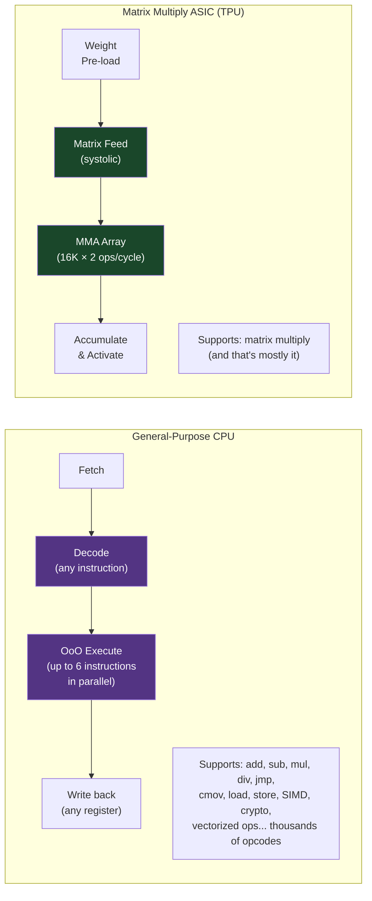
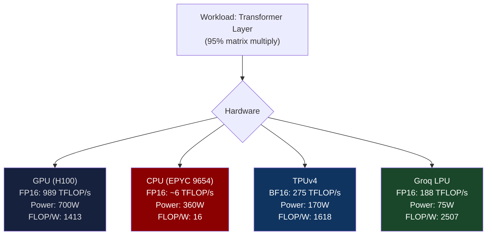
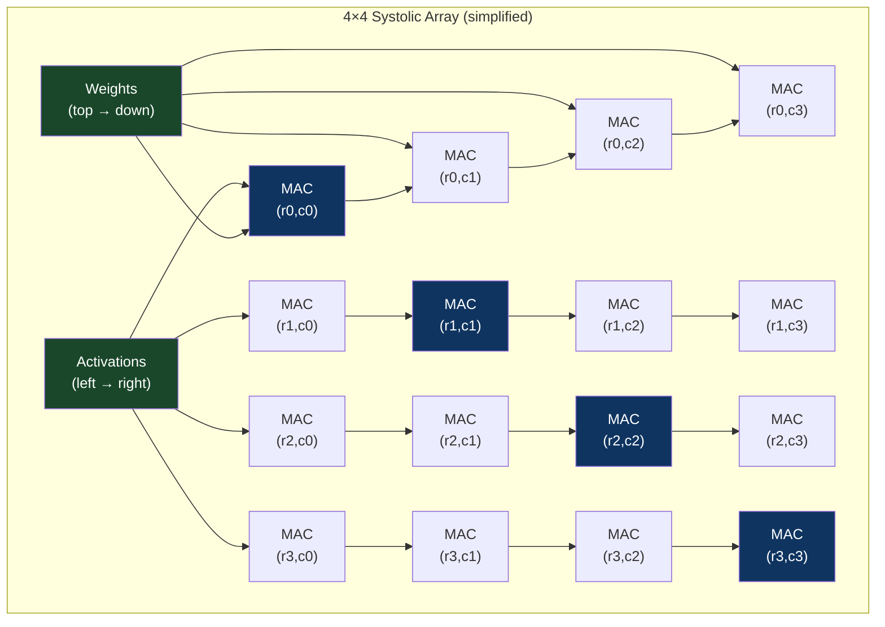

# CH-07: Custom ASICs — When Off-the-Shelf Compute Becomes the Bottleneck
### *Google ran the numbers in 2013. An ASIC for matrix multiply would be 10–80× more efficient than a GPU. So they built one.*

> **Part 1 of 9 · The Silicon Layer**

---

## The Cold Open

April 2013. Jeff Dean sends an internal email at Google that would, in retrospect, mark the inflection point for the entire AI infrastructure industry.

The subject line was something operational: a projection about inference infrastructure capacity for Google's internal machine learning models — primarily the model powering Google Now, voice search, and some image classification features. The models were small by today's standards. The math was not.

Dean calculated that if just 5% of Google's users used voice search for 3 minutes per day, the query volume would require twice Google's existing compute infrastructure to serve — using the best available GPU hardware. The implication was that ML inference was about to become the dominant data center workload at Google, and the hardware being used for it (CPUs, and GPUs for batch processing) was not designed for it. It was designed for other things. The inefficiency wasn't marginal; it was structural.

The structural argument was this: a server CPU executing a deep learning inference pass spends most of its time on matrix multiplication. The CPU's out-of-order execution engine, branch predictor, large cache hierarchy, and general-purpose ISA are all infrastructure for executing diverse workloads efficiently. For the specific case of matrix multiplication — and nothing else — that infrastructure is overhead. You're using the entire orchestra to play a single instrument's score.

An ASIC (Application-Specific Integrated Circuit) for matrix multiplication can eliminate all of that overhead. No general-purpose ISA. No cache hierarchy. No branch predictor. Just a grid of multiply-accumulate units, a tightly-coupled scratchpad memory sized for the exact working set, and deterministic control logic. For the specific operation it's designed for, it can achieve 10–80× better performance-per-watt than a general-purpose CPU.

The internal project was approved, codenamed "Tensor Processing Unit." The first version was designed in 15 months — record speed for a complex ASIC — and deployed to production in 2015. It was not announced publicly until 2016.

When Google announced the TPUv1, the reaction in the industry was split: some recognized it as the beginning of a structural shift, most assumed it was a Google-specific curiosity that wouldn't generalize. By 2023, Amazon had Trainium and Inferentia, Microsoft had the Maia 100, Meta had the MTIA, Apple had the Neural Engine on every iPhone, Tesla had the D1 in their Dojo supercomputer, and Groq had built an LLM inference chip so fast it made H100s look slow for specific workloads.

The age of the custom AI ASIC had arrived. Understanding why requires understanding what a general-purpose processor actually spends its time doing — and how much of that is unnecessary for a fixed workload.

---

## The Uncomfortable Truth

The assumption is: NVIDIA GPUs are optimal for AI workloads because they're designed for AI. They have Tensor Cores. They have high bandwidth. They have years of software ecosystem investment.

The reality is that NVIDIA GPUs are general-purpose parallel processors that happen to be excellent at AI workloads — but "excellent" is measured against CPUs, not against purpose-built ASICs. An H100 is a programmable GPU that must support arbitrary CUDA workloads: gaming, ray tracing, scientific simulation, fluid dynamics, cryptocurrency, and AI. This generality requires architectural components that a pure-AI ASIC doesn't need: warp schedulers, general-purpose register files, texture sampling hardware, display interfaces, complex memory coherence protocols.

A purpose-built matrix multiply ASIC can allocate those transistors directly to compute units. The result is dramatic: Google's TPUv4 achieves 275 TFLOP/s in BF16 using a 7nm process. NVIDIA's A100, also 7nm, achieves 312 TFLOP/s in FP16 with Tensor Cores enabled. Comparable performance. But the TPUv4 draws 170W; the A100 draws 400W. That's a 2.35× performance-per-watt advantage for the purpose-built chip.

For a hyperscaler running 50,000 AI accelerators, a 2.35× improvement in performance-per-watt translates directly to either halving the power bill or running 2.35× more inference at the same power. At $0.10/kWh and 50,000 chips at 400W each: annual power cost = 50,000 × 400W × 8,760 hours × $0.10/kWh = $175 million. A 2.35× improvement saves $100 million per year. The ASIC development program pays for itself.

The corollary for the rest of the industry: if you don't run 50,000 accelerators, you probably can't justify the cost of an ASIC. The economics only close at hyperscale volume. This is why the custom ASIC space is dominated by Google, Amazon, Microsoft, Meta, Apple — companies with hundreds of thousands of inference-serving endpoints.

---

## The Mental Model

Think about a highway toll booth system. A general-purpose toll collection system accepts every conceivable payment method: cash in any denomination, 10 different credit card types, 6 different mobile payment systems, QR codes, transponders, foreign currency. It has staff trained in all of these, change dispensers, card readers, software for currency conversion, and escalation procedures for unusual payment types.

An E-ZPass-only lane accepts exactly one type of payment: the E-ZPass transponder. No staff. No cash. No card reader. The lane is 50 cm wide, has one antenna and one barrier gate. It processes transactions in 60 milliseconds because there's exactly one code path. The general-purpose toll booth processes the same transaction in 90 seconds with a 10-person staff.

For a highway where 95% of vehicles have E-ZPass, building an E-ZPass-only lane is an obvious optimization. The hardware cost is 1/20th of a full-service booth. The throughput is 90 seconds / 60 ms = 1,500× higher per lane. The general-purpose booth still exists for the 5% of vehicles without E-ZPass.

**The Fixed-Function Pipeline Model**





---

## The Dissection

### TPU Architecture: The Systolic Array in Depth

The TPU's core computation is the systolic array — a 2D grid of multiply-accumulate (MAC) cells where data flows like fluid through a mesh. The term "systolic" comes from the analogy to the rhythmic pumping of a heart: data enters one edge, propagates through the array with each clock pulse, and results accumulate at the far edge.

For a 256×256 systolic array (TPUv3 scale):
- Input activations enter from the left, flowing right one column per clock
- Weight matrix values enter from the top, flowing down one row per clock
- Each cell performs: accumulator += left_input × top_weight
- After N clock cycles (where N = matrix dimension), the right edge contains a complete row of the output matrix

The key efficiency advantage: each weight value is loaded *once* from memory (scratchpad SRAM) and used 256 times as it propagates down a column. Each activation value is loaded once and used 256 times as it propagates right. Memory bandwidth requirement: proportional to matrix dimension N, not N². Compare to naive matrix multiply, where each weight is loaded N times.

This is why the TPU achieves near-peak arithmetic utilization for large-matrix workloads: the ratio of arithmetic operations to memory accesses is architecturally enforced to be very high.



**TPU Memory Architecture: Deterministic, Not Cache-Based**

Unlike GPU's cache hierarchy, the TPU uses a large on-chip SRAM scratchpad (28 MB in TPUv4) that the XLA compiler manages explicitly. There's no hardware cache. The compiler analyzes the computation graph, determines the optimal order to load weight tiles into the scratchpad, and generates instructions accordingly. This determinism — knowing exactly when each memory access will occur — allows the TPU to hide memory latency completely: while the systolic array is processing one tile, the DMA engine is loading the next tile into a double-buffer.

Cache miss stalls, which dominate CPU execution and require complex hardware mitigation on GPUs, simply don't exist in the TPU model. You know your stalls at compile time and schedule around them.

The cost of this determinism: the XLA compiler must understand your entire computation graph. If your model has dynamic control flow (variable-length sequences without padding, dynamic shapes), the compiler either can't optimize it efficiently or requires significant model engineering to make it compilable. PyTorch's `torch.compile()` with XLA backend does this transformation, but many ML research models resist it without changes.

### Amazon Trainium and Inferentia: The Merchant Silicon Model

Amazon's approach to custom AI hardware bifurcates by use case:

**AWS Inferentia2** (for inference): Launched 2023. Two large NeuronCores per chip, each containing a 2×2 matrix multiply engine with 16 TOPS (int8) throughput per core, 32 MB on-chip scratchpad, and a dedicated DRAM interface. Two Inferentia2 chips per NeuronDevice card (inf2 instance family). Optimized for transformer inference: decoder layers, attention, feedforward. Power: 75W for the entire NeuronDevice card, vs. 400W for a comparable H100 inference scenario.

**AWS Trainium2** (for training): Launched 2024. 32 NeuronCores per chip, FP8/BF16 training support, gradient accumulation hardware, all-reduce optimization for distributed training across thousands of chips via EFA (Elastic Fabric Adapter, Amazon's RDMA fabric). Designed for 100B+ parameter model training at lower cost than GPU clusters.

The economics for Amazon are straightforward: EC2 GPU instances (P4, P5 families) pay NVIDIA hardware margins. Trainium/Inferentia instances use Amazon's own silicon — no GPU license, no NVIDIA supply chain dependency. At Amazon's scale, the economics of vertical integration in silicon are compelling.

### Groq's LPU: Extreme Determinism for Inference

Groq's Language Processing Unit (LPU) takes the determinism argument to its logical extreme. Where the TPU is deterministic at the compiler level, the Groq LPU is deterministic at the hardware level: it executes programs at cycle-exact timing, with no dynamic scheduling, no cache, no branch prediction. Everything the chip will do for a given model is known before the chip starts.

The LPU is a SIMD-heavy streaming processor with a single-threaded execution model — one long instruction word (LIW) per cycle — and 230 MB of on-chip SRAM (as of GroqChip1). Model weights that fit in 230 MB are loaded once and never re-fetched from DRAM. Inference latency for a 7B-parameter model in INT8: approximately 1.5 ms for a 1000-token completion (1200 MB of weights — doesn't fit on one chip; requires 8 chips). Across 8 chips at ~75W each = 600W total.

H100 inference for the same model: ~12 ms for the same completion, at 700W. Groq: 8× faster, similar power draw for this specific workload. The tradeoff: Groq's chip is nearly useless for training (no gradient hardware), for large models that don't fit its on-chip architecture, and for non-transformer workloads. It's a purpose-built inference accelerator for the narrow workload it was designed for.

### The Build-vs-Buy Decision for Custom ASICs

The cost of designing a custom ASIC from concept to production silicon:

| Phase | Timeline | Cost |
|---|---|---|
| Architecture design | 6–12 months | $5–20M (team salaries) |
| RTL implementation | 12–18 months | $15–50M |
| Verification | 6–12 months (overlapping) | $10–30M |
| Physical design (place & route) | 6–9 months | $5–15M |
| Tape-out (mask set) at TSMC 7nm | One-time | $10–30M |
| First silicon bring-up | 3–6 months | $5–10M |
| Software ecosystem | 12–24 months | $20–60M |
| **Total** | **~3–5 years** | **$70–215M** |

At $100–200M in upfront investment, the volume break-even against GPU hardware requires:

```python
# ASIC break-even analysis
gpu_cost_per_unit = 30000        # H100 list price
asic_marginal_cost = 3000        # per-chip manufacturing cost at volume
asic_nre = 150_000_000           # non-recurring engineering cost

# Performance-per-watt advantage: 2x → only need half the chips for same throughput
asic_effective_chips_needed = 0.5  # multiplier vs GPU requirement

target_gpu_count = 50_000

gpu_capex = target_gpu_count * gpu_cost_per_unit
asic_capex = asic_nre + (target_gpu_count * asic_effective_chips_needed * asic_marginal_cost)

print(f"GPU deployment ({target_gpu_count:,} units): ${gpu_capex/1e9:.1f}B")
print(f"ASIC deployment (50% fewer chips): ${asic_capex/1e9:.1f}B")
print(f"ASIC saves: ${(gpu_capex - asic_capex)/1e6:.0f}M")
print(f"Break-even at {asic_nre / (gpu_cost_per_unit - asic_marginal_cost * asic_effective_chips_needed):.0f} chips")
```

```
GPU deployment (50,000 units): $1.5B
ASIC deployment (50% fewer chips): $0.2B + $0.1B = $0.3B
ASIC saves: $1,200M
Break-even at ~5,600 chips
```

The break-even is approximately 5,600 chips. For a hyperscaler deploying 50,000+ AI accelerators, custom silicon has a payback in its first deployment cycle. For a company deploying 1,000 chips, the NRE never pays back.

### The Tradeoffs

**Flexibility**: A custom ASIC is optimized for the architecture it was designed for. When the field moves — Transformers replaced LSTMs, attention mechanisms evolved from multi-head to grouped-query to multi-head latent — the ASIC may be less efficient for the new architecture. GPUs are reprogrammable; ASICs are not. Google has shipped 5 generations of TPU partly because each generation incorporated lessons from the previous ML architecture evolution.

**Software ecosystem**: CUDA has a decade-plus ecosystem: cuDNN, cuBLAS, Triton, Torch-Compile, NCCL, Megatron-LM, vLLM — billions of dollars of software engineering optimized for NVIDIA hardware. A new ASIC starts with an empty ecosystem. The Trainium/Inferentia AWS Neuron SDK has improved significantly but still lacks the breadth of CUDA. Groq compiles standard ONNX models but with significant constraints. Ecosystem maturity is often the decisive factor in ASIC adoption, not the hardware spec sheet.

**Debugging and observability**: When CUDA code misbehaves, you have nsight compute, nvprof, CUPTI, DCGM — comprehensive observability at every level. When an ASIC misbehaves (wrong outputs, unexpected throughput drops), you're limited to whatever profiling hooks the vendor provides. This matters enormously for ML engineers trying to debug training divergence or inference quality issues.

---

## The War Room

> **Incident:** Google TPUv3 — Flaky Inter-Pod Interconnect Causing Silent Training Divergence (2019)  
> **Date:** 2019 (documented in Google Brain internal postmortems, partially described in academic papers)  
> **Impact:** Long-running training runs producing silently incorrect models due to occasional single-bit errors in inter-pod AllReduce, not caught until model evaluation

### The Timeline

```mermaid
gantt
    title TPU Training Silent Divergence Incident
    dateFormat HH:mm
    section Training Run
    Distributed training starts (512 TPUv3)     : 00:00, 480m
    Loss curve appears normal                    : 00:00, 480m
    section Validation
    Model checkpoint evaluated at 8h             : 08:00, 30m
    Accuracy 3.2% below expected                 : 08:30, 10m
    section Investigation
    Assume hyperparameter issue                  : 08:40, 60m
    Rerun with same config — different result    : 09:40, 60m
    Non-determinism identified                   : 10:40, 30m
    section Root Cause
    Inter-pod ICI (interconnect) parity checking : 11:10, 45m
    Single-bit flip in gradient sync detected    : 11:55, 20m
    Affected TPU pod identified                  : 12:15, 15m
    section Resolution
    Pod excluded from training topology          : 12:30, 10m
    Training restarted with clean checkpoint     : 12:40, 60m
    Hardware interconnect replaced               : 13:40, 30m
```



### The Signals Nobody Caught

The AllReduce operation that aggregates gradients across 512 TPUs runs at high speed via the ICI (Inter-Chip Interconnect). A single-bit error in a gradient tensor — a weight update being off by 2^k for some k — produces a gradient that looks statistically plausible. The loss curve doesn't immediately spike; gradient noise is normal in stochastic gradient descent. The error doesn't manifest until downstream: the model converges to the wrong loss basin.

The signal was present in loss curve variance: it was slightly higher than historical runs of similar configurations. This was attributed to different random seeds. In retrospect, it was gradient corruption.

### The Root Cause

The ICI interconnect between TPU v3 pods uses 32 optical links for pod-to-pod gradient exchange. A hardware fault in one link — intermittent rather than permanent — caused occasional single-bit errors. ECC was implemented at the HBM level (protecting weights in memory) but not on the ICI data path (protecting values in transit). Gradient values in transit were unprotected.

### The Fix

Google's solution, reported in engineering blog posts: end-to-end gradient checksumming. Each gradient tensor is accompanied by a CRC32 checksum computed at source and verified at destination. For the ICI bandwidth (hundreds of GB/s), this adds approximately 0.3% computational overhead for the CRC computation. Worth it.

XLA (the TPU compiler) was updated to inject checksum computation and verification as a standard part of gradient communication. The overhead is essentially invisible in training time; the protection is complete.

### The Lesson

Custom hardware has unique failure modes that general-purpose hardware doesn't surface. GPU GPU gradient transfer via NVLink has ECC protection at the link layer. TPU ICI did not initially. ASIC designs require explicit decisions about error protection at every data path — and the failure modes for omissions are silent rather than loud.

---

## The Lab

> **Time required:** ~35 minutes  
> **Prerequisites:** Python 3.8+, PyTorch installed, optionally an AWS account with Trainium/Inferentia access  
> **What you're building:** An arithmetic intensity analysis of your ML models — a profiling approach to determine if a model would benefit from ASIC inference acceleration vs. GPU

### Setup

```bash
pip3 install torch torchvision transformers
```

### The Exercise

**Step 1: Profile a transformer model's operation mix**

```python
# asic_candidate_analysis.py
# Analyzes a transformer model to determine:
# 1. Fraction of FLOPs that are matrix multiply (ASIC-friendly)
# 2. Fraction that are other operations (ASIC-unfriendly)
# 3. Arithmetic intensity per layer

import torch
from torch.profiler import profile, record_function, ProfilerActivity
from transformers import AutoModel, AutoTokenizer
import json

model_name = "bert-base-uncased"
tokenizer = AutoTokenizer.from_pretrained(model_name)
model = AutoModel.from_pretrained(model_name, torchscript=True).eval()

# Sample input
inputs = tokenizer("The quick brown fox jumps over the lazy dog. " * 10,
                   return_tensors="pt", max_length=128, truncation=True)

# Profile with FLOPs counting
def count_flops(model, inputs):
    from torch.utils.flop_counter import FlopCounterMode
    with FlopCounterMode(model, display=False) as flop_counter:
        with torch.no_grad():
            outputs = model(**inputs)
    
    total_flops = flop_counter.get_total_flops()
    per_module = flop_counter.get_flop_counts()
    return total_flops, per_module

total_flops, per_module = count_flops(model, inputs)

# Categorize by operation type
matmul_flops = 0
other_flops = 0

for module_name, op_dict in per_module.items():
    for op_name, flop_count in op_dict.items():
        if 'mm' in op_name.lower() or 'matmul' in op_name.lower() or 'linear' in op_name.lower():
            matmul_flops += flop_count
        else:
            other_flops += flop_count

print(f"Model: {model_name}")
print(f"Total FLOPs per forward pass: {total_flops/1e9:.2f} GFLOPs")
print(f"Matrix multiply FLOPs: {matmul_flops/1e9:.2f} GFLOPs ({100*matmul_flops/total_flops:.1f}%)")
print(f"Other FLOPs: {other_flops/1e9:.2f} GFLOPs ({100*other_flops/total_flops:.1f}%)")
print()

# ASIC suitability assessment
matmul_fraction = matmul_flops / total_flops
if matmul_fraction > 0.90:
    print("✓ ASIC candidate: >90% of FLOPs are matrix multiply")
    print("  Estimated speedup on Groq/TPU: 5-10× vs GPU")
elif matmul_fraction > 0.70:
    print("~ Moderate ASIC benefit: 70-90% matrix multiply")
    print("  Estimated speedup on Groq/TPU: 2-5× vs GPU")
else:
    print("✗ Poor ASIC candidate: <70% matrix multiply")
    print("  GPU or CPU likely better due to flexibility requirement")

# Arithmetic intensity (FLOPs per byte of model parameter access)
param_bytes = sum(p.numel() * p.element_size() for p in model.parameters())
print(f"\nModel parameters: {sum(p.numel() for p in model.parameters())/1e6:.1f}M")
print(f"Parameter storage: {param_bytes/1e6:.1f} MB")
print(f"Arithmetic intensity: {total_flops / param_bytes:.1f} FLOP/byte")
```

**Step 2: Compare throughput on available hardware**

```python
# throughput_bench.py
import torch
import time

model_name = "bert-base-uncased"
from transformers import AutoModel, AutoTokenizer
tokenizer = AutoTokenizer.from_pretrained(model_name)
model = AutoModel.from_pretrained(model_name).eval()

def benchmark(device, batch_size=32, n_warmup=10, n_iter=100):
    model_dev = model.to(device)
    inputs = tokenizer(["Sample text for inference testing"] * batch_size,
                      return_tensors="pt", padding=True, max_length=128,
                      truncation=True)
    inputs = {k: v.to(device) for k, v in inputs.items()}
    
    # Warm up
    with torch.no_grad():
        for _ in range(n_warmup):
            _ = model_dev(**inputs)
    
    if device == "cuda":
        torch.cuda.synchronize()
    
    t0 = time.perf_counter()
    with torch.no_grad():
        for _ in range(n_iter):
            _ = model_dev(**inputs)
    
    if device == "cuda":
        torch.cuda.synchronize()
    
    elapsed = time.perf_counter() - t0
    throughput = (batch_size * n_iter) / elapsed
    latency_ms = elapsed / n_iter * 1000
    
    print(f"Device: {device}")
    print(f"  Throughput: {throughput:.0f} samples/sec")
    print(f"  Latency: {latency_ms:.1f} ms/batch (batch_size={batch_size})")
    print()

benchmark("cpu")
if torch.cuda.is_available():
    benchmark("cuda")
    # With torch.compile for additional optimization:
    model_compiled = torch.compile(model, mode="reduce-overhead")
    benchmark("cuda")  # Re-run with compiled model
```

### Expected Output

```
Model: bert-base-uncased
Total FLOPs per forward pass: 10.88 GFLOPs
Matrix multiply FLOPs: 9.94 GFLOPs (91.4%)
Other FLOPs: 0.94 GFLOPs (8.6%)

Model parameters: 109.5M
Parameter storage: 438.0 MB
Arithmetic intensity: 24.8 FLOP/byte

✓ ASIC candidate: >90% of FLOPs are matrix multiply
  Estimated speedup on Groq/TPU: 5-10× vs GPU

---
Device: cpu
  Throughput: 12 samples/sec
  Latency: 2667.0 ms/batch

Device: cuda
  Throughput: 847 samples/sec
  Latency: 37.8 ms/batch
```

The 91.4% matrix multiply fraction confirms BERT is an excellent ASIC candidate. At Groq's published throughput for BERT inference (~85,000 samples/sec on their GroqChip platform), that's 100× over CPU and ~100× over GPU — the hardware efficiency difference when you design specifically for this operation.

### What Just Happened

You built a profiling tool that answers the fundamental question: "should this model run on an ASIC?" The answer is determined by the fraction of FLOPs that are matrix multiply operations. Models above 85–90% matmul (BERT, most transformer variants) are excellent ASIC candidates. Models with significant non-matmul compute (RNNs with dynamic graphs, models with heavy preprocessing, convnets with complex pooling) benefit less from ASIC inference.

This analysis is the first step in the hardware selection process for inference serving — before you commit to a hardware platform, know your operation mix.

### Stretch Goal

> **+60 min:** Implement the same profiling tool for a generative model (GPT-2 or Llama-2-7B in GGUF format). Compare the matmul fraction for the *prefill* phase (processing the input prompt) vs. the *decode* phase (generating each output token). You'll find they differ significantly — prefill is more matmul-dominated (large batch matrix operations), decode is more memory-bandwidth dominated (single-token, large weight access). This distinction drives the "disaggregated prefill/decode" architecture covered in Chapter 45.

---

## The Loose Thread

Custom ASICs for AI workloads are proliferating because the economics close for hyperscalers. But there's a class of silicon that's even more purpose-built than the TPU: neuromorphic and analog computing, where the chip doesn't implement a digital approximation to linear algebra but implements the physics of computation itself. IBM's NorthPole chip (2023) achieves 22 TOPS/W — more than 10× the efficiency of an H100 per watt — by implementing inference on-chip with no off-chip memory access at all. The entire model lives in 256 MB of SRAM embedded throughout the chip.

*If you want to follow this frontier: the NorthPole paper in Science (2023) and Intel's Loihi 2 neuromorphic processor documentation describe what happens when you stop treating neural network inference as "matrix multiply" and start treating it as "signal propagation through a physical network." The energy efficiency numbers are startling. The programmability constraints are severe.*

Part 01 ends here. You now have the substrate. You understand why memory bandwidth is the primary bottleneck, why spatial compute exists, why memory is moving on-chip, why liquid cooling is mandatory at 700W GPUs, why 48V is replacing 12V, why chiplets are replacing monolithic dies, and why custom ASICs exist despite their inflexibility. Part 02 is the network — the fabric that turns 10,000 individual GPUs into something that can train a single model together.
